# installing Debian 8

This module is a step by step demonstration of an actual installation of
`Debian 8` (also known as `Jessie`).

We start by downloading an image from the internet and install
`Debian 8` as a virtual machine in `Virtualbox`. We will also do some
basic configuration of this new machine like setting an `ip address` and
fixing a `hostname`.

This procedure should be very similar for other versions of `Debian`,
and also for distributions like `Linux Mint`, `xubuntu/ubuntu/kubuntu`
or `Mepis`. This procedure can also be helpful if you are using another
virtualization solution.

Go to the next chapter if you want to install
`CentOS, Fedora, Red Hat Enterprise Linux, ...`.
# Debian

Debian is one of the oldest Linux distributions. I use Debian myself on
almost every computer that I own (including `raspbian` on the
`Raspberry Pi`).

Debian comes in `releases` named after characters in the movie
`Toy Story`. The `Jessie` release contains about 36000 packages.

  -----------------------------------
     name       number       year
  ----------- ----------- -----------
     Woody        3.0        2002

     Sarge        3.1        2005

     Etch         4.0        2007

     Lenny        5.0        2009

    Squeeze       6.0        2011

    Wheezy         7         2013

    Jessie         8         2015
  -----------------------------------

  : Debian releases

There is never a fixed date for the next `Debian` release. The next
version is released when it is ready.

# Downloading

All these screenshots were made in November 2014, which means `Debian 8`
was still in \'testing\' (but in \'freeze\', so there will be no major
changes when it is released).

Download Debian here:

After a couple of clicks on that website, I ended up downloading
`Debian 8` (testing) here. It should be only one click once `Debian 8`
is released (somewhere in 2015).

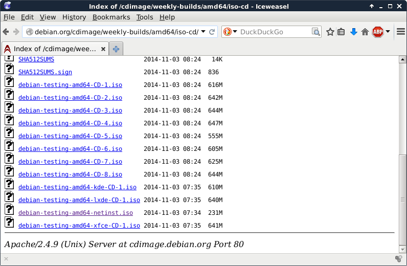

You have many other options to download and install `Debian`. We will
discuss them much later.

This small screenshot shows the downloading of a `netinst` .iso file.
Most of the software will be downloaded during the installation. This
also means that you will have the most recent version of all packages
when the install is finished.

I already have Debian 8 installed on my laptop (hence the `paul@debian8`
prompt). Anyway, this is the downloaded file just before starting the
installation.

    paul@debian8:~$ ls -hl debian-testing-amd64-netinst.iso
    -rw-r--r-- 1 paul paul 231M Nov 10 17:59 debian-testing-amd64-netinst.iso

Create a new virtualbox machine (I already have five, you might have
zero for now). Click the `New` button to start a wizard that will help
you create a virtual machine.

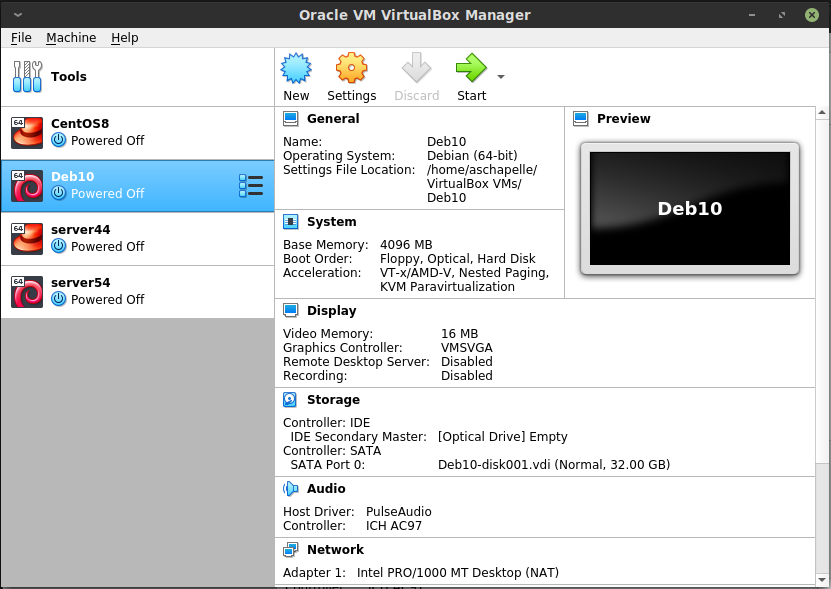

The machine needs a name, this screenshot shows that I named it
`server42`.

Most of the defaults in Virtualbox are ok.

512MB of RAM is enough to practice all the topics in this book.

We do not care about the virtual disk format.

Choosing `dynamically allocated` will save you some disk space (for a
small performance hit).

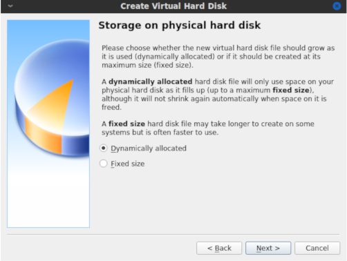

8GB should be plenty for learning about Linux servers.

This finishes the wizard. You virtual machine is almost ready to begin
the installation.

First, make sure that you attach the downloaded .iso image to the
virtual CD drive. (by opening `Settings`, `Storage` followed by a mouse
click on the round CD icon)

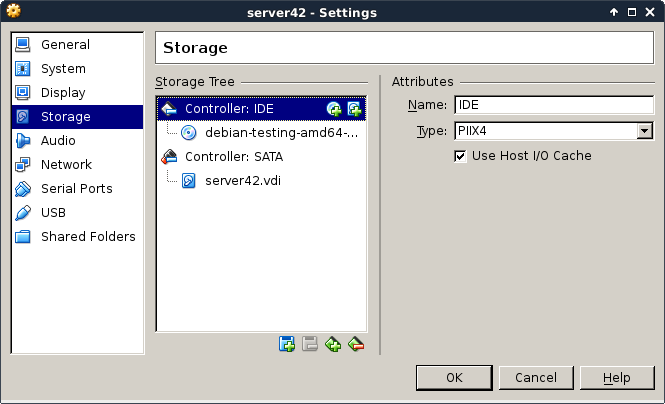

Personally I also disable sound and usb, because I never use these
features. I also remove the floppy disk and use a PS/2 mouse pointer.
This is probably not very important, but I like the idea that it saves
some resources.

Now boot the virtual machine and begin the actual installation. After a
couple of seconds you should see a screen similar to this. Choose
`Install` to begin the installation of Debian.

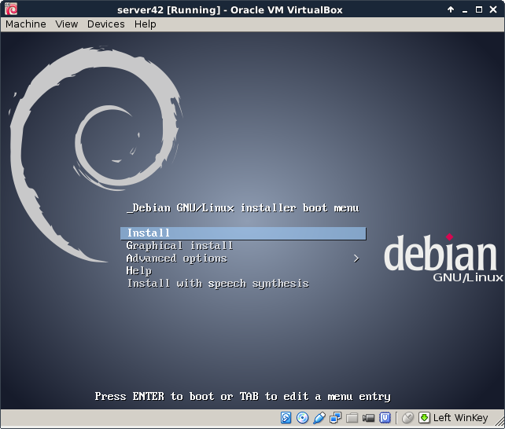

First select the language you want to use.

Choose your country. This information will be used to suggest a download
mirror.

Choose the correct keyboard. On servers this is of no importance since
most servers are remotely managed via `ssh`.

Enter a `hostname` (with `fqdn` to set a `dnsdomainname`).

Give the `root` user a password. Remember this password (or use
`hunter2`).

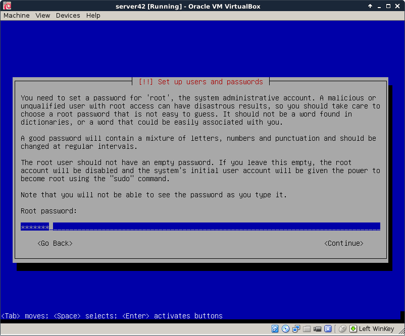

It is adviced to also create a normal user account. I don\'t give my
full name, Debian 8 accepts an identical username and full name `paul`.

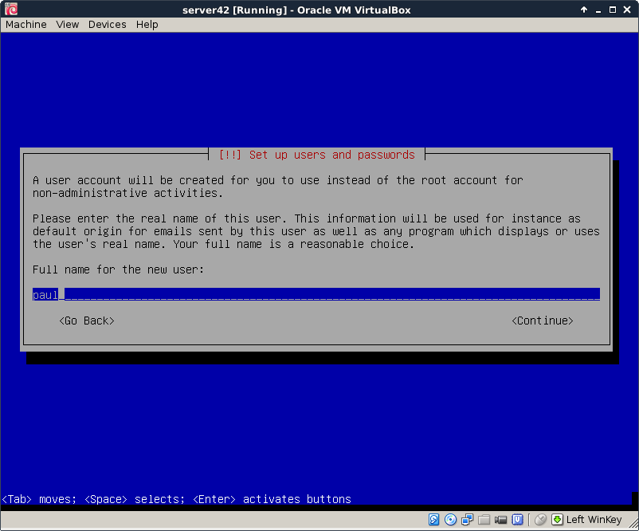

The `use entire disk` refers to the `virtual disk` that you created
before in `Virtualbox`..

Again the default is probably what you want. Only change partitioning if
you really know what you are doing.

Accept the partition layout (again only change if you really know what
you are doing).

This is the point of no return, the magical moment where pressing `yes`
will forever erase data on the (virtual) computer.

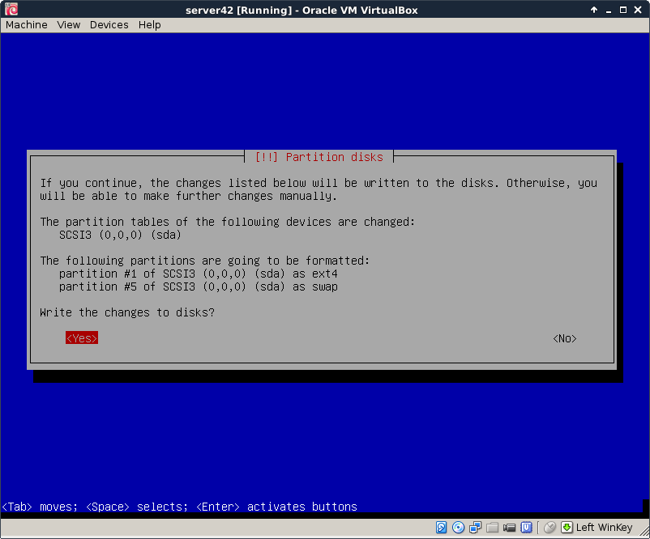

Software is downloaded from a mirror repository, preferably choose one
that is close by (as in the same country).

This setup was done in Belgium.

Leave the proxy field empty (unless you are sure that you are behind a
proxy server).

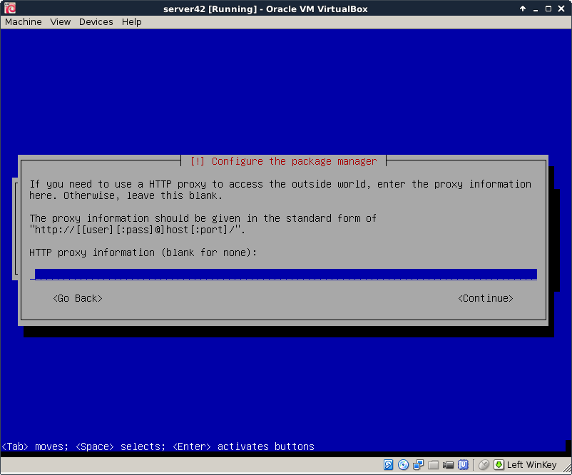

Choose whether you want to send anonymous statistics to the Debian
project (it gathers data about installed packages). You can view the
statistics here `http://popcon.debian.org/`.

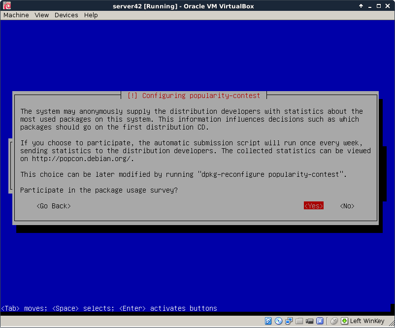

Choose what software to install, we do not need any graphical stuff for
this training.

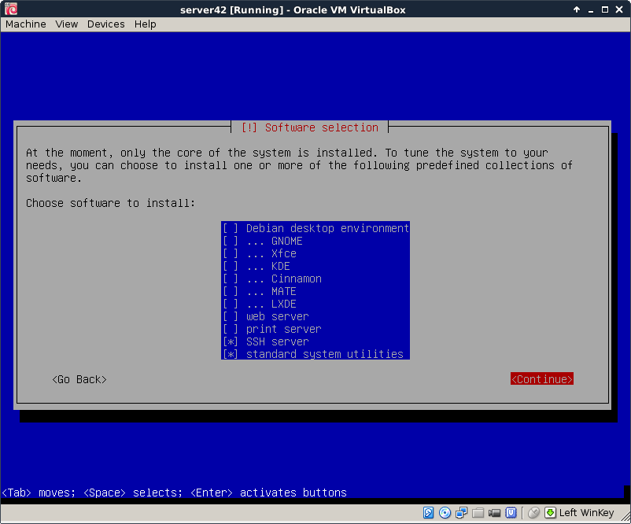

The latest versions are being downloaded.

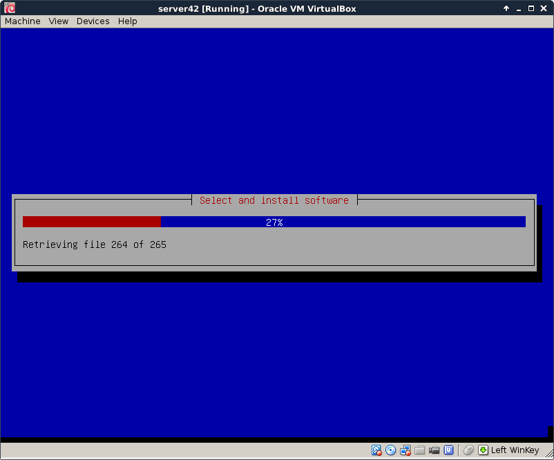

Say yes to install the bootloader on the virtual machine.

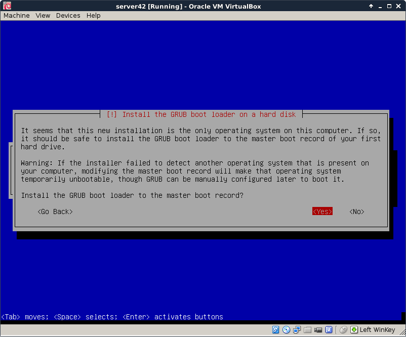

Booting for the first time shows the grub screen

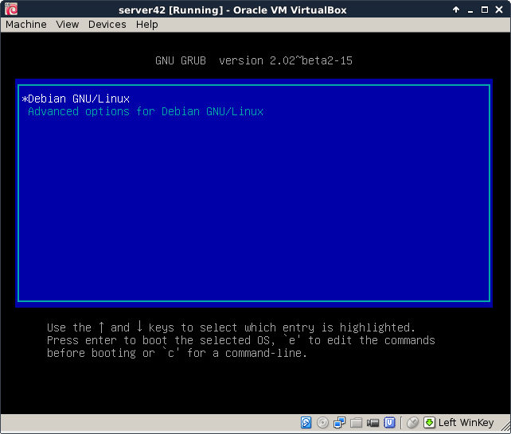

A couple seconds later you should see a lot of text scrolling of the
screen (`dmesg`). After which you are presented with this `getty` and
are allowed your first logon.

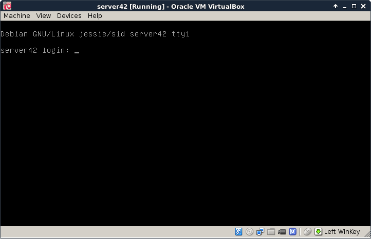

You should now be able to log on to your virtual machine with the `root`
account. Do you remember the password ? Was it `hunter2` ?

The screenshots in this book will look like this from now on. You can
just type those commands in the terminal (after you logged on).

    root@server42:~# who am i
    root     tty1         2014-11-10 18:21
    root@server42:~# hostname
    server42
    root@server42:~# date
    Mon Nov 10 18:21:56 CET 2014

# virtualbox networking

You can also log on from remote (or from your Windows/Mac/Linux host
computer) using `ssh` or `putty`. Change the `network` settings in the
virtual machine to `bridge`. This will enable your virtual machine to
receive an ip address from your local dhcp server.

The default virtualbox networking is to attach virtual network cards to
`nat`. This screenshiot shows the ip address `10.0.2.15` when on `nat`:

    root@server42:~# ifconfig
    eth0      Link encap:Ethernet  HWaddr 08:00:27:f5:74:cf
              inet addr:10.0.2.15  Bcast:10.0.2.255  Mask:255.255.255.0
              inet6 addr: fe80::a00:27ff:fef5:74cf/64 Scope:Link
              UP BROADCAST RUNNING MULTICAST  MTU:1500  Metric:1
              RX packets:11 errors:0 dropped:0 overruns:0 frame:0
              TX packets:19 errors:0 dropped:0 overruns:0 carrier:0
              collisions:0 txqueuelen:1000
              RX bytes:2352 (2.2 KiB)  TX bytes:1988 (1.9 KiB)

    lo        Link encap:Local Loopback
              inet addr:127.0.0.1  Mask:255.0.0.0
              inet6 addr: ::1/128 Scope:Host
              UP LOOPBACK RUNNING  MTU:65536  Metric:1
              RX packets:0 errors:0 dropped:0 overruns:0 frame:0
              TX packets:0 errors:0 dropped:0 overruns:0 carrier:0
              collisions:0 txqueuelen:0
              RX bytes:0 (0.0 B)  TX bytes:0 (0.0 B)

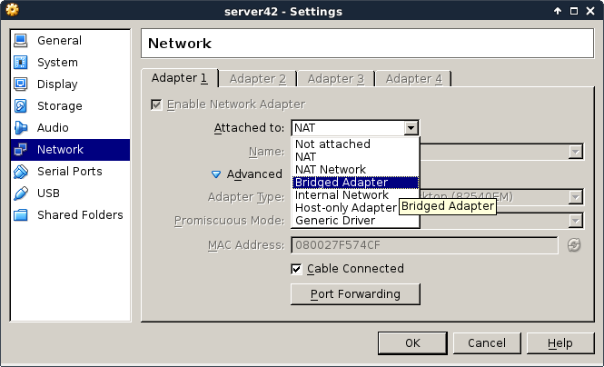

By shutting down the network interface and enabling it again, we force
Debian to renew an ip address from the bridged network.

    root@server42:~# # do not run ifdown while connected over ssh!
    root@server42:~# ifdown eth0
    Killed old client process
    Internet Systems Consortium DHCP Client 4.3.1
    Copyright 2004-2014 Internet Systems Consortium.
    All rights reserved.
    For info, please visit https://www.isc.org/software/dhcp/

    Listening on LPF/eth0/08:00:27:f5:74:cf
    Sending on   LPF/eth0/08:00:27:f5:74:cf
    Sending on   Socket/fallback
    DHCPRELEASE on eth0 to 10.0.2.2 port 67
    root@server42:~# # now enable bridge in virtualbox settings
    root@server42:~# ifup eth0
    Internet Systems Consortium DHCP Client 4.3.1
    Copyright 2004-2014 Internet Systems Consortium.
    All rights reserved.
    For info, please visit https://www.isc.org/software/dhcp/

    Listening on LPF/eth0/08:00:27:f5:74:cf
    Sending on   LPF/eth0/08:00:27:f5:74:cf
    Sending on   Socket/fallback
    DHCPDISCOVER on eth0 to 255.255.255.255 port 67 interval 8
    DHCPDISCOVER on eth0 to 255.255.255.255 port 67 interval 8
    DHCPREQUEST on eth0 to 255.255.255.255 port 67
    DHCPOFFER from 192.168.1.42
    DHCPACK from 192.168.1.42
    bound to 192.168.1.111 -- renewal in 2938 seconds.
    root@server42:~# ifconfig eth0
    eth0      Link encap:Ethernet  HWaddr 08:00:27:f5:74:cf
              inet addr:192.168.1.111  Bcast:192.168.1.255  Mask:255.255.255.0
              inet6 addr: fe80::a00:27ff:fef5:74cf/64 Scope:Link
              UP BROADCAST RUNNING MULTICAST  MTU:1500  Metric:1
              RX packets:15 errors:0 dropped:0 overruns:0 frame:0
              TX packets:31 errors:0 dropped:0 overruns:0 carrier:0
              collisions:0 txqueuelen:1000
              RX bytes:3156 (3.0 KiB)  TX bytes:3722 (3.6 KiB)
    root@server42:~#

Here is an example of `ssh` to this freshly installed computer. Note
that `Debian 8` has disabled remote root access, so i need to use the
normal user account.

    paul@debian8:~$ ssh paul@192.168.1.111
    paul@192.168.1.111's password:

    The programs included with the Debian GNU/Linux system are free software;
    the exact distribution terms for each program are described in the
    individual files in /usr/share/doc/*/copyright.

    Debian GNU/Linux comes with ABSOLUTELY NO WARRANTY, to the extent
    permitted by applicable law.
    paul@server42:~$
    paul@server42:~$ su -
    Password:
    root@server42:~#

TODO: putty screenshot here\...

# setting the hostname

The hostname of the server is asked during installation, so there is no
need to configure this manually.

    root@server42:~# hostname
    server42
    root@server42:~# cat /etc/hostname
    server42
    root@server42:~# dnsdomainname
    paul.local
    root@server42:~# grep server42 /etc/hosts
    127.0.1.1       server42.paul.local     server42
    root@server42:~#

# adding a static ip address

This example shows how to add a static ip address to your server.

You can use `ifconfig` to set a static address that is active until the
next `reboot` (or until the next `ifdown`).

a

    root@server42:~# ifconfig eth0:0 10.104.33.39

Adding a couple of lines to the `/etc/network/interfaces` file to enable
an extra ip address forever.

    root@server42:~# vi /etc/network/interfaces
    root@server42:~# tail -4 /etc/network/interfaces
    auto eth0:0
    iface eth0:0 inet static
    address 10.104.33.39
    netmask 255.255.0.0
    root@server42:~# ifconfig
    eth0      Link encap:Ethernet  HWaddr 08:00:27:f5:74:cf
              inet addr:192.168.1.111  Bcast:192.168.1.255  Mask:255.255.255.0
              inet6 addr: fe80::a00:27ff:fef5:74cf/64 Scope:Link
              UP BROADCAST RUNNING MULTICAST  MTU:1500  Metric:1
              RX packets:528 errors:0 dropped:0 overruns:0 frame:0
              TX packets:333 errors:0 dropped:0 overruns:0 carrier:0
              collisions:0 txqueuelen:1000
              RX bytes:45429 (44.3 KiB)  TX bytes:48763 (47.6 KiB)

    eth0:0    Link encap:Ethernet  HWaddr 08:00:27:f5:74:cf
              inet addr:10.104.33.39  Bcast:10.255.255.255  Mask:255.0.0.0
              UP BROADCAST RUNNING MULTICAST  MTU:1500  Metric:1

    lo        Link encap:Local Loopback
              inet addr:127.0.0.1  Mask:255.0.0.0
              inet6 addr: ::1/128 Scope:Host
              UP LOOPBACK RUNNING  MTU:65536  Metric:1
              RX packets:0 errors:0 dropped:0 overruns:0 frame:0
              TX packets:0 errors:0 dropped:0 overruns:0 carrier:0
              collisions:0 txqueuelen:0
              RX bytes:0 (0.0 B)  TX bytes:0 (0.0 B)

    root@server42:~#

# Debian package management

To get all information about the newest packages form the online
repository:

    root@server42:~# aptitude update
    Get: 1 http://ftp.be.debian.org jessie InRelease [191 kB]
    Get: 2 http://security.debian.org jessie/updates InRelease [84.1 kB]
    Get: 3 http://ftp.be.debian.org jessie-updates InRelease [117 kB]
    Get: 4 http://ftp.be.debian.org jessie-backports InRelease [118 kB]
    Get: 5 http://security.debian.org jessie/updates/main Sources [14 B]
    Get: 6 http://ftp.be.debian.org jessie/main Sources/DiffIndex [7,876 B]
    ... (output truncated)

To download and apply all updates for all installed packages:

    root@server42:~# aptitude upgrade
    Resolving dependencies...
    The following NEW packages will be installed:
      firmware-linux-free{a} irqbalance{a} libnuma1{a} linux-image-3.16.0-4-amd64{a}
    The following packages will be upgraded:
      busybox file libc-bin libc6 libexpat1 libmagic1 libpaper-utils libpaper1 libsqlite3-0
      linux-image-amd64 locales multiarch-support
    12 packages upgraded, 4 newly installed, 0 to remove and 0 not upgraded.
    Need to get 44.9 MB of archives. After unpacking 161 MB will be used.
    Do you want to continue? [Y/n/?]
    ... (output truncated)

To install new software (`vim` and `tmux` in this example):

    root@server42:~# aptitude install vim tmux
    The following NEW packages will be installed:
      tmux vim vim-runtime{a}
    0 packages upgraded, 3 newly installed, 0 to remove and 0 not upgraded.
    Need to get 6,243 kB of archives. After unpacking 29.0 MB will be used.
    Do you want to continue? [Y/n/?]
    Get: 1 http://ftp.be.debian.org/debian/ jessie/main tmux amd64 1.9-6 [245 kB]
    Get: 2 http://ftp.be.debian.org/debian/ jessie/main vim-runtime all 2:7.4.488-1 [5,046 kB]
    Get: 3 http://ftp.be.debian.org/debian/ jessie/main vim amd64 2:7.4.488-1 [952 kB]

Refer to the `package management` chapter in LinuxAdm.pdf for more
information.
