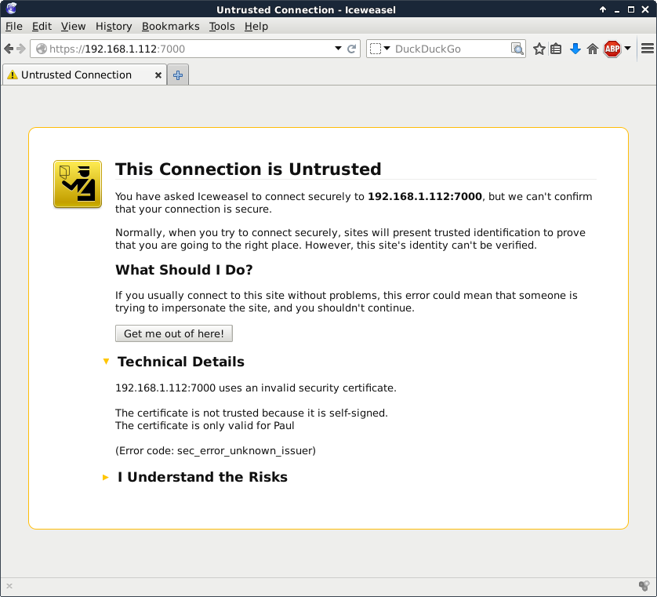
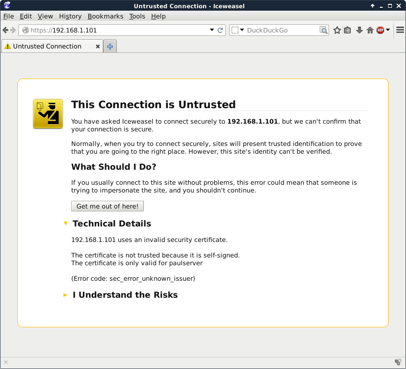

## introduction to Apache

### installing on Debian

The transcript below shows that there is no `apache` server installed, nor
does the `/var/www` directory exist.

```console
student@debian:~$ ls -l /var/www
ls: cannot access '/var/www': No such file or directory
student@debian:~$ dpkg -l apache2
dpkg-query: no packages found matching apache2
```

To install `apache` on Debian:

```console
student@debian:~$ sudo apt install apache2
Installing:                     
  apache2

Installing dependencies:
  apache2-bin   apache2-utils  libaprutil1-dbd-sqlite3  libaprutil1t64  ssl-cert
  apache2-data  libapr1t64     libaprutil1-ldap         liblua5.4-0

Suggested packages:
  apache2-doc  apache2-suexec-pristine  | apache2-suexec-custom  ufw  www-browser

Summary:
  Upgrading: 0, Installing: 10, Removing: 0, Not Upgrading: 87
  Download size: 2,405 kB
  Space needed: 8,568 kB / 58.7 GB available

Continue? [Y/n] y
Get:1 http://httpredir.debian.org/debian trixie/main amd64 libapr1t64 amd64 1.7.5-1 [104 kB]
[... output omitted ...]
Enabling conf serve-cgi-bin.
Enabling site 000-default.
Created symlink '/etc/systemd/system/multi-user.target.wants/apache2.service' → '/usr/lib/systemd/system/apache2.service'.
Created symlink '/etc/systemd/system/multi-user.target.wants/apache-htcacheclean.service' → '/usr/lib/systemd/system/apache-htcacheclean.service'.
Processing triggers for man-db (2.13.1-1) ...
Processing triggers for libc-bin (2.41-12) ...
```

After installation, the same two commands as above will yield a different result:

```console
student@debian:~$ ls -l /var/www
total 4
drwxr-xr-x 2 root root 4096 Aug 10 14:39 html
student@debian:~$ dpkg -l apache2
Desired=Unknown/Install/Remove/Purge/Hold
| Status=Not/Inst/Conf-files/Unpacked/halF-conf/Half-inst/trig-aWait/Trig-pend
|/ Err?=(none)/Reinst-required (Status,Err: uppercase=bad)
||/ Name           Version          Architecture Description
+++-==============-================-============-=================================
ii  apache2        2.4.68-1~deb13u1 amd64        Apache HTTP Server
```

### installing on Enterprise Linux

Note that Red Hat derived distributions use `httpd` as package and process name instead of `apache`.

To verify whether `apache` is installed in Enterprise Linux:

```console
student@el:~$ ls -l /var/www
ls: cannot access '/var/www': No such file or directory
student@el:~$ rpm -q httpd
package httpd is not installed
```

To install Apache on Enterprise Linux:

```console
student@el:~$ sudo dnf install httpd
Last metadata expiration check: 0:15:30 ago on Mon 10 Aug 2026 02:30:24 PM UTC.
Dependencies resolved.
====================================================================================================================
 Package                           Architecture       Version                           Repository             Size
====================================================================================================================
Installing:
 httpd                             x86_64             2.4.63-13.el10_2.5                appstream              48 k
Installing dependencies:
 almalinux-logos-httpd             noarch             100.4-1.el10_2                    appstream              18 k
 apr                               x86_64             1.7.5-3.el10                      appstream             127 k
 apr-util                          x86_64             1.6.3-23.el10_1                   appstream              97 k
 apr-util-lmdb                     x86_64             1.6.3-23.el10_1                   appstream              13 k
 httpd-core                        x86_64             2.4.63-13.el10_2.5                appstream             1.4 M
 httpd-filesystem                  noarch             2.4.63-13.el10_2.5                appstream              14 k
 httpd-tools                       x86_64             2.4.63-13.el10_2.5                appstream              81 k
Installing weak dependencies:
 apr-util-openssl                  x86_64             1.6.3-23.el10_1                   appstream              15 k
 mod_http2                         x86_64             2.0.29-4.el10_2.2                 appstream             161 k
 mod_lua                           x86_64             2.4.63-13.el10_2.5                appstream              59 k

Transaction Summary
====================================================================================================================
Install  11 Packages

Total download size: 2.0 M
Installed size: 6.0 M
Is this ok [y/N]: y
Downloading Packages:
(1/11): apr-util-1.6.3-23.el10_1.x86_64.rpm                                         625 kB/s |  97 kB     00:00    
[... output omitted ...]
Installed:
  almalinux-logos-httpd-100.4-1.el10_2.noarch               apr-1.7.5-3.el10.x86_64                                 
  apr-util-1.6.3-23.el10_1.x86_64                           apr-util-lmdb-1.6.3-23.el10_1.x86_64                    
  apr-util-openssl-1.6.3-23.el10_1.x86_64                   httpd-2.4.63-13.el10_2.5.x86_64                         
  httpd-core-2.4.63-13.el10_2.5.x86_64                      httpd-filesystem-2.4.63-13.el10_2.5.noarch              
  httpd-tools-2.4.63-13.el10_2.5.x86_64                     mod_http2-2.0.29-4.el10_2.2.x86_64                      
  mod_lua-2.4.63-13.el10_2.5.x86_64                        

Complete!
```

After running the `dnf install httpd` command, Apache is installed and the `/var/www` directory exists.

```console
student@el:~$ ls -l /var/www
total 0
drwxr-xr-x. 2 root root 6 Jul  9 00:00 cgi-bin
drwxr-xr-x. 2 root root 6 Jul  9 00:00 html
student@el:~$ rpm -q httpd
httpd-2.4.63-13.el10_2.5.x86_64
```

### running Apache on Debian

On Debian, the Apache service will also have been started automatically after installation. You can verify this with the `systemctl status apache2.service` command:

```console
student@debian:~$ systemctl status apache2.service 
● apache2.service - The Apache HTTP Server
     Loaded: loaded (/usr/lib/systemd/system/apache2.service; enabled; preset: enabled)
     Active: active (running) since Mon 2026-08-10 14:39:59 UTC; 2min 59s ago
 Invocation: 364ecb43cebc4fb58e929a771ef6900b
       Docs: https://httpd.apache.org/docs/2.4/
   Main PID: 3252 (apache2)
      Tasks: 55 (limit: 3506)
     Memory: 5.3M (peak: 5.7M)
        CPU: 23ms
     CGroup: /system.slice/apache2.service
             ├─3252 /usr/sbin/apache2 -k start
             ├─3254 /usr/sbin/apache2 -k start
             └─3255 /usr/sbin/apache2 -k start
```

Remark that the service is also enabled, so it will start automatically after a reboot.

If the service is running, you can check if it is serving web pages using e.g. `curl`:

```console
student@debian:~$ curl -i http://localhost/
HTTP/1.1 200 OK
Date: Mon, 10 Aug 2026 14:52:05 GMT
Server: Apache/2.4.68 (Debian)
Last-Modified: Mon, 10 Aug 2026 14:39:58 GMT
ETag: "29cf-658b25412c753"
Accept-Ranges: bytes
Content-Length: 10703
Vary: Accept-Encoding
Content-Type: text/html

<!DOCTYPE html PUBLIC "-//W3C//DTD XHTML 1.0 Transitional//EN" "http://www.w3.org/TR/xhtml1/DTD/xhtml1-transitional.dtd">
<html xmlns="http://www.w3.org/1999/xhtml">
  <head>
    <meta http-equiv="Content-Type" content="text/html; charset=UTF-8" />
    <title>Apache2 Debian Default Page: It works</title>
[... output omitted ...]
```

Debian provides a default web page in `/var/www/index.html` that is served when you browse to the ip-address of your server.

You can also verify that Apache is running by opening a web browser, and browse to the ip-address of your server (this is left as an exercise). An Apache test page should be shown.

### running Apache on Enterprise Linux

Remark that on Enterprise Linux, the `httpd` service is not started automatically after installation. You can verify this with the `systemctl status httpd.service` command:

```console
student@el:~$ systemctl status httpd
○ httpd.service - The Apache HTTP Server
     Loaded: loaded (/usr/lib/systemd/system/httpd.service; disabled; preset: disabled)
     Active: inactive (dead)
       Docs: man:httpd.service(8)
```

To start and enable the `httpd` service, use the following command (and then verify with `systemctl status httpd`):

```console
student@el:~$ sudo systemctl enable --now httpd
Created symlink '/etc/systemd/system/multi-user.target.wants/httpd.service' → '/usr/lib/systemd/system/httpd.service'.
student@el:~$ systemctl status httpd
● httpd.service - The Apache HTTP Server
     Loaded: loaded (/usr/lib/systemd/system/httpd.service; enabled; preset: disabled)
     Active: active (running) since Mon 2026-08-10 14:59:32 UTC; 3s ago
 Invocation: 3ffd69f238814e7faadad51b3e07d112
       Docs: man:httpd.service(8)
   Main PID: 7818 (httpd)
     Status: "Started, listening on: port 80"
      Tasks: 177 (limit: 18320)
     Memory: 13.9M (peak: 14.2M)
        CPU: 37ms
     CGroup: /system.slice/httpd.service
             ├─7818 /usr/sbin/httpd -DFOREGROUND
             ├─7820 /usr/sbin/httpd -DFOREGROUND
             ├─7821 /usr/sbin/httpd -DFOREGROUND
             ├─7822 /usr/sbin/httpd -DFOREGROUND
             └─7858 /usr/sbin/httpd -DFOREGROUND

Aug 10 14:59:32 el systemd[1]: Starting httpd.service - The Apache HTTP Server...
Aug 10 14:59:32 el (httpd)[7818]: httpd.service: Referenced but unset environment variable evaluates to an empty st>
Aug 10 14:59:32 el httpd[7818]: AH00558: httpd: Could not reliably determine the server's fully qualified domain na>
Aug 10 14:59:32 el httpd[7818]: Server configured, listening on: port 80
Aug 10 14:59:32 el systemd[1]: Started httpd.service - The Apache HTTP Server.
```

You can again use `curl` to verify that Apache is serving web pages:

```console
student@el:~$ curl -i http://localhost/
HTTP/1.1 403 Forbidden
Date: Mon, 10 Aug 2026 15:01:06 GMT
Server: Apache/2.4.63 (AlmaLinux)
Last-Modified: Thu, 28 Nov 2024 18:02:45 GMT
ETag: "1680-627fce3a8db40"
Accept-Ranges: bytes
Content-Length: 5760
Content-Type: text/html; charset=UTF-8

<!DOCTYPE html PUBLIC "-//W3C//DTD XHTML 1.1//EN" "http://www.w3.org/TR/xhtml11/DTD/xhtml11.dtd">

<html xmlns="http://www.w3.org/1999/xhtml" xml:lang="en">
        <head>
                <title>Test Page for the HTTP Server on AlmaLinux</title>
[... output omitted ...]
```

In a browser, you will see a test page, just like on Debian. But do you notice the difference in behaviour between Debian and Enterprise Linux?

Although the same Apache is running on both Debian and Enterprise Linux, there are considerable differences between the two distributions in the way you configure and manage Apache.

### index file on Enterprise Linux

Enterprise Linux does not provide a standard index.html or index.php file, which results in the 403 Forbidden error shown above.

If you create a custom `index.html` file in `/var/www/html` it will immediately serve as an index for this web server.

```console
student@el:~$ echo '<html><body><h1>It works!</h1></body></html>' | sudo tee /var/www/html/index.html
<html><body><h1>It works!</h1></body></html>
student@el:~$ curl -i http://127.0.0.1/
HTTP/1.1 200 OK
Date: Mon, 10 Aug 2026 15:14:37 GMT
Server: Apache/2.4.63 (AlmaLinux)
Last-Modified: Mon, 10 Aug 2026 15:14:24 GMT
ETag: "2d-658b2cf420fd7"
Accept-Ranges: bytes
Content-Length: 45
Content-Type: text/html; charset=UTF-8

<html><body><h1>It works!</h1></body></html>
```

### default website

Changing the default website of a freshly installed Apache web server is easy. All you need to do is create (or change) an index.html file in the `DocumentRoot` directory.

To locate the `DocumentRoot` directory on Debian:

```console
student@debian:~$ grep DocumentRoot /etc/apache2/sites-available/000-default.conf 
        DocumentRoot /var/www/html
```

This means that `/var/www/index.html` is the default web site.

Use curl to download the index page and compare it with the index.html file in `/var/www/html`. They should be exactly the same!

```console
student@debian:~$ curl -s http://127.0.0.1/ > index.html 
student@debian:~$ diff index.html /var/www/html/index.html 
```

Diff does not return any output, which means that the two files are identical.

This transcript shows how to locate the `DocumentRoot` directory on Enterprise Linux.

```console
student@el:~$ grep ^DocumentRoot /etc/httpd/conf/httpd.conf 
DocumentRoot "/var/www/html"
```

### Apache configuration

There are many similarities, but also a couple of differences when configuring `apache` on Debian or on Enterprise Linux. Both Linux families will get their own sections with examples.

All configuration on Debian and derived distributions is done in `/etc/apache2`.

```console
student@debian:~$ ls -l /etc/apache2/
total 80
-rw-r--r-- 1 root root  7178 Aug 10 14:55 apache2.conf
drwxr-xr-x 2 root root  4096 Aug 10 14:39 conf-available
drwxr-xr-x 2 root root  4096 Aug 10 14:39 conf-enabled
-rw-r--r-- 1 root root  1782 Jun 11 18:28 envvars
-rw-r--r-- 1 root root 31063 Dec  5  2025 magic
drwxr-xr-x 2 root root 12288 Aug 10 14:39 mods-available
drwxr-xr-x 2 root root  4096 Aug 10 14:39 mods-enabled
-rw-r--r-- 1 root root   274 Jun 11 18:28 ports.conf
drwxr-xr-x 2 root root  4096 Aug 10 14:39 sites-available
drwxr-xr-x 2 root root  4096 Aug 10 14:39 sites-enabled
```

Enterprise Linux uses `/etc/httpd`.

```console
student@el:~$ ls -l /etc/httpd/
total 4
drwxr-xr-x. 2 root root   37 Aug 10 14:46 conf
drwxr-xr-x. 2 root root   82 Aug 10 14:46 conf.d
drwxr-xr-x. 2 root root 4096 Aug 10 14:46 conf.modules.d
lrwxrwxrwx. 1 root root   19 Jul  9 00:00 logs -> ../../var/log/httpd
lrwxrwxrwx. 1 root root   29 Jul  9 00:00 modules -> ../../usr/lib64/httpd/modules
lrwxrwxrwx. 1 root root   10 Jul  9 00:00 run -> /run/httpd
lrwxrwxrwx. 1 root root   19 Jul  9 00:00 state -> ../../var/lib/httpd
```

Those are quite different, indeed!

The main configuration file on Debian is `/etc/apache2/apache2.conf`, while on Enterprise Linux it is `/etc/httpd/conf/httpd.conf`.

It is wise to make a backup of the configuration files before making changes. You can use the `cp` command to make a copy of the configuration file.

Before reloading the service with a changed settings, it is a good idea to check the syntax of the configuration files. On Debian, use `apache2ctl configtest`, while on Enterprise Linux you can use `httpd -t`.

```console
student@debian:~$ sudo apache2ctl configtest
AH00558: apache2: Could not reliably determine the server's fully qualified domain name, using 127.0.1.1. Set the 'ServerName' directive globally to suppress this message
Syntax OK
```

To avoid this message, you can set the ServerName directive in `/etc/apache2/apache2.conf` to the hostname of your server. If your system does not have a hostname that resolves to an IP address, you can use `localhost` as the ServerName, or an entry from `/etc/hosts` that resolves to the ip-address of your server.

```console
student@debian:~$ grep debian /etc/hosts
127.0.1.1       debian     debian.localdomain
student@debian:~$ echo 'ServerName debian.localdomain' | sudo tee -a /etc/apache2/apache2.conf
student@debian:~$ tail -1 /etc/apache2/apache2.conf
ServerName debian.localdomain
student@debian:~$ sudo apache2ctl configtest 
Syntax OK
student@debian:~$ sudo systemctl restart apache2
```

## port virtual hosts on Debian

Virtual hosts are the mechanism that allows you to run multiple websites on one web server. Each website can be on a different port, or on the same port but with a different hostname. Client requests are routed to the correct web server (and port) through e.g. a reverse proxy and/or several DNS records pointing to the same ip-address.

### default virtual host

Debian has a virtualhost configuration file for its default website in
`/etc/apache2/sites-available/default`.

```console
student@debian:~$ head -1 /etc/apache2/sites-available/000-default.conf 
<VirtualHost *:80>
```

This configuration handles all HTTP requests on port 80, regardless of the server hostname the request was directed to. The `DocumentRoot` directive in the configuration file determines the directory that is served for this virtual host.

```console
student@debian:~$ grep DocumentRoot /etc/apache2/sites-available/000-default.conf
        DocumentRoot /var/www/html
```

### three extra virtual hosts

In this scenario we create three additional websites for three customers
that share a clubhouse and want to jointly hire you as their webmaster. They are a model train club named `Choo Choo`, a chess club named `Chess Club 42` and a hackerspace named `hunter2`.

One way to put three websites on one web server, is to put each website on a different port. This example shows three newly created `virtual hosts`, one for each customer.

```console
student@debian:~$ cd /etc/apache2/sites-available/
student@debian:/etc/apache2/sites-available$ sudo nano choochoo.conf
student@debian:/etc/apache2/sites-available$ sudo nano chessclub42.conf 
student@debian:/etc/apache2/sites-available$ sudo nano hunter2.conf
student@debian:/etc/apache2/sites-available$ cat choochoo.conf 
<VirtualHost *:7000>
        ServerAdmin webmaster@localhost
        DocumentRoot /var/www/choochoo
</VirtualHost>
student@debian:/etc/apache2/sites-available$ cat chessclub42.conf 
<VirtualHost *:8000>
        ServerAdmin webmaster@localhost
        DocumentRoot /var/www/chessclub42
</VirtualHost>
student@debian:/etc/apache2/sites-available$ cat hunter2.conf 
<VirtualHost *:9000>
        ServerAdmin webmaster@localhost
        DocumentRoot /var/www/hunter2
</VirtualHost>
```

Notice the different port numbers 7000, 8000 and 9000. Notice also that we specified a unique `DocumentRoot` for each website.

### three extra ports

We need to enable these three ports on Apache in the `ports.conf` file. Open this file with a text editor and add three lines starting with the `Listen` directive specifying the three extra ports.

```console
student@debian:~$ sudo nano /etc/apache2/ports.conf
student@debian:~$ grep ^Listen /etc/apache2/ports.conf 
Listen 80
Listen 7000
Listen 8000
Listen 9000
```

### three extra websites

Next we need to create three `DocumentRoot` directories.

```console
student@debian:~$ sudo mkdir /var/www/{choochoo,chessclub42,hunter2}
student@debian:~$ ls -l /var/www
total 16
drwxr-xr-x 2 root root 4096 Aug 11 11:52 chessclub42
drwxr-xr-x 2 root root 4096 Aug 11 11:52 choochoo
drwxr-xr-x 2 root root 4096 Aug 10 14:39 html
drwxr-xr-x 2 root root 4096 Aug 11 11:52 hunter2
```

And we have to put some content in those directories.

```console
student@debian:~$ echo 'Choo Choo model train Choo Choo' | sudo tee /var/www/choochoo/index.html
Choo Choo model train Choo Choo
student@debian:~$ echo 'Welcome to chess club 42' | sudo tee /var/www/chessclub42/index.html
Welcome to chess club 42
student@debian:~$ echo 'HaCkInG iS fUn At HuNtEr2' | sudo tee /var/www/hunter2/index.html
HaCkInG iS fUn At HuNtEr2
```

### enabling extra websites

The last step is to enable the websites with the `a2ensite` command. This command will create links in `sites-enabled`.

The links are not there yet...

```console
student@debian:~$ cd /etc/apache2/
student@debian:/etc/apache2$ ls sites-available/
000-default.conf  chessclub42.conf  choochoo.conf  default-ssl.conf  hunter2.conf
student@debian:/etc/apache2$ ls sites-enabled/
000-default.conf
```

So we run the `a2ensite` command for all websites.

```console
student@debian:/etc/apache2$ sudo a2ensite choochoo chessclub42 hunter2
Enabling site choochoo.
Enabling site chessclub42.
Enabling site hunter2.
To activate the new configuration, you need to run:
  systemctl reload apache2
student@debian:/etc/apache2$ ls -l sites-enabled/
total 0
lrwxrwxrwx 1 root root 35 Aug 10 14:39 000-default.conf -> ../sites-available/000-default.conf
lrwxrwxrwx 1 root root 35 Aug 11 11:58 chessclub42.conf -> ../sites-available/chessclub42.conf
lrwxrwxrwx 1 root root 32 Aug 11 11:58 choochoo.conf -> ../sites-available/choochoo.conf
lrwxrwxrwx 1 root root 31 Aug 11 11:58 hunter2.conf -> ../sites-available/hunter2.conf
```

The links are created, so we can tell `apache` to restart.

```console
student@debian:/etc/apache2$ sudo systemctl reload apache2.service
```

This command should not return any output, which means that the `apache` service has been reloaded successfully.

### testing the three websites

Testing the several websites can be done with `curl` or `wget`. The following transcript shows the output of three `curl` commands, each sending a request to the three configured ports. The output is the content of the `index.html` file in the `DocumentRoot` of each website.

```console
student@debian:/etc/apache2$ curl http://localhost:7000/
Choo Choo model train Choo Choo
student@debian:/etc/apache2$ curl http://localhost:8000/
Welcome to chess club 42!
student@debian:/etc/apache2$ curl http://localhost:9000/
HaCkInG iS fUn At HuNtEr2
```

Try testing from another computer using the ip-address of your server!

## named virtual hosts on Debian

### named virtual hosts

For an external customer, having to access a website through a port number is not very user friendly. It is much better to have a website accessible by name, e.g. `mysite.example.com` instead of `www.example.com:8000`. This is possible with named virtual hosts.

The chess club and the model train club would prefer to have their website accessible by name.

We continue work on the same server that has three websites on three ports. We need to make sure those websites are accesible using the names `choochoo.local`, `chessclub42.local` and `hunter2.local`.

We start by creating three new virtualhosts.

```console
student@debian:/etc/apache2/sites-available$ sudo nano choochoo.local.conf 
student@debian:/etc/apache2/sites-available$ sudo nano chessclub42.local.conf 
student@debian:/etc/apache2/sites-available$ sudo nano hunter2.local.conf 
student@debian:/etc/apache2/sites-available$ cat *.local.conf
<VirtualHost *:80>
        ServerAdmin webmaster@localhost
        ServerName chessclub42.local
        DocumentRoot /var/www/chessclub42
</VirtualHost>
<VirtualHost *:80>
        ServerAdmin webmaster@localhost
        ServerName choochoo.local
        DocumentRoot /var/www/choochoo
</VirtualHost>
<VirtualHost *:80>
        ServerAdmin webmaster@localhost
        ServerName hunter2.local
        DocumentRoot /var/www/hunter2
</VirtualHost>
```

Notice that they all listen on `port 80` and have an extra `ServerName` directive.

### name resolution

In order for a client to access a website by name, the name must be resolved to an ip-address. This is usually done with DNS. For this demo it is also possible to quickly add the three names to the `/etc/hosts` file.

In this example, we will first check our ip address and then add the three names to `/etc/hosts`. If you want to reproduce the example, be sure to replace the ip address with your own!

```console
student@debian:/etc/apache2/sites-available$ ip -br a
lo               UNKNOWN        127.0.0.1/8 ::1/128 
eth0             UP             10.0.2.15/24 fe80::e845:83b0:bc1:ed0d/64 
eth1             UP             192.168.56.13/24 fe80::a00:27ff:fe09:b99/64 
student@debian:/etc/apache2/sites-available$ sudo nano /etc/hosts
student@debian:/etc/apache2/sites-available$ grep ^192 /etc/hosts
192.168.56.13   choochoo.local
192.168.56.13   chessclub42.local
192.168.56.13   hunter2.local
```

You can check if the names are resolved correctly with the `getent ahosts` command.

```console
student@debian:/etc/apache2/sites-available$ getent ahosts choochoo.local
192.168.56.13   STREAM choochoo.local
192.168.56.13   DGRAM  
192.168.56.13   RAW    
student@debian:/etc/apache2/sites-available$ getent ahosts chessclub42.local
192.168.56.13   STREAM chessclub42.local
192.168.56.13   DGRAM  
192.168.56.13   RAW    
student@debian:/etc/apache2/sites-available$ getent ahosts hunter2.local
192.168.56.13   STREAM hunter2.local
192.168.56.13   DGRAM  
192.168.56.13   RAW 
```

Remark that you could also use `ping`, but actually sending packets is not necessary to verify name resolution. The `nslookup` command will probably not work (if it is installed at all), beause it will try to query a DNS server, which is not configured for these names.

### enabling virtual hosts

Next we enable them with `a2ensite`.

```console
student@debian:/etc/apache2/sites-available$ sudo a2ensite choochoo.local chessclub42.local hunter2.local
Enabling site choochoo.local.
Enabling site chessclub42.local.
Enabling site hunter2.local.
To activate the new configuration, you need to run:
  systemctl reload apache2
```

### reload and verify

After a `service apache2 reload` the websites should be available by name.

```console
student@debian:/etc/apache2/sites-available$ sudo systemctl reload apache2.service 
student@debian:/etc/apache2/sites-available$ curl choochoo.local
Choo Choo model train Choo Choo
student@debian:/etc/apache2/sites-available$ curl chessclub42.local
Welcome to chess club 42!
student@debian:/etc/apache2/sites-available$ curl hunter2.local
HaCkInG iS fUn At HuNtEr2
```

## password protected website on Debian

You can secure files and directories in your website with a `.htaccess` file that refers to a `.htpasswd` file. The `htpasswd` command can create a `.htpasswd` file that contains a userid and an (encrypted) password.

This example creates a user and password for the hacker named `cliff` and uses the `-c` flag to create the `.htpasswd` file.

```console
student@debian:~$ sudo htpasswd -c /var/www/.htpasswd cliff
New password: 
Re-type new password: 
Adding password for user cliff
```

Hacker `rob` also wants access, so we add a second user and password to `.htpasswd` (this time without the `-c` flag!).

```console
student@debian:~$ sudo htpasswd /var/www/.htpasswd rob
New password: 
Re-type new password: 
Adding password for user rob
student@debian:~$ cat /var/www/.htpasswd 
cliff:$apr1$bAUQisSY$KTgmdtjTamFUdP.CsjDkP0
rob:$apr1$TyUD.92A$Nfr9YBbG4Vcasew97S6QZ1
```

Both Cliff and Rob chose the same password (hunter2), but that is not visible in the `.htpasswd` file because of the different salts.

Next we need to create a `.htaccess` file in the `DocumentRoot` of the website we want to protect. An example is shown here:

```console
student@debian:~$ cd /var/www/hunter2/
student@debian:/var/www/hunter2$ sudo nano .htaccess
student@debian:/var/www/hunter2$ cat .htaccess 
AuthUserFile /var/www/.htpasswd
AuthName "Members only!"
AuthType Basic
require valid-user
```

Note that we are protecting the website on port 9000 that we created earlier.

And because we put the website for the Hackerspace named hunter2 in a subdirectory of the default website, we will need to adjust the `AllowOvveride` parameter in the configuration. Open `/etc/apache2/apache2.conf` in a text editor and search for the line with `<Directory /var/www/>`. It will look like this:

```apacheconf
<Directory /var/www/>
    Options Indexes FollowSymLinks
    AllowOverride None
    Require all granted
</Directory>
```

Change the code block to the following:

```apacheconf
<Directory /var/www/>
    Options Indexes FollowSymLinks MultiViews
    AllowOverride Authconfig
    Order allow,deny
    allow from all
</Directory>
```

Now restart the apache2 server and test that it works!

```console
student@debian:~$ sudo systemctl restart apache2.service 
student@debian:~$ curl -i http://localhost:9000/
HTTP/1.1 401 Unauthorized
Date: Tue, 11 Aug 2026 13:00:16 GMT
Server: Apache/2.4.68 (Debian)
WWW-Authenticate: Basic realm="Members only!"
Content-Length: 498
Content-Type: text/html; charset=iso-8859-1

<!DOCTYPE HTML PUBLIC "-//W3C//DTD HTML 4.01//EN" "http://www.w3.org/TR/html4/strict.dtd">
<html><head>
<title>401 Unauthorized</title>
</head><body>
<h1>Unauthorized</h1>
<p>This server could not verify that you
are authorized to access the document
requested.  Either you supplied the wrong
credentials (e.g., bad password), or your
browser doesn't understand how to supply
the credentials required.</p>
<hr>
<address>Apache/2.4.68 (Debian) Server at localhost Port 9000</address>
</body></html>
```

As expected, the server returns a 401 Unauthorized error. You should get the same result for url `http://hunter2.local/`.

You can test the authentication with the `-u` option of `curl`.

```console
student@debian:~$ curl -u cliff:hunter2 http://localhost:9000/
HaCkInG iS fUn At HuNtEr2
student@debian:~$ curl -u rob:hunter2 http://localhost:9000/
HaCkInG iS fUn At HuNtEr2
```

If you try to access the website from a web browser, you will see a pop-up window asking for a username and password. You can enter either `cliff` or `rob` as the username, and `hunter2` as the password.

## port virtual hosts on CentOS

### default virtual host

Unlike Debian, CentOS has no virtualHost configuration file for its
default website. Instead the default configuration will throw a standard
error page when no index file can be found in the default location
(/var/www/html).

### three extra virtual hosts

In this scenario we create three additional websites for three customers
that share a clubhouse and want to jointly hire you. They are a model
train club named `Choo Choo`, a chess club named `Chess Club 42` and a
hackerspace named `hunter2`.

One way to put three websites on one web server, is to put each website
on a different port. This screenshot shows three newly created
`virtual hosts`, one for each customer.

    [root@CentOS65 ~]# vi /etc/httpd/conf.d/choochoo.conf
    [root@CentOS65 ~]# cat /etc/httpd/conf.d/choochoo.conf
    <VirtualHost *:7000>
            ServerAdmin webmaster@localhost
            DocumentRoot /var/www/html/choochoo
    </VirtualHost>
    [root@CentOS65 ~]# vi /etc/httpd/conf.d/chessclub42.conf
    [root@CentOS65 ~]# cat /etc/httpd/conf.d/chessclub42.conf
    <VirtualHost *:8000>
            ServerAdmin webmaster@localhost
            DocumentRoot /var/www/html/chessclub42
    </VirtualHost>
    [root@CentOS65 ~]# vi /etc/httpd/conf.d/hunter2.conf
    [root@CentOS65 ~]# cat /etc/httpd/conf.d/hunter2.conf
    <VirtualHost *:9000>
            ServerAdmin webmaster@localhost
            DocumentRoot /var/www/html/hunter2
    </VirtualHost>

Notice the different port numbers 7000, 8000 and 9000. Notice also that
we specified a unique `DocumentRoot` for each website.

### three extra ports

We need to enable these three ports on apache in the `httpd.conf` file.

    [root@CentOS65 ~]# vi /etc/httpd/conf/httpd.conf
    root@linux:~# grep ^Listen /etc/httpd/conf/httpd.conf
    Listen 80
    Listen 7000
    Listen 8000
    Listen 9000

### SELinux guards our ports

If we try to restart our server, we will notice the following error:

    [root@CentOS65 ~]# service httpd restart
    Stopping httpd:                                            [  OK  ]
    Starting httpd: 
           (13)Permission denied: make_sock: could not bind to address 0.0.0.0:7000
    no listening sockets available, shutting down
                                                               [FAILED]

This is due to SELinux reserving ports 7000 and 8000 for other uses. We
need to tell SELinux we want to use these ports for http traffic

    [root@CentOS65 ~]# semanage port -m -t http_port_t -p tcp 7000
    [root@CentOS65 ~]# semanage port -m -t http_port_t -p tcp 8000
    [root@CentOS65 ~]# service httpd restart
    Stopping httpd:                                            [  OK  ]
    Starting httpd:                                            [  OK  ]

### three extra websites

Next we need to create three `DocumentRoot` directories.

    [root@CentOS65 ~]# mkdir /var/www/html/choochoo
    [root@CentOS65 ~]# mkdir /var/www/html/chessclub42
    [root@CentOS65 ~]# mkdir /var/www/html/hunter2

And we have to put some really simple website in those directories.

    [root@CentOS65 ~]# echo 'Choo Choo model train Choo Choo' > /var/www/html/chooc\
    hoo/index.html
    [root@CentOS65 ~]# echo 'Welcome to chess club 42' > /var/www/html/chessclub42/\
    index.html
    [root@CentOS65 ~]# echo 'HaCkInG iS fUn At HuNtEr2' > /var/www/html/hunter2/ind\
    ex.html

### enabling extra websites

The only way to enable or disable configurations in RHEL/CentOS is by
renaming or moving the configuration files. Any file in
/etc/httpd/conf.d ending on .conf will be loaded by Apache. To disable a
site we can either rename the file or move it to another directory.

The files are created, so we can tell `apache`.

    [root@CentOS65 ~]# ls /etc/httpd/conf.d/
    chessclub42.conf  choochoo.conf  hunter2.conf  README  welcome.conf
    [root@CentOS65 ~]# service httpd reload
    Reloading httpd: 

### testing the three websites

Testing the model train club named `Choo Choo` on port 7000.

    [root@CentOS65 ~]# wget 127.0.0.1:7000
    --2014-05-11 11:59:36--  http://127.0.0.1:7000/
    Connecting to 127.0.0.1:7000... connected.
    HTTP request sent, awaiting response... 200 OK
    Length: 32 [text/html]
    Saving to: `index.html'

    100%[===========================================>] 32          --.-K/s   in 0s

    2014-05-11 11:59:36 (4.47 MB/s) - `index.html' saved [32/32]

    [root@CentOS65 ~]# cat index.html 
    Choo Choo model train Choo Choo

Testing the chess club named `Chess Club 42` on port 8000.

    [root@CentOS65 ~]# wget 127.0.0.1:8000
    --2014-05-11 12:01:30--  http://127.0.0.1:8000/
    Connecting to 127.0.0.1:8000... connected.
    HTTP request sent, awaiting response... 200 OK
    Length: 25 [text/html]
    Saving to: `index.html.1'

    100%[===========================================>] 25          --.-K/s   in 0s

    2014-05-11 12:01:30 (4.25 MB/s) - `index.html.1' saved [25/25]

    root@linux:/etc/apache2# cat index.html.1 
    Welcome to chess club 42

Testing the hacker club named `hunter2` on port 9000.

    [root@CentOS65 ~]# wget 127.0.0.1:9000 
    --2014-05-11 12:02:37--  http://127.0.0.1:9000/
    Connecting to 127.0.0.1:9000... connected.
    HTTP request sent, awaiting response... 200 OK
    Length: 26 [text/html]
    Saving to: `index.html.2'

    100%[===========================================>] 26          --.-K/s   in 0s

    2014-05-11 12:02:37 (4.49 MB/s) - `index.html.2' saved [26/26]

    root@linux:/etc/apache2# cat index.html.2 
    HaCkInG iS fUn At HuNtEr2

Cleaning up the temporary files.

    [root@CentOS65 ~]# rm index.html index.html.1 index.html.2 

### firewall rules

If we attempt to access the site from another machine however, we will
not be able to view the website yet. The firewall is blocking incoming
connections. We need to open these incoming ports first

    [root@CentOS65 ~]# iptables -I INPUT -p tcp --dport 80 -j ACCEPT
    [root@CentOS65 ~]# iptables -I INPUT -p tcp --dport 7000 -j ACCEPT
    [root@CentOS65 ~]# iptables -I INPUT -p tcp --dport 8000 -j ACCEPT
    [root@CentOS65 ~]# iptables -I INPUT -p tcp --dport 9000 -j ACCEPT

And if we want these rules to remain active after a reboot, we need to
save them

    [root@CentOS65 ~]# service iptables save
    iptables: Saving firewall rules to /etc/sysconfig/iptables:[  OK  ]

## named virtual hosts on CentOS

### named virtual hosts

The chess club and the model train club find the port numbers too hard
to remember. They would prefere to have their website accessible by
name.

We continue work on the same server that has three websites on three
ports. We need to make sure those websites are accesible using the names
`choochoo.local`, `chessclub42.local` and `hunter2.local`.

First, we need to enable named virtual hosts in the configuration

    [root@CentOS65 ~]# vi /etc/httpd/conf/httpd.conf
    [root@CentOS65 ~]# grep ^NameVirtualHost /etc/httpd/conf/httpd.conf
    NameVirtualHost *:80
    [root@CentOS65 ~]#

Next we need to create three new virtualhosts.

    [root@CentOS65 ~]# vi /etc/httpd/conf.d/choochoo.local.conf
    [root@CentOS65 ~]# vi /etc/httpd/conf.d/chessclub42.local.conf
    [root@CentOS65 ~]# vi /etc/httpd/conf.d/hunter2.local.conf
    [root@CentOS65 ~]# cat /etc/httpd/conf.d/choochoo.local.conf
    <VirtualHost *:80>
            ServerAdmin webmaster@localhost
            ServerName choochoo.local
            DocumentRoot /var/www/html/choochoo
    </VirtualHost>
    [root@CentOS65 ~]# cat /etc/httpd/conf.d/chessclub42.local.conf
    <VirtualHost *:80>
            ServerAdmin webmaster@localhost
            ServerName chessclub42.local
            DocumentRoot /var/www/html/chessclub42
    </VirtualHost>
    [root@CentOS65 ~]# cat /etc/httpd/conf.d/hunter2.local.conf
    <VirtualHost *:80>
            ServerAdmin webmaster@localhost
            ServerName hunter2.local
            DocumentRoot /var/www/html/hunter2
    </VirtualHost>
    [root@CentOS65 ~]#

Notice that they all listen on `port 80` and have an extra `ServerName`
directive.

### name resolution

We need some way to resolve names. This can be done with DNS, which is
discussed in another chapter. For this demo it is also possible to
quickly add the three names to the `/etc/hosts` file.

    [root@CentOS65 ~]# grep ^192 /etc/hosts
    192.168.1.225 choochoo.local
    192.168.1.225 chessclub42.local
    192.168.1.225 hunter2.local

Note that you may have another ip address...

### reload and verify

After a `service httpd reload` the websites should be available by name.

    [root@CentOS65 ~]# service httpd reload
    Reloading httpd: 
    [root@CentOS65 ~]# wget chessclub42.local
    --2014-05-25 16:59:14--  http://chessclub42.local/
    Resolving chessclub42.local... 192.168.1.225
    Connecting to chessclub42.local|192.168.1.225|:80... connected.
    HTTP request sent, awaiting response... 200 OK
    Length: 25 [text/html]
    Saving to: âindex.htmlâ

    100%[=============================================>] 25          --.-K/s   in 0s      

    2014-05-25 16:59:15 (1014 KB/s) - `index.html' saved [25/25]

    [root@CentOS65 ~]# cat index.html
    Welcome to chess club 42

## password protected website on CentOS

You can secure files and directories in your website with a `.htaccess`
file that refers to a `.htpasswd` file. The `htpasswd`
command can create a `.htpasswd` file that contains a
userid and an (encrypted) password.

This screenshot creates a user and password for the hacker named `cliff`
and uses the `-c` flag to create the `.htpasswd` file.

    [root@CentOS65 ~]# htpasswd -c /var/www/.htpasswd cliff
    New password: 
    Re-type new password: 
    Adding password for user cliff
    [root@CentOS65 ~]# cat /var/www/.htpasswd
    cliff:QNwTrymMLBctU

Hacker `rob` also wants access, this screenshot shows how to add a
second user and password to `.htpasswd`.

    [root@CentOS65 ~]# htpasswd /var/www/.htpasswd rob
    New password: 
    Re-type new password: 
    Adding password for user rob
    [root@CentOS65 ~]# cat /var/www/.htpasswd
    cliff:QNwTrymMLBctU
    rob:EC2vOCcrMXDoM
    [root@CentOS65 ~]#

Both Cliff and Rob chose the same password (hunter2), but that is not
visible in the `.htpasswd` file because of the different salts.

Next we need to create a `.htaccess` file in the `DocumentRoot` of the
website we want to protect. This screenshot shows an example.

    [root@CentOS65 ~]# cat /var/www/html/hunter2/.htaccess 
    AuthUserFile /var/www/.htpasswd
    AuthName "Members only!"
    AuthType Basic
    require valid-user

Note that we are protecting the website on `port 9000` that we created
earlier.

And because we put the website for the Hackerspace named hunter2 in a
subdirectory of the default website, we will need to adjust the
`AllowOvveride` parameter in `/etc/httpd/conf/httpd.conf` under the
`<Directory "/var/www/html">` directive as this screenshot shows.

    [root@CentOS65 ~]# vi /etc/httpd/conf/httpd.conf

    <Directory "/var/www/html">

    # 
    # Possible values for the Options directive are "None", "All",
    # or any combination of:
    #   Indexes Includes FollowSymLinks SymLinksifOwnerMatch ExecCGI MultiViews
    # 
    # Note that "MultiViews" must be named *explicitly* --- "Options All"
    # doesn't give it to you.
    # 
    # The Options directive is both complicated and important.  Please see
    # http://httpd.apache.org/docs/2.2/mod/core.html#options
    # for more information.
    # 
        Options Indexes FollowSymLinks

    # 
    # AllowOverride controls what directives may be placed in .htaccess files.
    # It can be "All", "None", or any combination of the keywords:
    #   Options FileInfo AuthConfig Limit
    #  
        AllowOverride Authconfig

    # 
    # Controls who can get stuff from this server.
    # 
        Order allow,deny
        Allow from all

    </Directory>

Now restart the apache2 server and test that it works!

## troubleshooting apache

When apache restarts, it will verify the syntax of files in the
configuration folder `/etc/apache2` on debian or `/etc/httpd` on CentOS
and it will tell you the name of the faulty file, the line number and an
explanation of the error.

    root@linux:~# service apache2 restart
    apache2: Syntax error on line 268 of /etc/apache2/apache2.conf: Syntax error o\
    n line 1 of /etc/apache2/sites-enabled/chessclub42: /etc/apache2/sites-enabled\
    /chessclub42:4: <VirtualHost> was not closed.\n/etc/apache2/sites-enabled/ches\
    sclub42:1: <VirtualHost> was not closed.
    Action 'configtest' failed.
    The Apache error log may have more information.
     failed!

Below you see the problem... a missing / before on line 4.

    root@linux:~# cat /etc/apache2/sites-available/chessclub42
    <VirtualHost *:8000>
            ServerAdmin webmaster@localhost
            DocumentRoot /var/www/chessclub42
    <VirtualHost>

Let us force another error by renaming the directory of one of our
websites:

    root@linux:~# mv /var/www/choochoo/ /var/www/chooshoo
    root@linux:~# !ser
    service apache2 restart
    Restarting web server: apache2Warning: DocumentRoot [/var/www/choochoo] does n\
    ot exist
    Warning: DocumentRoot [/var/www/choochoo] does not exist
     ... waiting Warning: DocumentRoot [/var/www/choochoo] does not exist
    Warning: DocumentRoot [/var/www/choochoo] does not exist
    .

As you can see, apache will tell you exactly what is wrong.

You can also troubleshoot by connecting to the website via a browser and
then checking the apache log files in `/var/log/apache`.

## virtual hosts example

Below is a sample virtual host configuration. This virtual hosts
overrules the default Apache `ErrorDocument` directive.

    <VirtualHost 83.217.76.245:80>
    ServerName cobbaut.be
    ServerAlias www.cobbaut.be
    DocumentRoot /home/paul/public_html
    ErrorLog /home/paul/logs/error_log
    CustomLog /home/paul/logs/access_log common
    ScriptAlias /cgi-bin/ /home/paul/cgi-bin/
    <Directory /home/paul/public_html>
        Options Indexes IncludesNOEXEC FollowSymLinks
        allow from all
    </Directory>
    ErrorDocument 404 http://www.cobbaut.be/cobbaut.php
    </VirtualHost>
            

## aliases and redirects

Apache supports aliases for directories, like this example shows.

    Alias /paul/ "/home/paul/public_html/"

Similarly, content can be redirected to another website or web server.

    Redirect permanent /foo http://www.foo.com/bar

## more on .htaccess

You can do much more with `.htaccess`. One example is to
use .htaccess to prevent people from certain domains to access your
website. Like in this case, where a number of referer spammers are
blocked from the website.

    student@linux:~/cobbaut.be$ cat .htaccess 
    # Options +FollowSymlinks
    RewriteEngine On
    RewriteCond %{HTTP_REFERER} ^http://(www\.)?buy-adipex.fw.nu.*$ [OR]
    RewriteCond %{HTTP_REFERER} ^http://(www\.)?buy-levitra.asso.ws.*$ [NC,OR]
    RewriteCond %{HTTP_REFERER} ^http://(www\.)?buy-tramadol.fw.nu.*$ [NC,OR]
    RewriteCond %{HTTP_REFERER} ^http://(www\.)?buy-viagra.lookin.at.*$ [NC,OR]
    ...
    RewriteCond %{HTTP_REFERER} ^http://(www\.)?www.healthinsurancehelp.net.*$ [NC]
    RewriteRule .* - [F,L]
    student@linux:~/cobbaut.be$

## traffic

Apache keeps a log of all visitors. The `webalizer` is
often used to parse this log into nice html statistics.

## self signed cert on Debian

Below is a very quick guide on setting up Apache2 on Debian 7 with a
self-signed certificate.

Chances are these packages are already installed.

    root@linux:~# aptitude install apache2 openssl
    No packages will be installed, upgraded, or removed.
    0 packages upgraded, 0 newly installed, 0 to remove and 0 not upgraded.
    Need to get 0 B of archives. After unpacking 0 B will be used.

Create a directory to store the certs, and use `openssl` to create a
self signed cert that is valid for 999 days.

    root@linux:~# mkdir /etc/ssl/localcerts
    root@linux:~# openssl req -new -x509 -days 999 -nodes -out /etc/ssl/local\
    certs/apache.pem -keyout /etc/ssl/localcerts/apache.key
    Generating a 2048 bit RSA private key
    ...
    ...
    writing new private key to '/etc/ssl/localcerts/apache.key'
    -----
    You are about to be asked to enter information that will be incorporated
    into your certificate request.
    What you are about to enter is what is called a Distinguished Name or a DN.
    There are quite a few fields but you can leave some blank
    For some fields there will be a default value,
    If you enter '.', the field will be left blank.
    -----
    Country Name (2 letter code) [AU]:BE
    State or Province Name (full name) [Some-State]:Antwerp
    Locality Name (eg, city) []:Antwerp
    Organization Name (eg, company) [Internet Widgits Pty Ltd]:linux-training.be
    Organizational Unit Name (eg, section) []:
    Common Name (e.g. server FQDN or YOUR name) []:Paul
    Email Address []:

A little security never hurt anyone.

    root@linux:~# ls -l /etc/ssl/localcerts/
    total 8
    -rw-r--r-- 1 root root 1704 Sep 16 18:24 apache.key
    -rw-r--r-- 1 root root 1302 Sep 16 18:24 apache.pem
    root@linux:~# chmod 600 /etc/ssl/localcerts/*
    root@linux:~# ls -l /etc/ssl/localcerts/
    total 8
    -rw------- 1 root root 1704 Sep 16 18:24 apache.key
    -rw------- 1 root root 1302 Sep 16 18:24 apache.pem

Enable the `apache ssl mod`.

    root@linux:~# a2enmod ssl
    Enabling module ssl.
    See /usr/share/doc/apache2.2-common/README.Debian.gz on how to configure SSL\
     and create self-signed certificates.
    To activate the new configuration, you need to run:
      service apache2 restart

Create the website configuration.

    root@linux:~# vi /etc/apache2/sites-available/choochoos
    root@linux:~# cat /etc/apache2/sites-available/choochoos
    <VirtualHost *:7000>
            ServerAdmin webmaster@localhost
            DocumentRoot /var/www/choochoos
            SSLEngine On
            SSLCertificateFile /etc/ssl/localcerts/apache.pem
            SSLCertificateKeyFile /etc/ssl/localcerts/apache.key
    </VirtualHost>
    root@linux:~#

And create the website itself.

    root@linux:/var/www/choochoos# vi index.html
    root@linux:/var/www/choochoos# cat index.html
    Choo Choo HTTPS secured model train Choo Choo

Enable the website and restart (or reload) apache2.

    root@linux:/var/www/choochoos# a2ensite choochoos
    Enabling site choochoos.
    To activate the new configuration, you need to run:
      service apache2 reload
    root@linux:/var/www/choochoos# service apache2 restart
    Restarting web server: apache2 ... waiting .

Chances are your browser will warn you about the self signed
certificate.



## self signed cert on RHEL/CentOS

Below is a quick way to create a self signed cert for https on
RHEL/CentOS. You may need these packages:

    [root@paulserver ~]# yum install httpd openssl mod_ssl
    Loaded plugins: fastestmirror
    Loading mirror speeds from cached hostfile
     * base: ftp.belnet.be
     * extras: ftp.belnet.be
     * updates: mirrors.vooservers.com
    base                                                         | 3.7 kB     00:00
    Setting up Install Process
    Package httpd-2.2.15-31.el6.centos.x86_64 already installed and latest version
    Package openssl-1.0.1e-16.el6_5.15.x86_64 already installed and latest version
    Package 1:mod_ssl-2.2.15-31.el6.centos.x86_64 already ins... and latest version
    Nothing to do

We use `openssl` to create the certificate.

    [root@paulserver ~]# mkdir certs
    [root@paulserver ~]# cd certs
    [root@paulserver certs]# openssl genrsa -out ca.key 2048
    Generating RSA private key, 2048 bit long modulus
    .........+++
    .........................................................+++
    e is 65537 (0x10001)
    [root@paulserver certs]# openssl req -new -key ca.key -out ca.csr
    You are about to be asked to enter information that will be incorporated
    into your certificate request.
    What you are about to enter is what is called a Distinguished Name or a DN.
    There are quite a few fields but you can leave some blank
    For some fields there will be a default value,
    If you enter '.', the field will be left blank.
    -----
    Country Name (2 letter code) [XX]:BE
    State or Province Name (full name) []:antwerp
    Locality Name (eg, city) [Default City]:antwerp
    Organization Name (eg, company) [Default Company Ltd]:antwerp
    Organizational Unit Name (eg, section) []:
    Common Name (eg, your name or your server's hostname) []:paulserver
    Email Address []:

    Please enter the following 'extra' attributes
    to be sent with your certificate request
    A challenge password []:
    An optional company name []:
    [root@paulserver certs]# openssl x509 -req -days 365 -in ca.csr -signkey ca.ke\
    y -out ca.crt
    Signature ok
    subject=/C=BE/ST=antwerp/L=antwerp/O=antwerp/CN=paulserver
    Getting Private key

We copy the keys to the right location (You may be missing SELinux info
here).

    [root@paulserver certs]# cp ca.crt /etc/pki/tls/certs/
    [root@paulserver certs]# cp ca.key ca.csr /etc/pki/tls/private/

We add the location of our keys to this file, and also add the
`NameVirtualHost *:443` directive.

    [root@paulserver certs]# vi /etc/httpd/conf.d/ssl.conf
    [root@paulserver certs]# grep ^SSLCerti /etc/httpd/conf.d/ssl.conf
    SSLCertificateFile /etc/pki/tls/certs/ca.crt
    SSLCertificateKeyFile /etc/pki/tls/private/ca.key

Create a website configuration.

    [root@paulserver certs]# vi /etc/httpd/conf.d/choochoos.conf
    [root@paulserver certs]# cat /etc/httpd/conf.d/choochoos.conf
    <VirtualHost *:443>
            SSLEngine on
            SSLCertificateFile /etc/pki/tls/certs/ca.crt
            SSLCertificateKeyFile /etc/pki/tls/private/ca.key
            DocumentRoot /var/www/choochoos
            ServerName paulserver
    </VirtualHost>
    [root@paulserver certs]#

Create a simple website and restart apache.

    [root@paulserver certs]# mkdir /var/www/choochoos
    [root@paulserver certs]# echo HTTPS model train choochoos > /var/www/choochoos/\
    index.html
    [root@paulserver httpd]# service httpd restart
    Stopping httpd:                                            [  OK  ]
    Starting httpd:                                            [  OK  ]

And your browser will probably warn you that this certificate is self
signed.



