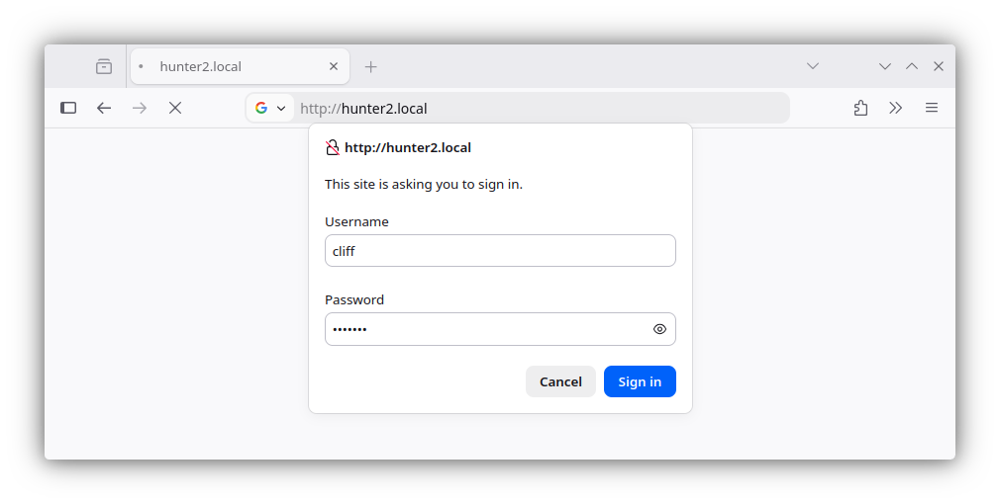
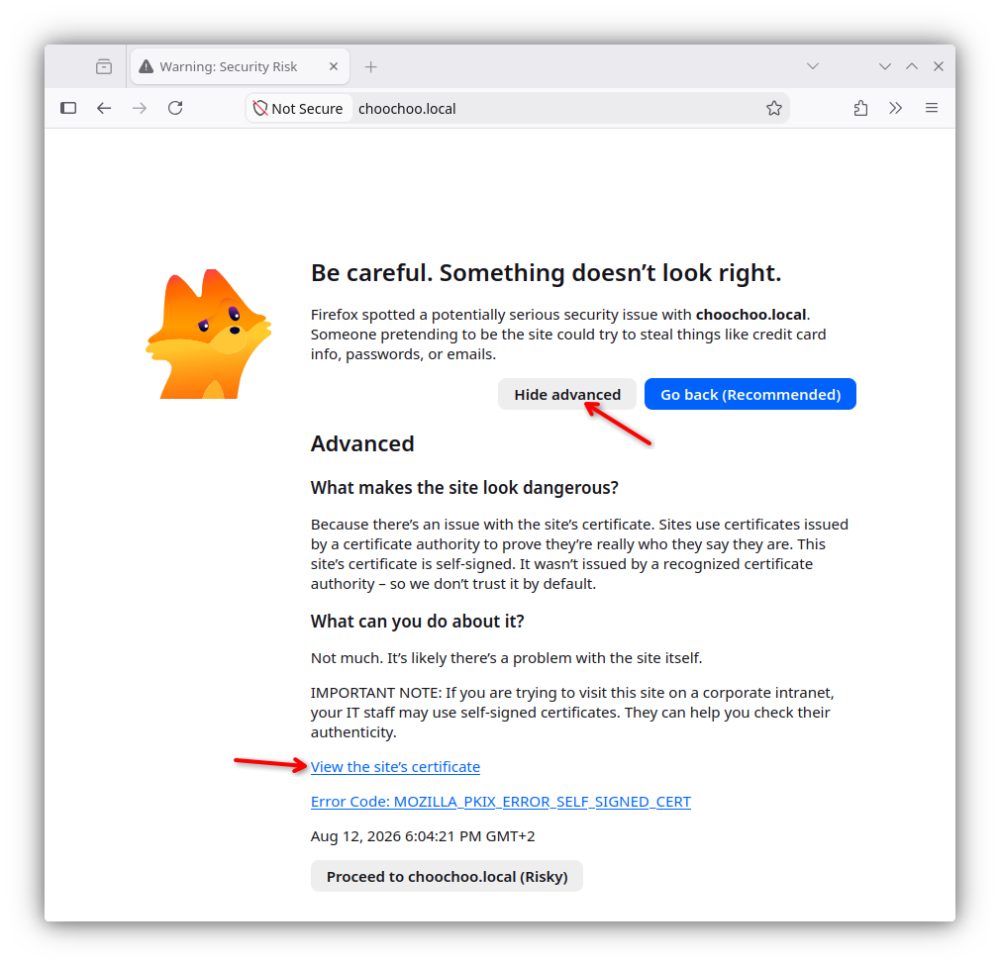
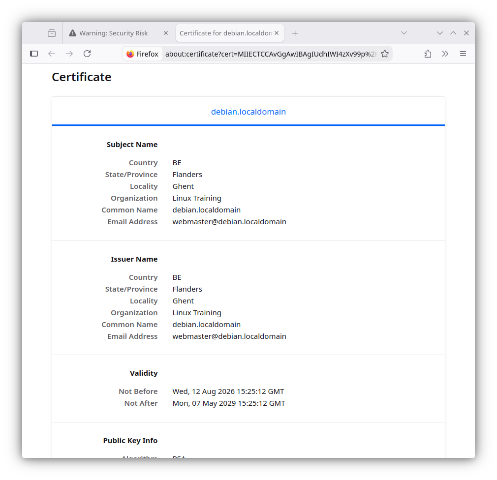

## introduction to Apache

### installing on Debian

The transcript below shows that there is no `apache` server installed, nor
does the `/var/www` directory exist.

```console
student@debian:~$ ls -l /var/www
ls: cannot access '/var/www': No such file or directory
student@debian:~$ dpkg -l apache2
dpkg-query: no packages found matching apache2
```

To install `apache` on Debian:

```console
student@debian:~$ sudo apt install apache2
Installing:                     
  apache2

Installing dependencies:
  apache2-bin   apache2-utils  libaprutil1-dbd-sqlite3  libaprutil1t64  ssl-cert
  apache2-data  libapr1t64     libaprutil1-ldap         liblua5.4-0

Suggested packages:
  apache2-doc  apache2-suexec-pristine  | apache2-suexec-custom  ufw  www-browser

Summary:
  Upgrading: 0, Installing: 10, Removing: 0, Not Upgrading: 87
  Download size: 2,405 kB
  Space needed: 8,568 kB / 58.7 GB available

Continue? [Y/n] y
Get:1 http://httpredir.debian.org/debian trixie/main amd64 libapr1t64 amd64 1.7.5-1 [104 kB]
[... output omitted ...]
Enabling conf serve-cgi-bin.
Enabling site 000-default.
Created symlink '/etc/systemd/system/multi-user.target.wants/apache2.service' → '/usr/lib/systemd/system/apache2.service'.
Created symlink '/etc/systemd/system/multi-user.target.wants/apache-htcacheclean.service' → '/usr/lib/systemd/system/apache-htcacheclean.service'.
Processing triggers for man-db (2.13.1-1) ...
Processing triggers for libc-bin (2.41-12) ...
```

After installation, the same two commands as above will yield a different result:

```console
student@debian:~$ ls -l /var/www
total 4
drwxr-xr-x 2 root root 4096 Aug 10 14:39 html
student@debian:~$ dpkg -l apache2
Desired=Unknown/Install/Remove/Purge/Hold
| Status=Not/Inst/Conf-files/Unpacked/halF-conf/Half-inst/trig-aWait/Trig-pend
|/ Err?=(none)/Reinst-required (Status,Err: uppercase=bad)
||/ Name           Version          Architecture Description
+++-==============-================-============-=================================
ii  apache2        2.4.68-1~deb13u1 amd64        Apache HTTP Server
```

### installing on Enterprise Linux

Note that Red Hat derived distributions use `httpd` as package and process name instead of `apache2`.

To verify whether Apache is installed in Enterprise Linux:

```console
student@el:~$ ls -l /var/www
ls: cannot access '/var/www': No such file or directory
student@el:~$ rpm -q httpd
package httpd is not installed
```

To install Apache on Enterprise Linux:

```console
student@el:~$ sudo dnf install httpd
Last metadata expiration check: 0:15:30 ago on Mon 10 Aug 2026 02:30:24 PM UTC.
Dependencies resolved.
====================================================================================================================
 Package                           Architecture       Version                           Repository             Size
====================================================================================================================
Installing:
 httpd                             x86_64             2.4.63-13.el10_2.5                appstream              48 k
Installing dependencies:
 almalinux-logos-httpd             noarch             100.4-1.el10_2                    appstream              18 k
 apr                               x86_64             1.7.5-3.el10                      appstream             127 k
 apr-util                          x86_64             1.6.3-23.el10_1                   appstream              97 k
 apr-util-lmdb                     x86_64             1.6.3-23.el10_1                   appstream              13 k
 httpd-core                        x86_64             2.4.63-13.el10_2.5                appstream             1.4 M
 httpd-filesystem                  noarch             2.4.63-13.el10_2.5                appstream              14 k
 httpd-tools                       x86_64             2.4.63-13.el10_2.5                appstream              81 k
Installing weak dependencies:
 apr-util-openssl                  x86_64             1.6.3-23.el10_1                   appstream              15 k
 mod_http2                         x86_64             2.0.29-4.el10_2.2                 appstream             161 k
 mod_lua                           x86_64             2.4.63-13.el10_2.5                appstream              59 k

Transaction Summary
====================================================================================================================
Install  11 Packages

Total download size: 2.0 M
Installed size: 6.0 M
Is this ok [y/N]: y
Downloading Packages:
(1/11): apr-util-1.6.3-23.el10_1.x86_64.rpm                                         625 kB/s |  97 kB     00:00    
[... output omitted ...]
Installed:
  almalinux-logos-httpd-100.4-1.el10_2.noarch               apr-1.7.5-3.el10.x86_64                                 
  apr-util-1.6.3-23.el10_1.x86_64                           apr-util-lmdb-1.6.3-23.el10_1.x86_64                    
  apr-util-openssl-1.6.3-23.el10_1.x86_64                   httpd-2.4.63-13.el10_2.5.x86_64                         
  httpd-core-2.4.63-13.el10_2.5.x86_64                      httpd-filesystem-2.4.63-13.el10_2.5.noarch              
  httpd-tools-2.4.63-13.el10_2.5.x86_64                     mod_http2-2.0.29-4.el10_2.2.x86_64                      
  mod_lua-2.4.63-13.el10_2.5.x86_64                        

Complete!
```

After running the `dnf install httpd` command, Apache is installed and the `/var/www` directory exists.

```console
student@el:~$ ls -l /var/www
total 0
drwxr-xr-x. 2 root root 6 Jul  9 00:00 cgi-bin
drwxr-xr-x. 2 root root 6 Jul  9 00:00 html
student@el:~$ rpm -q httpd
httpd-2.4.63-13.el10_2.5.x86_64
```

### running Apache on Debian

On Debian, the Apache service will also have been started automatically after installation. You can verify this with the `systemctl status apache2.service` command:

```console
student@debian:~$ systemctl status apache2.service 
● apache2.service - The Apache HTTP Server
     Loaded: loaded (/usr/lib/systemd/system/apache2.service; enabled; preset: enabled)
     Active: active (running) since Mon 2026-08-10 14:39:59 UTC; 2min 59s ago
 Invocation: 364ecb43cebc4fb58e929a771ef6900b
       Docs: https://httpd.apache.org/docs/2.4/
   Main PID: 3252 (apache2)
      Tasks: 55 (limit: 3506)
     Memory: 5.3M (peak: 5.7M)
        CPU: 23ms
     CGroup: /system.slice/apache2.service
             ├─3252 /usr/sbin/apache2 -k start
             ├─3254 /usr/sbin/apache2 -k start
             └─3255 /usr/sbin/apache2 -k start
```

Remark that the service is also enabled, so it will start automatically after a reboot.

If the service is running, you can check if it is serving web pages using e.g. `curl`:

```console
student@debian:~$ curl -i http://localhost/
HTTP/1.1 200 OK
Date: Mon, 10 Aug 2026 14:52:05 GMT
Server: Apache/2.4.68 (Debian)
Last-Modified: Mon, 10 Aug 2026 14:39:58 GMT
ETag: "29cf-658b25412c753"
Accept-Ranges: bytes
Content-Length: 10703
Vary: Accept-Encoding
Content-Type: text/html

<!DOCTYPE html PUBLIC "-//W3C//DTD XHTML 1.0 Transitional//EN" "http://www.w3.org/TR/xhtml1/DTD/xhtml1-transitional.dtd">
<html xmlns="http://www.w3.org/1999/xhtml">
  <head>
    <meta http-equiv="Content-Type" content="text/html; charset=UTF-8" />
    <title>Apache2 Debian Default Page: It works</title>
[... output omitted ...]
```

Debian provides a default web page in `/var/www/index.html` that is served when you browse to the ip-address of your server.

You can also verify that Apache is running by opening a web browser, and browse to the ip-address of your server (this is left as an exercise). An Apache test page should be shown.

### running Apache on Enterprise Linux

Remark that on Enterprise Linux, the `httpd` service is not started automatically after installation. You can verify this with the `systemctl status httpd.service` command:

```console
student@el:~$ systemctl status httpd
○ httpd.service - The Apache HTTP Server
     Loaded: loaded (/usr/lib/systemd/system/httpd.service; disabled; preset: disabled)
     Active: inactive (dead)
       Docs: man:httpd.service(8)
```

To start and enable the `httpd` service, use the following command (and then verify with `systemctl status httpd`):

```console
student@el:~$ sudo systemctl enable --now httpd
Created symlink '/etc/systemd/system/multi-user.target.wants/httpd.service' → '/usr/lib/systemd/system/httpd.service'.
student@el:~$ systemctl status httpd
● httpd.service - The Apache HTTP Server
     Loaded: loaded (/usr/lib/systemd/system/httpd.service; enabled; preset: disabled)
     Active: active (running) since Mon 2026-08-10 14:59:32 UTC; 3s ago
 Invocation: 3ffd69f238814e7faadad51b3e07d112
       Docs: man:httpd.service(8)
   Main PID: 7818 (httpd)
     Status: "Started, listening on: port 80"
      Tasks: 177 (limit: 18320)
     Memory: 13.9M (peak: 14.2M)
        CPU: 37ms
     CGroup: /system.slice/httpd.service
             ├─7818 /usr/sbin/httpd -DFOREGROUND
             ├─7820 /usr/sbin/httpd -DFOREGROUND
             ├─7821 /usr/sbin/httpd -DFOREGROUND
             ├─7822 /usr/sbin/httpd -DFOREGROUND
             └─7858 /usr/sbin/httpd -DFOREGROUND

Aug 10 14:59:32 el systemd[1]: Starting httpd.service - The Apache HTTP Server...
Aug 10 14:59:32 el (httpd)[7818]: httpd.service: Referenced but unset environment variable evaluates to an empty st>
Aug 10 14:59:32 el httpd[7818]: AH00558: httpd: Could not reliably determine the server's fully qualified domain na>
Aug 10 14:59:32 el httpd[7818]: Server configured, listening on: port 80
Aug 10 14:59:32 el systemd[1]: Started httpd.service - The Apache HTTP Server.
```

You can again use `curl` to verify that Apache is serving web pages:

```console
student@el:~$ curl -i http://localhost/
HTTP/1.1 403 Forbidden
Date: Mon, 10 Aug 2026 15:01:06 GMT
Server: Apache/2.4.63 (AlmaLinux)
Last-Modified: Thu, 28 Nov 2024 18:02:45 GMT
ETag: "1680-627fce3a8db40"
Accept-Ranges: bytes
Content-Length: 5760
Content-Type: text/html; charset=UTF-8

<!DOCTYPE html PUBLIC "-//W3C//DTD XHTML 1.1//EN" "http://www.w3.org/TR/xhtml11/DTD/xhtml11.dtd">

<html xmlns="http://www.w3.org/1999/xhtml" xml:lang="en">
        <head>
                <title>Test Page for the HTTP Server on AlmaLinux</title>
[... output omitted ...]
```

In a browser, you will see a test page, just like on Debian. But do you notice the difference in behaviour between Debian and Enterprise Linux? Take a look at the HTTP response headers. On Debian, the response code is `200 OK`, while on Enterprise Linux it is `403 Forbidden`. This is because Enterprise Linux does not provide a default index.html file, while Debian does.

Although the same Apache is running on both Debian and Enterprise Linux, there are considerable differences between the two distributions in the way you configure and manage Apache.

### index file on Enterprise Linux

Enterprise Linux does not provide a standard `index.html` or `index.php` file, which results in the 403 Forbidden error shown above.

If you create a custom `index.html` file in `/var/www/html` it will immediately serve as an index for this web server.

```console
student@el:~$ echo '<html><body><h1>It works!</h1></body></html>' | sudo tee /var/www/html/index.html
<html><body><h1>It works!</h1></body></html>
student@el:~$ curl -i http://127.0.0.1/
HTTP/1.1 200 OK
Date: Mon, 10 Aug 2026 15:14:37 GMT
Server: Apache/2.4.63 (AlmaLinux)
Last-Modified: Mon, 10 Aug 2026 15:14:24 GMT
ETag: "2d-658b2cf420fd7"
Accept-Ranges: bytes
Content-Length: 45
Content-Type: text/html; charset=UTF-8

<html><body><h1>It works!</h1></body></html>
```

### default website

Changing the default website of a freshly installed Apache web server is easy. All you need to do is create (or change) an `index.html` file in the `DocumentRoot` directory.

To locate the `DocumentRoot` directory on Debian:

```console
student@debian:~$ grep DocumentRoot /etc/apache2/sites-available/000-default.conf 
        DocumentRoot /var/www/html
```

This means that `/var/www/html` is the directory that contains the default web site.

Use curl to download the index page and compare it with the index.html file in `/var/www/html`. They should be exactly the same!

```console
student@debian:~$ curl -s http://127.0.0.1/ > index.html 
student@debian:~$ diff index.html /var/www/html/index.html 
```

Diff does not return any output, which means that the two files are identical.

This transcript shows how to locate the `DocumentRoot` directory on Enterprise Linux.

```console
student@el:~$ grep ^DocumentRoot /etc/httpd/conf/httpd.conf 
DocumentRoot "/var/www/html"
```

After installation, this directory is empty, but now it will contain the `index.html` file that we created above.

### Apache configuration

There are many similarities, but also a couple of differences when configuring `apache` on Debian or on Enterprise Linux. Both Linux families will get their own sections with examples.

All configuration on Debian and derived distributions is done in `/etc/apache2`.

```console
student@debian:~$ ls -l /etc/apache2/
total 80
-rw-r--r-- 1 root root  7178 Aug 10 14:55 apache2.conf
drwxr-xr-x 2 root root  4096 Aug 10 14:39 conf-available
drwxr-xr-x 2 root root  4096 Aug 10 14:39 conf-enabled
-rw-r--r-- 1 root root  1782 Jun 11 18:28 envvars
-rw-r--r-- 1 root root 31063 Dec  5  2025 magic
drwxr-xr-x 2 root root 12288 Aug 10 14:39 mods-available
drwxr-xr-x 2 root root  4096 Aug 10 14:39 mods-enabled
-rw-r--r-- 1 root root   274 Jun 11 18:28 ports.conf
drwxr-xr-x 2 root root  4096 Aug 10 14:39 sites-available
drwxr-xr-x 2 root root  4096 Aug 10 14:39 sites-enabled
```

Enterprise Linux uses `/etc/httpd`.

```console
student@el:~$ ls -l /etc/httpd/
total 4
drwxr-xr-x. 2 root root   37 Aug 10 14:46 conf
drwxr-xr-x. 2 root root   82 Aug 10 14:46 conf.d
drwxr-xr-x. 2 root root 4096 Aug 10 14:46 conf.modules.d
lrwxrwxrwx. 1 root root   19 Jul  9 00:00 logs -> ../../var/log/httpd
lrwxrwxrwx. 1 root root   29 Jul  9 00:00 modules -> ../../usr/lib64/httpd/modules
lrwxrwxrwx. 1 root root   10 Jul  9 00:00 run -> /run/httpd
lrwxrwxrwx. 1 root root   19 Jul  9 00:00 state -> ../../var/lib/httpd
```

Those are quite different, indeed!

The main configuration file on Debian is `/etc/apache2/apache2.conf`, while on Enterprise Linux it is `/etc/httpd/conf/httpd.conf`.

On Debian, additional configuration files are stored in `/etc/apache2/conf-available` and `/etc/apache2/mods-available` and `/etc/apache2/sites-available`. In order to actually load the settings in these files on service startup, you need to enable them with the `a2enconf`, `a2enmod` or `a2ensite` commands. The effect of these commands are that a link is created from the file in one of the `-available` directories to the corresponding `-enabled` directory that will actually be loaded. There are also `a2disconf`, `a2dismod` and `a2dissite` commands to disable configuration files that remove these links.

Enterprise Linux does not have the `-available` and `-enabled` directories, nor the `a2*` commands. All files ending in `.conf` that are located in `/etc/httpd/conf.modules.d` and `/etc/httpd/conf.d` are loaded on service startup.

It is wise to make a backup of the configuration files before making changes. You can use the `cp` command to make a copy of the configuration file.

Before reloading the service with a changed settings, it is also a good idea to check the syntax of the configuration files with the command `apachectl configtest`.

```console
student@debian:~$ sudo apachectl configtest
AH00558: apache2: Could not reliably determine the server's fully qualified domain name, using 127.0.1.1. Set the 'ServerName' directive globally to suppress this message
Syntax OK
```

To avoid this message, you can set the ServerName directive in `/etc/apache2/apache2.conf` (or `/etc/httpd/conf/httpd.conf` on Enterprise Linux) to the hostname of your server. If your system does not have a hostname that resolves to an IP address, you can use `localhost` as the ServerName, or an entry from `/etc/hosts` that resolves to the ip-address of your server.

```console
student@debian:~$ grep debian /etc/hosts
127.0.1.1       debian     debian.localdomain
student@debian:~$ echo 'ServerName debian.localdomain' | sudo tee -a /etc/apache2/apache2.conf
student@debian:~$ tail -1 /etc/apache2/apache2.conf
ServerName debian.localdomain
student@debian:~$ sudo apache2ctl configtest 
Syntax OK
student@debian:~$ sudo systemctl restart apache2
```

## port virtual hosts on Debian

Virtual hosts are the mechanism that allows you to run multiple websites on one web server. Each website can be on a different port, or on the same port but with a different hostname. Client requests are routed to the correct web server (and port) through e.g. a reverse proxy and/or several DNS records pointing to the same ip-address.

### default virtual host (Debian)

Debian has a virtualhost configuration file for its default website in
`/etc/apache2/sites-available/default`.

```console
student@debian:~$ head -1 /etc/apache2/sites-available/000-default.conf 
<VirtualHost *:80>
```

This configuration handles all HTTP requests on port 80, regardless of the server hostname the request was directed to. The `DocumentRoot` directive in the configuration file determines the directory that is served for this virtual host.

```console
student@debian:~$ grep DocumentRoot /etc/apache2/sites-available/000-default.conf
        DocumentRoot /var/www/html
```

### three extra virtual hosts (Debian)

In this scenario we create three additional websites for three customers
that share a clubhouse and want to jointly hire you as their webmaster. They are a model train club named `Choo Choo`, a chess club named `Chess Club 42` and a hackerspace named `hunter2`.

One way to put three websites on one web server, is to put each website on a different port. This example shows three newly created `virtual hosts`, one for each customer.

```console
student@debian:~$ cd /etc/apache2/sites-available/
student@debian:/etc/apache2/sites-available$ sudo nano choochoo.conf
student@debian:/etc/apache2/sites-available$ sudo nano chessclub42.conf 
student@debian:/etc/apache2/sites-available$ sudo nano hunter2.conf
student@debian:/etc/apache2/sites-available$ cat choochoo.conf 
<VirtualHost *:7000>
        ServerAdmin webmaster@localhost
        DocumentRoot /var/www/choochoo
</VirtualHost>
student@debian:/etc/apache2/sites-available$ cat chessclub42.conf 
<VirtualHost *:8000>
        ServerAdmin webmaster@localhost
        DocumentRoot /var/www/chessclub42
</VirtualHost>
student@debian:/etc/apache2/sites-available$ cat hunter2.conf 
<VirtualHost *:9000>
        ServerAdmin webmaster@localhost
        DocumentRoot /var/www/hunter2
</VirtualHost>
```

Notice the different port numbers 7000, 8000 and 9000. Notice also that we specified a unique `DocumentRoot` for each website.

### three extra websites (Debian)

Next we need to create three `DocumentRoot` directories.

```console
student@debian:~$ sudo mkdir /var/www/{choochoo,chessclub42,hunter2}
student@debian:~$ ls -l /var/www
total 16
drwxr-xr-x 2 root root 4096 Aug 11 11:52 chessclub42
drwxr-xr-x 2 root root 4096 Aug 11 11:52 choochoo
drwxr-xr-x 2 root root 4096 Aug 10 14:39 html
drwxr-xr-x 2 root root 4096 Aug 11 11:52 hunter2
```

And we have to put some content in those directories.

```console
student@debian:~$ echo 'Choo Choo model train Choo Choo' | sudo tee /var/www/choochoo/index.html
Choo Choo model train Choo Choo
student@debian:~$ echo 'Welcome to chess club 42' | sudo tee /var/www/chessclub42/index.html
Welcome to chess club 42
student@debian:~$ echo 'HaCkInG iS fUn At HuNtEr2' | sudo tee /var/www/hunter2/index.html
HaCkInG iS fUn At HuNtEr2
```

### three extra ports (Debian)

We need to enable these three ports on Apache in the `ports.conf` file. Open this file with a text editor and add three lines starting with the `Listen` directive specifying the three extra ports.

```console
student@debian:~$ sudo nano /etc/apache2/ports.conf
student@debian:~$ grep ^Listen /etc/apache2/ports.conf 
Listen 80
Listen 7000
Listen 8000
Listen 9000
```

### enabling extra websites (Debian)

The last step is to enable the websites with the `a2ensite` command. This command will create links in `sites-enabled`.

The links are not there yet...

```console
student@debian:~$ cd /etc/apache2/
student@debian:/etc/apache2$ ls sites-available/
000-default.conf  chessclub42.conf  choochoo.conf  default-ssl.conf  hunter2.conf
student@debian:/etc/apache2$ ls sites-enabled/
000-default.conf
```

So we run the `a2ensite` command for all websites.

```console
student@debian:/etc/apache2$ sudo a2ensite choochoo chessclub42 hunter2
Enabling site choochoo.
Enabling site chessclub42.
Enabling site hunter2.
To activate the new configuration, you need to run:
  systemctl reload apache2
student@debian:/etc/apache2$ ls -l sites-enabled/
total 0
lrwxrwxrwx 1 root root 35 Aug 10 14:39 000-default.conf -> ../sites-available/000-default.conf
lrwxrwxrwx 1 root root 35 Aug 11 11:58 chessclub42.conf -> ../sites-available/chessclub42.conf
lrwxrwxrwx 1 root root 32 Aug 11 11:58 choochoo.conf -> ../sites-available/choochoo.conf
lrwxrwxrwx 1 root root 31 Aug 11 11:58 hunter2.conf -> ../sites-available/hunter2.conf
```

The links are created, so we can tell `apache` to restart.

```console
student@debian:/etc/apache2$ sudo systemctl reload apache2.service
```

This command should not return any output, which means that the `apache` service has been reloaded successfully.

### testing the three websites (Debian)

To chech whether Apache is listening on the three additional ports, you can use the command `ss -tln`:

```console
vagrant@debian:~$ ss -tln
State    Recv-Q  Send-Q  Local Address:Port  Peer Address:Port
LISTEN   0       4096          0.0.0.0:111        0.0.0.0:*
LISTEN   0       128           0.0.0.0:22         0.0.0.0:*
LISTEN   0       4096             [::]:111           [::]:*
LISTEN   0       511                 *:80               *:*
LISTEN   0       128              [::]:22            [::]:*
LISTEN   0       511                 *:7000             *:*
LISTEN   0       511                 *:9000             *:*
LISTEN   0       511                 *:8000             *:*
```

To be sure that `apache2` (an not another process) is listening on ports 7000, 8000 and 9000, add option `-p` to the command and precede it with `sudo` to see the process name and PID. The output is too verbose to show it here.

Testing the several websites can be done with `curl` or `wget`. The following transcript shows the output of three `curl` commands, each sending a request to the three configured ports. The output is the content of the `index.html` file in the `DocumentRoot` of each website.

```console
student@debian:/etc/apache2$ curl http://localhost:7000/
Choo Choo model train Choo Choo
student@debian:/etc/apache2$ curl http://localhost:8000/
Welcome to chess club 42!
student@debian:/etc/apache2$ curl http://localhost:9000/
HaCkInG iS fUn At HuNtEr2
```

Try testing from another computer using the ip-address of your server!

## named virtual hosts on Debian

For an external customer, having to access a website through a port number is not very user friendly. It is much better to have a website accessible by name, e.g. `mysite.example.com` instead of `www.example.com:8000`. This is possible with named virtual hosts.

The chess club and the model train club would prefer to have their website accessible by name.

We continue work on the same server that has three websites on three ports. We need to make sure those websites are accesible using the names `choochoo.local`, `chessclub42.local` and `hunter2.local`.

We start by creating three new virtualhosts.

```console
student@debian:/etc/apache2/sites-available$ sudo nano choochoo.local.conf 
student@debian:/etc/apache2/sites-available$ sudo nano chessclub42.local.conf 
student@debian:/etc/apache2/sites-available$ sudo nano hunter2.local.conf 
student@debian:/etc/apache2/sites-available$ cat *.local.conf
<VirtualHost *:80>
        ServerAdmin webmaster@localhost
        ServerName chessclub42.local
        DocumentRoot /var/www/chessclub42
</VirtualHost>
<VirtualHost *:80>
        ServerAdmin webmaster@localhost
        ServerName choochoo.local
        DocumentRoot /var/www/choochoo
</VirtualHost>
<VirtualHost *:80>
        ServerAdmin webmaster@localhost
        ServerName hunter2.local
        DocumentRoot /var/www/hunter2
</VirtualHost>
```

Notice that they all listen on port 80 and have an extra `ServerName` directive.

### name resolution (Debian)

In order for a client to access a website by name, the name must be resolved to an ip-address. This is usually done with DNS. For this demo it is also possible to quickly add the three names to the `/etc/hosts` file.

In this example, we will first check our ip address and then add the three names to `/etc/hosts`. If you want to reproduce the example, be sure to replace the ip address with your own!

```console
student@debian:~$ ip -br a
lo               UNKNOWN        127.0.0.1/8 ::1/128 
eth0             UP             10.0.2.15/24 fe80::e845:83b0:bc1:ed0d/64 
eth1             UP             192.168.56.13/24 fe80::a00:27ff:fe09:b99/64 
student@debian:~$ sudo nano /etc/hosts
student@debian:~$ grep ^192 /etc/hosts
192.168.56.13  debian.local  choochoo.local  chessclub42.local  hunter2.local
```

You can check if the names are resolved correctly with the `getent ahosts` command.

```console
student@debian:~$ getent ahosts debian.local
192.168.56.13   STREAM debian.local
192.168.56.13   DGRAM  
192.168.56.13   RAW    
student@debian:~$ getent ahosts choochoo.local
192.168.56.13   STREAM choochoo.local
192.168.56.13   DGRAM  
192.168.56.13   RAW    
student@debian:~$ getent ahosts chessclub42.local
192.168.56.13   STREAM chessclub42.local
192.168.56.13   DGRAM  
192.168.56.13   RAW    
student@debian:~$ getent ahosts hunter2.local
192.168.56.13   STREAM hunter2.local
192.168.56.13   DGRAM  
192.168.56.13   RAW 
```

Remark that you could also use `ping`, but actually sending packets is not necessary to verify name resolution. The `nslookup` command will probably not work (if it is installed at all), beause it will try to query a DNS server, which is not configured for these names.

### enabling virtual hosts

Next we enable them with `a2ensite`.

```console
student@debian:/etc/apache2/sites-available$ sudo a2ensite choochoo.local chessclub42.local hunter2.local
Enabling site choochoo.local.
Enabling site chessclub42.local.
Enabling site hunter2.local.
To activate the new configuration, you need to run:
  systemctl reload apache2
```

### reload and verify (Debian)

After a `systemctl reload apache2` the websites should be available by name.

```console
student@debian:~$ sudo systemctl reload apache2.service 
student@debian:~$ curl http://debian.local/

<!DOCTYPE html PUBLIC "-//W3C//DTD XHTML 1.0 Transitional//EN" "http://www.w3.org/TR/xhtml1/DTD/xhtml1-transitional.dtd">
<html xmlns="http://www.w3.org/1999/xhtml">
  <head>
    <meta http-equiv="Content-Type" content="text/html; charset=UTF-8" />
    <title>Apache2 Debian Default Page: It works</title>
[... output omitted ...]
student@debian:~$ curl http://choochoo.local/
Choo Choo model train Choo Choo
student@debian:~$ curl http://chessclub42.local/
Welcome to chess club 42!
student@debian:~$ curl http://hunter2.local/
HaCkInG iS fUn At HuNtEr2
```

## password protected website on Debian

You can secure files and directories in your website with a `.htaccess` file that refers to a `.htpasswd` file. The `htpasswd` command can create a `.htpasswd` file that contains a userid and an (encrypted) password.

This example creates a user and password for the hacker named `cliff` and uses the `-c` flag to create the `.htpasswd` file.

```console
student@debian:~$ sudo htpasswd -c /var/www/.htpasswd cliff
New password: 
Re-type new password: 
Adding password for user cliff
```

Hacker `rob` also wants access, so we add a second user and password to `.htpasswd` (this time without the `-c` flag!).

```console
student@debian:~$ sudo htpasswd /var/www/.htpasswd rob
New password: 
Re-type new password: 
Adding password for user rob
student@debian:~$ cat /var/www/.htpasswd 
cliff:$apr1$bAUQisSY$KTgmdtjTamFUdP.CsjDkP0
rob:$apr1$TyUD.92A$Nfr9YBbG4Vcasew97S6QZ1
```

Both Cliff and Rob chose the same password (hunter2), but that is not visible in the `.htpasswd` file because of the different salts.

Next we need to create a `.htaccess` file in the `DocumentRoot` of the website we want to protect. An example is shown here:

```console
student@debian:~$ cd /var/www/hunter2/
student@debian:/var/www/hunter2$ sudo nano .htaccess
student@debian:/var/www/hunter2$ cat .htaccess 
AuthUserFile /var/www/.htpasswd
AuthName "Members only!"
AuthType Basic
require valid-user
```

Note that we are only protecting the website of the hackerspace hunter2 that we created earlier.

And because we put this website in a subdirectory of the default website, we will need to adjust the `AllowOverride` parameter in the configuration. Open `/etc/apache2/apache2.conf` in a text editor and search for the line with `<Directory /var/www/>`. It will look like this:

```apacheconf
<Directory /var/www/>
    Options Indexes FollowSymLinks
    AllowOverride None
    Require all granted
</Directory>
```

Change the code block to the following (Replace `None` with `Authconfig`):

```apacheconf
<Directory /var/www/>
    Options Indexes FollowSymLinks
    AllowOverride Authconfig
    Require all granted
</Directory>
```

Now restart the apache2 server and test that it works!

```console
student@debian:~$ sudo systemctl restart apache2.service 
student@debian:~$ curl -i http://hunter2.local/
HTTP/1.1 401 Unauthorized
Date: Tue, 11 Aug 2026 13:00:16 GMT
Server: Apache/2.4.68 (Debian)
WWW-Authenticate: Basic realm="Members only!"
Content-Length: 498
Content-Type: text/html; charset=iso-8859-1

<!DOCTYPE HTML PUBLIC "-//W3C//DTD HTML 4.01//EN" "http://www.w3.org/TR/html4/strict.dtd">
<html><head>
<title>401 Unauthorized</title>
</head><body>
<h1>Unauthorized</h1>
<p>This server could not verify that you
are authorized to access the document
requested.  Either you supplied the wrong
credentials (e.g., bad password), or your
browser doesn't understand how to supply
the credentials required.</p>
<hr>
<address>Apache/2.4.68 (Debian) Server at localhost Port 9000</address>
</body></html>
```

As expected, the server returns a 401 Unauthorized error. You should get the same result for url `http://localhost:9000/`.

You can test the authentication with the `-u` option of `curl`.

```console
student@debian:~$ curl -u cliff:hunter2 http://hunter2.local/
HaCkInG iS fUn At HuNtEr2
student@debian:~$ curl -u rob:hunter2 http://hunter2.local/
HaCkInG iS fUn At HuNtEr2
```

If you try to access the website from a web browser, you will see a pop-up window asking for a username and password. You can enter either `cliff` or `rob` as the username, and `hunter2` as the password.



The other sites should still be accessible without authentication.

```console
student@debian:~$ curl -I http://localhost/
HTTP/1.1 200 OK
Date: Wed, 12 Aug 2026 09:55:57 GMT
Server: Apache/2.4.68 (Debian)
Last-Modified: Wed, 12 Aug 2026 08:55:03 GMT
ETag: "29cf-658d5be3d1757"
Accept-Ranges: bytes
Content-Length: 10703
Vary: Accept-Encoding
Content-Type: text/html

student@debian:~$ curl http://choochoo.local/
Choo Choo model train Choo Choo
```

## port virtual hosts on Enterprise Linux

The structure of the Apache configuration on Enterprise Linux is quite different from Debian. The main configuration file is `/etc/httpd/conf/httpd.conf`, and there is no `sites-available` or `sites-enabled` directory. Instead, all additional configuration files are placed in `/etc/httpd/conf.d/`.

### default virtual host (EL)

Unlike Debian, Enterprise Linux has no virtualHost configuration file for its default website. Instead, the default configuration will throw a standard error page when no index file can be found in the default location (`/var/www/html`).

This is configured in `/etc/httpd/conf.d/welcome.conf`. Take a look at this file if you want to see how it works, but we will not discuss it here.

### three extra virtual hosts (EL)

In this scenario we create three additional websites for three customers that share a clubhouse and want to jointly hire you. They are a model train club named `Choo Choo`, a chess club named `Chess Club 42` and a hackerspace named `hunter2`.

One way to serve three websites on one web server, is to assign each website to a different port. This scenario shows three newly created `virtual hosts`, one for each customer.

```console
student@el:~$ cd /etc/httpd/conf.d/
student@el:/etc/httpd/conf.d$ sudo vi choochoo.conf 
student@el:/etc/httpd/conf.d$ sudo vi chessclub42.conf 
student@el:/etc/httpd/conf.d$ sudo vi hunter2.conf 
student@el:/etc/httpd/conf.d$ cat choochoo.conf chessclub42.conf hunter2.conf 
<VirtualHost *:7000>
        ServerAdmin webmaster@localhost
        DocumentRoot /var/www/html/choochoo
</VirtualHost>
<VirtualHost *:8000>
        ServerAdmin webmaster@localhost
        DocumentRoot /var/www/html/chessclub42
</VirtualHost>
<VirtualHost *:9000>
        ServerAdmin webmaster@localhost
        DocumentRoot /var/www/html/hunter2
</VirtualHost>
```

Notice the different port numbers 7000, 8000 and 9000. Notice also that we specified a unique `DocumentRoot` for each website.

### three extra websites (EL)

Next we need to create three `DocumentRoot` directories and we have to put some really content in those directories.

```console
student@el:~$ sudo mkdir /var/www/html/{choochoo,chessclub42,hunter2}
student@el:~$ echo 'Choo Choo model train Choo Choo' | sudo tee /var/www/html/choochoo/index.html
Choo Choo model train Choo Choo
student@el:~$ echo 'Welcome to chess club 42' | sudo tee /var/www/html/chessclub42/index.html
Welcome to chess club 42
student@el:~$ echo 'HaCkInG iS fUn At HuNtEr2' | sudo tee /var/www/html/hunter2/index.html
HaCkInG iS fUn At HuNtEr2
```

The directory `/var/www/html` is now structured as follows:

```console
student@el:~$ tree /var/www/html/
/var/www/html/
├── chessclub42
│   └── index.html
├── choochoo
│   └── index.html
├── hunter2
│   └── index.html
└── index.html

4 directories, 4 files
```

Note that if the command `tree` is not available on your system, you can install it with `sudo dnf install tree`.

### three extra ports (EL)

We need to enable these three ports on apache in the `httpd.conf` file.

```console
student@el:~$ sudo vi /etc/httpd/conf/httpd.conf
student@el:~$ grep ^Listen /etc/httpd/conf/httpd.conf 
Listen 80
Listen 7000
Listen 8000
Listen 9000
```

Be sure to check the syntax of the configuration file before restarting the service.

```console
student@el:~$ sudo apachectl configtest
Syntax OK
```

If you get a warning that the host name can not be reliably determined, you can add a `ServerName` directive to the main configuration file, as instructed above.

### SELinux guards our ports

If we try to restart our server, we will notice the following error:

```console
student@el:~$ sudo systemctl start httpd
Job for httpd.service failed because the control process exited with error code.
See "systemctl status httpd.service" and "journalctl -xeu httpd.service" for details.
```

This is due to SELinux only allowing the apache process to use specific ports that are reserved for web traffic (80 and 443 in particular).

```console
student@el:~$ sudo semanage port -l | grep ^http_port_t
http_port_t        tcp      80, 81, 443, 488, 8008, 8009, 8443, 9000
http_port_t        udp      80, 443
```

Remark that port 9000 is already configured to be used by Apache. We only need to add ports 7000 and 8000 to the list of allowed ports.

```console
student@el:~$ sudo semanage port -m -t http_port_t -p tcp 7000
student@el:~$ sudo semanage port -m -t http_port_t -p tcp 8000
student@el:~$ sudo semanage port -l | grep ^http_port_t
http_port_t        tcp      8000, 7000, 80, 81, 443, 488, 8008, 8009, 8443, 9000
http_port_t        udp      80, 443
student@el:~$ sudo systemctl start httpd
```

### testing the three websites (EL)

You can check the status of the service with `systemctl status httpd` and you should see that it is running. Additionaly, you can check the ports that are being listened to with `ss -tln`:

```console
student@el:~$ ss -tln
State     Recv-Q    Send-Q   Local Address:Port   Peer Address:Port
LISTEN    0         128            0.0.0.0:22          0.0.0.0:*
LISTEN    0         4096                 *:9090              *:*
LISTEN    0         511                  *:9000              *:*
LISTEN    0         511                  *:7000              *:*
LISTEN    0         128               [::]:22             [::]:*
LISTEN    0         511                  *:80                *:*
LISTEN    0         511                  *:8000              *:*
```

To be sure that `httpd` (an not another process) is listening on ports 7000, 8000 and 9000, add option `-p` to the command and precede it with `sudo` to see the process name and PID. The output is too verbose to show it here.

Testing the three new websites on their respective ports:

```console
student@el:~$ curl http://localhost:7000/
Choo Choo model train Choo Choo
student@el:~$ curl http://localhost:8000/
Welcome to chess club 42
student@el:~$ curl http://localhost:9000/
HaCkInG iS fUn At HuNtEr2
```

### firewall rules

If we attempt to access the site from another machine however, we will not be able to view the website yet. On Enterprise Linux, the firewall is enabled by default and it will block incoming connections.

```console
$ curl http://192.168.56.10/
curl: (7) Failed to connect to 192.168.56.10 port 80 after 0 ms: Could not connect to server
```

On recent versions of Enterprise Linux, the firewall is managed by `firewalld`. You can check the status of the firewall with `systemctl status firewalld` and you can list the current rules with `firewall-cmd --list-all`. After a default installation, the firewall rules usually look approximately like this:

```console
student@el:~$ sudo firewall-cmd --list-all
public (default, active)
  target: default
  ingress-priority: 0
  egress-priority: 0
  icmp-block-inversion: no
  interfaces: enp0s3 enp0s8
  sources: 
  services: cockpit dhcpv6-client ssh
  ports: 
  protocols: 
  forward: yes
  masquerade: no
  forward-ports: 
  source-ports: 
  icmp-blocks: 
  rich rules: 
```

Services `cockpit`, `dhcpv6-client` and `ssh` are allowed, but no rules for other services, nor ports are defined. Let's add rules for the default HTTP port 80 and the three extra ports 7000, 8000 and 9000.

```console
student@el:~$ sudo firewall-cmd --add-service=http
success
student@el:~$ sudo firewall-cmd --add-service=http --permanent
success
student@el:~$ sudo firewall-cmd --add-port=7000/tcp --permanent
success
student@el:~$ sudo firewall-cmd --add-port=8000/tcp --permanent
success
student@el:~$ sudo firewall-cmd --add-port=9000/tcp --permanent
success
student@el:~$ sudo firewall-cmd --reload
```

Verify the changes with `firewall-cmd --list-all`:

```console
student@el:~$ sudo firewall-cmd --list-all | grep ' services\| ports'
  services: cockpit dhcpv6-client http ssh
  ports: 7000/tcp 8000/tcp 9000/tcp
```

Check from another machine if you can access the websites now:

```console
$ curl http://192.168.56.10/
<html><body><h1>It works!</h1></body></html>
```

## named virtual hosts on Enterprise Linux

For an external customer, having to access a website through a port number is not very user friendly. It is much better to have a website accessible by name, e.g. `mysite.example.com` instead of `www.example.com:8000`. This is possible with named virtual hosts.

The chess club and the model train club would prefer to have their website accessible by name.

We continue work on the same server that has three websites on three ports. We need to make sure those websites are accesible using the names `choochoo.local`, `chessclub42.local` and `hunter2.local`.

First, we need to create three new virtualhosts.

```console
student@el:/etc/httpd/conf.d$ sudo vi choochoo.local.conf
student@el:/etc/httpd/conf.d$ sudo cp choochoo.local.conf chessclub42.local.conf 
student@el:/etc/httpd/conf.d$ sudo cp choochoo.local.conf hunter2.local.conf 
student@el:/etc/httpd/conf.d$ sudo vi chessclub42.
student@el:/etc/httpd/conf.d$ sudo vi chessclub42.local.conf 
student@el:/etc/httpd/conf.d$ sudo vi hunter2.local.conf 
student@el:/etc/httpd/conf.d$ cat *local.conf
<VirtualHost chessclub42.local:80>
        ServerAdmin webmaster@localhost
        ServerName chessclub42.local
        DocumentRoot /var/www/html/chessclub42
</VirtualHost>
<VirtualHost choochoo.local:80>
        ServerAdmin webmaster@localhost
        ServerName choochoo.local
        DocumentRoot /var/www/html/choochoo
</VirtualHost>
<VirtualHost hunter2.local:80>
        ServerAdmin webmaster@localhost
        ServerName hunter2.local
        DocumentRoot /var/www/html/hunter2
</VirtualHost>
```

Notice that they all listen on port 80 and have an extra `ServerName` directive. Also, you have to replace the `*` in `<VirtualHost *:80>` with the name of the virtual host, e.g. `<VirtualHost choochoo.local:80>`. If you don't do this, the `VirtualHost` setting will mask the default website. When you try to access the default website, you will get the content of the first virtual host instead.

### name resolution (EL)

In order for a client to access a website by name, the name must be resolved to an ip-address. This is usually done with DNS. For this demo it is also possible to quickly add the three names to the `/etc/hosts` file.

In this example, we will first check our ip address and then add the three names to `/etc/hosts`. If you want to reproduce the example, be sure to replace the ip address with your own!

```console
student@el:~$ ip -br a
lo               UNKNOWN        127.0.0.1/8 ::1/128 
enp0s3           UP             10.0.2.15/24 fe80::a00:27ff:fec1:d0d8/64 
enp0s8           UP             192.168.56.10/24 fe80::9289:9d6f:72a6:599d/64 
student@el:~$ sudo vi /etc/hosts
student@el:~$ grep ^192 /etc/hosts
192.168.56.10  el.local  choochoo.local  chessclub42.local  hunter2.local
```

You can check if the names are resolved correctly with the `getent ahosts` command.

```console
student@el:~$ getent ahosts el.local
192.168.56.10   STREAM el.local
192.168.56.10   DGRAM  
192.168.56.10   RAW   
student@el:~$ getent ahosts choochoo.local
192.168.56.10   STREAM choochoo.local
192.168.56.10   DGRAM  
192.168.56.10   RAW    
student@el:~$ getent ahosts chessclub42.local
192.168.56.10   STREAM chessclub42.local
192.168.56.10   DGRAM  
192.168.56.10   RAW    
student@el:~$ getent ahosts hunter2.local
192.168.56.10   STREAM hunter2.local
192.168.56.10   DGRAM  
192.168.56.10   RAW 
```

Remark that you could also use `ping`, but actually sending packets is not necessary to verify name resolution. The `nslookup` command will probably not work (if it is installed at all), beause it will try to query a DNS server, which is not configured for these names.

### reload and verify (EL)

After a `systemctl reload httpd` the websites should be available by name.

```console
student@el:~$ sudo apachectl configtest
Syntax OK
student@el:~$ sudo systemctl reload httpd
student@el:~$ curl http://choochoo.local/
Choo Choo model train Choo Choo
student@el:~$ curl http://chessclub42.local/
Welcome to chess club 42
student@el:~$ curl http://hunter2.local/
HaCkInG iS fUn At HuNtEr2
```

## password protected website on Enterprise Linux

You can secure files and directories in your website with a `.htaccess` file that refers to a `.htpasswd` file. The `htpasswd` command can create a `.htpasswd` file that contains a userid and an (encrypted) password.

This example creates a user and password for the hacker named `cliff` and uses the `-c` flag to create the `.htpasswd` file.

```console
student@el:~$ sudo htpasswd -c /var/www/.htpasswd cliff
New password: 
Re-type new password: 
Adding password for user cliff
```

Hacker `rob` also wants access, so we add a second user and password to `.htpasswd` (this time without the `-c` flag!).

```console
student@el:~$ sudo htpasswd /var/www/.htpasswd rob
New password: 
Re-type new password: 
Adding password for user rob
student@el:~$ cat /var/www/.htpasswd
cliff:$apr1$M8ma6.gQ$2Ey1BlPZ5q23Jknh.sDBI/
rob:$apr1$kHjxUt9s$rpF62TvZXbAnisCv8KZ1N1
```

Both Cliff and Rob chose the same password (hunter2), but that is not visible in the `.htpasswd` file because of the different salts.

Next we need to create a `.htaccess` file in the `DocumentRoot` of the website we want to protect. An example is shown here:

```console
student@el:~$ sudo vi /var/www/html/hunter2/.htaccess
student@el:~$ cat /var/www/html/hunter2/.htaccess
AuthUserFile /var/www/.htpasswd
AuthName "Members only!"
AuthType Basic
require valid-user
```

Note that we are only protecting the website of the hackerspace hunter2 that we created earlier.

And because we put this website in a subdirectory of the default website, we will need to adjust the `AllowOverride` parameter in the configuration. Open `/etc/httpd/conf/httpd.conf` in a text editor and search for the line with `<Directory "/var/www/html">` directive. It will look approximately like this (the config file has a lot of comments, which are omitted here for clarity):

```apacheconf
<Directory "/var/www/html">
    Options Indexes FollowSymLinks
    AllowOverride None
    Require all granted
</Directory>
```

Change the code block to the following (Replace `None` with `AuthConfig`):

```apacheconf
<Directory "/var/www/html">
    Options Indexes FollowSymLinks
    AllowOverride AuthConfig
    Require all granted
</Directory>
```

Now restart the apache2 server and test that it works!

```console
student@el:~$ sudo apachectl configtest
Syntax OK
student@el:~$ sudo systemctl reload httpd
student@el:~$ curl -i http://hunter2.local/
HTTP/1.1 401 Unauthorized
Date: Tue, 11 Aug 2026 23:06:55 GMT
Server: Apache/2.4.63 (AlmaLinux)
WWW-Authenticate: Basic realm="Members only!"
Content-Length: 381
Content-Type: text/html; charset=iso-8859-1

<!DOCTYPE HTML PUBLIC "-//IETF//DTD HTML 2.0//EN">
<html><head>
<title>401 Unauthorized</title>
</head><body>
<h1>Unauthorized</h1>
<p>This server could not verify that you
are authorized to access the document
requested.  Either you supplied the wrong
credentials (e.g., bad password), or your
browser doesn't understand how to supply
the credentials required.</p>
</body></html>
```

As expected, the server returns a 401 Unauthorized error. You should get the same result for url `http://localhost:9000/`.

You can test the authentication with the `-u` option of `curl`.

```console
student@el:~$ curl -u cliff:hunter2 http://hunter2.local/
HaCkInG iS fUn At HuNtEr2
student@el:~$ curl -u rob:hunter2 http://hunter2.local/
HaCkInG iS fUn At HuNtEr2
```

If you try to access the website from a web browser, you will see a pop-up window asking for a username and password. You can enter either `cliff` or `rob` as the username, and `hunter2` as the password.

The other sites should still be accessible without authentication.

```console
student@el:~$ curl http://localhost/
<html><body><h1>It works!</h1></body></html>
student@el:~$ curl http://chessclub42.local/
Welcome to chess club 42
```

## troubleshooting apache

Here are some guidelines to troubleshoot Apache when it does not work as expected.

### service status

First of all, chech if the service is running with `systemctl status`, followed by the service name (`apache2` on Debian or `httpd` on EL).

There are basically three possible states: `active (running)`, `inactive (dead)` and `failed`. If the service is not running, you can try to start it with `systemctl start` or restart it with `systemctl restart`.

An example of a correctly running service:

```console
student@el:~$ systemctl status httpd | head -3
● httpd.service - The Apache HTTP Server
     Loaded: loaded (/usr/lib/systemd/system/httpd.service; enabled; preset: disabled)
     Active: active (running) since Wed 2026-08-12 10:18:16 UTC; 18s ago
```

When the service is not running, you will see something like this:

```console
student@el:~$ systemctl status httpd | head -3
○ httpd.service - The Apache HTTP Server
     Loaded: loaded (/usr/lib/systemd/system/httpd.service; enabled; preset: disabled)
     Active: inactive (dead) since Wed 2026-08-12 10:19:47 UTC; 3s ago
```

To start the service, use `systemctl start <service>`. Also chech whether the service is enabled to start at boot time with `systemctl is-enabled <service>` and enable it if necessary with `systemctl enable <service>`.

If the service is in a failed state, you will see something like this:

```console
student@el:~$ systemctl status httpd | head -3
× httpd.service - The Apache HTTP Server
     Loaded: loaded (/usr/lib/systemd/system/httpd.service; enabled; preset: disabled)
     Active: failed (Result: exit-code) since Wed 2026-08-12 10:23:11 UTC; 3s ago
```

Trying to start the service at this point will not work, as there is probably a configuration error:

```console
student@el:~$ sudo systemctl restart httpd
Job for httpd.service failed because the control process exited with error code.
See "systemctl status httpd.service" and "journalctl -xeu httpd.service" for details.
```

See below for more information on how to deal with this.

### port status and firewall

If the service is running, it is also important to check if the service is listening on the correct ports. Use `ss -tln` to list all listening TCP ports. A typical Apache server should listen on port 80 (http) and 443 (https). If you have configured additional ports, they should also be listed. With `sudo ss -tlnp` you can also see the process name and PID that is listening on the port.

```console
student@el:~$ sudo ss -tlnp
State   Recv-Q  Send-Q  Local Address:Port  Peer Address:Port Process                                                                                                           
LISTEN  0       128           0.0.0.0:22         0.0.0.0:*     users:(("sshd",pid=1133,fd=7))                                                                                   
LISTEN  0       4096                *:9090             *:*     users:(("systemd",pid=1,fd=184))                                                                                 
LISTEN  0       511                 *:9000             *:*     users:(("httpd",pid=18115,fd=10),("httpd",pid=18114,fd=10),("httpd",pid=18113,fd=10),("httpd",pid=18111,fd=10))  
LISTEN  0       511                 *:7000             *:*     users:(("httpd",pid=18115,fd=6),("httpd",pid=18114,fd=6),("httpd",pid=18113,fd=6),("httpd",pid=18111,fd=6))      
LISTEN  0       128              [::]:22            [::]:*     users:(("sshd",pid=1133,fd=8))                                                                                   
LISTEN  0       511                 *:80               *:*     users:(("httpd",pid=18115,fd=4),("httpd",pid=18114,fd=4),("httpd",pid=18113,fd=4),("httpd",pid=18111,fd=4))      
LISTEN  0       511                 *:8000             *:*     users:(("httpd",pid=18115,fd=8),("httpd",pid=18114,fd=8),("httpd",pid=18113,fd=8),("httpd",pid=18111,fd=8))  
```

If the website is accessible locally (e.g. with `curl http://localhost/`), but not from another machine, the firewall is probably blocking incoming connections. Check the firewall rules with `firewall-cmd --list-all` (on EL) or `ufw status` (on Debian). If necessary, add rules to allow incoming connections on the required ports.

### configuration errors

When Apache restarts, it parses the configuration files that will be loaded and an error is found, it will emit a log message telling you the name of the faulty file, the line number and an explanation of the error. For example, let's assume we forgot the `/` in the closing `</VirtualHost>` tag in the configuration file of the chess club website. When we try to restart Apache, we will see an error message like this:

```console
student@el:~$ sudo systemctl restart httpd
Job for httpd.service failed because the control process exited with error code.
See "systemctl status httpd.service" and "journalctl -xeu httpd.service" for details.
```

The `systemctl` command does not show the error message, but we can look at the logs with `journalctl`. The error message suggests the options `-x` (add explanatory help texts to log messages), `-e` (jump to the end of the log) and `-u` (show only messages for a specific unit, in this case the Apache service). You can decide whether `-x` and `-e` are useful for you, but the `-u` option is essential to filter the log messages for the Apache service.

```console
student@el:~$ sudo journalctl -eu httpd.service
Aug 12 10:33:25 el systemd[1]: Starting httpd.service - The Apache HTTP Server...
Aug 12 10:33:25 el (httpd)[18428]: httpd.service: Referenced but unset environment variable evaluates to an empty string: OPTIONS
Aug 12 10:33:25 el httpd[18428]: httpd: Syntax error on line 363 of /etc/httpd/conf/httpd.conf: Syntax error on line 1 of /etc/httpd/conf.d/chessclub42.local.conf: /etc/httpd/conf.d/chessclub42.local.conf:5: <VirtualHost> was not closed.\n/etc/httpd/conf.d/chessclub42.local.conf:1: <VirtualHost> was not closed.
Aug 12 10:33:25 el systemd[1]: httpd.service: Main process exited, code=exited, status=1/FAILURE
Aug 12 10:33:25 el systemd[1]: httpd.service: Failed with result 'exit-code'.
Aug 12 10:33:25 el systemd[1]: Failed to start httpd.service - The Apache HTTP Server.
```

The line with the Syntax error message tells us where the problem is located. In this case, you see the confirmation that the `<VirtualHost>` directive in `chessclub42.local.conf` was not closed.

The `apachectl configtest` command can also be used to check the configuration files for errors, without actually loading them. It will show the same error message as above.

```console
student@el:~$ sudo apachectl configtest
httpd: Syntax error on line 363 of /etc/httpd/conf/httpd.conf: Syntax error on line 1 of /etc/httpd/conf.d/chessclub42.local.conf: /etc/httpd/conf.d/chessclub42.local.conf:5: <VirtualHost> was not closed.\n/etc/httpd/conf.d/chessclub42.local.conf:1: <VirtualHost> was not closed.
```

Let us force another error by introducing a typo in the `DocumentRoot` directive of the chess club website. Let's say we forgot an `s` in the directory name `chessclub42`.

The service will start, but the website will not be accessible.

```console
student@el:~$ sudo systemctl start httpd
student@el:~$ sudo systemctl is-active httpd
active
student@el:~$ curl http://chessclub42.local/
<!DOCTYPE HTML PUBLIC "-//IETF//DTD HTML 2.0//EN">
<html><head>
<title>404 Not Found</title>
</head><body>
<h1>Not Found</h1>
<p>The requested URL was not found on this server.</p>
</body></html>
```

If we check the logs, we will see a warning message:

```console
student@el:~$ sudo journalctl -eu httpd.service
Aug 12 10:44:15 el systemd[1]: Starting httpd.service - The Apache HTTP Server...
Aug 12 10:44:15 el (httpd)[18671]: httpd.service: Referenced but unset environment variable evaluates to an empty string: OPTIONS
Aug 12 10:44:15 el httpd[18671]: AH00112: Warning: DocumentRoot [/var/www/html/chesclub42] does not exist
Aug 12 10:44:15 el httpd[18671]: Server configured, listening on: port 9000, port 8000, ...
Aug 12 10:44:15 el systemd[1]: Started httpd.service - The Apache HTTP Server.
```

Running the `apachectl configtest` command before starting the service could have prevented this mistake:

```console
student@el:~$ sudo apachectl configtest
AH00112: Warning: DocumentRoot [/var/www/html/chesclub42] does not exist
Syntax OK
```

As you can see, Apache will tell you exactly what is wrong.

When you are changing Apache configuration, always check the configuration with `apachectl configtest` before restarting the service. While you are interacting with the service, it is also useful to follow the logs in real time in another terminal window with `journalctl -flu httpd.service`. The `-f` option will show new log messages as they are generated and `-l` will show the the entire line (instead of truncating it if your terminal is too narrow).

### log files

Apart from the system logs (that you can access with `journalctl`), Apache also has its own log files. The location of the log files is defined in the configuration file. On Debian, the default location is `/var/log/apache2`, while on EL it is `/var/log/httpd`. Log files are only accessible by the root user, so you will need to use `sudo` to read them.

An example on Debian:

```console
student@debian:~$ sudo ls -l /var/log/apache2/
total 16
-rw-r----- 1 root adm 1099 Aug 12 10:50 access.log
-rw-r----- 1 root adm 4903 Aug 12 09:53 error.log
-rw-r----- 1 root adm 3044 Aug 12 10:51 other_vhosts_access.log
student@debian:~$ sudo tail -5 /var/log/apache2/access.log
::1 - - [12/Aug/2026:09:51:44 +0000] "GET / HTTP/1.1" 200 10958 "-" "curl/8.14.1"
::1 - - [12/Aug/2026:09:53:42 +0000] "GET / HTTP/1.1" 200 10958 "-" "curl/8.14.1"
::1 - - [12/Aug/2026:09:55:57 +0000] "HEAD / HTTP/1.1" 200 255 "-" "curl/8.14.1"
::1 - - [12/Aug/2026:10:09:19 +0000] "GET / HTTP/1.1" 200 10958 "-" "curl/8.14.1"
127.0.0.1 - - [12/Aug/2026:10:50:48 +0000] "GET / HTTP/1.1" 200 10958 "-" "curl/8.14.1"
student@debian:~$ sudo tail -5 /var/log/apache2/error.log
[Wed Aug 12 09:51:36.845893 2026] [mpm_event:notice] [pid 5625:tid 5625] AH00489: Apache/2.4.68 (Debian) configured -- resuming normal operations
[Wed Aug 12 09:51:36.845925 2026] [core:notice] [pid 5625:tid 5625] AH00094: Command line: '/usr/sbin/apache2'
[Wed Aug 12 09:53:33.687854 2026] [mpm_event:notice] [pid 5625:tid 5625] AH00492: caught SIGWINCH, shutting down gracefully
[Wed Aug 12 09:53:33.737933 2026] [mpm_event:notice] [pid 5712:tid 5712] AH00489: Apache/2.4.68 (Debian) configured -- resuming normal operations
[Wed Aug 12 09:53:33.737968 2026] [core:notice] [pid 5712:tid 5712] AH00094: Command line: '/usr/sbin/apache2'
student@debian:~$ sudo tail -5 /var/log/apache2/other_vhosts_access.log
hunter2.local:80 192.168.56.13 - rob [12/Aug/2026:09:56:47 +0000] "GET / HTTP/1.1" 200 253 "-" "curl/8.14.1"
choochoo.local:80 192.168.56.13 - - [12/Aug/2026:09:58:26 +0000] "GET / HTTP/1.1" 200 259 "-" "curl/8.14.1"
choochoo.local:80 192.168.56.13 - - [12/Aug/2026:10:50:54 +0000] "GET / HTTP/1.1" 200 259 "-" "curl/8.14.1"
debian.local:9000 127.0.0.1 - - [12/Aug/2026:10:51:03 +0000] "GET / HTTP/1.1" 401 712 "-" "curl/8.14.1"
debian.local:7000 127.0.0.1 - - [12/Aug/2026:10:51:08 +0000] "GET / HTTP/1.1" 200 259 "-" "curl/8.14.1"
```

An example on Enterprise Linux:

```console
student@el:~$ sudo ls -l /var/log/httpd
total 16
-rw-r--r--. 1 root root 3191 Aug 12 10:46 access_log
-rw-r--r--. 1 root root 9446 Aug 12 10:44 error_log
student@el:~$ sudo tail -5 /var/log/httpd/access_log
192.168.56.10 - - [12/Aug/2026:10:56:55 +0000] "GET / HTTP/1.1" 200 32 "-" "curl/8.12.1"
127.0.0.1 - - [12/Aug/2026:10:57:02 +0000] "GET / HTTP/1.1" 401 381 "-" "curl/8.12.1"
::1 - - [12/Aug/2026:10:57:11 +0000] "GET /test.php HTTP/1.1" 404 196 "-" "curl/8.12.1"
::1 - - [12/Aug/2026:10:57:20 +0000] "GET / HTTP/1.1" 200 25 "-" "curl/8.12.1"
::1 - - [12/Aug/2026:10:57:24 +0000] "GET / HTTP/1.1" 200 32 "-" "curl/8.12.1"
student@el:~$ sudo tail -5 /var/log/httpd/error_log
AH00112: Warning: DocumentRoot [/var/www/html/chesclub42] does not exist
[Wed Aug 12 10:44:15.943234 2026] [lbmethod_heartbeat:notice] [pid 18671:tid 18671] AH02282: No slotmem from mod_heartmonitor
[Wed Aug 12 10:44:15.943581 2026] [systemd:notice] [pid 18671:tid 18671] SELinux policy enabled; httpd running as context system_u:system_r:httpd_t:s0
[Wed Aug 12 10:44:15.945728 2026] [mpm_event:notice] [pid 18671:tid 18671] AH00489: Apache/2.4.63 (AlmaLinux) configured -- resuming normal operations
[Wed Aug 12 10:44:15.945745 2026] [core:notice] [pid 18671:tid 18671] AH00094: Command line: '/usr/sbin/httpd -D FOREGROUND'
```

Following the log files in real time can also be done with `tail -f`. Press Ctrl+C to stop following the log file.

## virtual hosts example

Below is a sample virtual host configuration. This virtual hosts overrules the default Apache `ErrorDocument` directive.

```apacheconf
<VirtualHost 83.217.76.245:80>
ServerName cobbaut.be
ServerAlias www.cobbaut.be
DocumentRoot /home/paul/public_html
ErrorLog /home/paul/logs/error_log
CustomLog /home/paul/logs/access_log common
ScriptAlias /cgi-bin/ /home/paul/cgi-bin/
<Directory /home/paul/public_html>
    Options Indexes IncludesNOEXEC FollowSymLinks
    allow from all
</Directory>
ErrorDocument 404 http://www.cobbaut.be/cobbaut.php
</VirtualHost>
```

## aliases and redirects

Apache supports aliases for directories, like this example shows.

```apacheconf
Alias /paul/ "/home/paul/public_html/"
```

Similarly, content can be redirected to another website or web server.

```apacheconf
Redirect permanent /foo http://www.foo.com/bar
```

## more on .htaccess

You can do much more with `.htaccess`. One example is to use .htaccess to prevent people from certain domains to access your website. Like in this case, where a number of referer spammers are blocked from the website.

```console
paul@lounge:~/cobbaut.be$ cat .htaccess 
# Options +FollowSymlinks
RewriteEngine On
RewriteCond %{HTTP_REFERER} ^http://(www\.)?buy-adipex.fw.nu.*$ [OR]
RewriteCond %{HTTP_REFERER} ^http://(www\.)?buy-levitra.asso.ws.*$ [NC,OR]
RewriteCond %{HTTP_REFERER} ^http://(www\.)?buy-tramadol.fw.nu.*$ [NC,OR]
RewriteCond %{HTTP_REFERER} ^http://(www\.)?buy-viagra.lookin.at.*$ [NC,OR]
...
RewriteCond %{HTTP_REFERER} ^http://(www\.)?www.healthinsurancehelp.net.*$ [NC]
RewriteRule .* - [F,L]
```

## self signed certificate

Nowadays, it is no longer acceptable to run a website over plain HTTP. Production websites should always use HTTPS so traffic between the client and the server is encrypted. HTTPS is built on the concept of asymmetric encryption, which uses a public and a private key. Additionaly, the identity of the server is verified with a certificate, which is basically a digital signature of the public key by a trusted third party (the certificate authority).

For a production website, the procedure is approximately as follows:

1. Generate a **private key** and a **certificate signing request** (CSR) on the server.
2. Send the CSR to a **certificate authority** (CA) for signing.
3. The CA will verify the identity of the server and return a **signed certificate**.
4. Install the signed certificate on the server and configure the web server to use it.

For step 2, it is a necessary condition that the host name of the web server is publicly resolvable by DNS. In a test scenario like our lab setup, this is not possible. In this case, we can sign the certificate ourselves (i.e. a self-signed certificate). The disadvantage of a self-signed certificate is that the client cannot verify the identity of the server, so the browser will warn the user that the certificate is not trusted. For a production website, this is not acceptable, but for a test website, there is no way around this limitation.

### self signed cert on Debian

Below is a very quick guide on setting up Apache2 on Debian with a self-signed certificate.

Chances are the necessary packages are already installed. In the following example, `openssl` was already installed, but it is upgraded to the latest version.

```console
student@debian:~$ sudo apt install openssl
Upgrading:                      
  libssl3t64  openssl  openssl-provider-legacy

Summary:
  Upgrading: 3, Installing: 0, Removing: 0, Not Upgrading: 84
  Download size: 4,263 kB
  Space needed: 39.9 kB / 58.7 GB available

Continue? [Y/n] y
[... output omitted ...]
```

The place to store private keys and certificates is the directory `/etc/ssl`. The subdirectory `certs` is used for certificates (both of our own server and of known CAs), while the subdirectory `private` is used for private keys. Here are the contents of `/etc/ssl` on a Debian system. Note the permissions of the subdirectories!

```console
student@debian:~$ sudo ls -l /etc/ssl
[sudo] password for student: 
total 36
drwxr-xr-x 2 root root     16384 Aug 12 08:55 certs
-rw-r--r-- 1 root root     12411 Sep 26  2025 openssl.cnf
drwx--x--- 2 root ssl-cert  4096 Aug 12 08:55 private
```

During installation, a self-signed certificate is created for the default website. The certificate is stored in `/etc/ssl/certs/ssl-cert-snakeoil.pem` and the private key in `/etc/ssl/private/ssl-cert-snakeoil.key`. The snakeoil certificate is valid for 365 days. We are going to replace these with our own.

We use `openssl` to create a private key and self signed certificate that is valid for 999 days.

```console
student@debian:~$ sudo openssl req -new -x509 -days 999 -nodes -out /etc/ssl/certs/debian.local.pem -keyout /etc/ssl/private/debian.local.key
..+...+...+...........+.........+...............+.+........+...............+...+.........+...+..................+...+....+........+.............+.................+++++++++++++++++++++++++++++++++++++++*.+++++++++++++++++++++++++++++++++++++++*......+.+......+...+...+..+.+...........+...............+.+..+.................................+.........+................+...+..+............+.+.....................+.....+.+.....+....+......+..............+.+...+.........+..+...+.......+...........+....+...+..+.+..+...............+.+.........+.....+......+.+......+.................+...+.......+...........+...............+......+...................+.....+.+...........+..........+...+..+...+.........+.......+...+......+.....+....+...+..+.+..+...+....+...........+.........+.+.........+..+...+......+.......+...+..............+.+..............+...+.......+......+...........+.+........+.+.....+.+........+....+...........+....+..+....+.........+...+.................+..........+...++++++
....+.+..................+...+.......................+.+...............+...+...........+++++++++++++++++++++++++++++++++++++++*....+...+..+.+.....+++++++++++++++++++++++++++++++++++++++*..+..+......++++++
-----
You are about to be asked to enter information that will be incorporated
into your certificate request.
What you are about to enter is what is called a Distinguished Name or a DN.
There are quite a few fields but you can leave some blank
For some fields there will be a default value,
If you enter '.', the field will be left blank.
-----
Country Name (2 letter code) [AU]:BE
State or Province Name (full name) [Some-State]:Flanders
Locality Name (eg, city) []:Ghent
Organization Name (eg, company) [Internet Widgits Pty Ltd]:Linux Training    
Organizational Unit Name (eg, section) []:
Common Name (e.g. server FQDN or YOUR name) []:debian.local
Email Address []:webmaster@debian.local
```

Let's check the permissions of the files we just created.

```console
student@debian:~$ sudo ls -l /etc/ssl/*/debian*
-rw-r--r-- 1 root root 1346 Aug 12 15:16 /etc/ssl/certs/debian.local.pem
student@debian:~$ sudo ls -l /etc/ssl/private/debian.local.key
-rw------- 1 root root 1704 Aug 12 15:15 /etc/ssl/private/debian.local.key
```

The private key is only readable by root (which is what we want!), while the certificate is readable by everyone. This is important, because the web server runs as a non-privileged user and needs to be able to read the certificate. On a production server, one would protect the private key with additional security measures (e.g. by encrypting it with a passphrase, or by storing it on an external hardware security module so it is not even accessible during operation). For our lab setup, this is not necessary.

Enable Apache's SSL module.

```console
student@debian:~$ sudo a2enmod ssl 
Considering dependency mime for ssl:
Module mime already enabled
Considering dependency socache_shmcb for ssl:
Enabling module socache_shmcb.
Enabling module ssl.
See /usr/share/doc/apache2/README.Debian.gz on how to configure SSL and create self-signed certificates.
To activate the new configuration, you need to run:
  systemctl restart apache2
```

There is already a default SSL virtual host configuration file that we can modify to use our own certificate and private key. At this time, the automatically generated "snakeoil" certificate is used.

```console
student@debian:~$ grep '^[^#]*SSLCertificate' /etc/apache2/sites-available/default-ssl.conf
        SSLCertificateFile      /etc/ssl/certs/ssl-cert-snakeoil.pem
        SSLCertificateKeyFile   /etc/ssl/private/ssl-cert-snakeoil.key
```

Change these lines to point to our own certificate and private key, and then enable the site. Don't forget to check the syntax!

```console
student@debian:~$ grep '^[^#]*SSLCertificate' /etc/apache2/sites-available/default-ssl.conf
        SSLCertificateFile      /etc/ssl/certs/debian.local.pem
        SSLCertificateKeyFile   /etc/ssl/private/debian.local.key
student@debian:~$ sudo a2ensite default-ssl.conf 
Enabling site default-ssl.
To activate the new configuration, you need to run:
  systemctl reload apache2
student@debian:~$ sudo apachectl configtest
Syntax OK
```

Restart the Apache service to apply the changes and test the changes. The output of the `ss` command should now also include port 443 (the default port for HTTPS).

```console
student@debian:~$ sudo systemctl restart apache2
student@debian:~$ ss -tln | grep 443
LISTEN 0      511                *:443             *:*   
```

The `curl` command will also test the validity of the website's certificate. Since we are using a self-signed certificate, the test will fail. The `-k` option (or `--insecure`) tells `curl` to ignore the certificate validation.

```console
student@debian:~$ curl -I https://localhost/
curl: (60) SSL certificate problem: self-signed certificate
More details here: https://curl.se/docs/sslcerts.html

curl failed to verify the legitimacy of the server and therefore could not
establish a secure connection to it. To learn more about this situation and
how to fix it, please visit the webpage mentioned above.
student@debian:~$ curl -I --insecure https://localhost/
HTTP/1.1 200 OK
Date: Wed, 12 Aug 2026 15:34:09 GMT
Server: Apache/2.4.68 (Debian)
Last-Modified: Wed, 12 Aug 2026 08:55:03 GMT
ETag: "29cf-658d5be3d1757"
Accept-Ranges: bytes
Content-Length: 10703
Vary: Accept-Encoding
Content-Type: text/html
```

We should also implement HTTPS support for our customer websites. As an example, we will show how to modify the configuration of the "choochoo.local" site to support HTTPS. You can use the same procedure for the other two websites. To protect our customers, we will redirect all HTTP traffic to HTTPS. This is done with the `Redirect` directive in the virtual host configuration for port 80.

Edit the configuration file for the choochoos website `choochoos.local.conf` and change it to the following:

```apacheconf
<VirtualHost choochoo.local:80>
        ServerAdmin webmaster@localhost
        ServerName choochoo.local
        Redirect permanent / https://choochoo.local/
</VirtualHost>
<VirtualHost choochoo.local:443>
        ServerAdmin webmaster@localhost
        ServerName choochoo.local
        DocumentRoot /var/www/choochoo
        SSLEngine On
        SSLCertificateFile /etc/ssl/certs/debian.local.pem
        SSLCertificateKeyFile /etc/ssl/private/debian.local.key
</VirtualHost>
```

Test the configuration, restart Apache and test.

```console
student@debian:~$ sudo nano /etc/apache2/sites-available/choochoo.local.conf 
student@debian:~$ sudo apachectl configtest
Syntax OK
student@debian:~$ sudo systemctl restart apache2
student@debian:~$ curl http://choochoo.local/
<!DOCTYPE HTML PUBLIC "-//W3C//DTD HTML 4.01//EN" "http://www.w3.org/TR/html4/strict.dtd">
<html><head>
<title>301 Moved Permanently</title>
</head><body>
<h1>Moved Permanently</h1>
<p>The document has moved <a href="https://choochoo.local/">here</a>.</p>
<hr>
<address>Apache/2.4.68 (Debian) Server at choochoo.local Port 80</address>
</body></html>
```

The `curl` command shows that the HTTP request is redirected, but it does not follow the redirect. You can add the `-L` option to follow the redirect and `-k` to ignore the certificate validation. In the example below, we also added `-i` to show the HTTP headers of the response, which also shows how the redirect is handled.

```console
student@debian:~$ curl -iLk http://choochoo.local/
HTTP/1.1 301 Moved Permanently
Date: Wed, 12 Aug 2026 15:55:51 GMT
Server: Apache/2.4.68 (Debian)
Location: https://choochoo.local/
Content-Length: 351
Content-Type: text/html; charset=iso-8859-1

HTTP/1.1 200 OK
Date: Wed, 12 Aug 2026 15:55:51 GMT
Server: Apache/2.4.68 (Debian)
Last-Modified: Wed, 12 Aug 2026 09:13:11 GMT
ETag: "20-658d5ff198597"
Accept-Ranges: bytes
Content-Length: 32
Content-Type: text/html

Choo Choo model train Choo Choo
```

### self signed cert on Enterprise Linux

Below is a very quick guide on setting up Apache2 on Enterprise Linux with a self-signed certificate.

Chances are the necessary packages are already installed. In the following example, `openssl` was already installed, but it is upgraded to the latest version. We also need the `mod_ssl` package to enable SSL support in Apache. On Debian, this module is included in the base package, but not activated by default. On Enterprise Linux, it is a separate package.

```console
student@el:~$ sudo dnf install openssl mod_ssl
Last metadata expiration check: 0:18:16 ago on Wed 12 Aug 2026 04:09:10 PM UTC.
Package openssl-1:3.5.1-3.el10.alma.1.x86_64 is already installed.
Dependencies resolved.
=====================================================================================
 Package                 Architecture   Version                   Repository    Size
=====================================================================================
Installing:                                                                           
 mod_ssl                 x86_64         1:2.4.63-13.el10_2.5      appstream    108 k
Upgrading:                                                                           
 openssl                 x86_64         1:3.5.5-6.el10_2.alma.1   baseos       1.2 M
 openssl-fips-provider   x86_64         1:3.5.5-6.el10_2.alma.1   baseos       812 k
 openssl-libs            x86_64         1:3.5.5-6.el10_2.alma.1   baseos       2.2 M
                                                                                      
Transaction Summary                                                                           
=====================================================================================
Install  1 Package
Upgrade  3 Packages

Total download size: 4.3 M
Is this ok [y/N]: y
Downloading Packages:
[... output omitted ...]

Upgraded:
  openssl-1:3.5.5-6.el10_2.alma.1.x86_64              openssl-fips-provider-1:3.5.5-6.el10_2.alma.1.x86_64        
  openssl-libs-1:3.5.5-6.el10_2.alma.1.x86_64        
Installed:
  mod_ssl-1:2.4.63-13.el10_2.5.x86_64                                                                             

Complete!
```

After this, you can immediately restart `httpd` to enable SSL support. In `/etc/httpd/conf.d/`, a new configuration file, `ssl.conf`, has been added. It points to a self-signed certificate and private key that will be generated on server startup. These are stored in `/etc/pki/tls/certs/localhost.crt` and `/etc/pki/tls/private/localhost.key`, respectively. We will replace these below with our own self-signed certificate and private key.

After restart, the output of the `ss` command should now also include port 443 (the default port for HTTPS).

```console
student@el:~$ sudo systemctl restart httpd
student@el:~$ ss -tln | grep 443
LISTEN 0      511                *:443             *:*   
student@el:~$ ls -l /etc/pki/tls/*/localhost*
-rw-r--r--. 1 root root 3712 Aug 12 16:33 /etc/pki/tls/certs/localhost.crt
-rw-------. 1 root root 1700 Aug 12 16:33 /etc/pki/tls/private/localhost.key
```

Note the permissions of the files!

The `curl` command will also test the validity of the website's certificate. Since we are using a self-signed certificate, the test will fail. The `-k` option (or `--insecure`) tells `curl` to ignore the certificate validation.

```console
student@el:~$ curl https://localhost/
curl: (60) SSL certificate problem: self-signed certificate in certificate chain
More details here: https://curl.se/docs/sslcerts.html

curl failed to verify the legitimacy of the server and therefore could not
establish a secure connection to it. To learn more about this situation and
how to fix it, please visit the webpage mentioned above.
student@el:~$ curl -k https://localhost/
<html><body><h1>It works!</h1></body></html>
```

The place to store private keys and certificates is the directory `/etc/pki/tls`. The subdirectory `certs` is used for certificates (both of our own server and of known CAs), while the subdirectory `private` is used for private keys. Here are the contents of `/etc/pki/tls` on an AlmaLinux system.

```console
student@el:~$ ls -l /etc/pki/tls/
total 32
lrwxrwxrwx. 1 root root    49 Oct 29  2025 cert.pem -> /etc/pki/ca-trust/extracted/pem/tls-ca-bundle.pem
drwxr-xr-x. 2 root root  8192 Jul 27 00:00 certs
-rw-r--r--. 1 root root   412 Jul 27 00:00 ct_log_list.cnf
lrwxrwxrwx. 1 root root    50 Jul 27 00:00 fips_local.cnf -> /etc/crypto-policies/back-ends/openssl_fips.config
drwxr-xr-x. 2 root root     6 Jul 27 00:00 misc
-rw-r--r--. 1 root root 12412 Jul 27 00:00 openssl.cnf
drwxr-xr-x. 2 root root     6 Jul 27 00:00 openssl.d
drwxr-xr-x. 2 root root     6 Jul 27 00:00 private
```

We use `openssl` to create a private key and self signed certificate that is valid for 999 days.

```console
student@el:~$ sudo openssl req -new -x509 -days 999 -nodes -out /etc/pki/tls/certs/el.local.pem -keyout /etc/pki/tls/private/el.local.key
.+++++++++++++++++++++++++++++++++++++++*....+...+........+...+....+..+...+.......+...........+.........+.+.....+++++++++++++++++++++++++++++++++++++++*....+...+.+...+.................+.+.....+.........+...+.......+...+..+.........+.+......+...+......+.....+.........+...............+.+...+..+...+...+...+......+......+...+..........+...............+.....+.......+.........+...+..+.+........+.......+..+.+..............+............+.+.....+............+.+.........+...........+.+...+......+.....+................+.........+.........+...++++++
.+.....+.+.....+......+.........+.+.....+++++++++++++++++++++++++++++++++++++++*..+.+......+.....+.......+...+.........+.......................+............+.+++++++++++++++++++++++++++++++++++++++*...+.+.....+............+.+..+....+...........+...+.........+.+..+.........+................+..+.+..+....+.....++++++
-----
You are about to be asked to enter information that will be incorporated
into your certificate request.
What you are about to enter is what is called a Distinguished Name or a DN.
There are quite a few fields but you can leave some blank
For some fields there will be a default value,
If you enter '.', the field will be left blank.
-----
Country Name (2 letter code) [XX]:BE
State or Province Name (full name) []:Flanders
Locality Name (eg, city) [Default City]:Ghent
Organization Name (eg, company) [Default Company Ltd]:Linux Training
Organizational Unit Name (eg, section) []:
Common Name (eg, your name or your server's hostname) []:el.local
Email Address []:webmaster@el.local
student@el:~$ ls -l /etc/pki/tls/*/el.local*
-rw-r--r--. 1 root root 1403 Aug 12 19:28 /etc/pki/tls/certs/el.local.pem
-rw-------. 1 root root 1708 Aug 12 19:27 /etc/pki/tls/private/el.local.key
```

The private key is only readable by root (which is what we want!), while the certificate is readable by everyone. This is important, because the web server runs as a non-privileged user and needs to be able to read the certificate. On a production server, one would protect the private key with additional security measures (e.g. by encrypting it with a passphrase, or by storing it on an external hardware security module so it is not even accessible during operation). For our lab setup, this is not necessary.

We add the location of our new keys to the `ssl.conf` configuration file. Don't forget to check the syntax!

```console
student@el:~$ sudo vim /etc/httpd/conf.d/ssl.conf 
student@el:~$ grep '^[^#]*SSLCert' /etc/httpd/conf.d/ssl.conf
SSLCertificateFile /etc/pki/tls/certs/el.local.pem
SSLCertificateKeyFile /etc/pki/tls/private/el.local.key
student@el:~$ sudo apachectl configtest
Syntax OK
student@el:~$ sudo systemctl restart httpd
student@el:~$ curl -k https://localhost/
<html><body><h1>It works!</h1></body></html>
```

We should also implement HTTPS support for our customer websites. As an example, we will show how to modify the configuration of the "choochoo.local" site to support HTTPS. You can use the same procedure for the other two websites. To protect our customers, we will redirect all HTTP traffic to HTTPS. This is done with the `Redirect` directive in the virtual host configuration for port 80.

```apacheconf
<VirtualHost choochoo.local:80>
        ServerAdmin webmaster@localhost
        ServerName choochoo.local
        Redirect permanent / https://choochoo.local/
</VirtualHost>
<VirtualHost choochoo.local:443>
        ServerAdmin webmaster@localhost
        ServerName choochoo.local
        DocumentRoot /var/www/html/choochoo
        SSLEngine on
        SSLCertificateFile /etc/pki/tls/certs/el.local.pem
        SSLCertificateKeyFile /etc/pki/tls/private/el.local.key
</VirtualHost>
```

Test the configuration, restart Apache and test.

```console
student@el:$ sudo vim /etc/httpd/conf.d/choochoo.local.conf 
student@el:~$ sudo apachectl configtest
Syntax OK
student@el:~$ sudo systemctl restart httpd
student@el:~$ curl http://choochoo.local/
<!DOCTYPE HTML PUBLIC "-//IETF//DTD HTML 2.0//EN">
<html><head>
<title>301 Moved Permanently</title>
</head><body>
<h1>Moved Permanently</h1>
<p>The document has moved <a href="https://choochoo.local/">here</a>.</p>
</body></html>
```

The `curl` command shows that the HTTP request is redirected, but it does not follow the redirect. You can add the `-L` option to follow the redirect and `-k` to ignore the certificate validation. In the example below, we also added `-i` to show the HTTP headers of the response, which also shows how the redirect is handled.

```console
student@el:~$ curl -iLk http://choochoo.local/
HTTP/1.1 301 Moved Permanently
Date: Wed, 12 Aug 2026 19:46:39 GMT
Server: Apache/2.4.63 (AlmaLinux) OpenSSL/3.5.5
Location: https://choochoo.local/
Content-Length: 231
Content-Type: text/html; charset=iso-8859-1

HTTP/1.1 200 OK
Date: Wed, 12 Aug 2026 19:46:39 GMT
Server: Apache/2.4.63 (AlmaLinux) OpenSSL/3.5.5
Last-Modified: Tue, 11 Aug 2026 22:00:04 GMT
ETag: "20-658cc97de3981"
Accept-Ranges: bytes
Content-Length: 32
Content-Type: text/html; charset=UTF-8

Choo Choo model train Choo Choo
```

### certificate for a production website

Remark that the procedure above will create a private key and self-signed certificate in a single step. For a production website, this is obviously not acceptable. In that case, you should generate a Certificate Signing Request (CSR) and send it to a trusted Certificate Authority (CA) for signing. The CA will verify the identity of the server and return a signed certificate. The procedure is as follows:

```console
student@el:~$ openssl genrsa -out el.local.key
student@el:~$ openssl req -new -key el.local.key -out el.local.csr
You are about to be asked to enter information that will be incorporated
into your certificate request.
What you are about to enter is what is called a Distinguished Name or a DN.
There are quite a few fields but you can leave some blank
For some fields there will be a default value,
If you enter '.', the field will be left blank.
-----
Country Name (2 letter code) [XX]:BE
State or Province Name (full name) []:Flanders
Locality Name (eg, city) [Default City]:Ghent
Organization Name (eg, company) [Default Company Ltd]:Linux Training
Organizational Unit Name (eg, section) []:
Common Name (eg, your name or your server's hostname) []:el.local
Email Address []:webmaster@el.local

Please enter the following 'extra' attributes
to be sent with your certificate request
A challenge password []:
An optional company name []:
student@el:~$ ls -l
total 8
-rw-r--r--. 1 student student 1037 Aug 12 19:50 el.local.csr
-rw-------. 1 student student 1704 Aug 12 19:49 el.local.key
```

Send the .csr file to the CA for signing. The CA will return a signed certificate, which you can then install on the server. Signing a CSR with a CA is not possible in our lab setup, because the host name of the server is not publicly resolvable by DNS.

To complete the example, we will sign the CSR ourselves, resulting in another self-signed certificate.

```console
student@el:~$ openssl x509 -req -days 999 -in el.local.csr -signkey el.local.key -out el.local.pem
Certificate request self-signature ok
subject=C=BE, ST=Flanders, L=Ghent, O=Linux Training, CN=el.local, emailAddress=webmaster@el.local
student@el:~$ ls -l
total 12
-rw-r--r--. 1 student student 1037 Aug 12 19:50 el.local.csr
-rw-------. 1 student student 1704 Aug 12 19:49 el.local.key
-rw-r--r--. 1 student student 1334 Aug 12 19:54 el.local.pem
```

You only need the .key and .pem files on the server. The .csr file is only needed to send to the CA for signing.

### self signed cert in the browser

When you access a website with a self-signed certificate in your browser, you will get a warning that the certificate is not trusted. The screenshot below is from Firefox, but other browsers will show a similar warning. You can click on "Advanced" and then "Accept the Risk and Continue" to proceed to the website.



You can view the certificate by clicking the link "View site's certificate" in the warning message. The screenshot below shows the details of the self-signed certificate we created for the choochoo.local website.



