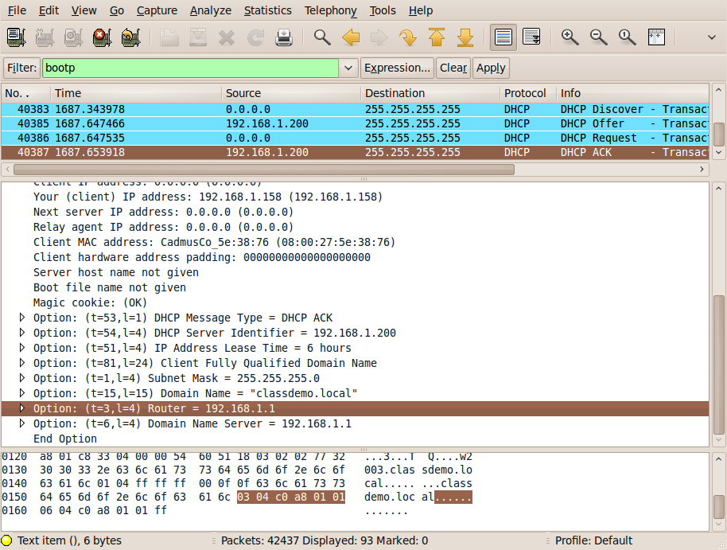
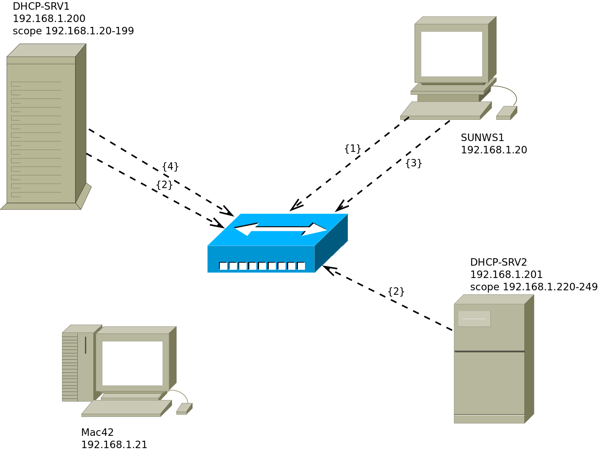

## four broadcasts

**dhcp** works with layer 2 broadcasts. A dhcp client that starts, will send a *dhcp discover* on the network. All *dhcp servers* (that have a lease available) will respond with a *dhcp offer*. The client will choose one of those offers and will send a *dhcp request* containing the chosen offer. The *dhcp server* usually responds with a *dhcp ack* (Acknowledge).

In wireshark it looks like this.



When this procedure is finished, then the client is allowed to use that ip-configuration until the end of its lease time.

## picturing dhcp

Here we have a small network with two *dhcp servers* named DHCP-SRV1 and DHCP-SRV2 and two clients (SunWS1 and Mac42). All computers are connected by a hub or switch (pictured in the middle). All four computers have a cable to the hub (cables not pictured).



1. The client SunWS1 sends a *dhcp discover* on the network. All computers receive this broadcast.

2. Both *dhcp servers* answer with a *dhcp offer*. DHCP-SRV1 is a *dedicated dhcp server* and is faster in sending a *dhcp offer* than DHCP-SRV2 (who happens to also be a file server).

3. The client chooses the offer from DHCP-SRV1 and sends a *dhcp request* on the network.

4. DHCP-SRV1 answers with a *dhcp ack* (short for acknowledge).

All four broadcasts (or five when you count both offers) can be layer 2 ethernet broadcast to mac address `ff:ff:ff:ff:ff:ff` and a layer 3 ip broadcast to 255.255.255.255.

The same story can be read in *rfc 2131*.

## installing isc dhcp on debian

There are multiple implementations of the dhcp protocol available on Linux, but for a long time, the default has been the one from the `Internet Software Consortium` (ISC), [ISC DHCP](https://www.isc.org/dhcp/). Although the ISC no longer actively develops ISC DHCP, it is still widely used and supported. The replacement for ISC DHCP is [Kea](https://www.isc.org/kea/), also from the ISC. However, Kea is not yet as widely used as ISC DHCP and, indeed, is not yet available in the package repositories of all major Linux distros.

On recent Debian-based systems, install the package `isc-dhcp-server`. Remark that on Debian 13 (codename *trixie*), `isc-dhcp-server` is marked as deprecated.

The example below is demonstrated on a Debian 12 system:

```console
student@debian:~$ sudo apt install isc-dhcp-server
Reading package lists... Done
Building dependency tree... Done
Reading state information... Done
The following additional packages will be installed:
  policycoreutils selinux-utils
Suggested packages:
  policykit-1 isc-dhcp-server-ldap ieee-data
The following NEW packages will be installed:
  isc-dhcp-server policycoreutils selinux-utils
0 upgraded, 3 newly installed, 0 to remove and 58 not upgraded.
Need to get 1,766 kB of archives.
After this operation, 7,818 kB of additional disk space will be used.
Do you want to continue? [Y/n] y
Get:1 http://httpredir.debian.org/debian bookworm/main amd64 isc-dhcp-server amd64 4.4.3-P1-2 [1,479 kB]
Get:2 http://httpredir.debian.org/debian bookworm/main amd64 selinux-utils amd64 3.4-1+b6 [126 kB]
Get:3 http://httpredir.debian.org/debian bookworm/main amd64 policycoreutils amd64 3.4-1 [161 kB]
Fetched 1,766 kB in 0s (8,004 kB/s)  
Preconfiguring packages ...
Selecting previously unselected package isc-dhcp-server.
(Reading database ... 37073 files and directories currently installed.)
[...some output omitted...]
Generating /etc/default/isc-dhcp-server...
Job for isc-dhcp-server.service failed because the control process exited with error code.
See "systemctl status isc-dhcp-server.service" and "journalctl -xeu isc-dhcp-server.service" for details.
invoke-rc.d: initscript isc-dhcp-server, action "start" failed.
× isc-dhcp-server.service - LSB: DHCP server
     Loaded: loaded (/etc/init.d/isc-dhcp-server; generated)
     Active: failed (Result: exit-code) since Mon 2024-10-07 14:43:20 UTC; 12ms ago
       Docs: man:systemd-sysv-generator(8)
    Process: 4517 ExecStart=/etc/init.d/isc-dhcp-server start (code=exited, status=1/FAILURE)
        CPU: 11ms

Oct 07 14:43:18 debian dhcpd[4529]: bugs on either our web page at www.isc.org or in the README file
Oct 07 14:43:18 debian dhcpd[4529]: before submitting a bug.  These pages explain the proper
Oct 07 14:43:18 debian dhcpd[4529]: process and the information we find helpful for debugging.
Oct 07 14:43:18 debian dhcpd[4529]: 
Oct 07 14:43:18 debian dhcpd[4529]: exiting.
Oct 07 14:43:20 debian isc-dhcp-server[4517]: Starting ISC DHCPv4 server: dhcpdcheck syslog for diagnostics. ... failed!
Oct 07 14:43:20 debian isc-dhcp-server[4517]:  failed!
Oct 07 14:43:20 debian systemd[1]: isc-dhcp-server.service: Control process exited, code=exited, status=1/FAILURE
Oct 07 14:43:20 debian systemd[1]: isc-dhcp-server.service: Failed with result 'exit-code'.
Oct 07 14:43:20 debian systemd[1]: Failed to start isc-dhcp-server.service - LSB: DHCP server.
Processing triggers for man-db (2.11.2-2) ...
```

On Debian-based systems, any network service being installed is also started automatically. In the output, we see that this has failed. Reason is that you need to write a correct confuration file first, and the one generated automatically does not work.

The configuration file is located at `/etc/dhcp/dhcpd.conf`, and it already contains some settings and some examples in comments. We'll discuss the configuration file below, after showing how to install on Enterprise Linux.

## isc dhcp on enterprise linux

On Enterprise Linux systems up to EL9, the package is called `dhcp-server`. Starting with EL10, ISC DHCP is no longer included in the default repositories, nor can it be installed from the EPEL Repository.

The following example was executed on AlmaLinux 9:

```console
[student@el ~]$ sudo dnf install dhcp-server
Last metadata expiration check: 0:16:58 ago on Mon 07 Oct 2024 02:40:19 PM UTC.
Dependencies resolved.
===============================================================================
 Package                 Architecture  Version             Repository  Size
===============================================================================
Installing:
 dhcp-server             x86_64        12:4.4.2-19.b1.el9  baseos      1.2 M
Installing dependencies:
 dhcp-common             noarch        12:4.4.2-19.b1.el9  baseos      128 k

Transaction Summary
===============================================================================
Install  2 Packages

Total download size: 1.3 M
Installed size: 4.2 M
Is this ok [y/N]: y
Downloading Packages:
(1/2): dhcp-common-4.4.2-19.b1.el9.noarch.rpm    1.0 MB/s | 128 kB     00:00
(2/2): dhcp-server-4.4.2-19.b1.el9.x86_64.rpm    7.3 MB/s | 1.2 MB     00:00
-------------------------------------------------------------------------------
Total                                            2.3 MB/s | 1.3 MB     00:00
Running transaction check
Transaction check succeeded.
Running transaction test
Transaction test succeeded.
Running transaction
  Preparing        :                                        1/1
  Installing       : dhcp-common-12:4.4.2-19.b1.el9.noarch  1/2
  Running scriptlet: dhcp-server-12:4.4.2-19.b1.el9.x86_64  2/2 
  Installing       : dhcp-server-12:4.4.2-19.b1.el9.x86_64  2/2 
  Running scriptlet: dhcp-server-12:4.4.2-19.b1.el9.x86_64  2/2 
  Verifying        : dhcp-common-12:4.4.2-19.b1.el9.noarch  1/2 
  Verifying        : dhcp-server-12:4.4.2-19.b1.el9.x86_64  2/2 

Installed:
  dhcp-common-12:4.4.2-19.b1.el9.noarch
  dhcp-server-12:4.4.2-19.b1.el9.x86_64

Complete!
```

After installing we get a `/etc/dhcp/dhcpd.conf` that points us to an
example file named `dhcpd.conf.sample`.

```console
[student@el ~]$ sudo cat /etc/dhcp/dhcpd.conf
#
# DHCP Server Configuration file.
#   see /usr/share/doc/dhcp-server/dhcpd.conf.example
#   see dhcpd.conf(5) man page
#
```

On EL, the service is *not* started automatically, nor is it configured correctly. Any attempt to start the service at this point will consequently fail.

## starting an unconfigured dhcp server

When you try to start an unconfigured dhcp server, you will get an error message like this:

```console
[student@el ~]$ sudo systemctl enable --now dhcpd.service 
Created symlink /etc/systemd/system/multi-user.target.wants/dhcpd.service → /usr/lib/systemd/system/dhcpd.service.
Job for dhcpd.service failed because the control process exited with error code.
See "systemctl status dhcpd.service" and "journalctl -xeu dhcpd.service" for details.
```

You get the suggestion to use `journalctl -xeu dhcpd.service` to look at the system logs. However, the option `-e` will only show the end of the logs, and you'll need more than that. Drop the `-e` option so you can  see all logs for the service.

```console
[student@el ~]$ journalctl -xu dhcpd.service
Oct 07 15:11:23 el systemd[1]: Starting DHCPv4 Server Daemon...
░░ Subject: A start job for unit dhcpd.service has begun execution
░░ Defined-By: systemd
░░ Support: https://wiki.almalinux.org/Help-and-Support
░░ 
░░ A start job for unit dhcpd.service has begun execution.
░░ 
░░ The job identifier is 1557.
Oct 07 15:11:23 el dhcpd[4877]: Internet Systems Consortium DHCP Server 4.4.2b1
Oct 07 15:11:23 el dhcpd[4877]: Copyright 2004-2019 Internet Systems Consortium.
Oct 07 15:11:23 el dhcpd[4877]: All rights reserved.
Oct 07 15:11:23 el dhcpd[4877]: For info, please visit https://www.isc.org/software/dhcp/
Oct 07 15:11:23 el dhcpd[4877]: ldap_gssapi_principal is not set,GSSAPI Authentication for LDAP will not be used
Oct 07 15:11:23 el dhcpd[4877]: Not searching LDAP since ldap-server, ldap-port and ldap-base-dn were not specified in the config file
Oct 07 15:11:23 el dhcpd[4877]: Config file: /etc/dhcp/dhcpd.conf
Oct 07 15:11:23 el dhcpd[4877]: Database file: /var/lib/dhcpd/dhcpd.leases
Oct 07 15:11:23 el dhcpd[4877]: PID file: /var/run/dhcpd.pid
Oct 07 15:11:23 el dhcpd[4877]: Source compiled to use binary-leases
Oct 07 15:11:23 el dhcpd[4877]: Wrote 0 leases to leases file.
Oct 07 15:11:23 el dhcpd[4877]: 
Oct 07 15:11:23 el dhcpd[4877]: No subnet declaration for eth1 (192.168.42.254).
Oct 07 15:11:23 el dhcpd[4877]: ** Ignoring requests on eth1.  If this is not what
Oct 07 15:11:23 el dhcpd[4877]:    you want, please write a subnet declaration
Oct 07 15:11:23 el dhcpd[4877]:    in your dhcpd.conf file for the network segment
Oct 07 15:11:23 el dhcpd[4877]:    to which interface eth1 is attached. **
Oct 07 15:11:23 el dhcpd[4877]: 
Oct 07 15:11:23 el dhcpd[4877]: 
...skipping...
Oct 07 15:11:23 el dhcpd[4877]: 
Oct 07 15:11:23 el dhcpd[4877]: Please report issues with this software via:
Oct 07 15:11:23 el dhcpd[4877]: https://bugs.almalinux.org/
Oct 07 15:11:23 el dhcpd[4877]: 
Oct 07 15:11:23 el dhcpd[4877]: exiting.
Oct 07 15:11:23 el systemd[1]: dhcpd.service: Main process exited, code=exited, status=1/FAILURE
░░ Subject: Unit process exited
░░ Defined-By: systemd
░░ Support: https://wiki.almalinux.org/Help-and-Support
░░ 
░░ An ExecStart= process belonging to unit dhcpd.service has exited.
░░ 
░░ The process' exit code is 'exited' and its exit status is 1.
Oct 07 15:11:23 el systemd[1]: dhcpd.service: Failed with result 'exit-code'.
░░ Subject: Unit failed
░░ Defined-By: systemd
░░ Support: https://wiki.almalinux.org/Help-and-Support
░░ 
░░ The unit dhcpd.service has entered the 'failed' state with result 'exit-code'.
Oct 07 15:11:23 el systemd[1]: Failed to start DHCPv4 Server Daemon.
░░ Subject: A start job for unit dhcpd.service has failed
░░ Defined-By: systemd
░░ Support: https://wiki.almalinux.org/Help-and-Support
░░ 
░░ A start job for unit dhcpd.service has finished with a failure.
░░ 
░░ The job identifier is 1557 and the job result is failed.

```

The most important line in the output is `No subnet declaration for eth1 (192.168.42.254)`.

This machine's ip address is set to 192.168.42.254/24 on interface `eth1`. However, the dhcp server is not configured to serve this network, resulting in the error message. In a typical setup, you need to add a *subnet declaration* that matches at least one of the interfaces on the server.

## configuring a dhcp server

What a host needs to be able to access the internet is:

- an ip address and subnet mask
- a default gateway to reach other networks outside of the lan
- a dns server to resolve host names to ip addresses

We need to configure the dhcp server to provide this information to hosts.

The configuration of a dhcp server can be found in `/etc/dhcp/dhcpd.conf`, both on Debian-based and on Enterprise Linux systems. A typical configuration consists of:

- global settings
- one or more subnet declarations
- one or more client reservations

For a detailed overview of all possible settings, refer to the man page `dhcpd.conf(5)` or the [ISC DHCP documentation](https://kb.isc.org/docs/isc-dhcp-41-manual-pages-dhcpd). In this book, we discuss the most common settings.

After editing the configuration file, you should test the syntax of the configuration file with `dhcpd -t -cf <config-file>`. If the syntax is correct, you can start the dhcp server with `systemctl start`.

For example, when there's a syntax error in the configuration file, you might see an error like this:

```console
student@debian:~$ /usr/sbin/dhcpd -t -cf /etc/dhcp/dhcpd.conf 
Internet Systems Consortium DHCP Server 4.4.3-P1
Copyright 2004-2022 Internet Systems Consortium.
All rights reserved.
For info, please visit https://www.isc.org/software/dhcp/
/etc/dhcp/dhcpd.conf line 8: semicolon expected.
option 
 ^
Configuration file errors encountered -- exiting

If you think you have received this message due to a bug rather
than a configuration issue please read the section on submitting
bugs on either our web page at www.isc.org or in the README file
before submitting a bug.  These pages explain the proper
process and the information we find helpful for debugging.

exiting.
```

After fixing syntax errors, you should see:

```console
student@debian:~$ /usr/sbin/dhcpd -t -cf /etc/dhcp/dhcpd.conf 
Internet Systems Consortium DHCP Server 4.4.3-P1
Copyright 2004-2022 Internet Systems Consortium.
All rights reserved.
For info, please visit https://www.isc.org/software/dhcp/
Config file: /etc/dhcp/dhcpd.conf
Database file: /var/lib/dhcp/dhcpd.leases
PID file: /var/run/dhcpd.pid
student@debian:~$ echo $?
0
```

You can print the exit status to be sure. If the exit status is 0, the syntax is correct.

After that, you should be able to start the service. On EL, it's `systemctl start dhcpd.service`, on Debian it's `systemctl start isc-dhcp-server.service`. Check the logs with `journalctl -u dhcpd.service` or `journalctl -x isc-dhcp-server.service` for error messages if the service did not start correctly.

On recent versions of Debian, starting the service at this point will still fail since we didn't configure a subnet declaration for IPv6 yet. This is beyond the scope of this chapter, so we'll turn off IPv6 support for now by editing `/etc/default/isc-dhcp-server`:

```bash
INTERFACESv4="eth1"
INTERFACESv6=""
```

with `eth1` being the interface that the dhcp server should listen on (and that should have ip address 192.168.56.254, as mentioned above).

### global settings

Global settings will apply to the entire dhcp server, including all subnet declarations and client reservations. Typical settings include:

- `option domain-name` - the domain name that will be used for the clients
- `option domain-name-servers` - the DNS servers that will be used by the clients
- `option routers` - the default gateway for the clients
- `default-lease-time` - the default lease time for the clients (in seconds)
- `max-lease-time` - the maximum lease time for the clients (in seconds)
- `authoritative` - whether the server is authoritative for the network

For example:

```text
# Global dhcp settings
option domain-name "example.com";
option domain-name-servers ns1.example.com, ns2.example.com;
option routers 192.168.42.254;
default-lease-time 600;
max-lease-time 7200;
authoritative;
```

### subnet declarations

A subnet declaration is used to define a range of IP addresses that the dhcp server can hand out to clients. It also contains the subnet mask and the broadcast address for the subnet. In a typical setting, the subnet declaration should match the ip address of one of the network interfaces. For example, if the server has an ip address of 192.168.42.254/24 on interface `eth1`, the subnet declaration could look like this:

```text
# Subnet declaration
subnet 192.168.42.0 netmask 255.255.255.0 {
  range 192.168.42.101 192.168.42.252;
  option routers 192.168.42.254;
}
```

In this example, the dhcp server will hand out ip addresses starting with 192.168.42.101 and ending with 192.168.42.252. The default gateway is set to 192.168.42.254, so the dhcp server is expected to route ip traffic to the outside world.

There are no other options set, so the clients will use the global settings. If you want to set specific options for this subnet, you can add them inside the subnet declaration.

### client reservations

You can reserve an ip configuration for a client using the mac address.

```text
host pc42 {
    hardware ethernet 11:22:33:44:55:66;
    fixed-address 192.168.42.42;
}
```

You can add individual options to this reservation.

```text
host pc42 {
    hardware ethernet 11:22:33:44:55:66;
    fixed-address 192.168.42.42;
    option domain-name "linux-training.be";
    option routers 192.168.42.254;
}
```

## complete example

Here is a complete example of the dhcp configuration described above.

```text
# Global dhcp settings
option domain-name "example.com";
option domain-name-servers ns1.example.com, ns2.example.com;
option routers 192.168.42.254;
default-lease-time 600;
max-lease-time 7200;
authoritative;

# Subnet declaration
subnet 192.168.42.0 netmask 255.255.255.0 {
  range 192.168.42.101 192.168.42.252;
  option routers 192.168.42.254;
}

# Client reservations
host pc42 {
    hardware ethernet 08:00:27:d2:26:79;
    fixed-address 192.168.42.42;
}
```

You can now start the service and test it with a client. The logs should show when a client gets an ip address from the dhcp server.

```console
student@debian:~$ sudo journalctl -flu isc-dhcp-server.service
[...some output omitted...]

```

Optionally, use `tcpdump` to save the dhcp traffic to a file and analyze it with `wireshark`.

```console
vagrant@debian:~$ sudo tcpdump -w dhcp-server.pcap -v -n -i eth1 port 67 or port 68
tcpdump: listening on eth1, link-type EN10MB (Ethernet), snapshot length 262144 bytes
^C6 packets captured
6 packets received by filter
0 packets dropped by kernel
```

Cancel the `tcpdump` command with `Ctrl-C` after you've seen the four broadcasts. Afterwards, open the file with `wireshark` or use `tcpdump` to print the contents:

```console
vagrant@debian:~$ tcpdump -r dhcp-server.pcap -ne#
reading from file dhcp-server.pcap, link-type EN10MB (Ethernet), snapshot length 262144
    1  07:04:07.443626 08:00:27:d2:26:79 > ff:ff:ff:ff:ff:ff, ethertype IPv4 (0x0800), length 330: 0.0.0.0.68 > 255.255.255.255.67: BOOTP/DHCP, Request from 08:00:27:d2:26:79, length 288
    2  07:04:07.443900 08:00:27:47:2a:bb > 08:00:27:d2:26:79, ethertype IPv4 (0x0800), length 342: 192.168.42.254.67 > 192.168.42.42.68: BOOTP/DHCP, Reply, length 300
    3  07:04:07.444480 08:00:27:d2:26:79 > ff:ff:ff:ff:ff:ff, ethertype IPv4 (0x0800), length 336: 0.0.0.0.68 > 255.255.255.255.67: BOOTP/DHCP, Request from 08:00:27:d2:26:79, length 294
    4  07:04:07.444640 08:00:27:47:2a:bb > 08:00:27:d2:26:79, ethertype IPv4 (0x0800), length 342: 192.168.42.254.67 > 192.168.42.42.68: BOOTP/DHCP, Reply, length 300
```

The first packet is the *dhcp discover* from the client, the second packet is the *dhcp offer* from the server, the third packet is the *dhcp request* from the client, and the fourth packet is the *dhcp ack* from the server. You can see more details when you open the file in `wireshark`.

In this example, the host with mac address `08:00:27:d2:26:79` received the reserved ip address 192.168.42.42.

