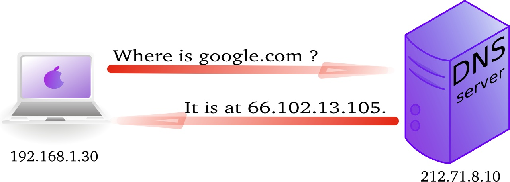
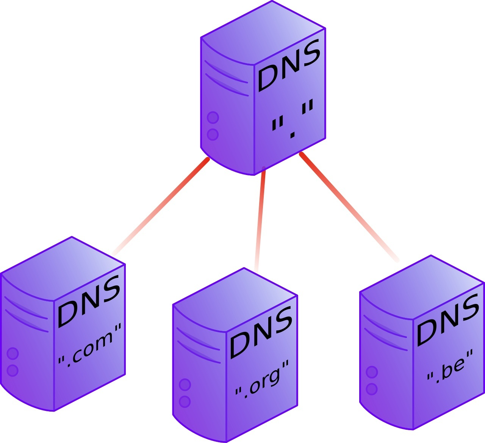
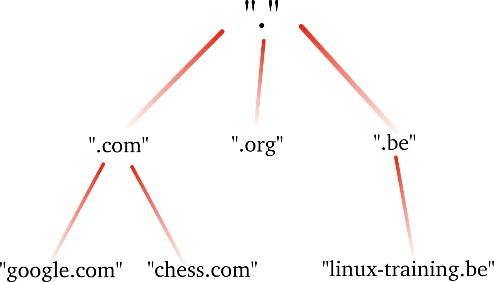
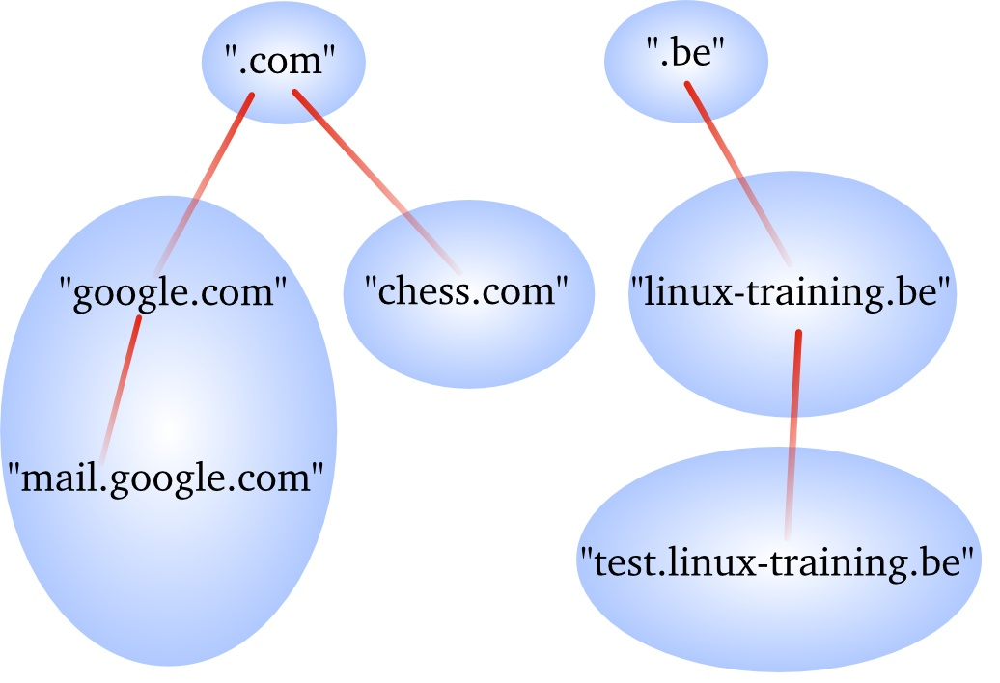
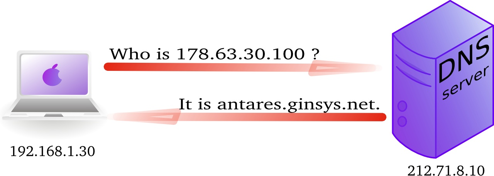
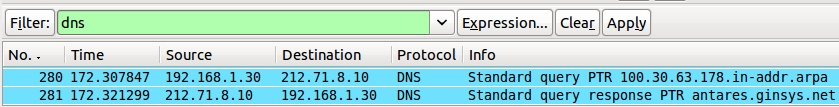

## about DNS

### name to ip address resolution

The *domain name system* or *DNS* is a service on a TCP/IP network that enables clients to translate host names into ip addresses. Actually *DNS* is much more than that, but let's keep it simple for now.

When you use a browser to go to a website, then you type the name of that website in the url bar. But for your computer to actually communicate with the web server hosting said website, your computer needs the ip address of that web server. That is where *DNS* comes in.



In wireshark you can use the *DNS* filter to see this traffic.


### history

In the Seventies, only a few hundred computers were connected to the internet. To resolve names, computers had a flat file that contained a table to resolve hostnames to ip addresses. This local file was downloaded from `hosts.txt` on an ftp server in Stanford.

In 1984 *Paul Mockapetris* created *DNS*, a distributed treelike hierarchical database that will be explained in detail below.

Today, *DNS* or *Domain Name System* is a worldwide distributed hierarchical database controlled by *ICANN* (the *Internet Corporation for Assigned Names and Numbers*). Its primary function is to resolve names to ip addresses, and to point to internet servers providing `smtp` or `ldap` services.

The old `hosts.txt` file is still active today on most computer systems under the name `/etc/hosts` (or `C:/Windows/System32/Drivers/etc/hosts`). See the `hosts(5)` for details.

A hosts file may look like this:

```hosts
# IP-address   hostname    aliases
127.0.0.1      localhost   localhost.localdomain
::1            localhost6  localhost6.localdomain6

172.22.255.254 router4038  gw gw.netlab.hogent.be
172.22.0.2     server4038  server4038.netlab.hogent.be
172.22.0.3     printer4038 printer4038.netlab.hogent.be
```

Each line contains a "record" with several fields, separated by whitespace. The first field is the IP (IPv4 or IPv6) address, following fields are hostnames and aliases.

You can use the hosts file to define shortcuts or aliases to websites or host names you use often. Contents of the hosts file will override all other means of name resolution.

Just enter the IP address and the chosen hostname in the hosts file and you can use that hostname in your browser, or when interacting with the host on the command line (e.g. `ping gw`, `ssh admin@server4038`, etc.).

A neat trick is to use the hosts file to block network traffic to unwanted hosts, e.g. ad servers or known malware domains. Just point the hostname to the IP address `127.0.0.1` and the website will not be reachable. You can find an example of an elaborate hosts file that blocks hundreds of ad servers at <https://someonewhocares.org/hosts/>.

### DNS namespace

The *dns namespace* is hierarchical tree structure, with the *root servers* (aka dot-servers) at the top. The *root servers* are usually represented by a dot.



Below the *root-servers* are the *Top Level Domains* or *TLD*'s. There are more *TLD*'s than shown in the picture. Currently about 200 countries have a *TLD*. (e.g. .be, .nl, .sh, etc.) And there are several general *TLD*'s like .com, .edu, .org, .gov, .net, .mil, .int and more recently also .aero, .info, .museum, ...

#### root servers

There are thirteen *root servers* on the internet, they are named *A* to *M*. Journalists often refer to these servers as *the master servers of the internet*, because if these servers go down, then nobody can (use names to) connect to websites.

The root servers are not thirteen physical machines, there are many more. For example the [*F* root server](https://www.isc.org/f-root/) consists of 46 physical machines that all behave as one (using anycast).

For more information, see:

- <http://root-servers.org>
- <http://en.wikipedia.org/wiki/Root_nameserver>

#### top level domains

Below the root level are the *top level domains* or *TLD*'s. Originally there were only seven defined:

| Year  | TLD   | Purpose                                             |
| :---: | :---- | :-------------------------------------------------- |
| 1985  | .arpa | Reverse lookup via in-addr.arpa                     |
| 1985  | .com  | Commercial Organizations                            |
| 1985  | .edu  | US Educational Institutions                         |
| 1985  | .gov  | US Government Institutions                          |
| 1985  | .mil  | US Military                                         |
| 1985  | .net  | Internet Service Providers, Internet Infrastructure |
| 1985  | .org  | Non profit Organizations                            |
| 1988  | .int  | International Organizations like nato.int           |

Country *TLD*'s were defined for individual countries, like *.uk* in 1985 for the United Kingdom, *.be* for Belgium in 1988 and *.fr* for France in 1986. See [RFC 1591](https://datatracker.ietf.org/doc/html/rfc1591) for more info.

In 1998 seven new general purpose *TLD*'s where chosen, they became active in the 21st century.

| Year  | TLD     | Purpose                                       |
| :---: | :------ | :-------------------------------------------- |
| 2002  | .aero   | Aviation related                              |
| 2001  | .biz    | Businesses                                    |
| 2001  | .coop   | For co-operatives                             |
| 2001  | .info   | Informative internet resources                |
| 2001  | .museum | For museums                                   |
| 2001  | .name   | For all kinds of names, pseudonyms and labels |
| 2004  | .pro    | For professionals                             |

Many people were surprised by the choices, claiming not much use for them and wanting a separate *.xxx* domain (introduced in 2011) for adult content, and *.kidz* a save haven for children. In the meantime more *TLD*'s were create like *.travel* (for travel agents), *.tel* (for internet communications) and *.jobs* (for jobs sites).

In 2012 *ICANN* released a list of 2000 new *TLD*'s that would gradually become available. The current list can be found at <https://www.iana.org/domains/root/db>.

#### domains

One level below the *top level domains* are the *domains*. Domains can have subdomains (also called child domains).



DNS domains are registered at the *TLD* servers, the *TLD* servers are registered at the *dot servers*.

#### fully qualified domain name

The *fully qualified domain name* or *fqdn* is the combination of the *hostname* of a machine appended with its *domain name*.

If for example a system is called *gwen* and it is in the domain *linux-training.be*, then the fqdn of this system is *gwen.linux-training.be*.

On Linux systems you can use the `hostname` and `dnsdomainname` commands to verify this information.

```console
student@gwen:~$ hostname
gwen
student@gwen:~$ dnsdomainname
linux-training.be
student@gwen:~$ hostname --fqdn
gwen.linux-training.be
```

#### dns zones

A *zone* (aka a *zone of authority*) is a portion of the DNS tree that is covered covers one domain name or child domain name. The picture below represents zones as blue ovals. Some zones will contain delegate authority over a child domain to another zone.



A *dns server* can be *authoritative* over zero, one or more *dns zones*, which means that it is the source of truth for the mapping of names to IP addresses within that/those zone(s). We will see more details later on the relation between a *dns server* and a *dns zone*.

### dns records

A *dns zone* is a collection of *records*, also called *resource records* (RRs). This section lists some of those *resource records*.

- The **A record**, which is also called a *host record* contains the ipv4-address of a computer. When a DNS client queries a DNS server for an A record, then the DNS server will resolve the hostname in the query to the specified ip address. An **AAAA record** is similar but contains an ipv6 address instead of ipv4.

- A **PTR record** is the reverse of an A record. It contains the name of a computer and can be used to resolve an ip address to a hostname. This is called a *reverse lookup* or *reverse lookup query*

- A **NS record** or *nameserver record* is a record that points to an authoritative DNS name server (in this zone). You can list all your name servers for your DNS zone in distinct NS records.

- An *A record* that maps the name of an *NS record* to an ip address is said to be a **glue record**.

- The **SOA record** (*Start Of Authority*) of a zone contains meta-information about the zone itself. The contents of the SOA record is explained in detail in the section about zone files. There is exactly one SOA record for each zone.

- A **CNAME record** maps a hostname to a hostname, creating effectively an alias for an existing hostname. The name of the mail server is often aliased to *mail* or *smtp*, and the name of a web server to *www*.

- The **MX record** points to an *smtp server*. When you send an email to another domain, then your mail server will need the MX record of the target domain's mail server in order to deliver email to the recepient's mailbox.

## DNS queries

The question a client asks a dns server is called a *query*. When a client queries for an ip address, this is called a *forward lookup query* (as seen in the previous drawing). The reverse, a query for the name of a host, is called a *reverse lookup query*.

We'll show in the following sections how to perform DNS queries with several command line tools.



This is what a reverse lookup looks like when sniffing with `tcpdump` (note the occurrecnes of PTR in the output):

```console
student@linux:~$ sudo tcpdump udp port 53
tcpdump: verbose output suppressed, use -v or -vv for full protocol decode
listening on eth0, link-type EN10MB (Ethernet), capture size 65535 bytes
11:01:29.357685 IP 192.168.1.103.42041 > 192.168.1.42.domain: 14763+ PT\
R? 87.155.93.188.in-addr.arpa. (44)
11:01:29.640093 IP 192.168.1.42.domain > 192.168.1.103.42041: 14763 1/0\
/0 PTR antares.ginsys.net. (76)
```

And here is what it looks like in `wireshark` (note this is an older screenshot).



### iterative or recursive query

A **recursive query** is a DNS query where the client that is submitting the query expects a complete answer (Like the fat red arrow above going from the Macbook to the DNS server).

An **iterative query** is a DNS query where the client does not expect a complete answer. Iterative queries usually take place between name servers, e.g. asking a root server for the authoritative name server of a top level domain. The root name servers do not respond to recursive queries.

## interacting with DNS

There are several tools to interact with *DNS*. In this section, we'll discuss `host`, `nslookup`, `dig`, and `getent`.

The `ping` command could also be used to test whether DNS resolution is working, but it does additional things like sending ICMP echo requests. Therefore, we will avoid using it for the purpose of testing DNS.

On Enterprise Linux and derivatives, ensure the `bind-utils` package is installed in order to use `dig`, `host`, or `nslookup`. On Debian and derivatives, you'll need the `bind9-host` (for `host`) and `bind9-dnsutils` packages (for `dig` and `nslookup`).

When you're on a system that doesn't have these tools installed, and installing additional packages is not possible, `getent` can be used as a fallback, albeit with limited functionality. Getent is included in the `glibc` library, which is installed on all Linux systems (`glibc-common` on EL and `libc-bin` on Debian).

### which DNS server is used?

A client computer needs to know the ip address of the *dns server* to be able to send queries to it. This is either provided by a *dhcp server* or manually entered. See also the chapter on network configuration for more details.

The traditional location to keep this information on Linux systems is in the `/etc/resolv.conf` file.

```console
student@linux:~$ cat /etc/resolv.conf
domain linux-training.be
search linux-training.be
nameserver 192.168.1.42
```

If the nameserver address points to 127.0.0.53, then the system is using *systemd-resolved* to resolve names. In this case, you can use the `resolvectl dns` command to see the current configuration, e.g.:

```console
student@linux:~$ resolvectl dns
Global:
Link 2 (eth0): 10.0.2.3
Link 3 (eth1): 
```

You can manually change the ip address in this file to use another *DNS* server. For example Google provides a public name server at 8.8.8.8 and 8.8.4.4.

```console
student@linux:~$ sudo nano /etc/resolv.conf
[...edit the file...]
student@linux:~$ cat /etc/resolv.conf
nameserver 8.8.8.8
nameserver 8.8.4.4
```

If your system uses *systemd-resolved*, you should use the `resolvectl dns LINK SERVER` command to change the configuration.

```console
student@linux:~$ resolvectl dns
Global:
Link 2 (eth0): 10.0.2.3
Link 3 (eth1):
vagrant@linux:~$ sudo resolvectl dns eth0 8.8.8.8
vagrant@linux:~$ resolvectl dns
Global:
Link 2 (eth0): 8.8.8.8
Link 3 (eth1):
```

**Please note** that on *dhcp clients* this configuration value can be overwritten when the *dhcp lease* is renewed. Permanent changes to the configuration are discussed in the chapter on network configuration.

### getent ahosts

In case when you don't have `dig`, `host`, or `nslookup` available, and installing packages is not feasible, you can use `getent ahosts` to perform a DNS lookup. The `getent` command is used to get entries from the system databases (see the `getent(1)` man page), and `ahosts` is one of the databases it can query.

```console
student@linux:~$ getent ahosts linux-training.be
188.40.26.208   STREAM linux-training.be
188.40.26.208   DGRAM
188.40.26.208   RAW
2a01:4f8:d0a:1044::2 STREAM
2a01:4f8:d0a:1044::2 DGRAM
2a01:4f8:d0a:1044::2 RAW
```

The command has no fancy options, but it can be used to perform a forward lookup to the default name server.

### host

`host` is a simple utility for performing DNS lookups. It is normally used to convert names to IP addresses and vice versa.

```console
student@linux:~$ host linux-training.be
linux-training.be has address 188.40.26.208
linux-training.be has IPv6 address 2a01:4f8:d0a:1044::2
linux-training.be mail is handled by 10 www115.your-server.de.
student@linux:~$ host linux-training.be 8.8.8.8
Using domain server:
Name: 8.8.8.8
Address: 8.8.8.8#53
Aliases:

linux-training.be has address 188.40.26.208
linux-training.be has IPv6 address 2a01:4f8:d0a:1044::2
linux-training.be mail is handled by 10 www115.your-server.de.
student@linux:~$ host 188.40.26.208
208.26.40.188.in-addr.arpa domain name pointer www115.your-server.de.
student@linux:~$ host 2a01:4f8:d0a:1044::2
2.0.0.0.0.0.0.0.0.0.0.0.0.0.0.0.4.4.0.1.a.0.d.0.8.f.4.0.1.0.a.2.ip6.arpa domain name pointer www115.your-server.de
```

The host command is quite limited in its functionality, `nslookup` and especially `dig` are much more useful to interact with DNS.

### nslookup

Windows users are probably familiar with the `nslookup` command and will be happy to know that it is also available on Linux systems.

In the first example below, the default DNS server (mentioned in `/etc/resolv.conf` or by `resolvectl dns`) is queried.

```console
student@linux:~$ nslookup linux-training.be
Server:         10.0.2.3
Address:        10.0.2.3#53

Non-authoritative answer:
Name:   linux-training.be
Address: 188.40.26.208
Name:   linux-training.be
Address: 2a01:4f8:d0a:1044::2
```

In the following example, we query a specific DNS server, in this case Google's public DNS server at 8.8.8.8. You will need this version of the command when you are troubleshooting issues with a DNS server you're configuring yourself (of course using its IP address instead of 8.8.8.8).

```console
student@linux:~$ nslookup linux-training.be 8.8.8.8
Server:         8.8.8.8
Address:        8.8.8.8#53

Non-authoritative answer:
Name:   linux-training.be
Address: 188.40.26.208
Name:   linux-training.be
Address: 2a01:4f8:d0a:1044::2
```

Reverse lookups are also possible with `nslookup`.

```console
student@linux:~$ nslookup 188.40.26.208
208.26.40.188.in-addr.arpa      name = www115.your-server.de.

Authoritative answers can be found from:

student@linux:~$ nslookup 2a01:4f8:d0a:1044::2
2.0.0.0.0.0.0.0.0.0.0.0.0.0.0.0.4.4.0.1.a.0.d.0.8.f.4.0.1.0.a.2.ip6.arpa        name = www115.your-server.de.

Authoritative answers can be found from:
```

`nslookup` can also be used interactively:

```console
nslookup
> server 8.8.8.8
Default server: 8.8.8.8
Address: 8.8.8.8#53
> linux-training.be
Server:         8.8.8.8
Address:        8.8.8.8#53

Non-authoritative answer:
Name:   linux-training.be
Address: 188.40.26.208
Name:   linux-training.be
Address: 2a01:4f8:d0a:1044::2
> set type=PTR
> 188.40.26.208
208.26.40.188.in-addr.arpa      name = www115.your-server.de.

Authoritative answers can be found from:
> 2a01:4f8:d0a:1044::2
Server:         8.8.8.8
Address:        8.8.8.8#53

Non-authoritative answer:
2.0.0.0.0.0.0.0.0.0.0.0.0.0.0.0.4.4.0.1.a.0.d.0.8.f.4.0.1.0.a.2.ip6.arpa        name = www115.your-server.de.

Authoritative answers can be found from:
> set type=NS
> linux-training.be
Server:         8.8.8.8
Address:        8.8.8.8#53

Non-authoritative answer:
linux-training.be       nameserver = ns.second-ns.com.
linux-training.be       nameserver = ns1.your-server.de.
linux-training.be       nameserver = ns3.second-ns.de.

Authoritative answers can be found from:
> set type=MX
> linux-training.be
Server:         8.8.8.8
Address:        8.8.8.8#53

Non-authoritative answer:
linux-training.be       mail exchanger = 10 www115.your-server.de.

Authoritative answers can be found from:
> exit
```

### dig

The `dig` command is a powerful tool for querying DNS servers. If you manage a DNS server, or need to troubleshoot DNS issues, it is a good idea to get familiar with `dig`, as it is much more versatile than `nslookup`.

```console
student@linux:~$ dig linux-training.be
; <<>> DiG 9.18.18-0ubuntu0.22.04.1-Ubuntu <<>> linux-training.be
;; global options: +cmd
;; Got answer:
;; ->>HEADER<<- opcode: QUERY, status: NOERROR, id: 8729
;; flags: qr rd ra; QUERY: 1, ANSWER: 1, AUTHORITY: 0, ADDITIONAL: 1

;; OPT PSEUDOSECTION:
; EDNS: version: 0, flags:; udp: 65494
;; QUESTION SECTION:
;linux-training.be.             IN      A

;; ANSWER SECTION:
linux-training.be.      7200    IN      A       188.40.26.208

;; Query time: 44 msec
;; SERVER: 127.0.0.53#53(127.0.0.53) (UDP)
;; WHEN: Wed Mar 27 17:02:44 UTC 2024
;; MSG SIZE  rcvd: 62
```

The output of `dig` is quite verbose, but very informative, and follows the syntax of a BIND zone file (see below). The `;` character is used to indicate comments. In this example, it is indicated that there was one `QUERY` and one `ANSWER`. The `QUESTION SECTION` shows the query that was made, and the `ANSWER SECTION` shows the response. Sometimes, the `ADDITIONAL SECTION` contains glue records for the name servers that are authoritative for the queried domain. Finally, you also get information about the query time, the server that was queried, and the time the query was made.

The `+short` option can be used to get a more concise output.

```console
student@linux:~$ dig +short linux-training.be
188.40.26.208
```

If you want to query a specific DNS server, you can specify it with the `@` symbol:

```console
student@linux:~$ dig +short @1.1.1.1 linux-training.be
188.40.26.208
```

Another type of *Resource Record* can be specified by just mentioning the type in the query:

```console
student@linux:~$ dig +short @1.1.1.1 AAAA linux-training.be
2a01:4f8:d0a:1044::2
student@linux:~$ dig +short NS hogent.be
ens1.hogent.be.
ns3.belnet.be.
ens2.hogent.be.
ns2.belnet.be.
ns1.belnet.be.
student@linux:~$ dig +short MX hogent.be
0 hogent-be.mail.protection.outlook.com.
```

A reverse lookup can be done with the -x option:

```console
student@linux:~$ dig -x 188.40.26.208 +short
www115.your-server.de.
```

A useful query is the `ANY` query, which will return all records for a domain:

```console
student@linux:~$ dig @ens1.hogent.be ANY hogent.be

; <<>> DiG 9.18.18-0ubuntu0.22.04.1-Ubuntu <<>> @ens1.hogent.be ANY hogent.be
; (2 servers found)
;; global options: +cmd
;; Got answer:
;; ->>HEADER<<- opcode: QUERY, status: NOERROR, id: 25886
;; flags: qr aa rd; QUERY: 1, ANSWER: 12, AUTHORITY: 0, ADDITIONAL: 5
;; WARNING: recursion requested but not available

;; OPT PSEUDOSECTION:
; EDNS: version: 0, flags:; udp: 1232
; COOKIE: 0d2f566a6341135d5ebd6167660452e7ffc6c1184db1c14a (good)
;; QUESTION SECTION:
;hogent.be.                     IN      ANY

;; ANSWER SECTION:
hogent.be.              3600    IN      SOA     ens1.hogent.be. hostmaster.hogent.be. 2024032506 43200 3600 2419200 3600
hogent.be.              3600    IN      A       193.190.173.132
hogent.be.              3600    IN      TXT     "adobe-idp-site-verification=..."
hogent.be.              3600    IN      TXT     "docusign=..."
hogent.be.              3600    IN      TXT     "v=spf1 a:spf-mail-out.hogent.be include:spf.protection.outlook.com -all"
hogent.be.              3600    IN      TXT     "docusign=..."
hogent.be.              3600    IN      NS      ens2.hogent.be.
hogent.be.              3600    IN      NS      ns1.belnet.be.
hogent.be.              3600    IN      NS      ns3.belnet.be.
hogent.be.              3600    IN      NS      ens1.hogent.be.
hogent.be.              3600    IN      NS      ns2.belnet.be.
hogent.be.              3600    IN      MX      0 hogent-be.mail.protection.outlook.com.

;; ADDITIONAL SECTION:
ens1.hogent.be.         3600    IN      A       193.190.172.1
ens2.hogent.be.         3600    IN      A       193.190.172.4
ens1.hogent.be.         3600    IN      AAAA    2001:6a8:1c60:d000::100
ens2.hogent.be.         3600    IN      AAAA    2001:6a8:1c60:d000::4

;; Query time: 24 msec
;; SERVER: 193.190.172.1#53(ens1.hogent.be) (TCP)
;; WHEN: Wed Mar 27 17:09:48 UTC 2024
;; MSG SIZE  rcvd: 674
```

You can request a zone transfer with the AXFR query type. Remark that this will usually not work for public DNS servers, as they are configured to deny zone transfers to the public. When you set up a primary and secondary nameserver yourself, the secondary nameserver will request a zone transfer from the primary nameserver.

The example below shows a zone transfer from `zonetransfer.me`, set up specifically for demonstration purposes. It contains examples for many different types of resource records. See <https://zonetransfer.me/> for more information.

```console
student@linux:~$ dig AXFR zonetransfer.me @nsztm1.digi.ninja

; <<>> DiG 9.18.18-0ubuntu0.22.04.1-Ubuntu <<>> AXFR zonetransfer.me @nsztm1.digi.ninja
;; global options: +cmd
zonetransfer.me.        7200    IN      SOA     nsztm1.digi.ninja. robin.digi.ninja. 2019100801 172800 900 1209600 3600
zonetransfer.me.        300     IN      HINFO   "Casio fx-700G" "Windows XP"

... more lines of output ...

zonetransfer.me.        7200    IN      SOA     nsztm1.digi.ninja. robin.digi.ninja. 2019100801 172800 900 1209600 3600
;; Query time: 24 msec
;; SERVER: 81.4.108.41#53(nsztm1.digi.ninja) (TCP)
;; WHEN: Wed Mar 27 17:16:22 UTC 2024
;; XFR size: 50 records (messages 1, bytes 2085)
```

If you don't specify an argument, `dig` will query the *dot domain* `.` and return a list with the names of the root DNS servers:

```console
student@linux:~$ dig
; <<>> DiG 9.16.23-RH <<>>
;; global options: +cmd
;; Got answer:
;; ->>HEADER<<- opcode: QUERY, status: NOERROR, id: 25274
;; flags: qr rd ra ad; QUERY: 1, ANSWER: 13, AUTHORITY: 0, ADDITIONAL: 1

;; OPT PSEUDOSECTION:
; EDNS: version: 0, flags:; udp: 512
;; QUESTION SECTION:
;.                   IN   NS

;; ANSWER SECTION:
.            20603   IN   NS   h.root-servers.net.
.            20603   IN   NS   b.root-servers.net.
.            20603   IN   NS   g.root-servers.net.
.            20603   IN   NS   l.root-servers.net.
.            20603   IN   NS   a.root-servers.net.
.            20603   IN   NS   k.root-servers.net.
.            20603   IN   NS   j.root-servers.net.
.            20603   IN   NS   e.root-servers.net.
.            20603   IN   NS   d.root-servers.net.
.            20603   IN   NS   i.root-servers.net.
.            20603   IN   NS   m.root-servers.net.
.            20603   IN   NS   c.root-servers.net.
.            20603   IN   NS   f.root-servers.net.

;; Query time: 19 msec
;; SERVER: 10.0.2.3#53(10.0.2.3)
;; WHEN: Wed Mar 27 21:23:11 UTC 2024
;; MSG SIZE  rcvd: 239
```

As mentioned before, each of the thirteen root servers has multiple instances located all over the world. You can ask a root name server to reveal its actual name that should contain an IATA three letter airport code.

```console
student@linux:~$ dig +short +norec @f.root-servers.net hostname.bind chaos txt
"BRU.cf.f.root-servers.org"
```

