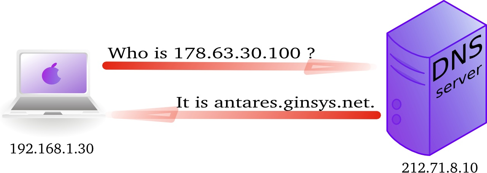
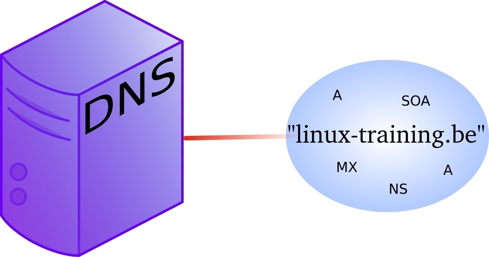
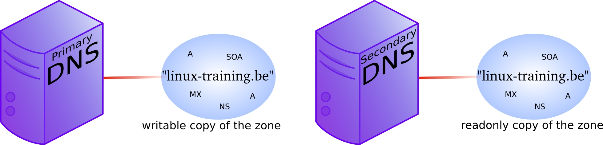
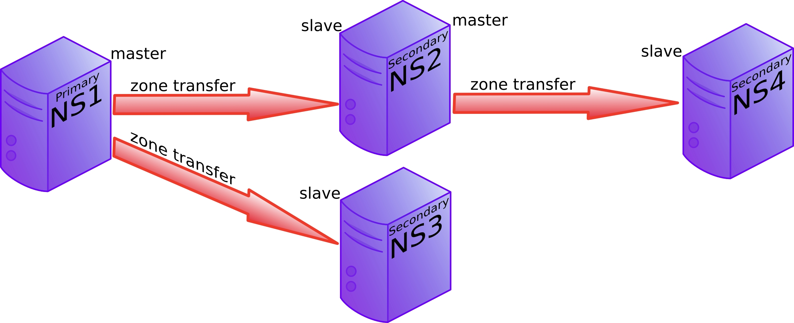
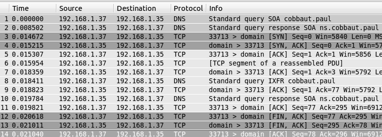
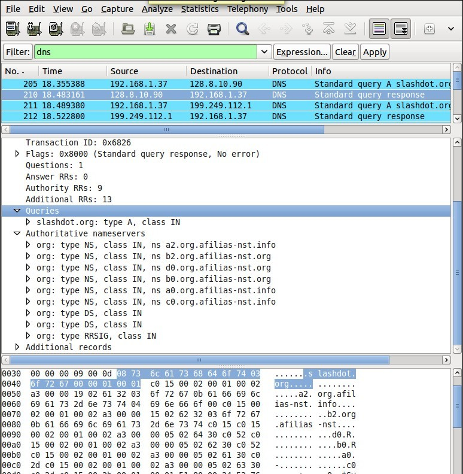
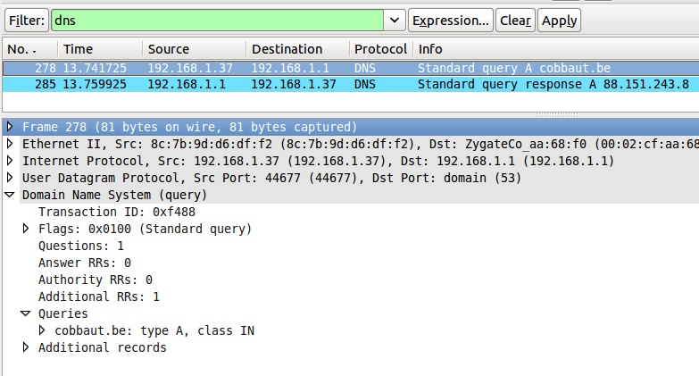

## about dns

### forward and reverse lookup queries

The question a client asks a dns server is called a *query*. When a client queries for an ip address, this is called a *forward lookup query* (as seen in the previous drawing).

The reverse, a query for the name of a host, is called a *reverse lookup query*.



Here is an example of a *reverse lookup query* with `nslookup`.

```console
student@linux:~$ nslookup
> set type=PTR
> 188.93.155.87
Server:         192.168.1.42
Address:        192.168.1.42#53

Non-authoritative answer:
87.155.93.188.in-addr.arpa      name = antares.ginsys.net.
```

This is what a reverse lookup looks like when sniffing with `tcpdump`.

```console
student@linux:~$ sudo tcpdump udp port 53
tcpdump: verbose output suppressed, use -v or -vv for full protocol decode
listening on eth0, link-type EN10MB (Ethernet), capture size 65535 bytes
11:01:29.357685 IP 192.168.1.103.42041 > 192.168.1.42.domain: 14763+ PT\
R? 87.155.93.188.in-addr.arpa. (44)
11:01:29.640093 IP 192.168.1.42.domain > 192.168.1.103.42041: 14763 1/0\
/0 PTR antares.ginsys.net. (76)
```

And here is what it looks like in `wireshark` (note this is an older screenshot).


## caching only servers

A *dns server* that is set up without *authority* over a *zone*, but that is connected to other name servers and caches the queries is called a *caching only name server*. Caching only name servers do not have a *zone database* with resource records. Instead they connect to other name servers and cache that information.

There are two kinds of caching only name servers. Those with a *forwarder*, and those that use the *root servers*.

### caching only server without forwarder

A caching only server without forwarder will have to get information elsewhere. When it receives a query from a client, then it will consult one of the *root servers*. The *root server* will refer it to a *TLD* server, which will refer it to another *DNS* server. That last server might know the answer to the query, or may refer to yet another server. In the end, our hard working *DNS* server will find an answer and report this back to the client.

In the picture below, the clients asks for the ip address of *linux-training.be*. Our caching only server will contact the root server, and be refered to the *.be* server. It will then contact the *.be* server and be refered to one of the name servers of Openminds. One of these name servers (in this cas *ns1.openminds.be*) will answer the query with the ip address of *linux-training.be*. When our caching only server reports this to the client, then the client can connect to this website.


Sniffing with `tcpdump` will give you this (the first 20 characters of
each line are cut).

```console
192.168.1.103.41251 > M.ROOT-SERVERS.NET.domain: 37279% [1au] A? linux-tr\
aining.be. (46)
M.ROOT-SERVERS.NET.domain > 192.168.1.103.41251: 37279- 0/11/13 (740)
192.168.1.103.65268 > d.ns.dns.be.domain: 38555% [1au] A? linux-training.\
be. (46)
d.ns.dns.be.domain > 192.168.1.103.65268: 38555- 0/7/5 (737)
192.168.1.103.7514 > ns2.openminds.be.domain: 60888% [1au] A? linux-train\
ing.be. (46)
ns2.openminds.be.domain > 192.168.1.103.7514: 60888*- 1/0/1 A 188.93.155.\
87 (62)
```

### caching only server with forwarder

A *caching only server* with a *forwarder* is a DNS server that will get all its information from the *forwarder*. The *forwarder* must be a *dns server* for example the *dns server* of an *internet service provider*.


This picture shows a *dns server* on the company LAN that has set the *dns server* from their *isp* as a *forwarder*. If the ip address of the *isp dns server* is 212.71.8.10, then the following lines would occur in the `named.conf` file of the company *dns server*:

```nginx
forwarders {
    212.71.8.10;
};
```

You can also configure your *dns server* to work with *conditional forwarder(s)*. The definition of a conditional forwarder looks like this.

```nginx
zone "someotherdomain.local" {
        type forward;
        forward only;
        forwarders { 10.104.42.1; };
};
```

### iterative or recursive query

A *recursive query* is a DNS query where the client that is submitting the query expects a complete answer (Like the fat red arrow above going from the Macbook to the DNS server). An *iterative query* is a DNS query where the client does not expect a complete answer (the three black arrows originating from the DNS server in the picture above). Iterative queries usually take place between name servers. The root name servers do not respond to recursive queries.

## authoritative dns servers

A DNS server that is controlling a zone, is said to be the *authoritative* DNS server for that zone. Remember that a *zone* is a collection of *resource records*.



## primary and secondary

When you set up the first *authoritative* dns server for a zone, then this is called the *primary dns server*. This server will have a readable and writable copy of the *zone database*. For reasons of fault tolerance, performance or load balancing you may decide to set up another *dns server* with authority over that zone. This is called a *secondary* dns server.



## zone transfers

The slave server receives a copy of the zone database from the master server using a *zone transfer*. Zone transfers are requested by the slave servers at regular intervals. Those intervals are defined in the *soa record*.


You can force a refresh from a zone with `rndc`. The example below force a transfer of the `fred.local` zone, and shows the log from `/var/log/syslog`.

```console
root@linux:/etc/bind# rndc refresh fred.local
root@linux:/etc/bind# grep fred /var/log/syslog | tail -7 | cut -c38-
zone fred.local/IN: sending notifies (serial 1)
received control channel command 'refresh fred.local'
zone fred.local/IN: Transfer started.
transfer of 'fred.local/IN' from 10.104.109.1#53: connected using 10.104.33.30#57367
zone fred.local/IN: transferred serial 2
transfer of 'fred.local/IN' from 10.104.109.1#53: Transfer completed: 1 messages, 10 records, 264 bytes, 0.001 secs (264000 bytes/sec)
zone fred.local/IN: sending notifies (serial 2)
```

## master and slave

When adding a *secondary dns server* to a zone, then you will configure this server as a *slave server* to the *primary server*. The primary server then becomes the *master server* of the slave server.

Often the *primary dns server* is the *master* server of all slaves. Sometimes a *slave server* is *master server* for a second line slave server. In the picture below ns1 is the primary dns server and ns2, ns3 and ns4 are secondaries. The master for slaves ns2 and ns3 is ns1, but the master for ns4 is ns2.



## SOA record

The *soa record* contains a *refresh* value. If this is set to 30 minutes, then the slave server will request a copy of the zone file every 30 minutes. There is also a *retry* value. The retry value is used when the master server did not reply to the last zone transfer request. The value for *expiry time* says how long the slave server will answer to queries, without receiving a zone update.

Below an example of how to use nslookup to query the *soa record* of a zone (linux-training.be).

```console
student@debian:~$ nslookup 
> set type=SOA
> server ns1.openminds.be
> linux-training.be
Server:         ns1.openminds.be
Address:        195.47.215.14#53

linux-training.be
        origin = ns1.openminds.be
        mail addr = hostmaster.openminds.be
        serial = 2321001133
        refresh = 14400
        retry = 3600
        expire = 604800
        minimum = 3600
```

Zone transfers only occur when the zone database was updated (meaning when one or more resource records were added, removed or changed on the master server). The slave server will compare the *serial number* of its own copy of the SOA record with the serial number of its master's SOA record. When both serial numbers are the same, then no update is needed (because no records were added, removed or deleted). When the slave has a lower serial number than its master, then a zone transfer is requested.

Below a zone transfer captured in wireshark.



## full or incremental zone transfers

When a zone tranfer occurs, this can be either a full zone transfer or an incremental zone transfer. The decision depends on the size of the transfer that is needed to completely update the zone on the slave server. An incremental zone transfer is prefered when the total size of changes is smaller than the size of the zone database. Full zone transfers use the *axfr* protocol, incremental zone transfer use the *ixfr* protocol.

## DNS cache

DNS is a caching protocol.

When a client queries its local DNS server, and the local DNS server is not authoritative for the query, then this server will go looking for an authoritative name server in the DNS tree. The local name server will first query a root server, then a *TLD* server and then a domain server. When the local name server resolves the query, then it will relay this information to the client that submitted the query, and it will also keep a copy of these queries in its cache. So when a(nother) client submits the same query to this name server, then it will retrieve this information form its cache.

For example, a client queries for the A record on *www.linux-training.be* to its local server. This is the first query ever received by this local server. The local server checks that it is not authoritative for the linux-training.be domain, nor for the *.be tld*, and it is also not a root server. So the local server will use the root hints to send an *iterative* query to a root server.

The root server will reply with a reference to the server that is authoritative for the .be domain (root DNS servers do not resolve fqdn's, and root servers do not respond to recursive queries).

The local server will then sent an iterative query to the authoritative server for the *.be tld*. This server will respond with a reference to the name server that is authoritative for the linux-training.be domain.

The local server will then sent the query for *www.linux-training.be* to the authoritative server (or one of its slave servers) for the linux-training.be domain. When the local server receives the ip address for *www.linux-training.be*, then it will provide this information to the client that submitted this query.

Besides caching the A record for *www.linux-training.be*, the local server
will also cache the NS and A record for the linux-training.be name
server and the .be name server.

## forward lookup zone example

The way to set up zones in `/etc/bind/named.conf.local` is to create a zone entry with a reference to another file (this other file contains the *zone database*).

Here is an example of such an entry in `/etc/bind/named.conf.local`:

```text
//
// Do any local configuration here
//

// Consider adding the 1918 zones here, if they are not used in your
// organization
//include "/etc/bind/zones.rfc1918";

zone "paul.local" IN {
        type master;
        file "/etc/bind/db.paul.local";
        allow-update { none; };
};
```

To create the zone file, the easy method is to copy an existing zone file (this is easier than writing from scratch).

```console
root@linux:/etc/bind# cp db.empty db.paul.local
root@linux:/etc/bind# vi db.paul.local
```

Here is an example of a zone file.

```console
root@linux:/etc/bind# cat db.paul.local
; zone for classroom teaching
$TTL    86400
@       IN      SOA     debianpaul.paul.local. root.paul.local (
                        2014100100      ; Serial
                        1h              ; Refresh
                        1h              ; Retry
                        2h              ; Expire
                        86400 )         ; Negative Cache TTL
;
; name servers
;
        IN      NS      ns1
        IN      NS      debianpaul
        IN      NS      debian10
;
; servers
;
debianpaul      IN      A       10.104.33.30
debian10         IN      A       10.104.33.30
ns1             IN      A       10.104.33.30
;www            IN      A       10.104.33.30
```

## example: caching only DNS server

1. installing DNS software on Debian

    student@debian:~# apt update && apt upgrade
    ...
    student@debian:~$ aptitude install bind9
    ...
    student@debian:~$ dpkg -l | grep bind9 | tr -s ' '
    ii bind9 1:9.8.4.dfsg.P1-6+nmu2+deb7u2 amd64 Internet Domain Name Server
    ii bind9-host 1:9.8.4.dfsg.P1-6+nmu2+deb7u2 amd64 Version of 'host' bundled...
    ii bind9utils 1:9.8.4.dfsg.P1-6+nmu2+deb7u2 amd64 Utilities for BIND
    ii libbind9-80 1:9.8.4.dfsg.P1-6+nmu2+deb7u2 amd64 BIND9 Shared Library use...
    student@debian:~$

2. Discover the default configuration files. Can you define the purpose
of each file ?

    student@debian:~$ ls -l /etc/bind
    total 52
    -rw-r--r-- 1 root root 2389 Sep  5 20:25 bind.keys
    -rw-r--r-- 1 root root  237 Sep  5 20:25 db.0
    -rw-r--r-- 1 root root  271 Sep  5 20:25 db.127
    -rw-r--r-- 1 root root  237 Sep  5 20:25 db.255
    -rw-r--r-- 1 root root  353 Sep  5 20:25 db.empty
    -rw-r--r-- 1 root root  270 Sep  5 20:25 db.local
    -rw-r--r-- 1 root root 3048 Sep  5 20:25 db.root
    -rw-r--r-- 1 root bind  463 Sep  5 20:25 named.conf
    -rw-r--r-- 1 root bind  490 Sep  5 20:25 named.conf.default-zones
    -rw-r--r-- 1 root bind  374 Oct  1 20:01 named.conf.local
    -rw-r--r-- 1 root bind  913 Oct  1 13:24 named.conf.options
    -rw-r----- 1 bind bind   77 Oct  1 11:14 rndc.key
    -rw-r--r-- 1 root root 1317 Sep  5 20:25 zones.rfc191

3. Setup caching only dns server. This is normally the default setup. A
caching-only name server will look up names for you and cache them. Many
tutorials will tell you to add a *forwarder*, but we first try without
this!

Hey this seems to work without a *forwarder*. Using a sniffer you can
find out what really happens. Your freshly install dns server is not
using a cache, and it is not using your local dns server (from
/etc/resolv.conf). So where is this information coming from ? And what
can you learn from sniffing this dns traffic ?

4. Explain in detail what happens when you enable a caching only dns
server without forwarder. This wireshark screenshot can help, but you
learn more by sniffing the traffic yourself.



You should see traffic to a *root name server* whenever you try a new
*TLD* for the first time. Remember that *DNS* is a caching protocol,
which means that repeating a query will generate a lot less traffic
since your *dns server* will still have the answer in its memory.

## root hints

Every *dns server software* will come with a list of *root hints* to locate the *root servers*.

This screenshot shows a small portion of the root hints file that comes with *BIND 9.8.4*.

```console
student@linux:~$ sudo grep -w 'A ' /etc/bind/db.root
A.ROOT-SERVERS.NET.      3600000      A     198.41.0.4
B.ROOT-SERVERS.NET.      3600000      A     192.228.79.201
C.ROOT-SERVERS.NET.      3600000      A     192.33.4.12
D.ROOT-SERVERS.NET.      3600000      A     199.7.91.13
E.ROOT-SERVERS.NET.      3600000      A     192.203.230.10
F.ROOT-SERVERS.NET.      3600000      A     192.5.5.241
G.ROOT-SERVERS.NET.      3600000      A     192.112.36.4
H.ROOT-SERVERS.NET.      3600000      A     128.63.2.53
I.ROOT-SERVERS.NET.      3600000      A     192.36.148.17
J.ROOT-SERVERS.NET.      3600000      A     192.58.128.30
K.ROOT-SERVERS.NET.      3600000      A     193.0.14.129
L.ROOT-SERVERS.NET.      3600000      A     199.7.83.42
M.ROOT-SERVERS.NET.      3600000      A     202.12.27.33
```


## example: caching only with forwarder

5. Add the public Google *dns server* as a *forwarder*. The ip address
of this server is 8.8.8.8 .

Before the change:

    student@debian:~$ grep -A2 'forwarders {' /etc/bind/named.conf.options
            // forwarders {
            //      0.0.0.0;
            // };

changing:

    student@debian:~$ vi /etc/bind/named.conf.options

After the change:

    student@debian:~$ grep -A2 'forwarders {' /etc/bind/named.conf.options
             forwarders {
                    8.8.8.8;
             };

Restart the server:

    student@debian:~$ service bind9 restart
    Stopping domain name service...: bind9.
    Starting domain name service...: bind9.

6. Explain the purpose of adding the *forwarder*. What is our
*dns server* doing when it receives a query ?

    student@debian:~$ nslookup
    > server
    Default server: 10.104.33.30
    Address: 10.104.33.30#53
    > linux-training.be
    Server:         10.104.33.30
    Address:        10.104.33.30#53

    Non-authoritative answer:
    Name:   linux-training.be
    Address: 188.93.155.87
    >

This is the output of `tcpdump udp port 53` while executing the above
query for `linux-training.be` in `nslookup`.

    student@debian:~$ tcpdump udp port 53
    tcpdump: verbose output suppressed, use -v or -vv for full protocol decode
    listening on eth0, link-type EN10MB (Ethernet), capture size 65535 bytes

You should find the following two lines in the output of `tcpdump`:

    10.104.33.30.19381 > google-public-dns-a.google.com.domain: 18237+% [1au] A? \
    linux-training.be. (46)
    google-public-dns-a.google.com.domain > 10.104.33.30.19381: 18237 1/0/1 A 188\
    .93.155.87 (62)

Below is an (old) wireshark screenshot that can help, you should see
something similar (but with different ip addresses).



7. What happens when you query for the same domain name more than once
?

8. Why does it say \"non-authoritative answer\" ? When is a dns server
authoritative ?

9. You can also use `dig` instead of `nslookup`.

    student@debian:~$ dig @10.104.33.30 linux-training.be +short
    188.93.155.87
    student@debian:~$

10. How can we avoid having to set the server in dig or nslookup ?

Change this:

    student@debian:~$ cat /etc/resolv.conf
    nameserver 10.46.101.1
    student@debian:~$

into this:

    student@debian:~$ cat /etc/resolv.conf
    nameserver 10.104.33.30
    student@debian:~$

11. When you use `dig` for the first time for a domain, where is the
answer coming from ? And the second time ? How can you tell ?

## example: primary authoritative server

1. Instead of only cachng the information from other servers, we will
now make our server authoritative for our own domain.

2. I choose the top level domain `.local` and the domain `paul.local`
and put the information in `/etc/bind/named.conf.local`.

    student@debian:~$ cat /etc/bind/named.conf.local
    //
    // Do any local configuration here
    //

    // Consider adding the 1918 zones here, if they are not used in your
    // organization
    //include "/etc/bind/zones.rfc1918";

    zone "paul.local" IN {
            type master;
            file "/etc/bind/db.paul.local";
            allow-update { none; };
    };

3. Also add a *zone database file*, similar to this one (add some A
records for testing). Set the *Refresh* and *Retry* values not too high
so you can sniff this traffic (this example makes the slave server
contact the master every hour).

    student@debian:~$ cat /etc/bind/db.paul.local
    ; zone for classroom teaching
    $TTL    86400
    @       IN      SOA     debianpaul.paul.local. root.paul.local (
                            2014100101      ; Serial
                            1h              ; Refresh
                            1h              ; Retry
                            2h              ; Expire
                            900 )           ; Negative Cache TTL
    ;
    ; name servers
    ;
            IN      NS      ns1
            IN      NS      debianpaul
            IN      NS      debian10
    ;
    ; servers
    ;
    debianpaul      IN      A       10.104.33.30
    debian10         IN      A       10.104.33.30
    ns1             IN      A       10.104.33.30
    ;www            IN      A       10.104.33.30
    student@debian:~$

Note that the *www* record is commented out, so it will not resolve.

### using your own DNS server

If you are confident that your *dns server* works, then set it as
default and only dns server in `/etc/resolv.conf`.

    student@debian:~$ cat /etc/resolv.conf
    nameserver 10.104.33.30
    student@debian:~$

In case you also use `dhclient`, you will need to add your dns server to
`/etc/dhcp/dhclient.conf`.

    student@debian:~$ diff /etc/dhcp/dhclient.conf /etc/dhcp/dhclient.conf.original
    21c21
    < prepend domain-name-servers 10.104.33.30;
    ---
    > #prepend domain-name-servers 127.0.0.1;
    23,24c23
    < #     domain-name, domain-name-servers, domain-search, host-name,
    <       domain-name, domain-search, host-name,
    ---
    >       domain-name, domain-name-servers, domain-search, host-name,
    student@debian:~$

The above screenshot shows that 10.104.33.30 is now a default option
that the *dhcp client* should no longer request from the *dhcp server*.

Adjust `/etc/hosts` to reflect your *domain name* and verify with
`hostname` and `dnsdomainname`.

    student@debian:~$ grep debian10 /etc/hosts
    127.0.1.1 debian10.paul.local debian10
    student@debian:~$ hostname
    debian10
    student@debian:~$ hostname --fqdn
    debian10.paul.local
    student@debian:~$ dnsdomainname
    paul.local

### using your own domain

Consider the following screenshot:

    student@debian:~$ cat /etc/resolv.conf
    nameserver 10.104.33.30
    student@debian:~$ ping -c1 www
    ping: unknown host www
    student@debian:~$ vi /etc/resolv.conf
    student@debian:~$ cat /etc/resolv.conf
    nameserver 10.104.33.30
    domain paul.local
    student@debian:~$ ping -c1 www
    PING www.paul.local (10.104.33.31) 56(84) bytes of data.
    64 bytes from 10.104.33.31: icmp_req=1 ttl=64 time=0.021 ms

    --- www.paul.local ping statistics ---
    1 packets transmitted, 1 received, 0% packet loss, time 0ms
    rtt min/avg/max/mdev = 0.021/0.021/0.021/0.000 ms
    student@debian:~$

Adding the *domain paul.local* directive to `/etc/resolv.conf` allows
omitting the domain when using hostnames.

You can accomplish this feature automatically by adjusting
`dhclient.conf`.

    student@debian:~$ grep paul.local /etc/dhcp/dhclient.conf
    prepend domain-name "paul.local";
    prepend domain-search "paul.local";
    student@debian:~$

4. Restart the DNS server and check your zone in the error log.

    student@debian:~$ service bind9 restart
    Stopping domain name service...: bind9.
    Starting domain name service...: bind9.
    student@debian:~$ grep paul.local /var/log/syslog
    Oct  6 09:22:18 debian10 named[2707]: zone paul.local/IN: loaded seria\
    l 2014100101
    Oct  6 09:22:18 debian10 named[2707]: zone paul.local/IN: sending noti\
    fies (serial 2014100101)

5. Use `dig` or `nslookup` (or even `ping`) to test your A records.

    student@debian:~$ ping -c1 ns1.paul.local
    PING ns1.paul.local (10.104.33.30) 56(84) bytes of data.
    64 bytes from 10.104.33.30: icmp_req=1 ttl=64 time=0.006 ms

    --- ns1.paul.local ping statistics ---
    1 packets transmitted, 1 received, 0% packet loss, time 0ms
    rtt min/avg/max/mdev = 0.006/0.006/0.006/0.000 ms
    student@debian:~$ ping -c1 www.paul.local
    ping: unknown host www.paul.local

Note that the *www* record was commented out, so it should fail.

    student@debian:~$ dig debian10.paul.local

    ; <<>> DiG 9.8.4-rpz2+rl005.12-P1 <<>> debian10.paul.local
    ;; global options: +cmd
    ;; Got answer:
    ;; ->>HEADER<<- opcode: QUERY, status: NOERROR, id: 50491
    ;; flags: qr aa rd ra; QUERY: 1, ANSWER: 1, AUTHORITY: 3, ADDITIONAL: 2

    ;; QUESTION SECTION:
    ;debian10.paul.local.            IN      A

    ;; ANSWER SECTION:
    debian10.paul.local.     86400   IN      A       10.104.33.30

    ;; AUTHORITY SECTION:
    paul.local.             86400   IN      NS      ns1.paul.local.
    paul.local.             86400   IN      NS      debian10.paul.local.
    paul.local.             86400   IN      NS      debianpaul.paul.local.

    ;; ADDITIONAL SECTION:
    ns1.paul.local.         86400   IN      A       10.104.33.30
    debianpaul.paul.local.  86400   IN      A       10.104.33.30

    ;; Query time: 4 msec
    ;; SERVER: 10.104.33.30#53(10.104.33.30)
    ;; WHEN: Mon Oct  6 09:35:25 2014
    ;; MSG SIZE  rcvd: 141

    student@debian:~$

6. Our primary server appears to be up and running. Note the
information here:

    server os  : Debian 7
    ip address : 10.104.33.30
    domain name: paul.local
    server name: ns1.paul.local

## example: a DNS slave server

1. A slave server transfers zone information over the network from a
master server (a slave can also be a master). A primary server maintains
zone records in its local file system. As an exercise, and to verify the
work of all students, set up a slave server of all the master servers in
the classroom.

2. Before configuring the slave server, we may have to allow transfers
from our zone to this server. Remember that this is not very secure
since transfers are in clear text and limited to an ip address. This
example follows our demo from above.

Imagine a student named *Jesse* having completed the setup as shown
before, with the domain name *jesse.local* and the ip address
10.104.15.20. The goal is to have a slave server of paul.local on
Jesse's computer and a slave zone of jesse.local on my computer.

Below is an example of an `allow-transfer` statement. Careful, maybe the
default allows transfer to any.

    root@linux:/etc/bind# cat named.conf.local
    //
    // Do any local configuration here
    //

    // Consider adding the 1918 zones here, if they are not used in your
    // organization
    //include "/etc/bind/zones.rfc1918";

    zone "paul.local" IN {
            type master;
            file "/etc/bind/db.paul.local";
            allow-update { none; };
            allow-transfer { 10.104.15.20; };
    };

3. With the configuration below I can make my server a slave for the
`jesse.local` zone.

    root@linux:/etc/bind# tail -6 named.conf.local
    zone "jesse.local" IN {
            type slave;
            file "/var/cache/named/db.jesse.local";
            masters { 10.104.15.20; };
    };

    root@linux:/etc/bind# mkdir /var/cache/named/
    root@linux:/etc/bind# chown bind:bind /var/cache/named/
    root@linux:/etc/bind# ls -ld /var/cache/named/
    drwxr-xr-x 2 bind bind 4096 Oct  1 20:01 /var/cache/named/

Note that we put the *slave zones* in `/var/cache/named` and not in
`/etc/bind`.

4. Restarting bind on the slave server should transfer the zone
database file. Verify this in `/var/log/syslog`. (time and date are
truncated from the screenshot, and Jesse did not use the current date in
the serial number...)

    root@linux:/etc/bind# grep jesse /var/log/syslog
    named[2731]: zone jesse.local/IN: Transfer started.
    named[2731]: transfer of 'jesse.local/IN' from 10.104.15.20#53: connected u\
    sing 10.104.33.30#44719
    named[2731]: zone jesse.local/IN: transferred serial 20110516
    named[2731]: transfer of 'jesse.local/IN' from 10.104.15.20#53: Transfer co\
    mpleted: 1 messages, 8 records, 239 bytes, 0.001 secs (239000 bytes/sec)

And the contents of the *slave zone*:

    root@linux:/etc/bind# cat /var/cache/named/db.jesse.local
    $ORIGIN .
    $TTL 604800     ; 1 week
    jesse.local             IN SOA  ns.jesse.local. root.jesse.local.jesse.local. (
                                    20110516   ; serial
                                    300        ; refresh (5 minutes)
                                    200        ; retry (3 minutes 20 seconds)
                                    2419200    ; expire (4 weeks)
                                    604800     ; minimum (1 week)
                                    )
                            NS      ns.jesse.local.
    $ORIGIN jesse.local.
    anya                    A       10.104.15.1
    mac                     A       10.104.15.30
    ns                      A       10.104.15.20
    ubu1010srv              A       10.104.15.20
    www                     A       10.104.15.25
    root@linux:/etc/bind#

