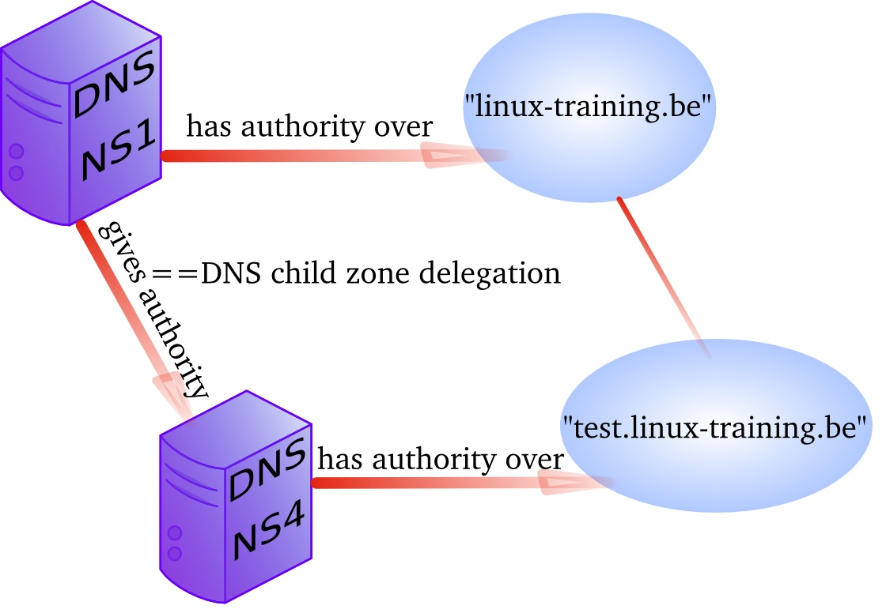

## example: DNS round robin

When you create multiple A records for the same name, then
`bind` will do a `round robin` of the order in which the
records are returned. This allows the use of DNS as a load balancer
between hosts, since clients will usually take the first ip-address
offered.

Consider this example from the `/etc/bind/db.paul.local` zone
configuration file. There are two A records for `www` pointing to two
distinct ip addresses.

    root@linux:~# grep www /etc/bind/db.paul.local
    www             IN      A       10.104.33.30
    www             IN      A       10.104.33.31

Below a screenshot of `nslookup` querying a load balanced A record.
Notice the order of ip addresses returned.

    root@linux:~# nslookup www.paul.local 10.104.33.30
    Server:         10.104.33.30
    Address:        10.104.33.30#53

    Name:   www.paul.local
    Address: 10.104.33.31
    Name:   www.paul.local
    Address: 10.104.33.30

    root@linux:~# nslookup www.paul.local 10.104.33.30
    Server:         10.104.33.30
    Address:        10.104.33.30#53

    Name:   www.paul.local
    Address: 10.104.33.30
    Name:   www.paul.local
    Address: 10.104.33.31

Try to set up a website on two web servers (with a small difference so
you can distinguish the websites) and test the `round robin`.

## DNS delegation

You can `delegate` a child domain to another DNS server. The child
domain then becomes a new zone, with authority at the new dns server.

When `delegation` is properly set up, then clients that query your
parent zone will also be able to resolve the delegated child zones.

## example: DNS delegation

We have another `Linux server` named `debian10b` and we want to make it
responsible for the child domain `test42.paul.local`.

*Note the name of the servers in the screenshots are either `debian10`
(hosting the parent domain) or `debian10b` (hosting the child domain).*

We start by adjusting the `/etc/bind/named.comf.local` file (on the
server hosting the parent domain) to make sure that no forwarder will be
used when resolving authoritative names.

    root@linux:~# grep -A4 paul.local /etc/bind/named.conf.local
    zone "paul.local" IN {
            type master;
            file "/etc/bind/db.paul.local";
            allow-update { none; };
            allow-transfer { 10.104.15.20; };
            forwarders { };
    };
    root@linux:~#

Technically, you could also set `allow-transfer` to `{ any; };` while
troubleshooting and then refine it later, but this is not needed for
delegation.

Then we add the delegation to our zone database:

    root@linux:~# tail -3 /etc/bind/db.paul.local
    $ORIGIN test42.paul.local.
    @       IN      NS      ns2.test42.paul.local.
    ns2     IN      A       10.104.33.31    ; the glue record
    root@linux:~#

Don\'t forget to restart `bind` and verify `/var/log/syslog`.

    root@linux:~# service bind9 restart
    Stopping domain name service...: bind9.
    Starting domain name service...: bind9.
    root@linux:~# grep paul.local /var/log/syslog | cut -c28- | tail -2
    named[3202]: zone paul.local/IN: loaded serial 2014100801
    named[3202]: zone paul.local/IN: sending notifies (serial 2014100801)
    root@linux:~#

*Note that on your terminal you can type `tail -40 /var/log/syslog`
because the only reason I use `grep`, `cut` and `tail -2` is to limit
the size of the screenshots in this book.*

Next we create a zone database file on the second server, as seen in
this screenshot:

    root@linux:~# cat /etc/bind/db.test42.paul.local
    ; child zone for classroom teaching
    $TTL    86400
    $ORIGIN test42.paul.local.
    @       IN      SOA     ns2.test42.paul.local. root.test42.paul.local. (
                            2014100802      ; Serial
                            1h              ; Refresh
                            1h              ; Retry
                            2h              ; Expire
                            900 )           ; Negative Cache TTL
    ;
    ; name servers
    ;
            IN      NS      ns2.test42.paul.local.
            IN      NS      debian10b.test42.paul.local.
    ;
    ; servers
    ;
    ns2             IN      A       10.104.33.31
    debian10b        IN      A       10.104.33.31
    testsrv         IN      A       10.104.33.31
    root@linux:~#

The second server also needs a zone definition in `named.conf.local`,
followed by a restart of `bind`.

    root@linux:~# cat /etc/bind/named.conf.local
    //
    // Do any local configuration here
    //

    // Consider adding the 1918 zones here, if they are not used in your
    // organization
    //include "/etc/bind/zones.rfc1918";

    zone "test42.paul.local" IN {
            type master;
            file "/etc/bind/db.test42.paul.local";
            allow-update { none; };
            allow-transfer { any; };
    };
    root@linux:~#

Testing on the parent server:

    root@linux:~# dig ns1.paul.local +short
    10.104.33.30
    root@linux:~# dig ns2.test42.paul.local +short
    10.104.33.31
    root@linux:~# dig debian10b.test42.paul.local +short
    10.104.33.31

## example: split-horizon dns

Suppose you want to answer dns queries depending on who is asking. For
example when someone from the 10.104.15.0/24 network (managed by Jesse)
asks for the A record www.paul.local, then dns answers with
10.104.33.30. But when someone from the 10.104.42.0/24 network (managed
by Keith) asks for the same A record of www.paul.local, he will get
10.104.33.31 as an answer.

A `split-horizon` setup can be used to redirect people to `local` copies
of certain services.

In this example we want to decide on specific answers for two networks
(Jesse\'s and Keith\'s) and prevent them from using our dns server for
`recursion`, while maintaining the capability to resolve the internet
and our paul.local zone from our own network.

We start by creating three `view` clauses in `named.conf.local`.

    root@linux:/etc/bind# cat named.conf.local
    view "paul" {
    match-clients { 10.104.33.0; localhost; };
    include "/etc/bind/named.conf.default-zones";
    zone "paul.local" IN {
            type master;
            file "/etc/bind/db.paul.local";
            allow-update { none; };
            };
    };      // end view internal

    view "jesse" {
    match-clients { 10.104.15/24; };
    zone "paul.local" IN {
            type master;
            file "/etc/bind/db.paul.local.jesse";
            allow-update { none; };
            };
    };      // end view jesse

    view "keith" {
    match-clients { 10.104.42/24; };
    zone "paul.local" IN {
            type master;
            file "/etc/bind/db.paul.local.keith";
            allow-update { none; };
            };
    };      // end view keith

Note that we included the `default-zones` in the internal zone. It is
mandatory to put all zones inside views when using a view.

The zone files are identical copies, except for the `www` record. You
can see that the `round robin` is still active for internal users,
computers from 10.104.15.0/24 (Jesse) will always receive 10.104.33.30
while computers from 10.104.42.0/24 (Keith) will receive 10.104.33.31.

    root@linux:/etc/bind# grep www db.paul.local db.paul.local.[jk]*
    db.paul.local:www               IN      A       10.104.33.30
    db.paul.local:www               IN      A       10.104.33.31
    db.paul.local.jesse:www         IN      A       10.104.33.30
    db.paul.local.keith:www         IN      A       10.104.33.31

## old dns topics

All the dns things below this paragraph are old and in urgent need of
review.

### old example: reverse DNS

1\. We can add ip to name resolution to our dns-server using a reverse
dns zone.

2\. Start by adding a .arpa zone to /etc/bind/named.conf.local like this
(we set notify to no to avoid sending of notify messages to other name
servers):

    root@linux:/etc/bind# grep -A4 arpa named.conf.local 
    zone "1.168.192.in-addr.arpa" {
        type master;
        notify no;
        file "/etc/bind/db.192";
    };

3\. Also create a zone database file for this reverse lookup zone.

    root@linux:/etc/bind# cat db.192 
    ;
    ; BIND reverse data file for 192.168.1.0/24 network
    ;
    $TTL    604800
    @   IN  SOA ns.cobbaut.paul root.cobbaut.paul. (
                20110516    ; Serial
                 604800     ; Refresh
                  86400     ; Retry
                2419200     ; Expire
                 604800 )   ; Negative Cache TTL
    ;
    @   IN  NS  ns.
    37  IN  PTR ns.cobbaut.paul.
    1   IN  PTR anya.cobbaut.paul.
    30  IN  PTR mac.cobbaut.paul.
    root@linux:/etc/bind# 

4\. Test with nslookup or dig:

    root@linux:/etc/bind# dig 1.168.192.in-addr.arpa AXFR

### old DNS load balancing

Not as above. When you have more than one DNS server authoritative for a
zone, you can spread queries amongst all server. One way to do this is
by creating NS records for all servers that participate in the load
balancing of external queries.

You could also configure different name servers on internal clients.

### old DNS notify

The original design of DNS in rfc 1034 and rfc 1035 implemented a
`refresh` time in the `SOA` record to configure a time loop for slaves
to query their master server. This can result in a lot of useless pull
requests, or in a significant lag between updates.

For this reason `dns notify (rfc 1996)` was designed. The server will
now notify slaves whenever there is an update. By default this feature
is activated in `bind`.

Notify can be disabled as in this screenshot.

    zone "1.168.192.in-addr.arpa" {
            type master;
            notify no;
            file "/etc/bind/db.192";
    };

### old testing IXFR and AXFR

Full zone transfers (AXFR) are initiated when you restart the bind
server, or when you manually update the zone database file directly.
With `nsupdate` you can update a zone database and initiate an
incremental zone transfer.

You need DDNS allowed for `nsupdate` to work.

    root@linux:/etc/bind# nsupdate
    > server 127.0.0.1
    > update add mac14.linux-training.be 86400 A 192.168.1.23
    > send
    update failed: REFUSED

### old DDNS integration with DHCP

Some organizations like to have all their client computers in DNS. This
can be cumbersome to maintain. Luckily `rfc 2136` describes integration
of DHCP servers with a DNS server. Whenever DHCP acknowledges a client
ip configuration, it can notify DNS with this clients ip-address and
name. This is called `dynamic updates` or DDNS.

### old reverse is forward in-addr.arpa

Reverse lookup is actually iomplemented as a forward lookup in the
`in-addr.arpa` domain. This domain has 256 child domains (from
0.in-addr.arpa to 255.in-addr.arpa), with each child domain having again
256 child domains. And this twice more to a structure of over four
billion (2 to the power 32) domains.

### old ipv6

With rfc 3596 came ipv6 extensions for DNS. There is the AAAA record for
ipv6 hosts on the network, and there is the `ip6.int` domain for reverse
lookup (having 16 child domains from 0.ip6.int to f.ip6.int, each of
those having again 16 child domains\...and this 16 times.

### old DNS security: file corruption

To mitigate file corruption on the `zone files` and the
`bind configuration` files protect them with Unix permissions and take
regular backups.

### old DNS security: zone transfers

Limit zone transfers to certain ip addresses instead of to `any`.
Nevermind that ip-addresses can be spoofed, still use this.

### old DNS security: zone transfers, ip spoofing

You could setup DNSSEC (which is not the easiest to maintain) and with
rfc 2845(tsig?) and with rfc 2930(tkey, but this is open to brute
force), or you could disable all zone transfers and use a script with
ssh to copy them manually.

### old DNS security: queries

Allow recursion only from the local network, and iterative queries from
outside only when necessary. This can be configured on master and slave
servers.

    view "internal" {
    match-clients { 192.168.42/24; };
    recursion yes;
    ...

    };

    view "external" {
    match-clients { any; };
    recursion no;
    ...

    };

Or allow only queries from the local network.

    options {
          allow-query { 192.168.42.0/24; localhost; };
    };

    zone "cobbaut.paul" {
          allow-query { any; };
    };

Or only allow recursive queries from internal clients.

    options {
            allow-recursion { 192.168.42.0/24; localhost; };
    };

### old DNS security: chrooted bind

Most Linux distributions allow an easy setup of bind in a `chrooted`
environment.

### old DNS security: DNSSEC

DNSSEC uses public/private keys to secure communications, this is
described in rfc\'s 4033, 4034 and 4035.

### old DNS security: root

Do not run bind as root. Do not run any application daemon as root.

