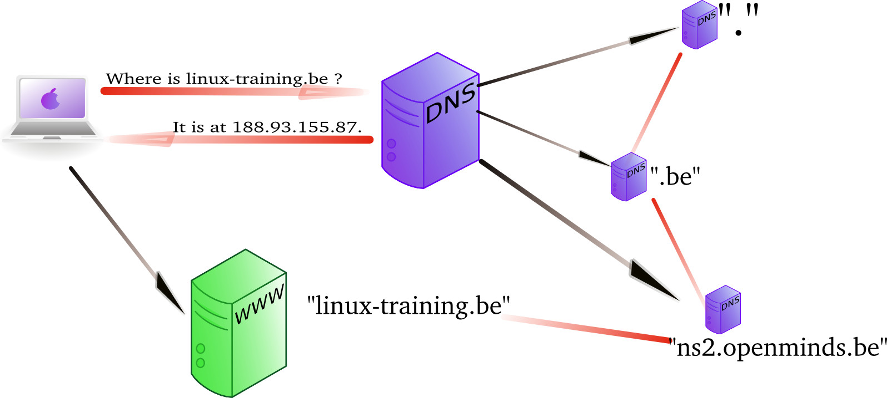

## DNS server types

There are several types of DNS servers, each with its own purpose. The most common types are:

- **Authoritative:** this type of server is the "source of truth" for a specific *DNS zone*. Authoritative servers can be **primary** or **secondary[^primary_secondary] servers**. A *primary server* has a *zone file* that contains all the resource records for the zone. A *secondary server* replicates the zone data from the primary server through a *zone transfer*. When a query is made for a record in the zone, the authoritative server returns the answer.

[^primary_secondary]: The old nomenclature of *master* and *slave* servers is being phased out due to its negative connotations. The terms *primary* and *secondary* are now preferred.

- **Caching:** this type of server caches responses to queries it receives. When a query is made, the caching server first checks its cache to see if it has the answer. If it does, it returns the cached response. If not, it starts a ***recursive query.*** In a recursive query, the resolver will query a root server for the DNS server responsible for the top-level domain of the query. It will then query that server for the DNS server responsible for the second-level domain, and so on, until it gets the answer to the original query. The caching server will cache the response to the original query for a certain amount of time (the *TTL* or *Time To Live* value of the record).

- **Forwarding:** this type of server is not authoritative, but it forwards queries to other servers. The DNS server of a VirtualBox NAT interface is an example of a forwarding server that passes on queries of the VM to the DNS server of the physical machine.

- **Stealth:** this type of server is hidden from the public and is used for internal purposes. It is not listed in the publicly visible NS records for a domain. Stealth servers are used for DNS resolution of network services for internal use and are not accessible from the internet. For example, a company might have an intranet webserver with hostname `intranet.company.com` that is only accessible from within the company network. The RRs for this host would only be available from the internal stealth DNS server, but not from the public authoritative DNS server for `company.com`.

- **Split horizon:** this type of server provides different responses to queries based on the source of the query. For example, a split horizon server might return different IP addresses for a domain based on whether the query is coming from inside or outside the local network.

A DNS server, depending on how it is configured, can have one or more properties from the above list. For example, a server can be both authoritative and caching, it can be caching and forwarding, or both primary and secondary (for different domains).

Some best practices for maintaining a DNS server in a production environment:

- *Don't configure your DNS server to support recursive queries for all clients.* This could lead to DDoS attacks. You can always limit the source IP addresses to trusted clients that are allowed to make recursive queries.

- *A secure DNS server should only perform a single function.* For example, a DNS server that is authoritative for a zone should not also be a caching server (this is called an **authoritative only server**). Unfortunately, this is not always feasible for smaller organizations and in practice, many DNS servers perform multiple functions.

- *A DNS server should be installed on a dedicated machine* because it is essential for the operation of a network. Combining a DNS server with other services on the same machine can lead to lower availability (if the services are under high load) or security issues (since it increases the attack surface).

### caching only servers

A *dns server* that is set up without *authority* over a *zone*, but that is connected to other name servers and caches the queries is called a *caching only name server*. Caching only name servers do not have a *zone database* with resource records. Instead they connect to other name servers and cache that information.

There are two kinds of caching only name servers. Those with a *forwarder*, and those that use the *root servers*.

The default installation of BIND is a caching ony name server without a forwarder.

#### caching only server without forwarder

A caching only server without forwarder will have to get information elsewhere. When it receives a query from a client, then it will consult one of the *root servers*. The *root server* will refer it to a *TLD* server, which will refer it to another *DNS* server. That last server might know the answer to the query, or may refer to yet another server. In the end, our hard working *DNS* server will find an answer and report this back to the client.

In the picture below, the clients asks for the ip address of *linux-training.be*. Our caching only server will contact the root server, and be refered to the *.be* server. It will then contact the *.be* server and be refered to one of the name servers of Openminds. One of these name servers (in this cas *ns1.openminds.be*) will answer the query with the ip address of *linux-training.be*. When our caching only server reports this to the client, then the client can connect to this website.



Sniffing with `tcpdump` will give you this (the first 20 characters of
each line are cut).

```console
192.168.1.103.41251 > M.ROOT-SERVERS.NET.domain: 37279% [1au] A? linux-tr\
aining.be. (46)
M.ROOT-SERVERS.NET.domain > 192.168.1.103.41251: 37279- 0/11/13 (740)
192.168.1.103.65268 > d.ns.dns.be.domain: 38555% [1au] A? linux-training.\
be. (46)
d.ns.dns.be.domain > 192.168.1.103.65268: 38555- 0/7/5 (737)
192.168.1.103.7514 > ns2.openminds.be.domain: 60888% [1au] A? linux-train\
ing.be. (46)
ns2.openminds.be.domain > 192.168.1.103.7514: 60888*- 1/0/1 A 188.93.155.\
87 (62)
```

#### caching only server with forwarder

A *caching only server* with a *forwarder* is a DNS server that will get all its information from the *forwarder*. The *forwarder* must be a *dns server* for example the *dns server* of an *internet service provider*.


This picture shows a *dns server* on the company LAN that has set the *dns server* from their *isp* as a *forwarder*. If the ip address of the *isp dns server* is 212.71.8.10, then the following lines would occur in the `named.conf` file of the company *dns server*:

```nginx
forwarders {
    212.71.8.10;
};
```

You can also configure your *dns server* to work with *conditional forwarder(s)*. The definition of a conditional forwarder looks like this.

```nginx
zone "someotherdomain.local" {
        type forward;
        forward only;
        forwarders { 10.104.42.1; };
};
```

## BIND installation

If you need to set up a DNS server, there are several open source solutions available. [PowerDNS](https://www.powerdns.com), [MyDNS](http://mydns.bboy.net), [MaraDNS](https://maradns.samiam.org), [dnsmasq](https://thekelleys.org.uk/dnsmasq/doc.html), [Name Server Daemon](https://www.nlnetlabs.nl/projects/nsd/about/) (NSD), [Unbound](https://www.nlnetlabs.nl/projects/unbound/about/), etc. However, the most widely used DNS server on the internet is undoubtedly [BIND](https://www.isc.org/bind/) (Berkeley Internet Name Domain). BIND is open source and maintained by the *Internet Systems Consortium* (ISC).

In this section, we'll discuss how to install and configure BIND on a Linux system.

### installation on Debian

On **Debian-based systems**, install the `bind9` package:

```console
student@debian:~$ sudo apt install bind9
```

The service will be started automatically after installation. You can check the status of the service with `systemctl status named`.

The main configuration files for BIND can be found in the `/etc/bind` directory and are named `named.conf*`. The `named.conf` file is the main configuration file for BIND, and it includes other configuration files. The `named.conf.options` file contains options that apply to the entire server, such as the listening interfaces and the forwarders. The `named.conf.local` file contains the zone definitions for the server. The `named.conf.default-zones` file contains the *default zones* (e.g. the root, broadcast and localhost zones) that are included in the configuration.

*Zone files* are kept in the same directory and are named after the zone they represent. By default, you will find several files starting with `db.*` and `zones.rfc1918`.

### installation on Enterprise Linux

On **Enterprise Linux**, install the `bind` package:

```console
student@el:~$ sudo dnf install bind
```

The service will *not* be started automatically, so you will need to start it manually and enable it to start at boot:

```console
student@el:~$ sudo systemctl enable --now named
```

For security, BIND configuration files and directories are only readable for the root user, so you will need to use `sudo` to view or edit them (or, optionally, become `root`). The main configuration file is `/etc/named.conf`, and the zone files are kept in the `/var/named` directory.

### comparison between Debian and Enterprise Linux installation

Although BIND on EL and Debian are the same software, there are considerable differences in the way they are installed and configured. The config files are stored in a different location and are structured differently.

The main differences are:

|                          | Debian                               | EL                    |
| :----------------------- | :----------------------------------- | :-------------------- |
| Package name             | `bind9`                              | `bind`                |
| Service name             | `named`                              | `named`               |
| Configuration directory  | `/etc/bind`                          | `/etc`, `/etc/named`  |
| Main config file         | `/etc/bind/named.conf`               | `/etc/named.conf`     |
| Server options           | `/etc/bind/named.conf.options`       | `/etc/named.conf`     |
| Default zone definitions | `/etc/bind/named.conf.default-zones` | `/etc/named.conf`     |
| Zone files directory     | `/etc/bind`                          | `/var/named`          |
| Root hints file          | `/usr/share/dns/root.hints`          | `/var/named/named.ca` |
| Default zone files       | `/etc/bind/db.*`,                    | `/var/named/named.*`  |
|                          | `/etc/bind/zones.rfc1918`            |                       |

### troubleshooting commands

Before we start configuring BIND, we'll first introduce some useful commands for troubleshooting DNS issues. We'll show the commands on an EL system, but they work on Debian as well.

Checking the status of the BIND service:

```console
[student@el ~]$ systemctl status named
● named.service - Berkeley Internet Name Domain (DNS)
     Loaded: loaded (/usr/lib/systemd/system/named.service; enabled; preset: disabled)
     Active: active (running) since Sat 2024-06-15 19:44:21 UTC; 3min 32s ago
    Process: 4812 ExecStartPre=/bin/bash -c if [ ! "$DISABLE_ZONE_CHECKING" == "yes" ]; then /usr/sbin/named-checkconf -z "$NAMEDCONF"; else echo "Checking of zone files is disabled"; fi (c>
    Process: 4815 ExecStart=/usr/sbin/named -u named -c ${NAMEDCONF} $OPTIONS (code=exited, status=0/SUCCESS)
   Main PID: 4816 (named)
      Tasks: 10 (limit: 11128)
     Memory: 25.2M
        CPU: 44ms
     CGroup: /system.slice/named.service
             └─4816 /usr/sbin/named -u named -c /etc/named.conf
```

Checking interfaces and network ports that BIND is listening on:

```console
[student@el ~]$ sudo ss -tlnp | grep named
State   Recv-Q  Send-Q  Local Address:Port  Peer Address:Port  Process
LISTEN  0       10          127.0.0.1:53         0.0.0.0:*      users:(("named",pid=4816,fd=34))
LISTEN  0       10          127.0.0.1:53         0.0.0.0:*      users:(("named",pid=4816,fd=35))
LISTEN  0       4096        127.0.0.1:953        0.0.0.0:*      users:(("named",pid=4816,fd=31))
LISTEN  0       4096            [::1]:953           [::]:*      users:(("named",pid=4816,fd=42))
LISTEN  0       10              [::1]:53            [::]:*      users:(("named",pid=4816,fd=41))
LISTEN  0       10              [::1]:53            [::]:*      users:(("named",pid=4816,fd=40))
```

So immediately after installation, BIND is only listening on the loopback interface, on port 53 for DNS queries and on port 953 for `rndc` commands. Both IPv4 and IPv6, TCP and UDP are supported. UDP is typically used for simple DNS queries, while TCP is used for zone transfers and large responses.

Checking whether the configuration file is correct:

```console
[student@el ~]$ sudo named-checkconf
```

If the syntax of the main configuration file is correct, the command will return without any output and exit status 0. If there are errors, they will be displayed on the screen and the process will exit with a non-zero exit status.

Checking the syntax of a zone file is done with `named-checkzone <zone> <zonefile>`. Later, we'll create our own zone files, but the following command can be run on a basic installation, and checks the root hints file. On Debian, you'll need to change the path to the root hints file.

```console
[student@el ~]$ sudo named-checkzone . /var/named/named.ca
zone ./IN: has 0 SOA records
zone ./IN: not loaded due to errors.
```

You should check the syntax of the configuration and zone files after each change to ensure that the server will (re)start correctly.

Checking the logs of the BIND server with `journalctl`:

```console
[student@el ~]$ sudo journalctl -u named.service
... output omitted ...
```

When troubleshooting a BIND server, it's useful to keep the logs open in a separate terminal. Add the `-f` option to the `journalctl` command to follow the logs in real-time and `-l` to wrap long lines:

```console
[student@el ~]$ sudo journalctl -flu named.service
... output omitted ...
```

Finally, you can enable and disable logging of queries with `rndc`:

```console
[student@el ~]$ sudo rndc querylog on
[student@el ~]$ sudo rndc querylog off
```

The command doesn't return any output, but you'll find the result in the logs. If you don't add the option `on` or `off`, the current status will be toggled.

## main BIND configuration file

The main BIND configuration file `named.conf` usually consists of several sections. The most important sections are:

- `options`: configure interfaces, recursion, DNSSEC, etc.
- `logging`: configure logging
- `zone`: define zones
- include other configuration files

In the sections below, we show how to change basic configuration options for a BIND server. Remark that this is not a comprehensive guide to BIND configuration. BIND is a very powerful and flexible DNS server, and there are many more options available. For a more elaborate explanation, check e.g. [DNS for Rocket Scientists](https://www.zytrax.com/books/dns/) or the [BIND documentation](https://kb.isc.org/docs/aa-01031).

### control who can query the server

In a default installation, BIND can not be queried by other hosts, even though it is running. In order to make the service available over the network, you need to configure the *network interfaces* that BIND listens on, and determine which hosts are allowed to query the server.

To configure the interfaces that BIND listens on, you can use the `listen-on` directive. By default, BIND listens only on the loopback interface. Change this to the IP address(es) of the interface(s) you want BIND to listen on, or `any` to listen on all interfaces. Each IP address should be terminated with a semicolon.

The default configuration in the `options` section may look like:

```text
    listen-on port 53 { 127.0.0.1; };
    listen-on-v6 port 53 { ::1; };
```

Change this to e.g.:

```text
    listen-on port 53 { any; };
    listen-on-v6 port 53 { any; };
```

The hosts that can send queries to the server are configured with the `allow-query` directive. By default, BIND only allows queries from localhost. To allow queries from any host, change the directive to:

```text
    allow-query { localnets; };
```

You can also specify a range of IP addresses (e.g. 192.168.56/24), a single IP address, special keywords like `localhost`, `localnets`, `any`, or a semicolon-separated list of these.

After making the change, check the syntax of the configuration file and restart the service:

```console
[student@el ~]$ sudo named-checkconf 
[student@el ~]$ sudo systemctl restart named
```

### recursion

Whether your name server is allowed to perform recursive queries depends on the `recursion` directive in the `options` section.

```text
    recursion yes;
```

If you set up an authoritative server, you should disable recursion:

```text
    recursion no;
```

If recursion is allowed, it's best to limit this ability to specific clients. This is done with the `allow-recursion-on` and `allow-recursion` directives. The former specifies the network interfaces and the latter the clients that are allowed to perform recursive queries. Two examples:

```text
    allow-recursion-on { any; };
    allow-recursion { localnets; };
```

```text
    allow-recursion-on { eth1; };
    allow-recursion { 192.168.56/24; };
```

### forwarders

If you want to configure a forwarder, set the `forward` and `forwarders` directives in the `options` section. The `forward` directive can be `only` (denoting it can only forward queries) or `first` (denoting it will try to resolve the query itself if the forwarder did not respond). The `forwarders` directive specifies the IP addresses of the forwarders. An example with the [public Cloudflare DNS servers](https://one.one.one.one/dns/) as forwarders:

```text
    forward only;
    forwarders {
        1.1.1.1; 1.0.0.1;
        2606:4700:4700::1111; 2606:4700:4700::1001;
    };
```

## DNS zones

In this section, we'll set up our DNS server to be authoritative for domain `example.com`. We'll create a *forward lookup zone* and a *reverse lookup zone*.

The forward lookup zone will typically contain A, AAAA, CNAME, MX, NS, and SOA records. The reverse lookup zone will contain PTR and SOA records.

A few zone files are already included in the default installation, a.o. the zone file for the *root zone* (see next section), and for the *local domain* (not discussed in this book).

### the root hints file

The *root hints file* is a file that contains the addresses of the root servers of the internet. It is used by the DNS server to initiate recursive queries. The file is added during installation, but could -if necessary- be reproduced using the `dig` command. If you call `dig` without arguments, it will query the *dot*, `.` domain, i.e. the root servers. If you send this query to one of the root servers, you will additionally get the glue (A and AAAA) records for each root server:

```console
[student@linux ~]$ dig @f.root-servers.net

; <<>> DiG 9.16.23-RH <<>> @f.root-servers.net
; (2 servers found)
;; global options: +cmd
;; Got answer:
;; ->>HEADER<<- opcode: QUERY, status: NOERROR, id: 6028
;; flags: qr aa rd; QUERY: 1, ANSWER: 13, AUTHORITY: 0, ADDITIONAL: 27
;; WARNING: recursion requested but not available

;; OPT PSEUDOSECTION:
; EDNS: version: 0, flags:; udp: 1472
;; QUESTION SECTION:
;.                            IN  NS

;; ANSWER SECTION:
.                     518400  IN  NS    i.root-servers.net.

[... more lines of output ...]

.                     518400  IN  NS    m.root-servers.net.

;; ADDITIONAL SECTION:
i.root-servers.net.  518400  IN  A  192.36.148.17
i.root-servers.net.   518400  IN  AAAA  2001:7fe::53

[... more lines of output ...]

m.root-servers.net.   518400  IN  A     202.12.27.33
m.root-servers.net.   518400  IN  AAAA  2001:dc3::35

;; Query time: 18 msec
;; SERVER: 192.5.5.241#53(192.5.5.241)
;; WHEN: Wed Mar 27 21:25:40 UTC 2024
;; MSG SIZE  rcvd: 811
```

This is exactly the information stored in the root hints file.

### forward lookup zone

In order to set up a forward lookup zone, you first need to create a zone file, and then add a zone definition to the main configuration file.

Let's say we want to set up a forward lookup zone for the domain `example.com`. The zone file will have the same name as the zone (`example.com`) and will be stored in the `/var/named` directory. We want to keep track of the following host names:

| Host   | Alias | IP         | Function              |
| :----- | :---- | :--------- | :-------------------- |
| ns1    |       | 192.0.2.1  | Primary name server   |
| ns2    |       | 192.0.2.2  | Secondary name server |
| srv001 | www   | 192.0.2.10 | Web server            |
| srv002 | mail  | 192.0.2.20 | Mail server           |

Additionally, we want that `https://example.com/` will also point to the web server.

A zone file for this domain could look like this:

```text
// Zone file /var/named/example.com
$ORIGIN example.com.
$TTL 1W

@ IN SOA ns.example.com. hostmaster.example.com. (
  24061601 1D 1H 1W 1D )

       IN  NS     ns1
       IN  NS     ns2

       IN  MX     10 srv002

ns1    IN  A      192.0.2.1
ns2    IN  A      192.0.2.2

srv001 IN  A      192.0.2.10
@      IN  A      192.0.2.10
www    IN  CNAME  srv001

srv002 IN  A      192.0.2.20
smtp   IN  CNAME  srv002
imap   IN  CNAME  srv002
```

The `$ORIGIN` directive on line 1 sets the default domain name for the zone. Fully qualified domain names *must always* end with a dot. Names names *that do not end with a dot* are considered to be relative to this domain, and the value of `$ORIGIN` will be added. E.g. `ns1` will be interpreted as `ns1.example.com.` in this zone file. This is actually a common source of errors in zone files!

The `$TTL` directive on line 2 sets the default *time-to-live* value for the records in the zone. It determines how long a record can be cached by a resolver before it expires. The value `1W` stands for one week.

Line 4 and 5 define the *Start of Authority* record. The `@` symbol is a shorthand for the zone name (`example.com.`). The `IN` keyword stands for *Internet* and is the class of the record. The `SOA` record contains information about the zone:

- `ns.example.com.` is the primary name server for the zone.
- `hostmaster.example.com.` is the email address of the person responsible for the zone (to be interpreted as `hostmaster@example.com`, but the `@` is replaced with a dot because of the special meaning of the `@` symbol in the zone file).
- `24061601` is a serial number that is chosen by the system administrator. It is an integer, but commonly it contains an encoded timestamp, e.g. `YYMMDDHH`. The serial number is used to determine whether a zone transfer is necessary. If the serial number of the primary server is higher than the serial number of the secondary server, a zone transfer will occur. That means that you need to increment the serial number every time you make a change to the zone file.
- `1D` is the refresh time. It is the time that a secondary server waits before checking if the serial number of the primary server has changed.
- `1H` is the retry time. It is the time that a secondary server waits before retrying a zone transfer if the previous attempt failed.
- `1W` is the expiry time. It is the time that a secondary server will keep the zone data if it can't contact the primary server.
- `1D` determines how long a NAME ERROR result can be cached.

The `NS` records on line 7 and 8 define the name servers for the zone, i.e. `ns1` and `ns2`.

On line 10, the `MX` record defines the mail server for the domain, i.e. `srv002`.

The `A` records on the following lines define the IP addresses of each host. The first "column" is the (unqualified) hostname and the last is the IP address. Remark that, because the names do not end with a dot, the value of `$ORIGIN` is appended to the names. The record on line 16 with the `@` symbol ensures that an A query for `example.com` points to the web server.

The `CNAME` records, finally, define aliases for the hosts. The `www` alias points to the web server `srv001`, and the `smtp` and `imap` aliases point to the mail server `srv002`

Save the file and test the syntax:

```console
[student@el ~]$ sudo vi /var/named/example.com
... edit the file ...
[student@el ~]$ sudo named-checkzone example.com /var/named/example.com
zone example.com/IN: loaded serial 24061601
OK
```

Next, add a zone definition to the main configuration file. The zone definition could look like this:

```text
zone "example.com" IN {
  type primary;
  file "example.com";
  notify yes;
  allow-update { none; };
};
```

The first line defines the domain name of the zone. The `IN` keyword stands for *Internet* and is the class of the zone.

The `type` of this zone is `primary`, meaning that this server is the primary authoritative server for the zone.

The `file` directive specifies the location of the zone file, relative to the directory specified in the `directory` directive in the `options` section (`/var/named` on EL).

The `notify` directive tells the server to notify the secondary servers when the zone has changed.

The `allow-update` directive specifies which hosts are allowed to update the zone. In this case, no hosts are allowed to update the zone. We'll change this later when we set up a secondary server.

Check the syntax, restart the service and test:

```console
[student@el ~]$ sudo named-checkconf
[student@el ~]$ sudo systemctl restart named
[student@el ~]$ dig @localhost example.com +short
192.0.2.10
```

### reverse lookup zone

## secondary server and zone transfer
