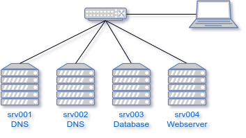

## practice: BIND

Use Vagrant and VirtualBox to set up the following scenario for DNS domain `linuxtrn.lan` with IP range 172.16.76.0/24. The scenario is illustrated in the following diagram:

Four VMs are attached to a common Host-Only or Internal network. The properties of the VMs are summarized in the following table:

| Host     | Alias          | IP              | Role                 |
| :------- | :------------- | :-------------- | :------------------- |
| `srv001` | `ns1`          | `172.16.76.251` | Primary DNS server   |
| `srv002` | `ns2`          | `172.16.76.252` | Secondary DNS server |
| `srv003` | `smtp`, `imap` | `172.16.76.3`   | Mail server          |
| `srv004` | `www`          | `172.16.76.4`   | Webserver            |

If you used a Host-Only network, the host machine can play the role of a client. In the case of an internal network, add another VM (e.g. a ready-made Linux Mint or Kali Linux VM) to the network as a client. In this scenario, routing is not considered. The VMs will have internet access through their NAT interfaces.

Remark that the VMS `srv003` and `srv004` should not necessarily exist in order to make te setup work. It could add to the realism of the scenario, though, since you can check whether entering `https://www.linuxtrn.lan` in a browser on a client will work.

1. Set up `srv001` (Debian or EL-based) and install BIND.

    - Discover the default configuration files. Can you define the purpose of each file?
    - Turn on the query log and start `tcpdump` to capture any traffic for port 53 (inbound and outbound).
    - Without changing the configuration, send a simple forward A query for any domain name from the VM itself. Do you expect this to work?
    - Try to determine from the logs or the `tcpdump` output whether the DNS server is configured as a *caching name server* with or without a *forwarder*.
    - Repeat the previous query. Do you see a difference in behavior? Can you explain why?

2. Ensure that the DNS server is available to all hosts on the local network. Don't forget to check firewall settings! Test whether you can resolve the domain name from another VM or a physical machine on the same network.

3. Add a *forwarder* and verify that it works. Try to use a public DNS server as a forwarder. Google's is well known, but there are others, too! Search for "free public dns servers" to get some suggestions.

    - Repeat the queries from the previous step. Do you see a difference in behavior?

4. Create a *primary forward lookup zone* named `linuxtrn.lan` with a variety of resource records, e.g. NS, MX, A, CNAME. Also add an A record for the `@` shorthand.

   - Use `dig` and `nslookup` to verify all resource records.
   - Optionally, write a test script that runs these queries automatically and compares the results with the expected values.

5. On the client machine, set the system DNS server to the IP address of `srv001` and test (from the terminal, or using your test script) whether you can:

    - Ping the VMs by their hostnames.
    - Resolve the domain name `linuxtrn.lan` to an IP address.
    - Query the name and mail servers for the domain `linuxtrn.lan`.
    - Perform a reverse lookup for any of the IP addresses in the domain.
    - Access the website on `srv004` by entering `https://www.linuxtrn.lan` in a browser (or alternatively use `curl` if your client VM does not have a graphical UI).

6. Set up `srv002`, install BIND and set up a *secondary* server for your primary zone.

    - Rewrite your test script so it can also run queries against the secondary server.
    - Ensure that you have the query logs on the primary server turned on and that you are watching its logs before you start the secondary server.
    - Observe the zone transfer process when you start the secondary server.
    - Check that the secondary server responds to the same queries as the primary.
    - Try an AXFR query from the secondary server to the primary server. Try the same from the client machine. Also try it from the primary server to the secondary server. Which work and which don't?
    - Make a change to one of the resource records on the primary server (e.g. change an IP address) and update your test script. Restart the primary server. Query both the primary and the secondary server to see if the change has been propagated.
    - It probably hasn't, unless you thought of incrementing the seral number in the zone file. Do that now and repeat the previous step. Check whether the zone transfer happens and that both primary and secondary server respond with the updated information.

