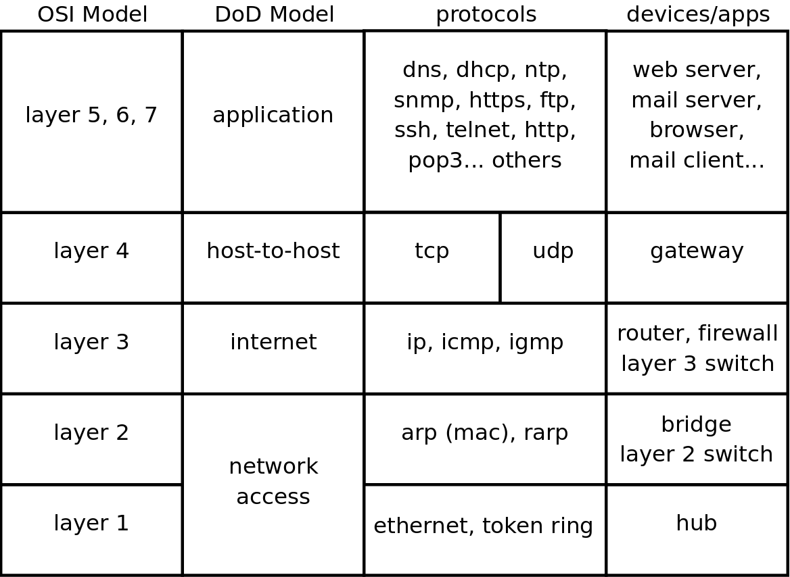
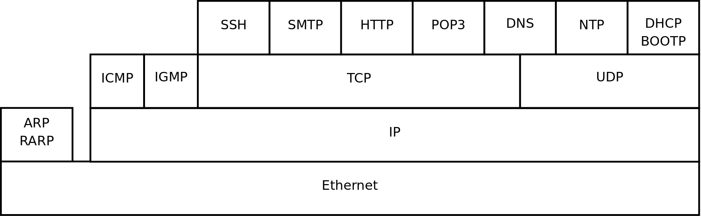
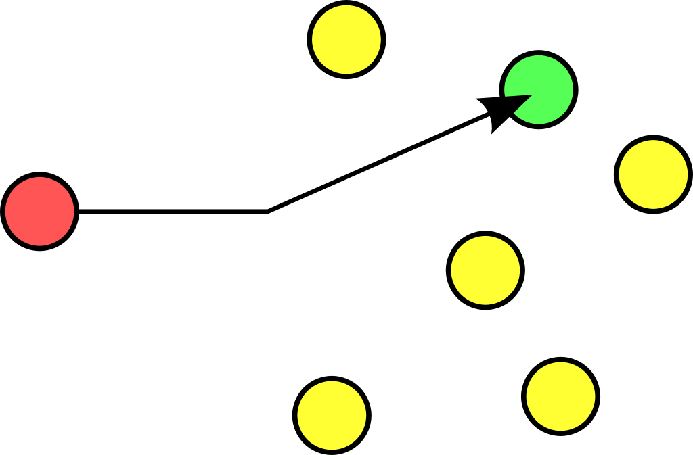
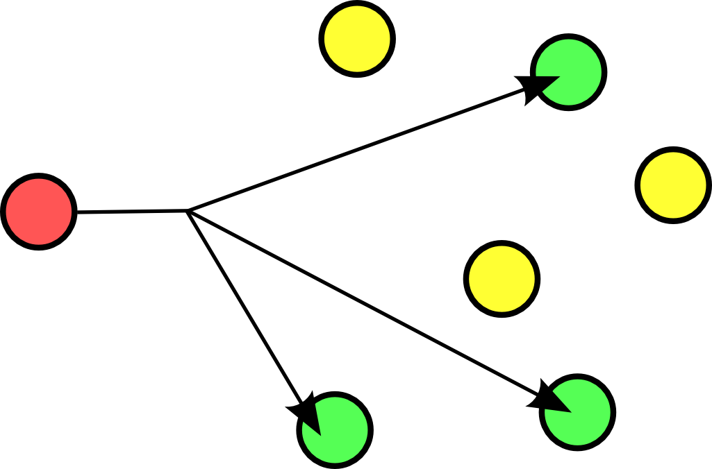
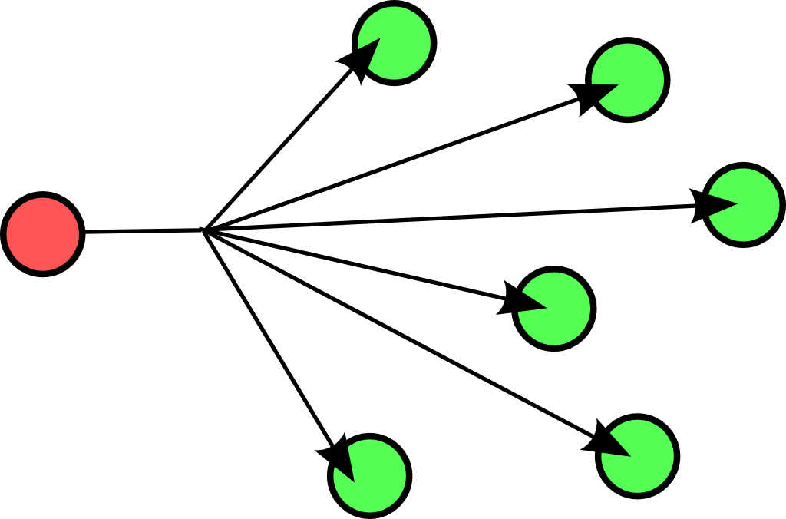
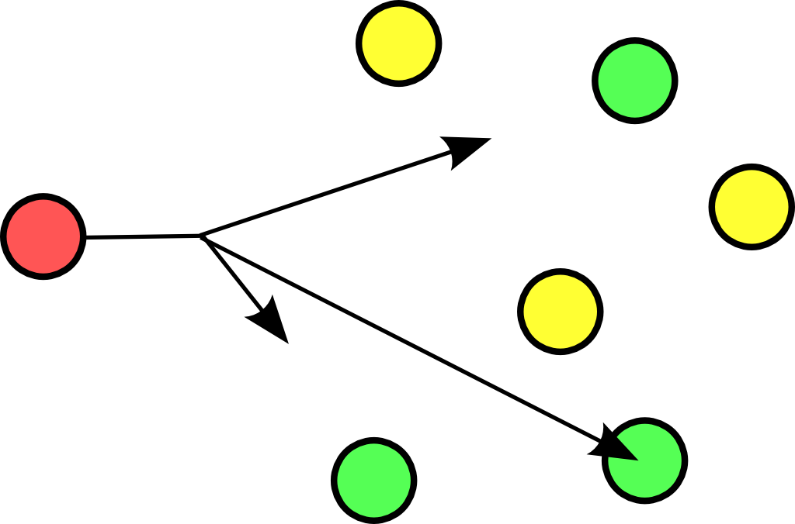
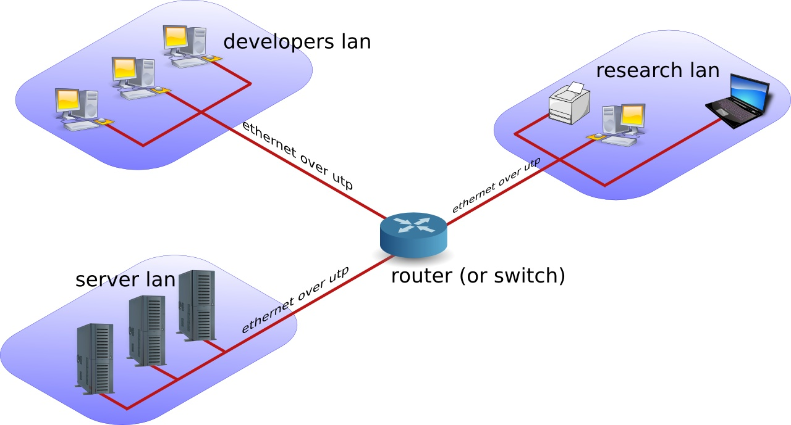
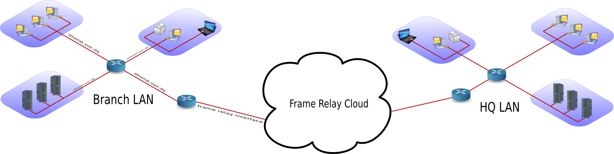

## network layers

### seven OSI layers

When talking about protocol layers, people usually mention the seven
layers of the `osi` protocol (Application, Presentation, Session,
Transport, Network, Data Link and Physical). We will discuss layers 2
and 3 in depth, and focus less on the other layers. The reason is that
these layers are important for understanding networks. You will hear
administrators use words like \"this is a layer 2 device\" or \"this is
a layer 3 broadcast\", and you should be able to understand what they
are talking about.

### four DoD layers

The `DoD` (or tcp/ip) model has only four layers, roughly mapping its
`network access layer` to OSI layers 1 and 2 (Physical and Datalink),
its `internet` (IP) layer to the OSI `network layer`, its `host-to-host`
(tcp, udp) layer to OSI layer 4 (transport) and its `application layer`
to OSI layers 5, 6 and 7.

Below an attempt to put OSI and DoD layers next to some protocols and
devices.

### short introduction to the physical layer

The physical layer, or `layer 1`, is all about voltage, electrical
signals and mechanical connections. Some networks might still use `coax`
cables, but most will have migrated to `utp` (cat 5 or better) with
`rj45` connectors.

Devices like `repeaters` and `hubs` are part of this layer. You cannot
use software to \'see\' a `repeater` or `hub` on the network. The only
thing these devices are doing is amplifying electrical signals on
cables. `Passive hubs` are multiport amplifiers that amplify an incoming
electrical signal on all other connections. `Active hubs` do this by
reading and retransmitting bits, without interpreting any meaning in
those bits.

Network technologies like `csma/cd` and `token ring` are defined on this
layer.

This is all we have to say about `layer 1` in this book.

### short introduction to the data link layer

The data link layer, or `layer 2` is about frames. A frame has a `crc`
(cyclic redundancy check). In the case of ethernet (802.3), each network
card is identifiable by a unique 48-bit `mac` address (media access
control address).

On this layer we find devices like bridges and switches. A bridge is
more intelligent than a hub because a `bridge` can make decisions based
on the mac address of computers. A `switch` also understands mac
addresses.

In this book we will discuss commands like `arp` and `ifconfig` to
explore this layer.

### short introduction to the network layer

`Layer 3` is about ip packets. This layer gives every host a unique
32-bit ip address. But `ip` is not the only protocol on this layer,
there is also icmp, igmp, ipv6 and more. A complete list can be found in
the `/etc/protocols` file.

On this layer we find devices like `routers` and layer 3 switches,
devices that know (and have) an ip address.

In tcp/ip this layer is commonly referred to as the `internet layer`.

### short introduction to the transport layer

We will discuss the `tcp` and `udp` protocols in the context of layer 4.
The DoD model calls this the host-to-host layer.

### layers 5, 6 and 7

The tcp/ip application layer includes layers 5, 6 and 7. Details on the
difference between these layers are out of scope of this course.

### network layers in this book

Stacking of layers in this book is based on the `Protocols in Frame`
explanation in the `wireshark` sniffer. When sniffing a dhcp packet, we
notice the following in the sniffer.

    [Protocols in Frame: eth:ip:udp:bootp]

Sniffing for ntp (Network Time Protocol) packets gives us this line,
which makes us conclude to put `ntp` next to `bootp` in the protocol
chart below.

    [Protocols in Frame: eth:ip:udp:ntp]

Sniffing an `arp` broadcast makes us put arp next to `ip`. All these
protocols are explained later in this chapter.

    [Protocols in Frame: eth:arp]

Below is a protocol chart based on wireshark\'s knowledge. It contains
some very common protocols that are discussed in this book. The chart
does not contain all protocols.

## unicast, multicast, broadcast, anycast

### unicast

A `unicast` communication originates from one computer and is destined
for exactly one other computer (or host). It is common for computers to
have many `unicast` communications.

### multicast

A `multicast` is destined for a group (of computers).

Some examples of `multicast` are Realplayer (.sdp files) and `ripv2` (a
routing protocol).

### broadcast

A `broadcast` is meant for everyone.

Typical example here is the BBC (British Broadcasting Corporation)
broadcasting to everyone. In datacommunications a broadcast is most
common confined to the `lan`.

Careful, a `layer 2 broadcast` is very different from a
`layer 3 broadcast`. A layer two broadcast is received by all network
cards on the same segment (it does not pass any router), whereas a layer
3 broadcast is received by all hosts in the same ip subnet.

### anycast

The `root name servers` of the internet use
`anycast`. An `anycast` signal goes the the
(geographically) nearest of a well defined group.

With thanks to the nice anonymous wikipedia contributor to put these
pictures in the public domain.

## lan-wan-man

The term `lan` is used for local area networks, as opposed to a `wan`
for wide area networks. The difference between the two is determined by
the `distance` between the computers, and not by the number of computers
in a network. Some protocols like `atm` are designed for use in a `wan`,
others like `ethernet` are designed for use in a `lan`.

### lan

A `lan` (Local Area Network) is a local network. This can
be one room, or one floor, or even one big building. We say `lan` as
long as computers are `close` to each other. You can also define a `lan`
when all computers are `ethernet` connected.

A `lan` can contain multiple smaller `lan`\'s. The picture below shows
three `lan`\'s that together make up one `lan`.

### man

A `man` (Metropolitan Area Network) is something inbetween
a `lan` and a `wan`, often comprising several buildings on the same
campus or in the same city. A `man` can use `fddi` or `ethernet` or
other protocols for connectivity.

### wan

A `wan` (Wide Area Network) is a network with a lot of
distance between the computers (or hosts). These hosts are often
connected by `leased lines`. A `wan` does not use `ethernet`, but
protocols like `fddi`, `frame relay`,
`ATM` or `X.25` to connect computers (and
networks).

The picture below shows a branch office that is connected through
`Frame Relay` with headquarters.

The acronym `wan` is also used for large surface area networks like the
`internet`.

`Cisco` is known for their `wan` technology. They make
`routers` that connect many `lan` networks using `wan`
protocols.

### pan-wpan

Your home network is called a `pan` (Personal Area
Network). A wireless `pan` is a `wpan`.

## internet - intranet - extranet

The `internet` is a global network. It connects many networks using the
`tcp/ip` protocol stack.

The origin of the `internet` is the `arpanet`. The `arpanet` was created
in 1969, that year only four computers were connected in the network. In
1971 the first `e-mail` was sent over the `arpanet`. `E-mail` took 75
percent of all `arpanet` traffic in 1973. 1973 was also the year `ftp`
was introduced, and saw the connection of the first European countries
(Norway and UK). In 2009 the internet was available to 25 percent of the
world population. In 2011 it is estimated that only a quarter of
internet webpages are in English.

An `intranet` is a private `tcp/ip` network. An `intranet` uses the same
protocols as the `internet`, but is only accessible to people from
within one organization.

An `extranet` is similar to an `intranet`, but some trusted
organizations (partners/clients/suppliers/\...) also get access.

## tcp/ip

### history of tcp/ip

In the Sixties development of the `tcp/ip` protocol stack was started by
the US Department of Defense. In the Eighties a lot of commercial
enterprises developed their own protocol stack: IBM created `sna`,
Novell had `ipx/spx`, Microsoft completed `netbeui` and Apple worked
with `appletalk`. All the efforts from the Eighties failed to survive
the Nineties. By the end of the Nineties, almost all computers in the
world were able to speak tcp/ip.

In my humble opinion, the main reason for the survival of `tcp/ip` over
all the other protocols is its openness. Everyone is free to develop and
use the tcp/ip protocol suite.

### rfc (request for comment)

The protocols that are used on the internet are defined in `rfc's`. An
rfc or `request for comment` describes the inner working of all internet
protocols. The `IETF` (Internet Engineering Task Force) is the sole
publisher of these protocols since 1986.

The official website for the rfc\'s is `http://www.rfc-editor.org`. This
website contains all rfc\'s in plain text, for example rfc2132 (which
defines dhcp and bootp) is accessible at
http://www.rfc-editor.org/rfc/rfc2132.txt.

### many protocols

For reliable connections, you use `tcp`, whereas
`udp` is connectionless but faster. The
`icmp` error messages are used by `ping`,
multicast groups are managed by `igmp`.

These protocols are visible in the protocol field of the ip header, and
are listed in the `/etc/protocols` file.

    student@linux:~$ grep tcp /etc/protocols 
    tcp     6       TCP             # transmission control protocol

### many services

Network cards are uniquely identified by their `mac address`, hosts by
their `ip address` and applications by their `port number`.

Common application level protocols like smtp, http, ssh, telnet and ftp
have fixed `port numbers`. There is a list of `port numbers` in
`/etc/services`.

    student@linux:~$ grep ssh /etc/services 
    ssh             22/tcp                 # SSH Remote Login Protocol
    ssh             22/udp

