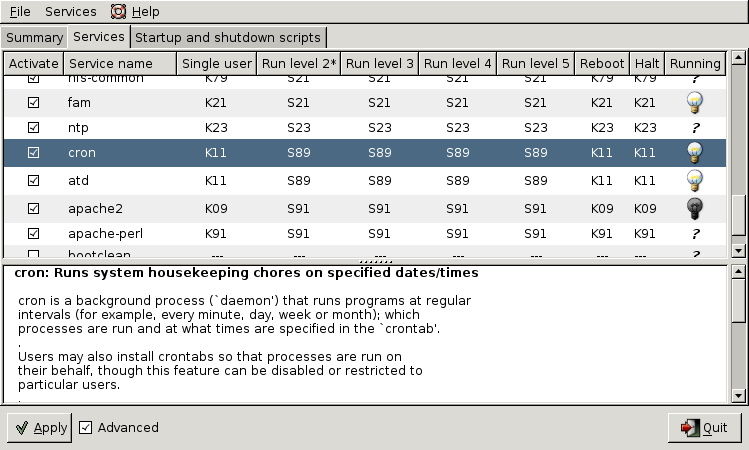

## system init(ialization)

### process id 1

The kernel receives system control from the bootloader. After a while
the kernel starts the `init daemon`. The `init` daemon
(`/sbin/init`) is the first daemon that is started and receives
`process id 1` (PID 1). `Init` never dies.

### configuration in /etc/inittab

When `/sbin/init` is started, it will first read its
configuration file `/etc/inittab`. In that file, it will
look for the value of initdefault (3 in the screenshot below).

    [student@linux ~]$ grep ^id /etc/inittab 
    id:3:initdefault:

### initdefault

The value found in `initdefault` indicates the default
`runlevel`. Some Linux distributions have a brief
description of runlevels in /etc/inittab, like here on Red Hat
Enterprise Linux 4.

    # Default runlevel. The runlevels used by RHS are:
    #   0 - halt (Do NOT set initdefault to this)
    #   1 - Single user mode
    #   2 - Multiuser, without NFS (The same as 3, if you don't have network)
    #   3 - Full multiuser mode
    #   4 - unused
    #   5 - X11
    #   6 - reboot (Do NOT set initdefault to this)

`Runlevel 0` means the system is shutting down. `Runlevel 1` is used for
troubleshooting, only the root user can log on, and only at the console.
`Runlevel 3` is typical for servers, whereas `runlevel 5` is typical for
desktops (graphical logon). Besides runlevels 0, 1 and 6, the use may
vary depending on the distribution. Debian and derived Linux systems
have full network and GUI logon on runlevels 2 to 5. So always verify
the proper meaning of runlevels on your system.

### sysinit script

#### /etc/rc.d/rc.sysinit

The next line in `/etc/inittab` in Red Hat and derivatives is the
following.

    si::sysinit:/etc/rc.d/rc.sysinit

This means that independent of the selected runlevel, `init` will run
the `/etc/rc.d/rc.sysinit` script. This script initializes
hardware, sets some basic environment, populates
`/etc/mtab` while mounting file systems, starts swap and
more.

    [student@linux ~]$ egrep -e"^# Ini" -e"^# Sta" -e"^# Che" /etc/rc.d/rc.sysinit
    # Check SELinux status
    # Initialize hardware
    # Start the graphical boot, if necessary; /usr may not be mounted yet...
    # Initialiaze ACPI bits
    # Check filesystems
    # Start the graphical boot, if necessary and not done yet.
    # Check to see if SELinux requires a relabel
    # Initialize pseudo-random number generator
    # Start up swapping.
    # Initialize the serial ports.

*That `egrep` command could also have been written with
`grep` like this :*

    grep "^# \(Ini\|Sta\|Che\)".

#### /etc/init.d/rcS

Debian has the following line after `initdefault`.

    si::sysinit:/etc/init.d/rcS

The `/etc/init.d/rcS` script will always run on Debian
(independent of the selected runlevel). The script is actually running
all scripts in the `/etc/rcS.d/` directory in alphabetical
order.

    root@linux:~# cat /etc/init.d/rcS 
    #! /bin/sh
    #
    # rcS
    #
    # Call all S??* scripts in /etc/rcS.d/ in numerical/alphabetical order
    #

    exec /etc/init.d/rc S

### rc scripts

Init will continue to read `/etc/inittab` and meets this section on
Debian Linux.

    l0:0:wait:/etc/init.d/rc 0
    l1:1:wait:/etc/init.d/rc 1
    l2:2:wait:/etc/init.d/rc 2
    l3:3:wait:/etc/init.d/rc 3
    l4:4:wait:/etc/init.d/rc 4
    l5:5:wait:/etc/init.d/rc 5
    l6:6:wait:/etc/init.d/rc 6

On Red Hat Enterprise Linux it is identical except `init.d` is `rc.d`.

    l0:0:wait:/etc/rc.d/rc 0
    l1:1:wait:/etc/rc.d/rc 1
    l2:2:wait:/etc/rc.d/rc 2
    l3:3:wait:/etc/rc.d/rc 3
    l4:4:wait:/etc/rc.d/rc 4
    l5:5:wait:/etc/rc.d/rc 5
    l6:6:wait:/etc/rc.d/rc 6

In both cases, this means that `init` will start the rc script with the
runlevel as the only parameter. Actually `/etc/inittab`
has fields separated by colons. The second field determines the runlevel
in which this line should be executed. So in both cases, only one line
of the seven will be executed, depending on the runlevel set by
`initdefault`.

### rc directories

When you take a look any of the `/etc/rcX.d/` directories,
then you will see a lot of (links to) scripts who's name start with
either uppercase K or uppercase S.

    [root@linux rc3.d]# ls -l | tail -4
    lrwxrwxrwx 1 root root 19 Oct 11  2008 S98haldaemon -> ../init.d/haldaemon
    lrwxrwxrwx 1 root root 19 Oct 11  2008 S99firstboot -> ../init.d/firstboot
    lrwxrwxrwx 1 root root 11 Jan 21 04:16 S99local -> ../rc.local
    lrwxrwxrwx 1 root root 16 Jan 21 04:17 S99smartd -> ../init.d/smartd

The `/etc/rcX.d/` directories only contain links to scripts in
`/etc/init.d/`. Links allow for the script to have a different name.
When entering a runlevel, all scripts that start with uppercase K or
uppercase S will be started in alphabetical order. Those that start with
K will be started first, with `stop` as the only parameter. The
remaining scripts with S will be started with `start` as the only
parameter.

All this is done by the `/etc/rc.d/rc` script on Red Hat
and by the `/etc/init.d/rc` script on Debian.

### mingetty

#### mingetty in /etc/inittab

Almost at the end of `/etc/inittab` there is a section to
start and `respawn` several `mingetty`
daemons.

    [root@linux ~]# grep getty /etc/inittab 
    # Run gettys in standard runlevels
    1:2345:respawn:/sbin/mingetty tty1
    2:2345:respawn:/sbin/mingetty tty2
    3:2345:respawn:/sbin/mingetty tty3
    4:2345:respawn:/sbin/mingetty tty4
    5:2345:respawn:/sbin/mingetty tty5
    6:2345:respawn:/sbin/mingetty tty6

#### mingetty and /bin/login

This `/sbin/mingetty` will display a message on a virtual
console and allow you to type a userid. Then it executes the
`/bin/login` command with that userid. The `/bin/login`
program will verify whether that user exists in
`/etc/passwd` and prompt for (and verify) a password. If
the password is correct, `/bin/login` passes control to the shell listed
in `/etc/passwd`.

#### respawning mingetty

The mingetty daemons are started by `init` and watched until they die
(user exits the shell and is logged out). When this happens, the `init`
daemon will `respawn` a new mingetty. So even if you
`kill` a mingetty daemon, it will be restarted automatically.

This example shows that init respawns mingetty daemons. Look at the
PID's of the last two mingetty processes.

    [root@linux ~]# ps -C mingetty
      PID TTY          TIME CMD
     2407 tty1     00:00:00 mingetty
     2408 tty2     00:00:00 mingetty
     2409 tty3     00:00:00 mingetty
     2410 tty4     00:00:00 mingetty
     2411 tty5     00:00:00 mingetty
     2412 tty6     00:00:00 mingetty
                

When we `kill` the last two mingettys, then `init` will
notice this and start them again (with a different PID).

    [root@linux ~]# kill 2411 2412
    [root@linux ~]# ps -C mingetty
      PID TTY          TIME CMD
     2407 tty1     00:00:00 mingetty
     2408 tty2     00:00:00 mingetty
     2409 tty3     00:00:00 mingetty
     2410 tty4     00:00:00 mingetty
     2821 tty5     00:00:00 mingetty
     2824 tty6     00:00:00 mingetty
                

#### disabling a mingetty

You can disable a mingetty for a certain tty by removing the runlevel
from the second field in its line in /etc/inittab. Don't forget to tell
init about the change of its configuration file with
`kill -1 1`.

The example below shows how to disable mingetty on tty3 to tty6 in
runlevels 4 and 5.

    [root@linux ~]# grep getty /etc/inittab 
    # Run gettys in standard runlevels
    1:2345:respawn:/sbin/mingetty tty1
    2:2345:respawn:/sbin/mingetty tty2
    3:23:respawn:/sbin/mingetty tty3
    4:23:respawn:/sbin/mingetty tty4
    5:23:respawn:/sbin/mingetty tty5
    6:23:respawn:/sbin/mingetty tty6
                

## daemon or demon ?

A `daemon` is a process that runs in background, without a
link to a GUI or terminal. Daemons are usually started at system boot,
and stay alive until the system shuts down. In more recent technical
writings, daemons are often refered to as `services`.

Unix `daemons` are not to be confused with demons.
`Evi Nemeth`, co-author of the UNIX System Administration
Handbook has the following to say about daemons:

*Many people equate the word \"daemon\" with the word \"demon\",
implying some kind of satanic connection between UNIX and the
underworld. This is an egregious misunderstanding. \"Daemon\" is
actually a much older form of \"demon\"; daemons have no particular bias
towards good or evil, but rather serve to help define a person's
character or personality. The ancient Greeks' concept of a \"personal
daemon\" was similar to the modern concept of a \"guardian angel\"
...*.

## starting and stopping daemons

The K and S scripts are links to the real scripts in
`/etc/init.d/`. These can also be used when the system is
running to start and stop daemons (or services). Most of them accept the
following parameters: start, stop, restart, status.

For example in this screenshot we restart the samba daemon.

    root@linux:~# /etc/init.d/samba restart
     * Stopping Samba daemons...                               [ OK ] 
     * Starting Samba daemons...                               [ OK ]

You can achieve the same result on RHEL/Fedora with the
`service` command.

    [root@linux ~]# service smb restart
    Shutting down SMB services:                                [  OK  ]
    Shutting down NMB services:                                [  OK  ]
    Starting SMB services:                                     [  OK  ]
    Starting NMB services:                                     [  OK  ]

You might also want to take a look at `chkconfig`,
`update-rc.d`.

## chkconfig

The purpose of `chkconfig` is to relieve system
administrators of manually managing all the links and scripts in
`/etc/init.d` and `/etc/rcX.d/`.

### chkconfig \--list

Here we use `chkconfig` to list the status of a service in the different
runlevels. You can see that the `crond` daemon (or service) is only
activated in runlevels 2 to 5.

    [root@linux ~]# chkconfig --list crond
    crond           0:off   1:off   2:on    3:on    4:on    5:on    6:off

When you compare the screenshot above with the one below, you can see
that `off` equals to a K link to the script, whereas `on` equals to an S
link.

    [root@linux etc]# find ./rc?.d/ -name \*crond -exec ls -l {} \;|cut -b40-
    ./rc0.d/K60crond -> ../init.d/crond
    ./rc1.d/K60crond -> ../init.d/crond
    ./rc2.d/S90crond -> ../init.d/crond
    ./rc3.d/S90crond -> ../init.d/crond
    ./rc4.d/S90crond -> ../init.d/crond
    ./rc5.d/S90crond -> ../init.d/crond
    ./rc6.d/K60crond -> ../init.d/crond

### runlevel configuration

Here you see how to use chkconfig to disable (or enable) a service in a
certain runlevel.

This screenshot shows how to disable `crond` in runlevel 3.

    [root@linux ~]# chkconfig --level 3 crond off
    [root@linux ~]# chkconfig --list crond
    crond           0:off   1:off   2:on    3:off   4:on    5:on    6:off

This screenshot shows how to enable `crond` in runlevels 3 and 4.

    [root@linux ~]# chkconfig --level 34 crond on
    [root@linux ~]# chkconfig --list crond
    crond           0:off   1:off   2:on    3:on    4:on    5:on    6:off

### chkconfig configuration

Every script in `/etc/init.d/` can have (comment) lines to
tell chkconfig what to do with the service. The line with `# chkconfig:`
contains the runlevels in which the service should be started (2345),
followed by the priority for start (90) and stop (60).

    [root@linux ~]# head -9 /etc/init.d/crond | tail -5
    # chkconfig: 2345 90 60
    # description: cron is a standard UNIX program that runs user-specified
    #              programs at periodic scheduled times. vixie cron adds a
    #              number of features to the basic UNIX cron, including better
    #              security and more powerful configuration options.

### enable and disable services

Services can be enabled or disabled in all runlevels with one command.
Runlevels 0, 1 and 6 are always stopping services (or calling the
scripts with `stop`) even when their name starts with uppercase S.

    [root@linux ~]# chkconfig crond off
    [root@linux ~]# chkconfig --list crond
    crond           0:off   1:off   2:off   3:off   4:off   5:off   6:off
    [root@linux ~]# chkconfig crond on
    [root@linux ~]# chkconfig --list crond 
    crond           0:off   1:off   2:on    3:on    4:on    5:on    6:off

## update-rc.d

### about update-rc.d

The Debian equivalent of `chkconfig` is called
`update-rc.d`. This tool is designed for use in scripts,
if you prefer a graphical tool then look at `bum`.

When there are existing links in `/etc/rcX.d/` then `update-rc.d` does
not do anything. This is to avoid that post installation scripts using
`update-rc.d` are overwriting changes made by a system administrator.

    root@linux:~# update-rc.d cron remove
    update-rc.d: /etc/init.d/cron exists during rc.d purge (use -f to force)

As you can see in the next screenshot, nothing changed for the cron
daemon.

    root@linux:~# find /etc/rc?.d/ -name '*cron' -exec ls -l {} \;|cut -b44-
    /etc/rc0.d/K11cron -> ../init.d/cron
    /etc/rc1.d/K11cron -> ../init.d/cron
    /etc/rc2.d/S89cron -> ../init.d/cron
    /etc/rc3.d/S89cron -> ../init.d/cron
    /etc/rc4.d/S89cron -> ../init.d/cron
    /etc/rc5.d/S89cron -> ../init.d/cron
    /etc/rc6.d/K11cron -> ../init.d/cron

### removing a service

Here we remove `cron` from all runlevels. Remember that the proper way
to disable a service is to put K scripts oin all runlevels!

    root@linux:~# update-rc.d -f cron remove
     Removing any system startup links for /etc/init.d/cron ...
       /etc/rc0.d/K11cron
       /etc/rc1.d/K11cron
       /etc/rc2.d/S89cron
       /etc/rc3.d/S89cron
       /etc/rc4.d/S89cron
       /etc/rc5.d/S89cron
       /etc/rc6.d/K11cron
    root@linux:~# find /etc/rc?.d/ -name '*cron' -exec ls -l {} \;|cut -b44-
    root@linux:~#

### enable a service

This screenshot shows how to use `update-rc.d` to enable a service in
runlevels 2, 3, 4 and 5 and disable the service in runlevels 0, 1 and 6.

    root@linux:~# update-rc.d cron defaults
     Adding system startup for /etc/init.d/cron ...
       /etc/rc0.d/K20cron -> ../init.d/cron
       /etc/rc1.d/K20cron -> ../init.d/cron
       /etc/rc6.d/K20cron -> ../init.d/cron
       /etc/rc2.d/S20cron -> ../init.d/cron
       /etc/rc3.d/S20cron -> ../init.d/cron
       /etc/rc4.d/S20cron -> ../init.d/cron
       /etc/rc5.d/S20cron -> ../init.d/cron

### customize a service

And here is an example on how to set your custom configuration for the
cron daemon.

    root@linux:~# update-rc.d -n cron start 11 2 3 4 5 . stop 89 0 1 6 .
     Adding system startup for /etc/init.d/cron ...
       /etc/rc0.d/K89cron -> ../init.d/cron
       /etc/rc1.d/K89cron -> ../init.d/cron
       /etc/rc6.d/K89cron -> ../init.d/cron
       /etc/rc2.d/S11cron -> ../init.d/cron
       /etc/rc3.d/S11cron -> ../init.d/cron
       /etc/rc4.d/S11cron -> ../init.d/cron
       /etc/rc5.d/S11cron -> ../init.d/cron

## bum

This screenshot shows `bum` in advanced mode.

## runlevels

### display the runlevel

You can see your current runlevel with the `runlevel` or
`who -r` commands.

The runlevel command is typical Linux and will output the previous and
the current runlevel. If there was no previous runlevel, then it will
mark it with the letter N.

    [root@linux ~]# runlevel 
    N 3

The history of `who -r` dates back to Seventies Unix, it still works on
Linux.

    [root@linux ~]# who -r
             run-level 3  Jul 28 09:15                   last=S

### changing the runlevel

You can switch to another runlevel with the `telinit`
command. On Linux `/sbin/telinit` is usually a (hard) link
to `/sbin/init`.

This screenshot shows how to switch from runlevel 2 to runlevel 3
without reboot.

    root@linux:~# runlevel 
    N 2
    root@linux:~# init 3
    root@linux:~# runlevel 
    2 3

### /sbin/shutdown

The `shutdown` command is used to properly shut down a
system.

Common switches used with `shutdown` are `-a`, `-t`, `-h` and `-r`.

The `-a` switch forces `/sbin/shutdown` to use `/etc/shutdown.allow`.
The `-t` switch is used to define the number of seconds between the
sending of the `TERM` signal and the `KILL`
signal. The `-h` switch halts the system instead of changing to
runlevel 1. The `-r` switch tells `/sbin/shutdown` to reboot after
shutting down.

This screenshot shows how to use `shutdown` with five seconds between
TERM and KILL signals.

    root@linux:~# shutdown -t5 -h now

The `now` is the time argument. This can be `+m` for the number of
minutes to wait before shutting down (with `now` as an alias for `+0`.
The command will also accept hh:mm instead of `+m`.

### halt, reboot and poweroff

The binary `/sbin/reboot` is the same as `/sbin/halt` and
`/sbin/poweroff`. Depending on the name we use to call the command, it
can behave differently.

When in runlevel 0 or 6 `halt`, `reboot` and
`poweroff` will tell the kernel to `halt`, `reboot` or
`poweroff` the system.

When not in runlevel 0 or 6, typing `reboot` as root actually calls the
`shutdown` command with the `-r` switch and typing `poweroff` will
switch off the power when halting the system.

### /var/log/wtmp

`halt`, `reboot` and `poweroff` all write to
`/var/log/wtmp`. To look at `/var/log/wtmp`, we need to
use th `last`.

    [root@linux ~]# last | grep reboot
    reboot   system boot  2.6.18-128.el5   Fri May 29 11:44   (192+05:01)
    reboot   system boot  2.6.18-128.el5   Wed May 27 12:10    (06:49)
    reboot   system boot  2.6.18-128.el5   Mon May 25 19:34   (1+15:59)
    reboot   system boot  2.6.18-128.el5   Mon Feb  9 13:20   (106+21:13)

### Ctrl-Alt-Del

When `rc` is finished starting all those scripts, `init`
will continue to read /etc/inittab. The next line is about what to do
when the user hits `Ctrl-Alt-Delete` on the keyboard.

Here is what Debian 4.0 does.

    root@linux:~# grep -i ctrl /etc/inittab 
    # What to do when CTRL-ALT-DEL is pressed.
    ca:12345:ctrlaltdel:/sbin/shutdown -t1 -a -r now

Which is very similar to the default Red Hat Enterprise Linux 5.2
action.

    [root@linux ~]# grep -i ctrl /etc/inittab 
    # Trap CTRL-ALT-DELETE
    ca::ctrlaltdel:/sbin/shutdown -t3 -r now

One noticable difference is that Debian forces shutdown to use
`/etc/shutdown.allow`, where Red Hat allows everyone to
invoke `shutdown` pressing `Ctrl-Alt-Delete`.

### UPS and loss of power

    [root@linux ~]# grep ^p /etc/inittab 
    pf::powerfail:/sbin/shutdown -f -h +2 "Power Failure; System Shutting Down"
    pr:12345:powerokwait:/sbin/shutdown -c "Power Restored; Shutdown Cancelled"

It will read commands on what to execute in case of `powerfailure`,
`powerok` and `Ctrl-Alt-Delete`. The init process never
stops keeping an eye on power failures and that triple key combo.

    root@linux:~# grep ^p /etc/inittab 
    pf::powerwait:/etc/init.d/powerfail start
    pn::powerfailnow:/etc/init.d/powerfail now
    po::powerokwait:/etc/init.d/powerfail stop

## systemd

It is likely that `systemd` will replace all the standard
init/runlevel/rc functionality. Both Red Hat and Debian have decided in
2014 that `systemd` will be replacing `init` in future releases
(RHEL7/CentOS8 and Debian 8).

The screenshot below shows `systemd` running as `pid 1` on RHEL7.

    [root@linux ~]# ps fax | grep systemd | cut -c1-76
        1 ?        Ss     0:01 /usr/lib/systemd/systemd --switched-root --system
      505 ?        Ss     0:00 /usr/lib/systemd/systemd-journald
      545 ?        Ss     0:00 /usr/lib/systemd/systemd-udevd
      670 ?        Ss     0:00 /usr/lib/systemd/systemd-logind
      677 ?        Ssl    0:00 /bin/dbus-daemon --system --address=systemd: --no
     2662 pts/1    S+     0:00          \_ grep --color=auto systemd
    [root@linux ~]#

Debian 8 (not yet released in September 2014) uses parts of `systemd`,
but still has `init` as `pid 1`.

    root@linux:~# ps fax | grep systemd
     2042 ?        S      0:00 /sbin/cgmanager --daemon -m name=systemd
    10127 pts/4    S+     0:00          |                   \_ grep systemd
     2777 ?        S      0:00 /lib/systemd/systemd-logind
    root@linux:~#

### systemd targets

The first command to learn is `systemctl list-units --type=target` (or
the shorter version `systemctl -t target`). It will show you the
different targets on the system.

    [root@linux ~]# systemctl list-units --type=target
    UNIT                LOAD   ACTIVE SUB    DESCRIPTION
    basic.target        loaded active active Basic System
    cryptsetup.target   loaded active active Encrypted Volumes
    getty.target        loaded active active Login Prompts
    graphical.target    loaded active active Graphical Interface
    local-fs-pre.target loaded active active Local File Systems (Pre)
    local-fs.target     loaded active active Local File Systems
    multi-user.target   loaded active active Multi-User System
    network.target      loaded active active Network
    nfs.target          loaded active active Network File System Server
    paths.target        loaded active active Paths
    remote-fs.target    loaded active active Remote File Systems
    slices.target       loaded active active Slices
    sockets.target      loaded active active Sockets
    swap.target         loaded active active Swap
    sysinit.target      loaded active active System Initialization
    timers.target       loaded active active Timers

    LOAD   = Reflects whether the unit definition was properly loaded.
    ACTIVE = The high-level unit activation state, i.e. generalization of SUB.
    SUB    = The low-level unit activation state, values depend on unit type.

    16 loaded units listed. Pass --all to see loaded but inactive units, too.
    To show all installed unit files use 'systemctl list-unit-files'.
    [root@linux ~]#

Targets are the replacement of runlevels and define specific points to
reach when booting the system. For example the `graphical.target` is
reached when you get a graphical interface, and the `nfs.target`
requires a running nfs server.

To switch to a target (for example `multi-user.target`), we now use
`systemctl isolate` (instead of the equivalent `init 3` to change the
runlevel).

    [root@linux ~]# ps fax | wc -l
    169
    [root@linux ~]# systemctl isolate multi-user.target
    [root@linux ~]# ps fax | wc -l
    129
    [root@linux ~]#

To change the default target, we again use this `systemctl` command
(instead of editing the `/etc/inittab` file).

    [root@linux ~]# systemctl enable multi-user.target --force
    rm '/etc/systemd/system/default.target'
    ln -s '/usr/lib/systemd/system/multi-user.target' '/etc/systemd/system/default\
    .target'
    [root@linux ~]#

This command removed the file `/etc/systemd/system/default.target` and
replaced it with a symbolic link to the `multi-user-.target` target.

### systemd dependencies

Dependencies are no longer defined by alfabetical order of running
scripts, but by configuration in `/etc/systemd/system/`. For example
here are the required services for the `multi-user.target` on Red Hat
Enterprise 7.

    [root@linux ~]# ls /etc/systemd/system/multi-user.target.wants/
    abrt-ccpp.service     hypervkvpd.service      postfix.service
    abrtd.service         hypervvssd.service      remote-fs.target
    abrt-oops.service     irqbalance.service      rhsmcertd.service
    abrt-vmcore.service   ksm.service             rngd.service
    abrt-xorg.service     ksmtuned.service        rpcbind.service
    atd.service           libstoragemgmt.service  rsyslog.service
    auditd.service        libvirtd.service        smartd.service
    avahi-daemon.service  mdmonitor.service       sshd.service
    chronyd.service       ModemManager.service    sysstat.service
    crond.service         NetworkManager.service  tuned.service
    cups.path             nfs.target              vmtoolsd.service
    [root@linux ~]#

Debian8 is not fully migrated yet.

    root@linux:~# ls /etc/systemd/system/multi-user.target.wants/ 
    anacron.service       binfmt-support.service  pppd-dns.service  ssh.service
    atd.service           fancontrol.service      remote-fs.target
    avahi-daemon.service  lm-sensors.service      rsyslog.service

Typical `rc scripts` are replaced with services. Issue the
`systemctl list-units -t service --all` (or `systemctl -at service`) to
get a list of all services on your system.

    [root@linux ~]# systemctl -at service | head -5 | column -t | cut -c1-78
    UNIT                 LOAD    ACTIVE    SUB      DESCRIPTION
    abrt-ccpp.service    loaded  active    exited   Install      ABRT     coredump
    abrt-oops.service    loaded  active    running  ABRT         kernel   log
    abrt-vmcore.service  loaded  inactive  dead     Harvest      vmcores  for
    abrt-xorg.service    loaded  active    running  ABRT         Xorg     log
    [root@linux ~]#

And here an example on how to see the status of the `sshd` service.

    [root@linux ~]# systemctl status sshd.service
    sshd.service - OpenSSH server daemon
       Loaded: loaded (/usr/lib/systemd/system/sshd.service; enabled)
       Active: active (running) since Wed 2014-09-10 13:42:21 CEST; 55min ago
     Main PID: 1400 (sshd)
       CGroup: /system.slice/sshd.service
               --1400 /usr/sbin/sshd -D

    Sep 10 13:42:21 rhel7 systemd[1]: Started OpenSSH server daemon.
    Sep 10 13:42:21 rhel7 sshd[1400]: Server listening on 0.0.0.0 port 22.
    Sep 10 13:42:21 rhel7 sshd[1400]: Server listening on :: port 22.
    [root@linux ~]#

### systemd services

The `chkconfig` and `service` commands are considered 'legacy'. They
are replaced with `systemctl`.

This screenshot shows the new way to start and stop a service.

    [root@linux ~]# systemctl start crond.service
    [root@linux ~]# systemctl show crond.service | grep State
    LoadState=loaded
    ActiveState=active
    SubState=running
    UnitFileState=enabled
    [root@linux ~]# systemctl stop crond.service
    [root@linux ~]# systemctl show crond.service | grep State
    LoadState=loaded
    ActiveState=inactive
    SubState=dead
    UnitFileState=enabled
    [root@linux ~]#

And here is the new way to stop and disable a service.

    [root@linux ~]# systemctl stop crond.service
    [root@linux ~]# systemctl disable crond.service
    rm '/etc/systemd/system/multi-user.target.wants/crond.service'
    [root@linux ~]# systemctl show crond.service | grep State
    LoadState=loaded
    ActiveState=inactive
    SubState=dead
    UnitFileState=disabled
    [root@linux ~]#

This screenshot shows how to enable and start the service again.

    [root@linux ~]# systemctl enable crond.service
    ln -s '/usr/lib/systemd/system/crond.service' '/etc/systemd/system/multi-user.\
    target.wants/crond.service'
    [root@linux ~]# systemctl start crond.service
    [root@linux ~]# systemctl show crond.service | grep State
    LoadState=loaded
    ActiveState=active
    SubState=running
    UnitFileState=enabled
    [root@linux ~]#

### systemd signalling

You can also use `systemd` to `kill` problematic services.

    [root@linux ~]# systemctl show crond.service | grep State
    LoadState=loaded
    ActiveState=active
    SubState=running
    UnitFileState=enabled
    [root@linux ~]# systemctl kill -s SIGKILL crond.service
    [root@linux ~]# systemctl show crond.service | grep State
    LoadState=loaded
    ActiveState=failed
    SubState=failed
    UnitFileState=enabled
    [root@linux ~]#

### systemd shutdown

The `poweroff`, `halt` and `reboot` commands are considered legacy now
and are handeld by `systemctl`. The table below shows the legacy
commands on the left and their new `systemd` equivalent on the right.

  ---------------------------------------------------------
  legacy command         systemd command
  ---------------------- ----------------------------------
  poweroff               systemctl poweroff

  reboot                 systemctl reboot

  halt                   systemctl halt

  pm-suspend             systemctl suspend

  pm-hibernate           systemctl hibernate
  ---------------------------------------------------------

  : systemd power management

### remote systemd

The `systemctl` utility has a buil-in remote control providing there is
an `ssh daemon` running on the remote system.

This screenshot shows how to use `systemctl` to verify a service on an
other RHEL server.

    [root@linux ~]# systemctl -H root@192.168.1.65 status sshd
    root@192.168.1.65's password:
    sshd.service - OpenSSH server daemon
       Loaded: loaded (/usr/lib/systemd/system/sshd.service; enabled)
       Active: active (running) since Thu 2014-09-11 13:04:10 CEST; 16min ago
      Process: 1328 ExecStartPre=/usr/sbin/sshd-keygen (code=exited, status=0/SUCCE\
    SS)
     Main PID: 1363 (sshd)
       CGroup: /system.slice/sshd.service
    [root@linux ~]#

### there is more systemd

There are other tools...

    systemd-analyze                 systemd-loginctl
    systemd-ask-password            systemd-machine-id-setup
    systemd-cat                     systemd-notify
    systemd-cgls                    systemd-nspawn
    systemd-cgtop                   systemd-run
    systemd-coredumpctl             systemd-stdio-bridge
    systemd-delta                   systemd-sysv-convert
    systemd-detect-virt             systemd-tmpfiles
    systemd-inhibit                 systemd-tty-ask-password-agent

For example `systemd-analyze blame` will give you an overview of the
time it took for each service to boot.

    [root@linux ~]# systemd-analyze blame | head
              1.977s firewalld.service
              1.096s tuned.service
               993ms postfix.service
               939ms iprinit.service
               925ms vboxadd-x11.service
               880ms firstboot-graphical.service
               839ms accounts-daemon.service
               829ms network.service
               822ms iprupdate.service
               795ms boot.mount
    [root@linux ~]#

