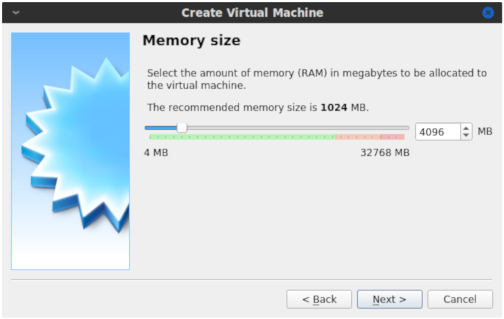
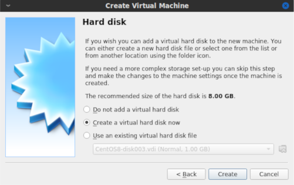
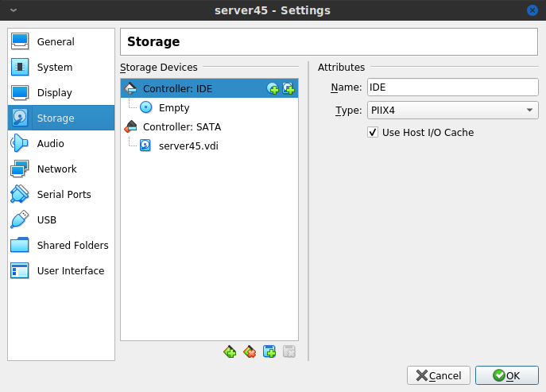
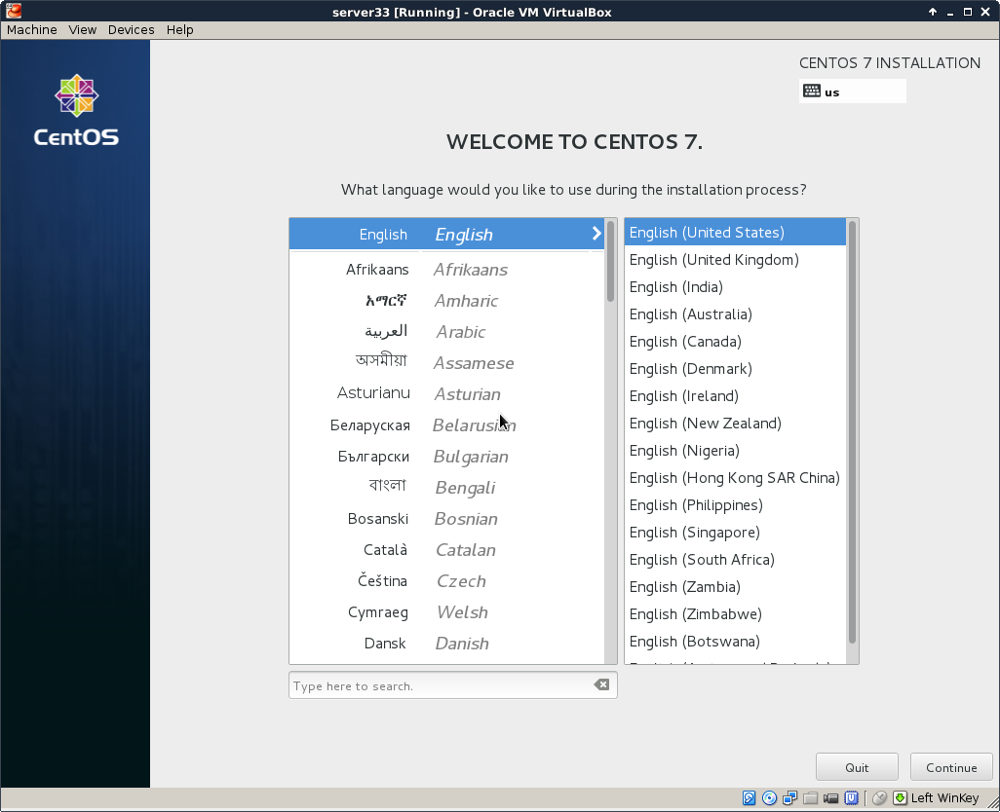
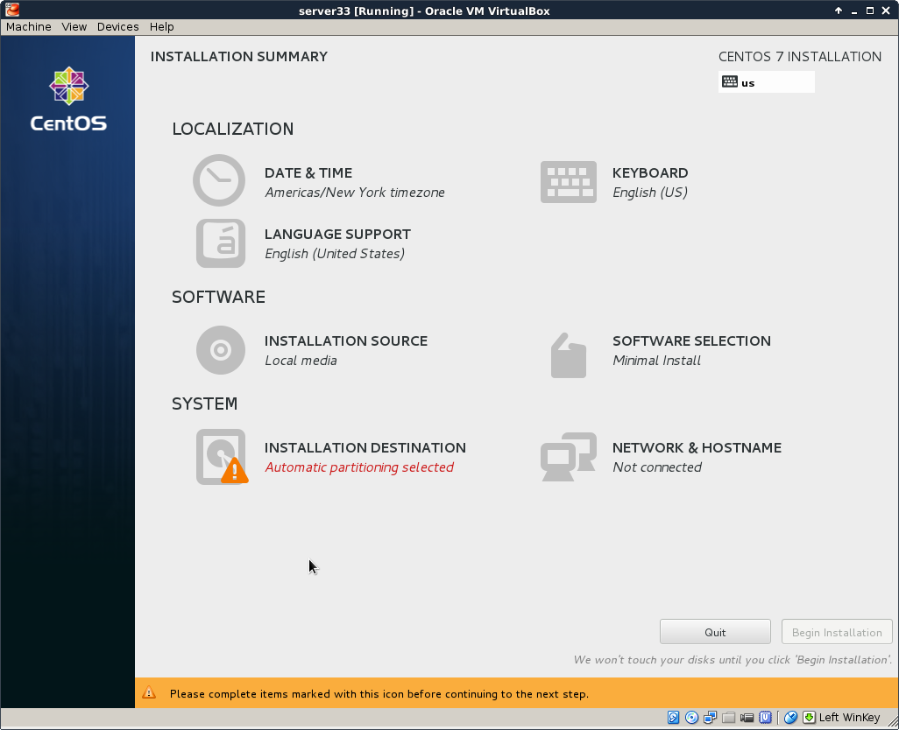
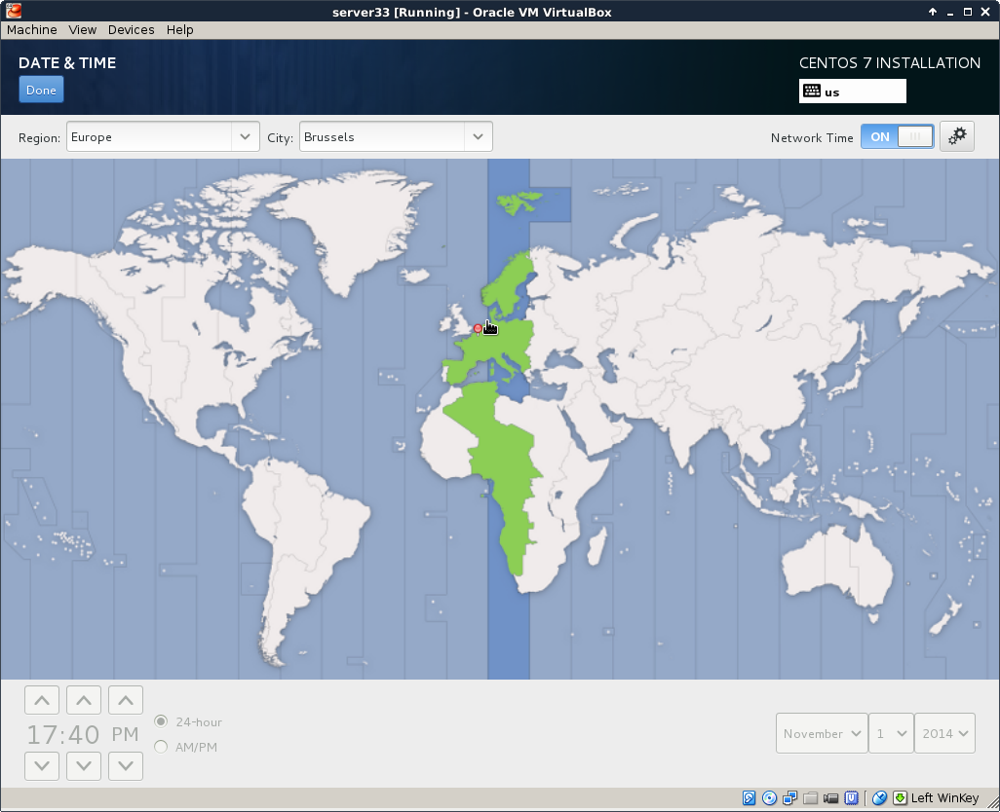
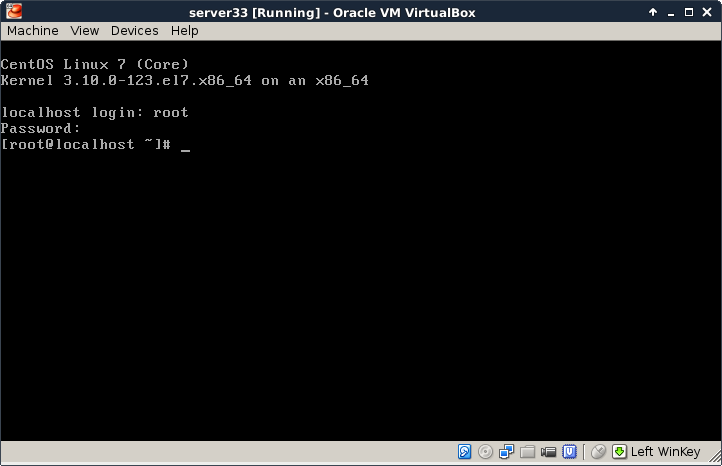

## download a CentOS 7 image

This demonstration uses a laptop computer with `Virtualbox` to install
`CentOS 7` as a virtual machine. The first task is to download an `.iso`
image of `CentOS 7`.

The `CentOS 7` website looks like this today (November 2014). They
change the look regularly, so it may look different when you visit it.

You can download a full DVD, which allows for an off line installation
of a graphical `CentOS 7` desktop. You can select this because it should
be easy and complete, and should get you started with a working
`CentOS 7` virtual machine.

But I clicked instead on \'alternative downloads\', selected `CentOS 7`
and `x86_64` and ended up on a `mirror list`. Each mirror is a server
that contains copies of `CentOS 7` media. I selected a Belgian mirror
because I currently am in Belgium.

There is again the option for full DVD\'s and more. This demonstration
will use the `minimal` .iso file, because it is much smaller in size.
The download takes a couple of minutes.

Verify the size of the file after download to make sure it is complete.
Probably a right click on the file and selecting \'properties\' (if you
use Windows or Mac OSX).

I use Linux on the laptop already:

    paul@debian8:~$ ls -lh CentOS-7.0-1406-x86_64-Minimal.iso
    -rw-r--r-- 1 paul paul 566M Nov  1 14:45 CentOS-7.0-1406-x86_64-Minimal.iso

Do not worry if you do no understand the above command. Just try to make
sure that the size of this file is the same as the size that is
mentioned on the `CentOS 7` website.

## Virtualbox

This screenshot shows up when I start Virtualbox. I already have four
virtual machines, you might have none.

Below are the steps for creating a new virtual machine. Start by
clicking `New` and give your machine a name (I chose `server33`). Click
`Next`.

A Linux computer without graphical interface will run fine on
`half a gigabyte` of RAM.

A Linux virtual machine will need a `virtual hard drive`.

Any format will do for our purpose, so I left the default `vdi`.

The default `dynamically allocated` type will save disk space (until we
fill the virtual disk up to 100 percent). It makes the virtual machine a
bit slower than `fixed size`, but the `fixed size` speed improvement is
not worth it for our purpose.

The name of the virtual disk file on the host computer will be
`server33.vdi` in my case (I left it default and it uses the vm name).
Also 16 GB should be enough to practice Linux. The file will stay much
smaller than 16GB, unless you copy a lot of files to the virtual
machine.

You should now be back to the start screen of `Virtualbox`. If all went
well, then you should see the machine you just created in the list.

After finishing the setup, we go into the `Settings` of our virtual
machine and attach the `.iso` file we downloaded before. Below is the
default screenshot.

This is a screenshot with the `.iso` file properly attached.

## CentOS 7 installing

The screenshots below will show every step from starting the virtual
machine for the first time (with the .iso file attached) until the first
logon.

You should see this when booting, otherwise verify the attachment of the
.iso file form the previous steps. Select
`Test this media and install CentOS 7`.

Carefully select the language in which you want your `CentOS`. I always
install operating systems in English, even though my native language is
not English.

Also select the right keyboard, mine is a US qwerty, but yours may be
different.

You should arrive at a summary page (with one or more warnings).

Start by configuring the network. During this demonstration I had a DHCP
server running at 192.168.1.42, yours is probably different. Ask someone
(a network administator ?) for help if this step fails.

Select your time zone, and activate `ntp`.

Choose a mirror that is close to you. If you can\'t find a local mirror,
then you can copy the one from this screenshot (it is a general `CentOS`
mirror).

It can take a couple of seconds before the mirror is verified.

I did not select any software here (because I want to show it all in
this training).

After configuring network, location, software and all, you should be
back on this page. Make sure there are no warnings anymore (and that you
made the correct choice everywhere).

You can enter a `root password` and create a `user account` while the
installation is downloading from the internet. This is the longest step,
it can take several minutes (or up to an hour if you have a slow
internet connection).

If you see this, then the installation was successful.

Time to reboot the computer and start `CentOS 7` for the first time.

This screen will appear briefly when the virtual machines starts. You
don\'t have to do anything.

After a couple of seconds, you should see a logon screen. This is called
a `tty` or a `getty`. Here you can type `root` as username. The
`login process` will then ask your password (nothing will appear on
screen when you type your password).

And this is what it looks like after logon. You are logged on to your
own Linux machine, very good.

All subsequent screenshots will be text only, no images anymore.

For example this screenshot shows three commands being typed on my new
CentOS 7 install.

    [root@localhost ~]# who am i
    root     pts/0        2014-11-01 22:14
    [root@localhost ~]# hostname
    localhost.localdomain
    [root@localhost ~]# date
    Sat Nov  1 22:14:37 CET 2014

When using `ssh` the same commands will give this screenshot:

    [root@localhost ~]# who am i
    root     pts/0        2014-11-01 21:00 (192.168.1.35)
    [root@localhost ~]# hostname
    localhost.localdomain
    [root@localhost ~]# date
    Sat Nov  1 22:10:04 CET 2014
    [root@localhost ~]#

If the last part is a bit too fast, take a look at the next topic
`CentOS 7 first logon`.

## CentOS 7 first logon

All you have to log on, after finishing the installation, is this screen
in Virtualbox.

This is workable to learn Linux, and you will be able to practice a lot.
But there are more ways to access your virtual machine, the next
chapters discuss some of these and will also introduce some basic system
configuration.

### setting the hostname

Setting the hostname is a simple as changing the `/etc/hostname` file.
As you can see here, it is set to `localhost.localdomain` by default.

    [root@localhost ~]# cat /etc/hostname
    localhost.localdomain

You could do `echo server33.netsec.local > /etc/hostname` followed by a
`reboot`. But there is also the new `CentOS 7` way of setting a new
hostname.

    [root@localhost ~]# nmtui

The above command will give you a menu to choose from with a
`set system hostname` option. Using this `nmtui` option will edit the
`/etc/hostname` file for you.

    [root@localhost ~]# cat /etc/hostname
    server33.netsec.local
    [root@localhost ~]# hostname
    server33.netsec.local
    [root@localhost ~]# dnsdomainname
    netsec.local

For some reason the documentation on the `centos.org` and
`docs.redhat.com` websites tell you to also execute this command:

    [root@localhost ~]# systemctl restart systemd-hostnamed

## Virtualbox network interface

By default `Virtualbox` will connect your virtual machine over a `nat`
interface. This will show up as a 10.0.2.15 (or similar).

    [root@server33 ~]# ip a
    1: lo: <LOOPBACK,UP,LOWER_UP> mtu 65536 qdisc noqueue state UNKNOWN
        link/loopback 00:00:00:00:00:00 brd 00:00:00:00:00:00
        inet 127.0.0.1/8 scope host lo
           valid_lft forever preferred_lft forever
        inet6 ::1/128 scope host
           valid_lft forever preferred_lft forever
    2: enp0s3: <BROADCAST,MULTICAST,UP,LOWER_UP> mtu 1500 qdisc pfifo_fast s\
    tate UP qlen 1000
        link/ether 08:00:27:1c:f5:ab brd ff:ff:ff:ff:ff:ff
        inet 10.0.2.15/24 brd 10.0.2.255 scope global dynamic enp0s3
           valid_lft 86399sec preferred_lft 86399sec
        inet6 fe80::a00:27ff:fe1c:f5ab/64 scope link
           valid_lft forever preferred_lft forever

You can change this to `bridge` (over your wi-fi or over the ethernet
cable) and thus make it appear as if your virtual machine is directly on
your local network (receiving an ip address from your real dhcp server).

You can make this change while the vm is running, provided that you
execute this command:

    [root@server33 ~]# systemctl restart network
    [root@server33 ~]# ip a s dev enp0s3
    2: enp0s3: <BROADCAST,MULTICAST,UP,LOWER_UP> mtu 1500 qdisc pfifo_fast s\
    tate UP qlen 1000
        link/ether 08:00:27:1c:f5:ab brd ff:ff:ff:ff:ff:ff
        inet 192.168.1.110/24 brd 192.168.1.255 scope global dynamic enp0s3
           valid_lft 7199sec preferred_lft 7199sec
        inet6 fe80::a00:27ff:fe1c:f5ab/64 scope link
           valid_lft forever preferred_lft forever
    [root@server33 ~]#

## configuring the network

The new way of changing network configuration is through the `nmtui`
tool. If you want to manually play with the files in
`/etc/sysconfig/network-scripts` then you will first need to verify (and
disable) `NetworkManager` on that interface.

Verify whether an interface is controlled by `NetworkManager` using the
`nmcli` command (connected means managed bu NM).

    [root@server33 ~]# nmcli dev status
    DEVICE  TYPE      STATE      CONNECTION
    enp0s3  ethernet  connected  enp0s3
    lo      loopback  unmanaged  --

Disable `NetworkManager` on an interface (enp0s3 in this case):

    echo 'NM_CONTROLLED=no' >> /etc/sysconfig/network-scripts/ifcfg-enp0s3

You can restart the network without a reboot like this:

    [root@server33 ~]# systemctl restart network

Also, forget `ifconfig` and instead use `ip a`.

    [root@server33 ~]# ip a s dev enp0s3 | grep inet
        inet 192.168.1.110/24 brd 192.168.1.255 scope global dynamic enp0s3
        inet6 fe80::a00:27ff:fe1c:f5ab/64 scope link
    [root@server33 ~]#

## adding one static ip address

This example shows how to add one static ip address to your computer.

    [root@server33 ~]# nmtui edit enp0s3

In this interface leave the IPv4 configuration to automatic, and add an
ip address just below.

              IPv4 CONFIGURATION <Automatic>                         <Hide>
              Addresses 10.104.33.32/16__________ <Remove>

Execute this command after exiting `nmtui`.

    [root@server33 ~]# systemctl restart network

And verify with `ip` (not with `ifconfig`):

    [root@server33 ~]# ip a s dev enp0s3 | grep inet
        inet 192.168.1.110/24 brd 192.168.1.255 scope global dynamic enp0s3
        inet 10.104.33.32/16 brd 10.104.255.255 scope global enp0s3
        inet6 fe80::a00:27ff:fe1c:f5ab/64 scope link
    [root@server33 ~]#

## package management

Even with a network install, `CentOS 7` did not install the latest
version of some packages. Luckily there is only one command to run (as
root). This can take a while.

    [root@server33 ~]# yum update
    Loaded plugins: fastestmirror
    Loading mirror speeds from cached hostfile
     * base: centos.weepeetelecom.be
     * extras: centos.weepeetelecom.be
     * updates: centos.weepeetelecom.be
    Resolving Dependencies
    --> Running transaction check
    ---> Package NetworkManager.x86_64 1:0.9.9.1-13.git20140326.4dba720.el7 \
    will be updated
    ... (output truncated)

You can also use `yum` to install one or more packages. Do not forget to
run `yum update` from time to time.

    [root@server33 ~]# yum update -y && yum install vim -y
    Loaded plugins: fastestmirror
    Loading mirror speeds from cached hostfile
     * base: centos.weepeetelecom.be
    ... (output truncated)

Refer to the package management chapter for more information on
installing and removing packages.

## logon from Linux and MacOSX

You can now open a terminal on Linux or MacOSX and use `ssh` to log on
to your virtual machine.

    paul@debian8:~$ ssh root@192.168.1.110
    root@192.168.1.110's password:
    Last login: Sun Nov  2 11:53:57 2014
    [root@server33 ~]# hostname
    server33.netsec.local
    [root@server33 ~]#

## logon from MS Windows

There is no `ssh` installed on MS Windows, but you can download
`putty.exe` from
`http://www.chiark.greenend.org.uk/~sgtatham/putty/download.html` (just
Google it).

Use `putty.exe` as shown in this screenshot (I saved the ip address by
giving it a name \'server33\' and presing the \'save\' button).

The first time you will get a message about keys, accept this (this is
explained in the ssh chapter).

Enter your userid (or root) and the correct password (nothing will
appear on the screen when typing a password).

