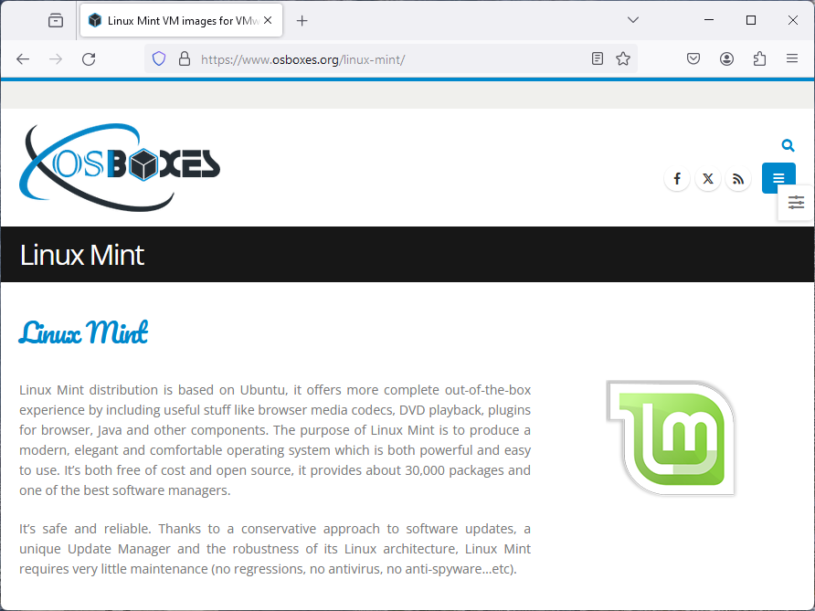
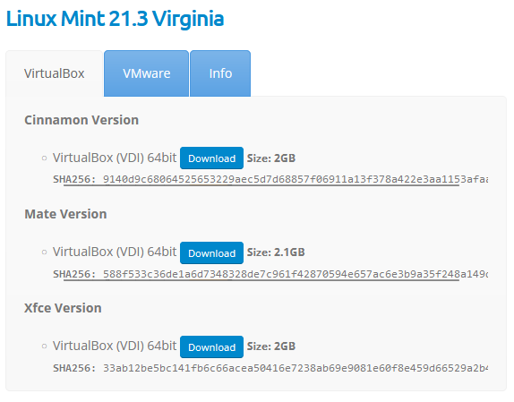
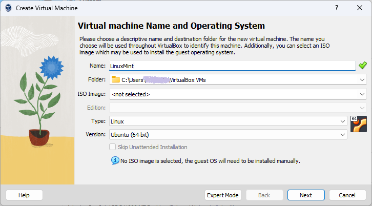
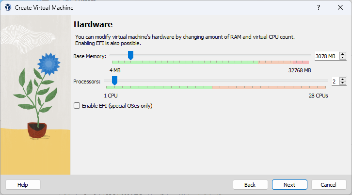
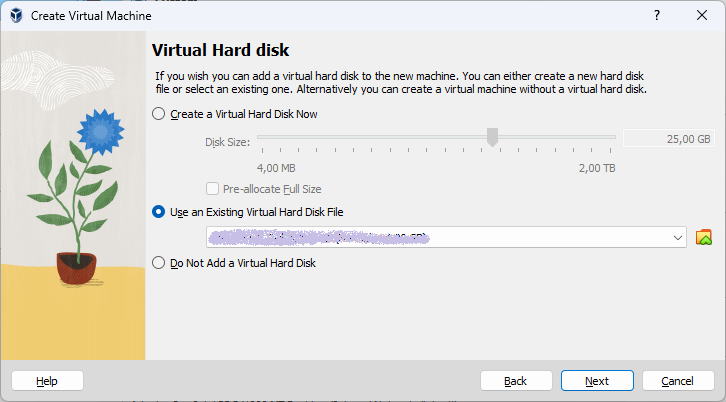
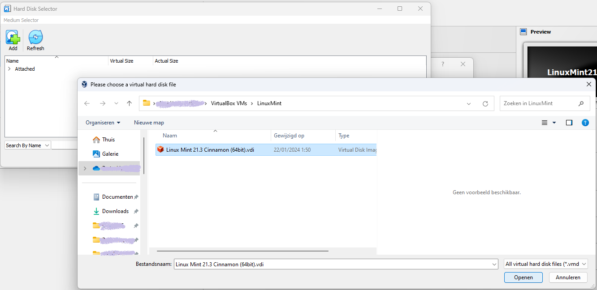
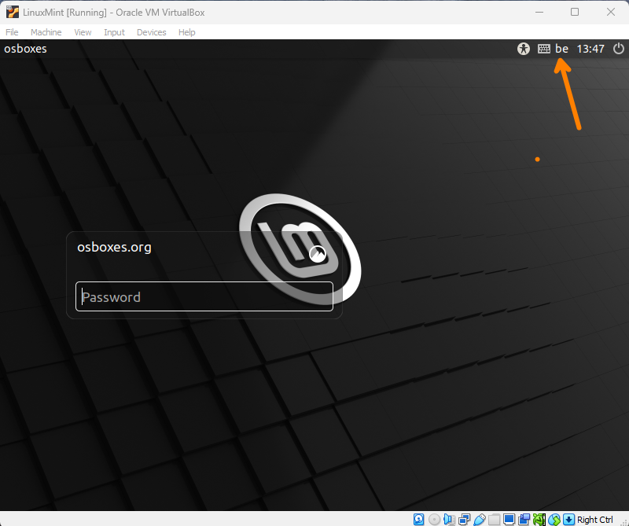
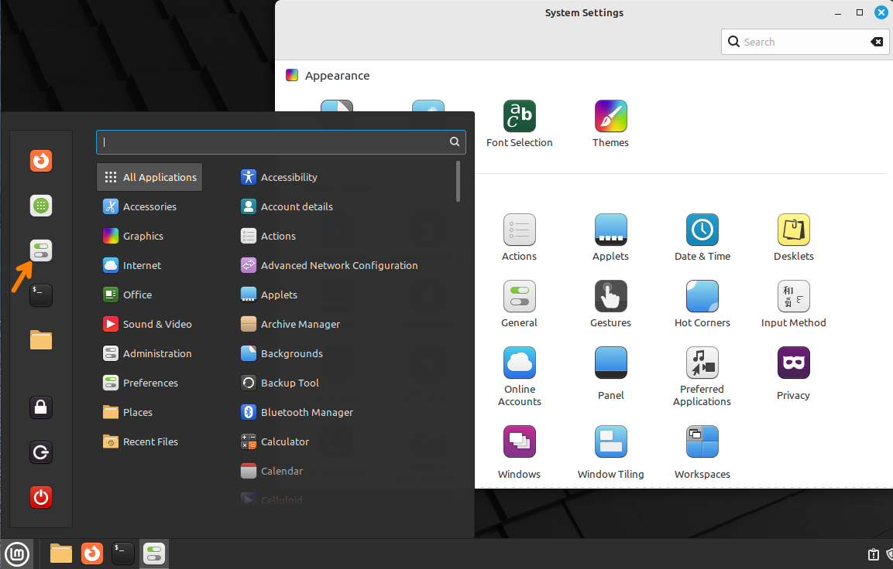
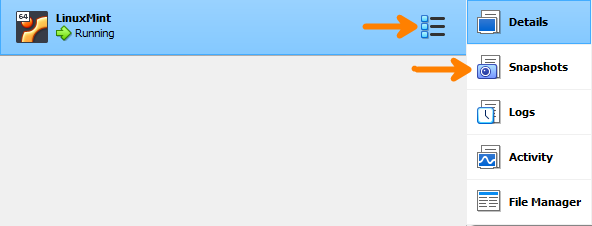

## Downloading a Linux VM image

Start by going to the [OSBoxes website](https://www.osboxes.org/). This website is the initiative computer science student only identified under the name or handle *Umair*. The website offers a variety of ready-to-use Linux/Unix guest operating systems for VirtualBox or VMware.

Browse the website or use the search box to find a Linux distribution that you would like to try. In this example, we will use a Linux Mint image.

Scroll down to the download section, select the VirtualBox tab and click the download link for the Cinnamon Version.

The downloaded file is in the .7z (7zip) format that contains a .vdi (Virtual Disk Image) file. VirtualBox can use this file as the hard disk for a virtual machine. First, we'll need to create that virtual machine.

## Creating a VirtualBox VM

Start VirtualBox and click the *New* button. In the dialog that appears, enter a name for the virtual machine, e.g. *LinuxMint*. In our case, that's the only setting that needs to be changed in this step.

Click *Next* to proceed to the next step. In the next dialog, select the amount of memory (RAM) that you want to allocate to the virtual machine. The default value is 2048 MB, which should be sufficient. However, if you have more memory available, you can increase this value. You can also assign CPU cores to the virtual machine. The default value of 1 is fine, but by increasing this value, you can improve the performance of the virtual machine.

Click *Next* to proceed to the next step, selecting a Virtual Hard disk. Since we already have a .vdi file, we can use that as the hard disk for the virtual machine. Now is a good time to go to put the downloaded .vdi file in the correct location. By now, VirtualBox has created a folder for the virtual machine. All VMs are usually kept in a directory called *VirtualBox VMs* in your home directory. Inside that directory, there should now be a subdirectory with the name of the virtual machine. Move or copy the downloaded .vdi file into that directory.

Go back to the VirtualBox dialog and select *Use an existing virtual hard disk file*.

Click the folder icon on the right to open the *Hard Disk Selector dialog*. Here, click the Add button. The file dialog that opens will probably open in the correct directory and you should see the .vdi file. If not, navigate to the directory where you put the .vdi file. Select the file and click *Open*.

You're back in the Hard Disk Selector dialog. The .vdi file is shown under the category *Not Attached*. Ensure it's selected and click *Choose*. You're now back in the New Virtual Machine Wizard. Click *Next* to go to the final step showing a summary of the chosen settings. Click *Finish* to create the virtual machine.

In the main VirtualBox window, you should now see the new virtual machine in the list of VMs. It's ready to boot, but if you want to change some of the settings, you still can. For example, you could increase the video memory to the maximum value or enable 3D acceleration. Another useful change is to add a second network adapter attached to a Host-only Adapter or internal network. This will later allow you to create a virtual network with multiple VMs.

If you're happy with the settings, click the *Start* button to boot the virtual machine.

## Logging in, initial configuration

After booting, you're greeted by the Linux Mint login screen. The default username is always *osboxes* and the password is *osboxes.org*. **Pay attention!** All osboxes-VMs are configured with a qwerty keyboard layout. Luckily, you can change the layout from the menu in the top right corner of the screen. For example, here we selected the *Belgian* layout.

After logging in, you're presented with the Linux Mint desktop. Congratulations! You now have a virtual machine that you can use to learn Linux. You can start by exploring the desktop environment, the file manager, the web browser, the terminal, and the software manager. The big advantage of using a virtual machine is that you can experiment without the risk of breaking your computer. You can always start over by deleting the virtual machine and creating a new one.

To access the system settings, click the Linux Mint logo in the bottom left corner and select *System Settings* icon (indicated in the screenshot below). Here you can change the desktop background, the theme, the screensaver, the power settings, the keyboard layout, and much more.

Feel free to use and configure the system as you like. We do have a few recommendations for you:

- **Disable the screensaver and automatic screen lock** (System Settings > Screensaver). This can be annoying when you're working in the VM and the screen locks after a few minutes of inactivity.
- If you have another **keyboard layout** than the default US QWERTY, change the layout to your preference and/or add alternative layouts (System Settings > Keyboard > Layouts).
- Optionally, **change your password** to one that you choose (System Settings > Account details > Password). If you're afraid of forgetting your password, here's a tip: open the VirtualBox VM Settings and go to General and then the Description tab. Here you can add a note with your password.
- In the VirtualBox window that contains your VM, open the **Devices menu** and select *Shared Clipboard* > *Bidirectional*. This will allow you to copy and paste text between your host system and the VM.
- After a few minutes, the *Update Manager* will be launched automatically. You can use this tool to **update the system** and install the latest security patches. Follow the instructions shown. If you're asked for a password, remember it's *osboxes.org*. After the updates are installed, you will probably be asked to restart the system. You can do this now or later.
- When you have configured your system to your liking, you can **create a snapshot of the VM**. This is a point-in-time backup of the VM that you can revert to if you mess up the system. To create a snapshot, go to the VirtualBox main window, ensure your Linux Mint VM is selected and click the settings icon right of the VM name. In the menu that pops up, select Snapshots.

    

## Shut down the VM

When you're done using the VM, you can shut it down. There are four good ways to stop the VM and one particularly bad one.

1. You can click the *Linux Mint Start Menu* button in the bottom left corner, then the *Shut Down* button (the red icon on the bottom). In the dialog that appears, select *Shut Down*.
2. You can open a terminal and enter the command `poweroff`.
3. You can click the close button (the X in the top right corner of the VM window). In the dialog that appears, select *Send the shutdown signal*. Your VM should show the dialog as in the previous method where you can select *Shut Down*.
4. You can click the close button of the VM window and select *Save the machine state*. This is basically the equivalent of closing your laptop lid. The next time you start the VM, it will resume from where you left off.
5. You can click the close button of the VM window and select *Power off the machine*. This is the bad way to shut down the VM because it's the equivalent of pulling the power plug of a physical computer. It's not recommended to do this, since it may cause corruption of the file system when a write operation was in progress at the time of the power off.

