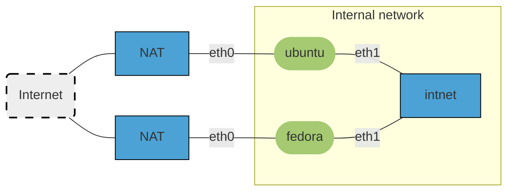

## solutions: network configuration

### network diagram



- Hosts are the nodes with a green background (the Fedora and Ubuntu VMs).
- Switches/LANs are the rectangular nodes with a dark blue background. In this case, the switches are not real devices, but virtualized networks within VirtualBox.
    - The Ubuntu and Fedora VMs are each connected to the Internet via a separate NAT adapter with interface `eth0` (the predictable name would be `enp0s3`)
    - They are both connected with `eth1` (predictable name `enp0s8`) to a shared internal network.

### IP address table

Remark that the MAC and IPv6 addresses will be different on your system. The IPv4 addresses should be the same, as we will configure them, or their value is predictable.

|  Host  | Iface |    MAC address    | IPv4 address/mask |      IPv6 address/mask      |    GW    |
| :----: | :---: | :---------------: | :---------------: | :-------------------------: | :------: |
| ubuntu | eth0  | 08:00:27:87:8e:29 |   10.0.2.15/24    | fe80::a00:27ff:fe87:8e29/64 | 10.0.2.2 |
|        | eth1  | 08:00:27:df:a2:e4 | 192.168.100.1/24  |   fd00:1337:cafe:1::1/64    |    --    |
| fedora | eth0  | 08:00:27:d5:0f:5d |   10.0.2.15/24    | fe80::e0e:40bf:aa93:ed7d/64 | 10.0.2.2 |
|        | eth1  | 08:00:27:7e:c1:07 | 192.168.100.2/24  |   fd00:1337:cafe:1::2/64    |    --    |

### solutions

1. Log in to each VM and look up the following information:

    - MAC addresses of each network interface: general command: `ip a`, or specific: `ip -br l show dev eth0` or `eth1`

        On Ubuntu:

        ```console
        vagrant@ubuntu:~$ ip a
        1: lo: <LOOPBACK,UP,LOWER_UP> mtu 65536 qdisc noqueue state UNKNOWN group default qlen 1000
            link/loopback 00:00:00:00:00:00 brd 00:00:00:00:00:00
            inet 127.0.0.1/8 scope host lo
            valid_lft forever preferred_lft forever
            inet6 ::1/128 scope host
            valid_lft forever preferred_lft forever
        2: eth0: <BROADCAST,MULTICAST,UP,LOWER_UP> mtu 1500 qdisc fq_codel state UP group default qlen 1000
            link/ether 08:00:27:87:8e:29 brd ff:ff:ff:ff:ff:ff
            altname enp0s3
            inet 10.0.2.15/24 metric 100 brd 10.0.2.255 scope global dynamic eth0
            valid_lft 80602sec preferred_lft 80602sec
            inet6 fe80::a00:27ff:fe87:8e29/64 scope link
            valid_lft forever preferred_lft forever
        3: eth1: <BROADCAST,MULTICAST> mtu 1500 qdisc noop state DOWN group default qlen 1000
            link/ether 08:00:27:df:a2:e4 brd ff:ff:ff:ff:ff:ff
            altname enp0s8
        vagrant@ubuntu:~$ ip -br l show dev eth0
        eth0             UP             08:00:27:87:8e:29 <BROADCAST,MULTICAST,UP,LOWER_UP>
        vagrant@ubuntu:~$ ip -br l show dev eth1
        eth1             DOWN           08:00:27:df:a2:e4 <BROADCAST,MULTICAST>
        ```

        On Fedora:

        ```console
        [vagrant@fedora ~]$ ip a
        1: lo: <LOOPBACK,UP,LOWER_UP> mtu 65536 qdisc noqueue state UNKNOWN group default qlen 1000
            link/loopback 00:00:00:00:00:00 brd 00:00:00:00:00:00
            inet 127.0.0.1/8 scope host lo
            valid_lft forever preferred_lft forever
            inet6 ::1/128 scope host noprefixroute
            valid_lft forever preferred_lft forever
        2: eth0: <BROADCAST,MULTICAST,UP,LOWER_UP> mtu 1500 qdisc fq_codel state UP group default qlen 1000
            link/ether 08:00:27:d5:0f:5d brd ff:ff:ff:ff:ff:ff
            altname enp0s3
            inet 10.0.2.15/24 brd 10.0.2.255 scope global dynamic noprefixroute eth0
            valid_lft 80257sec preferred_lft 80257sec
            inet6 fe80::e0e:40bf:aa93:ed7d/64 scope link noprefixroute
            valid_lft forever preferred_lft forever
        3: eth1: <BROADCAST,MULTICAST,UP,LOWER_UP> mtu 1500 qdisc fq_codel state UP group default qlen 1000
            link/ether 08:00:27:7e:c1:07 brd ff:ff:ff:ff:ff:ff
            altname enp0s8
        [vagrant@fedora ~]$ ip -br l show dev eth0
        eth0             UP             08:00:27:d5:0f:5d <BROADCAST,MULTICAST,UP,LOWER_UP>
        [vagrant@fedora ~]$ ip -br l show dev eth1
        eth1             UP             08:00:27:7e:c1:07 <BROADCAST,MULTICAST,UP,LOWER_UP>
        ```

    - IPv4 and IPv6 addresses and network masks of each network interface

        See the output of `ip a` above. To get specific information, use `ip -br a show dev eth0` or `eth1`.

        ```console
        vagrant@ubuntu:~$ ip -br a show dev eth0
        eth0             UP             10.0.2.15/24 metric 100 fe80::a00:27ff:fe87:8e29/64
        vagrant@ubuntu:~$ ip -br a show dev eth1
        eth1             DOWN
        ```

        ```console
        [vagrant@fedora ~]$ ip -br a show dev eth0
        eth0             UP             10.0.2.15/24 fe80::e0e:40bf:aa93:ed7d/64
        [vagrant@fedora ~]$ ip -br a show dev eth1
        eth1             UP             fe80::e3fd:c3c5:a67d:e676/64
        ```

    - The public IP address of your VMs, lab environment or home network

        ```console
        [vagrant@fedora ~]$ curl ifconfig.me
        94.12.34.56
        ```

        The result is the same on the Ubuntu VM.

    - The routing table and default gateway

        ```console
        vagrant@ubuntu:~$ ip r
        default via 10.0.2.2 dev eth0 proto dhcp src 10.0.2.15 metric 100
        10.0.2.0/24 dev eth0 proto kernel scope link src 10.0.2.15 metric 100
        10.0.2.2 dev eth0 proto dhcp scope link src 10.0.2.15 metric 100
        10.0.2.3 dev eth0 proto dhcp scope link src 10.0.2.15 metric 100
        ```

        ```console
        [vagrant@fedora ~]$ ip r
        default via 10.0.2.2 dev eth0 proto dhcp src 10.0.2.15 metric 100
        10.0.2.0/24 dev eth0 proto kernel scope link src 10.0.2.15 metric 100
        ```

        Remark that there will be no default gateway for `eth1` as it is not connected to the Internet.

    - The DNS server(s)

        ```console
        vagrant@ubuntu:~$ resolvectl dns
        Global:
        Link 2 (eth0): 10.0.2.3
        Link 3 (eth1):
        ```

        ```console
        [vagrant@fedora ~]$ resolvectl dns
        Global:
        Link 2 (eth0): 10.0.2.3
        Link 3 (eth1):
        ```

        For both VMs, the DNS server is provided by VirtualBox's NAT adapter.

    - ARP address cache

        ```console
        vagrant@ubuntu:~$ ip n
        10.0.2.2 dev eth0 lladdr 52:54:00:12:35:02 DELAY
        10.0.2.3 dev eth0 lladdr 52:54:00:12:35:03 STALE
        ```

        ```console
        [vagrant@fedora ~]$ ip n
        10.0.2.3 dev eth0 lladdr 52:54:00:12:35:03 STALE
        10.0.2.2 dev eth0 lladdr 52:54:00:12:35:02 DELAY
        ```

2. See completed address table above.

3. Assign a static IP address to the `eth1` interface of each VM. Use the following addresses:

    - Ubuntu: 192.168.100.1/24, fd00:1337:cafe:1::1/64
    - Fedora: 192.168.100.2/24, fd00:1337:cafe:1::2/64

    On Ubuntu:

    ```console
    vagrant@ubuntu:~$ ls -l /etc/netplan/
    total 8
    -rw------- 1 root root 144 Jan 30 06:24 00-installer-config.yaml
    -rw------- 1 root root 150 Mar 10 16:02 01-netcfg.yaml`
    vagrant@ubuntu:~$ sudo cat /etc/netplan/01-netcfg.yaml
    ```

    Content of netplan file:

    ```yaml
    network:
    version: 2
    ethernets:
      eth0:
        dhcp4: true
      # add these lines:
      eth1:
        addresses:
          - 192.168.100.1/24
          - fd00:1337:cafe:1::1/64
    ```

    Apply the changes:

    ```console
    vagrant@ubuntu:~$ sudo netplan apply
    vagrant@ubuntu:~$ ip a show dev eth1
    3: eth1: <BROADCAST,MULTICAST,UP,LOWER_UP> mtu 1500 qdisc fq_codel state UP group default qlen 1000
        link/ether 08:00:27:df:a2:e4 brd ff:ff:ff:ff:ff:ff
        altname enp0s8
        inet 192.168.100.1/24 brd 192.168.100.255 scope global eth1
            valid_lft forever preferred_lft forever
        inet6 fd00:1337:cafe:1::1/64 scope global
            valid_lft forever preferred_lft forever
        inet6 fe80::a00:27ff:fedf:a2e4/64 scope link
            valid_lft forever preferred_lft forever
    ```

    On Fedora:

    ```console
    [vagrant@fedora ~]$ ip a show dev eth1
    3: eth1: <BROADCAST,MULTICAST,UP,LOWER_UP> mtu 1500 qdisc fq_codel state UP group default qlen 1000
        link/ether 08:00:27:7e:c1:07 brd ff:ff:ff:ff:ff:ff
        altname enp0s8
        inet6 fe80::e3fd:c3c5:a67d:e676/64 scope link noprefixroute
            valid_lft forever preferred_lft forever
    [vagrant@fedora ~]$ nmcli connection show
    NAME                UUID                                  TYPE      DEVICE
    Wired connection 1  38615132-53d4-35ff-8df0-3b92d4588781  ethernet  eth0
    lo                  5db8b605-105e-4625-b83a-bfd1f2417042  loopback  lo
    enp0s3              76a80ae8-22e3-4baf-ad81-76bbbd334bf8  ethernet  --
    Wired connection 2  32bfc162-a112-3607-b528-7b4cabf39cfe  ethernet  --
    [vagrant@fedora ~]$ sudo nmcli connection modify 'Wired connection 2' ipv4.method manual ipv4.addresses 192.168.100.2/24 ipv6.addresses fd00:1337:cafe:1::2/64
    [vagrant@fedora ~]$ sudo nmcli connection up 'Wired connection 2'
    [vagrant@fedora ~]$ ip a show dev eth1
    3: eth1: <BROADCAST,MULTICAST,UP,LOWER_UP> mtu 1500 qdisc fq_codel state UP group default qlen 1000
        link/ether 08:00:27:7e:c1:07 brd ff:ff:ff:ff:ff:ff
        altname enp0s8
        inet 192.168.100.2/24 brd 192.168.100.255 scope global noprefixroute eth1
            valid_lft forever preferred_lft forever
        inet6 fd00:1337:cafe:1::2/64 scope global noprefixroute
            valid_lft forever preferred_lft forever
        inet6 fe80::e3fd:c3c5:a67d:e676/64 scope link noprefixroute
            valid_lft forever preferred_lft forever
    ```

4. Check if the VMs can ping each other. If not, troubleshoot the issue and fix it.

    On Ubuntu:

    ```console
    vagrant@ubuntu:~$ ping -c 1 192.168.100.2
    PING 192.168.100.2 (192.168.100.2) 56(84) bytes of data.
    64 bytes from 192.168.100.2: icmp_seq=1 ttl=64 time=1.88 ms

    --- 192.168.100.2 ping statistics ---
    1 packets transmitted, 1 received, 0% packet loss, time 0ms
    rtt min/avg/max/mdev = 1.881/1.881/1.881/0.000 ms
    vagrant@ubuntu:~$ ping6 -c 1 fd00:1337:cafe:1::2
    PING fd00:1337:cafe:1::2(fd00:1337:cafe:1::2) 56 data bytes
    64 bytes from fd00:1337:cafe:1::2: icmp_seq=1 ttl=64 time=1.14 ms

    --- fd00:1337:cafe:1::2 ping statistics ---
    1 packets transmitted, 1 received, 0% packet loss, time 0ms
    rtt min/avg/max/mdev = 1.142/1.142/1.142/0.000 ms
    ```

    On Fedora:

    ```console
    [vagrant@fedora ~]$ ping -c1 192.168.100.1
    PING 192.168.100.1 (192.168.100.1) 56(84) bytes of data.
    64 bytes from 192.168.100.1: icmp_seq=1 ttl=64 time=3.06 ms

    --- 192.168.100.1 ping statistics ---
    1 packets transmitted, 1 received, 0% packet loss, time 1ms
    [vagrant@fedora ~]$ ping6 -c1 fd00:1337:cafe:1::1
    PING fd00:1337:cafe:1::1(fd00:1337:cafe:1::1) 56 data bytes
    64 bytes from fd00:1337:cafe:1::1: icmp_seq=1 ttl=64 time=3.95 ms

    --- fd00:1337:cafe:1::1 ping statistics ---
    1 packets transmitted, 1 received, 0% packet loss, time 0ms
    rtt min/avg/max/mdev = 3.951/3.951/3.951/0.000 ms
    ```

    Both VMs can ping each other, so the network is working as expected.

5. Check the ARP cache on each VM. Is there a difference with the previous time you did this?

    ```console
    vagrant@ubuntu:~$ ip n
    10.0.2.2 dev eth0 lladdr 52:54:00:12:35:02 REACHABLE
    192.168.100.2 dev eth1 lladdr 08:00:27:7e:c1:07 STALE
    fe80::e3fd:c3c5:a67d:e676 dev eth1 lladdr 08:00:27:7e:c1:07 DELAY
    fd00:1337:cafe:1::2 dev eth1 lladdr 08:00:27:7e:c1:07 REACHABLE
    ```

    ```console
    [vagrant@fedora ~]$ ip n
    192.168.100.1 dev eth1 lladdr 08:00:27:df:a2:e4 STALE
    10.0.2.3 dev eth0 lladdr 52:54:00:12:35:03 STALE
    10.0.2.2 dev eth0 lladdr 52:54:00:12:35:02 REACHABLE
    fe80::a00:27ff:fedf:a2e4 dev eth1 lladdr 08:00:27:df:a2:e4 REACHABLE
    fd00:1337:cafe:1::1 dev eth1 lladdr 08:00:27:df:a2:e4 REACHABLE
    ```

    On both hosts, the ARP cache now contains an entry for the other host's `eth1` interface. This is expected, as we have just communicated with the other host. IPv6 addresses are also present in the overview, even though IPv6 uses the Neighbor Discovery Protocol (NDP) instead of ARP.

