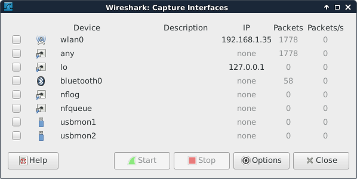
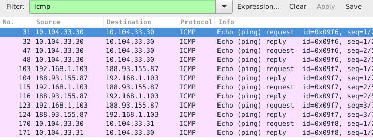
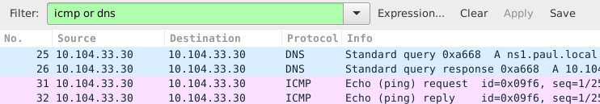
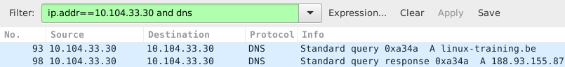
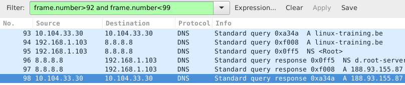
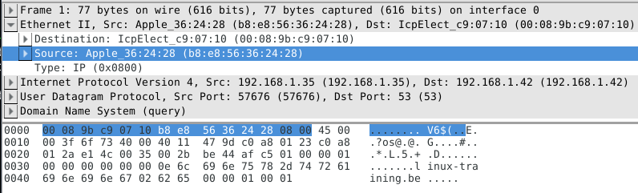
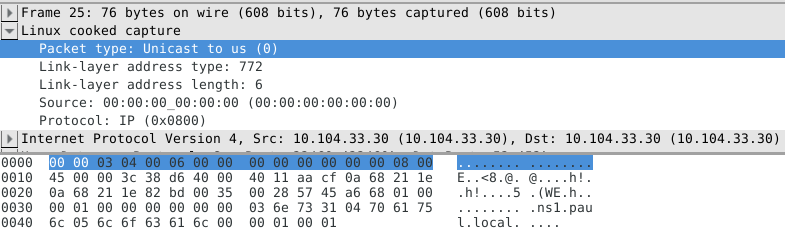

## wireshark

### installing wireshark

This example shows how to install `wireshark` on `.deb` based
distributions (including Debian, Mint, Xubuntu, and others).

    root@linux:~# apt-get install wireshark
    Reading package lists... Done
    Building dependency tree
    Reading state information... Done
    ... (output truncated)

On `.rpm` based distributions like CentOS, RHEL and Fedora you can use
`yum` to install `wireshark`.

    [root@linux ~]# yum install wireshark
    Loaded plugins: fastestmirror
    Loading mirror speeds from cached hostfile
    ... (output truncated)

### selecting interface

When you start `wireshark` for the first time, you will need to select
an interface. You will see a dialog box that looks similar to this one.

It is possible that there are no interfaces available because some
distributions only allow root to sniff the network. You may need to use
`sudo wireshark`.

Or you can follow the general advice to sniff using `tcpdump` or any
other tool, and save the capture to a file. Any saved capture can be
analyzed using `wireshark` at a later time.

### minimize traffic

Sniffing a network can generate many thousands of packets in a very
short time. This can be overwhelming. Try to mitigate by isolating your
sniffer on the network. Preferably sniff an isolated virtual network
interface over which you control all traffic.

If you are at home to learn sniffing, then it could help to close all
network programs on your computer, and disconnect other computers and
devices like smartphones and tablets to minimize the traffic.

Even more important than this is the use of `filters` which will be
discussed in this chapter.

### sniffing ping

I started the sniffer and captured all packets while doing these three
`ping` commands (there is no need for root to do this):

    root@linux:~# ping -c2 ns1.paul.local
    PING ns1.paul.local (10.104.33.30) 56(84) bytes of data.
    64 bytes from 10.104.33.30: icmp_req=1 ttl=64 time=0.010 ms
    64 bytes from 10.104.33.30: icmp_req=2 ttl=64 time=0.023 ms

    --- ns1.paul.local ping statistics ---
    2 packets transmitted, 2 received, 0% packet loss, time 1001ms
    rtt min/avg/max/mdev = 0.010/0.016/0.023/0.007 ms
    root@linux:~# ping -c3 linux-training.be
    PING linux-training.be (188.93.155.87) 56(84) bytes of data.
    64 bytes from antares.ginsys.net (188.93.155.87): icmp_req=1 ttl=56 time=15.6 ms
    64 bytes from antares.ginsys.net (188.93.155.87): icmp_req=2 ttl=56 time=17.8 ms
    64 bytes from antares.ginsys.net (188.93.155.87): icmp_req=3 ttl=56 time=14.7 ms

    --- linux-training.be ping statistics ---
    3 packets transmitted, 3 received, 0% packet loss, time 2003ms
    rtt min/avg/max/mdev = 14.756/16.110/17.881/1.309 ms
    root@linux:~# ping -c1 centos7.paul.local
    PING centos7.paul.local (10.104.33.31) 56(84) bytes of data.
    64 bytes from 10.104.33.31: icmp_req=1 ttl=64 time=0.590 ms

    --- centos7.paul.local ping statistics ---
    1 packets transmitted, 1 received, 0% packet loss, time 0ms
    rtt min/avg/max/mdev = 0.590/0.590/0.590/0.000 ms

In total more than 200 packets were sniffed from the network. Things
become clearer when you enter `icmp` in the filter field and press the
`apply` button.

### sniffing ping and dns

Using the same capture as before, but now with a different `filter`. We
want to see both `dns` and `icmp` traffic, so we enter both in the
filter field.

We put `dns or icmp` in the filter to achieve this. Putting
`dns and icmp` would render nothing because there is no packet that
matches both protocols.

In the screenshot above you can see that packets 25 and 26 both have
10.104.33.30 as `source` and `destination` ip address. That is because
the dns client is the same computer as the dns server.

The same is true for packets 31 and 32, since the machine is actually
pinging itself.

### specific ip address

This is a screenshot that filters for `dns` packets that contain a
certain `ip address`. The filter in use is
`ip.addr==10.104.33.30 and dns`. The `and` directive forces each
displayed packet to match both conditions.

Packet 93 is the `dns query` for the A record of linux-training.be.
Packet 98 is the response from the `dns server`. What do you think
happened in the packets between 93 and 98 ? Try to answer this before
reading on (it always helps to try to predict what you will see, and
then checking your prediction).

### filtering by frame

The correct technical term for a `packet` as sniffed is a `frame`
(because we sniff on layer two). So to display packets with certain
numbers, we use `frame.number` in the filter.

### looking inside packets

The middle pane can be expanded. When selecting a line in this pane, you
can see the corresponding bytes in the frame in the bottom panel.

This screenshot shows the middle pane with the source address of my
laptop selected.

Note that the above works fine when sniffing one interface. When
sniffing with for example `tcpdump -i any` you will end up with
`Linux cooked` at this level.

### other filter examples

You can combine two protocols with a logical `or` between them. The
example below shows how to filter only `arp` and `bootp`
(or `dhcp`) packets.

This example shows how to filter for `dns` traffic
containing a certain `ip address`.

## tcpdump

Sniffing on the command line can be done with `tcpdump`.
Here are some examples.

Using the `tcpdump host $ip` command displays all traffic with one host
(192.168.1.38 in this example).

    root@linux:~# tcpdump host 192.168.1.38
    tcpdump: verbose output suppressed, use -v or -vv for full protocol decode
    listening on eth0, link-type EN10MB (Ethernet), capture size 96 bytes

Capturing only ssh (tcp port 22) traffic can be done with
`tcpdump tcp port $port`. This screenshot is cropped to 76 characters
for readability in the pdf.

    root@linux:~# tcpdump tcp port 22
    tcpdump: verbose output suppressed, use -v or -vv for full protocol decode
    listening on eth1, link-type EN10MB (Ethernet), capture size 96 bytes
    14:22:20.716313 IP deb106.local.37973 > rhel53.local.ssh: P 666050963:66605
    14:22:20.719936 IP rhel53.local.ssh > deb106.local.37973: P 1:49(48) ack 48
    14:22:20.720922 IP rhel53.local.ssh > deb106.local.37973: P 49:113(64) ack 
    14:22:20.721321 IP rhel53.local.ssh > deb106.local.37973: P 113:161(48) ack
    14:22:20.721820 IP deb106.local.37973 > rhel53.local.ssh: . ack 161 win 200
    14:22:20.722492 IP rhel53.local.ssh > deb106.local.37973: P 161:225(64) ack
    14:22:20.760602 IP deb106.local.37973 > rhel53.local.ssh: . ack 225 win 200
    14:22:23.108106 IP deb106.local.54424 > ubuntu910.local.ssh: P 467252637:46
    14:22:23.116804 IP ubuntu910.local.ssh > deb106.local.54424: P 1:81(80) ack
    14:22:23.116844 IP deb106.local.54424 > ubuntu910.local.ssh: . ack 81 win 2
    ^C
    10 packets captured
    10 packets received by filter
    0 packets dropped by kernel

Same as above, but write the output to a file with the
`tcpdump -w $filename` command.

    root@linux:~# tcpdump -w sshdump.tcpdump tcp port 22
    tcpdump: listening on eth0, link-type EN10MB (Ethernet), capture size 96 bytes
    ^C
    17 packets captured
    17 packets received by filter
    0 packets dropped by kernel

With `tcpdump -r $filename` the file created above can be
displayed.

    root@linux:~# tcpdump -r sshdump.tcpdump

Many more examples can be found in the manual page of `tcpdump`.

