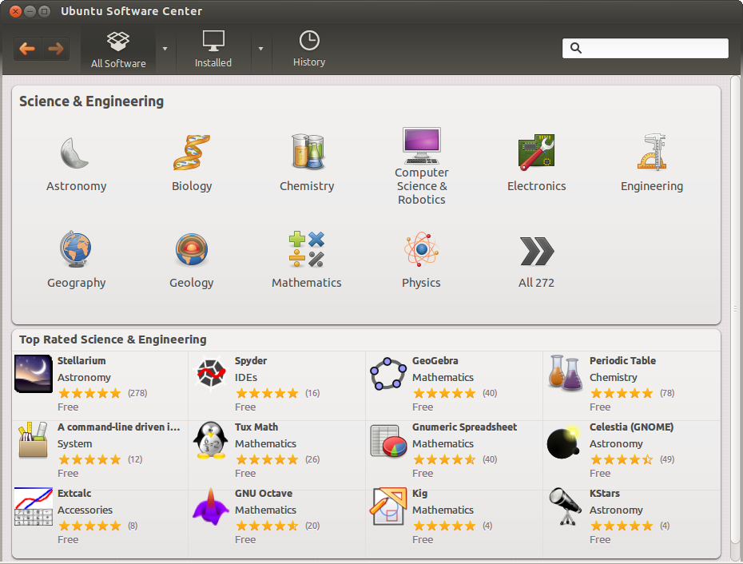

## package terminology

### repository

A lot of software and documentation for your Linux distribution is available as **packages** in one or more centrally distributed **repositories**. The packages in such a repository are tested and very easy to install (or remove) with a graphical or command line installer.

### .deb packages

Debian, Ubuntu, Mint and all derivatives of Debian and Ubuntu use `.deb` packages. To manage software on these systems, you can use `apt` or `apt-get`, both these tools are a front end for `dpkg`.

### .rpm packages

Red Hat, Fedora, CentOS, OpenSUSE, Mandriva, Red Flag and others use `.rpm` packages. The tools to manage software packages on these systems are `dnf` and `rpm`.

### dependency

Some packages need other packages to function. Tools like `apt-get`, `apt` and `dnf` will install all **dependencies** you need. When using `dpkg` or `rpm`, or when building from **source**, you will need to install dependencies yourself.

### open source

These repositories contain a lot of independent **open source software**. Often the source code is customized to integrate better with your distribution. Most distributions also offer this modified source code as a **package** in one or more **source repositories**.

You are free to go to the project website itself (samba.org, apache.org, github.com ...) and download the *vanilla* (= without the custom distribution changes) source code.

### GUI software management

End users have several graphical applications available via the desktop (look for *add/remove software* or something similar).

Below a screenshot of Ubuntu Software Center running on Ubuntu 12.04. Graphical tools are not discussed in this book.

