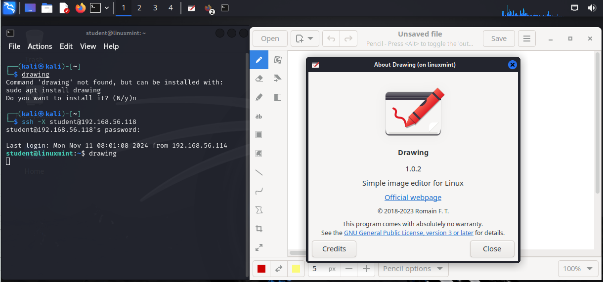

## about ssh

**Secure SHell** (ssh) is the common way to securely connect to a remote system, e.g. a server in a datacenter, and open a terminal to execute commands. It is considered an essential tool for managing Linux systems, so it is included by default even on minimal installations of most distributions. Server-installations of Linux have the `openssh-server` package installed and enabled.

Even some popular services, like Github, also use SSH for communication. Synchronizing code between a local source code repository and a remote repository on github.com is only allowed over SSH.

### secure shell in general

The **SSH protocol** is secure in two ways. Firstly the connection is *authenticated* both ways, and secondly the connection is *encrypted*.

An SSH connection always starts with a cryptographic *handshake*. The *authentication* takes place (using user id/password or public/private keys) and communication can begin over the encrypted connection. When both sides are accepted as trustworthy parties, it is followed by *encryption* of the transport layer using a symmetric cypher.  The latter is exchanged between the two parties directly after authenticating. In other words, the tunnel is already encrypted before you start typing anything.

The *SSH protocol* will remember the servers it handshaked with, and warn you in case something suspicious happened, e.g. when the signature or *fingerprint* of the server changed. This is a *'mitm'*-attack prevention.

The `openssh` package is maintained by the *OpenBSD* people and is distributed with a lot of operating systems, including Linux.

Older protocols like `telnet`, `rlogin` and `rsh` can also be used to remotely connect to your servers. However, these protocols do not encrypt the login session, which means confidential information about the server, including your user id and password, can be sniffed by tools like `wireshark` or `tcpdump`. Consequently, they are no longer installed by default on most Linux distributions and you should **never** use them in a production environment.
To securely connect to your servers, use `ssh`.

### public and private keys

The `ssh` protocol uses the well known system of *public and private keys*. The below explanation is succinct, more information about [public key cryptography](http://en.wikipedia.org/wiki/Public-key_cryptography) can be found on wikipedia.

Imagine Alice and Bob, two people that like to communicate with each other. Using *public and private keys* they can communicate with *confidentiality* and with *authentication*.

Alice and Bob both need to generate a key pair, each consisting of two cryptographic keys. A key pair has as property that a message that is encrypted with one key can only be decrypted with the other key. This concept is also called *asymmetric encryption*. One key is kept *private* and the other is made *public*.

When Alice wants to send an encrypted message to Bob, she uses the *public key* of Bob. Since Bob should be the only person to have his *private key*, Alice is certain that Bob is the only person that can read the encrypted message.

A *digital signature* is based on the same principle. Alice signs a message with her *private key*, which usually means that a *hash* of the message (i.e. a unique number that represents the message) is encrypted with her *private key*. When Bob wants to verify that the message came from Alice, Bob uses the *public key* of Alice to decrypt the signature. If the decrypted hash matches the hash of the received message, Bob can be certain the message came from Alice and was not altered during transfer.

### public-key cryptosystems

This chapter does not explain the technical implementation of cryptographic algorithms, it only explains how to use the ssh tools some common key exchange types. More information about these algorithms can be found here:

- <https://en.wikipedia.org/wiki/RSA_(cryptosystem)>
- <https://en.wikipedia.org/wiki/Digital_Signature_Algorithm>
- <https://en.wikipedia.org/wiki/EdDSA>
- <https://en.wikipedia.org/wiki/Elliptic_Curve_Digital_Signature_Algorithm>

### ssh remote login: autentication fingerprint

The following screenshot shows how to use `ssh` to log on to a remote computer running Linux. The local user is named `paul` and he is logging on as user `admin42` on the remote system.

```console
paul@linux:~$ ssh admin42@192.168.1.30
The authenticity of host '192.168.1.30 (192.168.1.30)' can't be established.
RSA key fingerprint is b5:fb:3c:53:50:b4:ab:81:f3:cd:2e:bb:ba:44:d3:75.
Are you sure you want to continue connecting (yes/no)?
```

As you can see, the user `paul` is presented with an `rsa` authentication fingerprint from the remote system. The user can accepts this by typing `yes`. We will see later that an entry will be added to the `~/.ssh/known_hosts` file.

```console
paul@linux:~$ ssh admin42@192.168.1.30
The authenticity of host '192.168.1.30 (192.168.1.30)' can't be established.
RSA key fingerprint is b5:fb:3c:53:50:b4:ab:81:f3:cd:2e:bb:ba:44:d3:75.
Are you sure you want to continue connecting (yes/no)? yes
Warning: Permanently added '192.168.1.30' (RSA) to the list of known hosts.
admin42@192.168.1.30's password: 
Welcome to Ubuntu 12.04 LTS (GNU/Linux 3.2.0-26-generic-pae i686)

    * Documentation:  https://help.ubuntu.com/

1 package can be updated.
0 updates are security updates.

Last login: Wed Jun  6 19:25:57 2024 from 172.28.0.131
admin42@ubuserver:~$
```

The user can get log out of the remote server by typing `exit` or by using `Ctrl-d`.

```console
admin42@ubuserver:~$ exit
logout
Connection to 192.168.1.30 closed.
student@linux:~$
```

The fingerprint guarantees server-side authentication. 
If the user would connect a second time to this server, the authentication question will no longer be asked (as the fingerprint is retained in the `known_hosts` file).
If for any reason the fingerprint of the server does **not** match the one in the `known_hosts` file, the user will be warned and the connection will be refused.

```console
paul@linux:~$ ssh admin42@192.168.1.30
@@@@@@@@@@@@@@@@@@@@@@@@@@@@@@@@@@@@@@@@@@@@@@@@@@@@@@@@@@@
@    WARNING: REMOTE HOST IDENTIFICATION HAS CHANGED!     @
@@@@@@@@@@@@@@@@@@@@@@@@@@@@@@@@@@@@@@@@@@@@@@@@@@@@@@@@@@@
IT IS POSSIBLE THAT SOMEONE IS DOING SOMETHING NASTY!
Someone could be eavesdropping on you right now (man-in-the-middle attack)!
It is also possible that a host key has just been changed.
The fingerprint for the RSA key sent by the remote host is
6e:45:f9:a8:af:38:3d:a1:a5:c7:76:1d:02:f8:77:00.
Please contact your system administrator.
Add correct host key in /home/paul/.ssh/known_hosts to get rid of this message.
Offending ECDSA key in /home/paul/.ssh/known_hosts:14
Host key for 192.168.1.30 has changed and you have requested strict checking.
Host key verification failed.
```

### ssh beyond remote login

Next to 'simply' allowing  to log in on a remote node, `ssh` also allows for remote exection of commands, and transferring files.

#### executing a command in remote

This screenshot shows how to execute the `pwd` command on the remote server. There is no need to `exit` the server manually.

```console
paul@linux:~$ ssh admin42@192.168.1.30 pwd
admin42@192.168.1.30's password: 
/home/admin42
paul@linux:~$
```

#### scp

The `scp` command works just like `cp`, but allows the source and
destination of the copy to be behind `ssh`. Here is an example where we
copy the `/etc/hosts` file from the remote server to the home directory
of user paul.

```console
pau;@linux:~$ scp admin42@192.168.1.30:/etc/hosts /home/paul/serverhosts
admin42@192.168.1.30's password: 
hosts                                        100%  809     0.8KB/s   00:00
```

Here is an example of the reverse, copying a local file to a remote server.

```console
student@linux:~$ scp ~/serverhosts admin42@192.168.1.30:/etc/hosts.new
admin42@192.168.1.30's password: 
serverhosts                                  100%  809     0.8KB/s   00:00
```

**Remark** that the `scp` command *used to be* based on the *SCP protocol*. However, this protocol is now considered to be *insecure*. Fortunately, this does not mean that you can't use the `scp` command anymore, since it nowadays uses the actually secure *SFTP protocol* (Secure File Transfer Protocol) to copy files between hosts.

## setting up passwordless ssh

Above, the server-side authentication based on a fingerprint was explained. Client-side authentication is by default based on a user/password combination. However: we could use a pub/priv keypair to take care of this authentication - avoiding to type your password every time you want to log in.

To set up passwordless ssh (client-side) authentication through public/private keys, use `ssh-keygen` to generate a key pair without a passphrase, and then copy your public key to the destination server.

Let's do this step by step. In the example that follows, we will set up ssh without password between Alice and Bob. Alice is using Ubuntu on her laptoph, and has as an account on an Enterprise Linux server named Bob. Server Bob wants to give Alice access using ssh and the public and private key system. This means that even if the password of Alice is changed on this server Bob, Alice will still have access.

### generate with ssh-keygen

The example below shows how Alice uses `ssh-keygen` to generate an RSA key pair. Alice does not enter a passphrase[^1].

```console
[alice@linux ~]$ ssh-keygen -t rsa
Generating public/private rsa key pair.
Enter file in which to save the key (/home/alice/.ssh/id_rsa): 
Created directory '/home/alice/.ssh'.
Enter passphrase (empty for no passphrase): 
Enter same passphrase again: 
Your identification has been saved in /home/alice/.ssh/id_rsa.
Your public key has been saved in /home/alice/.ssh/id_rsa.pub.
The key fingerprint is:
9b:ac:ac:56:c2:98:e5:d9:18:c4:2a:51:72:bb:45:eb alice@linux
[alice@linux ~]$
```

[^1]: It is possible to specify a passphrase when generating the keypair; that passphrase will be used to encrypt the private key part of this file using 128-bit AES.

With the `-t` option, you can specify the type of key to create. The default is `rsa-sha2-512` (i.e. RSA-key with SHA-2 as hash algorithm).

Safe key types include:

- `rsa` (default)
- `ecdsa` (Elliptic Curve Digital Signature Algorithm)
- `ed25519` (Edwards-curve Digital Signature Algorithm)

Key types to avoid include:

- `dsa` (Digital Signature Algorithm) is considered weak and should not be used. In SSH, this keytype is called `ssh-dss` and has been deprecated as of August 2015 - see https://www.openssh.com/txt/release-7.0 .
- `ssh-rsa` uses the SHA-1 hash algorithm, which is considered weak. The latter has been deprecated as af August 2021 - see https://www.openssh.com/txt/release-8.7 .

It an older server is still using these keys, you should consider updating the keypairs. A workaround, e.g. to use the deprecated key one more time be able to log in to work on the updates, could be found on https://www.openssh.com/legacy.html . This is further elaborated in the 'Troubleshooting' section below.

### id_rsa and id_rsa.pub

The `ssh-keygen` command generate two keys in a hidden folder `.ssh`. The public key is named `~/.ssh/id_rsa.pub`. The private key is named `~/.ssh/id_rsa`.

```console
[alice@linux ~]$ ls -l .ssh/id*
total 16
-rw------- 1 alice alice 1671 May  1 07:38 id_rsa
-rw-r--r-- 1 alice alice  393 May  1 07:38 id_rsa.pub
```

The files will be named `id_ecdsa` and `id_ecdsa.pub` when using `ecdsa` instead of `rsa`.

### ~/.ssh

In general, the `.ssh` directory is used to store the user's `ssh` related files.
If it doesn't exist, the hidden `.ssh` directory will be created automatically when generating the keypair.
If you create the `.ssh` directory manually, then you need to chmod 700 it! Otherwise ssh will refuse to use the keys (world readable private keys are not secure!).

As you can see, the `.ssh` directory is secure in Alice's home directory on her laptop.

```console
[alice@linux ~]$ ls -ld .ssh
drwx------ 2 alice alice 4096 May  1 07:38 .ssh
```

Server Bob decides to manually create the `.ssh` directory, so he needs to manually secure it.

```console
bob@linux:~$ mkdir .ssh
bob@linux:~$ ls -ld .ssh
drwxr-xr-x 2 bob bob 4096 2024-05-14 16:53 .ssh
bob@linux:~$ chmod 700 .ssh/
```

Next to storing the keypair(s) generated by a user, it can also contain other files. Most notably is the file `known_hosts`, containing an entry for each fingerprint that has been accepted before when connecting to a new server. 

### .ssh/authorized_keys

In your `~/.ssh` directory, you can create a file called `authorized_keys`. This file can contain one or more public keys from people you trust. Those trusted people can use their private keys to prove their identity and gain access to your account via ssh (without password). The example shows Bob's authorized_keys file containing the public key of Alice.

```console
bob@linux:~$ cat .ssh/authorized_keys 
ssh-rsa AAAAB3NzaC1yc2EAAAABIwAAAQEApCQ9xzyLzJes1sR+hPyqW2vyzt1D4zTLqk\
MDWBR4mMFuUZD/O583I3Lg/Q+JIq0RSksNzaL/BNLDou1jMpBe2Dmf/u22u4KmqlJBfDhe\
yTmGSBzeNYCYRSMq78CT9l9a+y6x/shucwhaILsy8A2XfJ9VCggkVtu7XlWFDL2cum08/0\
mRFwVrfc/uPsAn5XkkTscl4g21mQbnp9wJC40pGSJXXMuFOk8MgCb5ieSnpKFniAKM+tEo\
/vjDGSi3F/bxu691jscrU0VUdIoOSo98HUfEf7jKBRikxGAC7I4HLa+/zX73OIvRFAb2hv\
tUhn6RHrBtUJUjbSGiYeFTLDfcTQ== alice@linux
```

### copy the public key to the other computer

But wait a minute? How did this key get onto server Bob?
To copy the public key from Alice's laptop tot server Bob, Alice decided to use `scp`.

```console
[alice@linux .ssh]$ scp id_rsa.pub bob@192.168.48.92:~/.ssh/authorized_keys
bob@192.168.48.92's password: 
id_rsa.pub                                    100%  393     0.4KB/s   00:00
```

Be careful when copying a second key! Do not overwrite the first key, instead append the key to the same `~/.ssh/authorized_keys` file!

```bash
cat id_rsa.pub >> ~/.ssh/authorized_keys
```

Alice could also have used `ssh-copy-id` like in this example.

```bash
ssh-copy-id -i .ssh/id_rsa.pub bob@192.168.48.92
```

### passwordless ssh

Alice can now use ssh to connect passwordless to server Bob. In combination with `ssh`'s capability to execute commands on the remote host, this can be useful in pipes across different machines.

```console
[alice@linux ~]$ ssh bob@192.168.48.92 "ls -l .ssh"
total 4
-rw-r--r-- 1 bob bob 393 2024-05-14 17:03 authorized_keys
[alice@linux ~]$
```

## ssh-agent

When generating keys with `ssh-keygen`, you have the option to enter a passphrase to protect access to the keys by encrypting them with a symmetric cipher. To avoid having to type this passphrase every time, you can add the key to `ssh-agent` using `ssh-add`.

Most Linux distributions will start the `ssh-agent` automatically when you log on.

```console
paul@linux~$ ps -ef | grep ssh-agent
paul     2405  2365  0 08:13 ?        00:00:00 /usr/bin/ssh-agent...
```

If the `ssh-agent` is not running, you can start it with `eval $(ssh-agent)`.

```console
student@debian:~$ ps -ef | grep ssh-agent
student     1608    1393  0 14:52 pts/0    00:00:00 grep ssh-agent
student@debian:~$ eval $(ssh-agent)
Agent pid 1610
student@debian:~$ ps -ef | grep ssh-agent
student     1610       1  0 14:52 ?        00:00:00 ssh-agent
student     1612    1393  0 14:52 pts/0    00:00:00 grep ssh-agent
```

This screenshot shows how to use `ssh-add` with option `-L` to list the keys that are currently added to the `ssh-agent`, and to add a key (without arguments):

```console
student@debian:~$ ssh-add -L
The agent has no identities.
student@debian:~$ ssh-add
Identity added: /home/student/.ssh/id_rsa (student@debian)
student@debian:~$ ssh-add -L
ssh-rsa AAAAB3NzaC1yc2EAAAAD......MeoDHPqR5/yUsCO6MzVOCaZpf8Toc= student@debian
```

All keys can be removed from the `ssh-agent` with `ssh-add -D`.


## X forwarding via ssh

Another popular feature of `ssh` is called *X11 forwarding*. *X11* is the foundation of graphical user interfaces on Linux and Unix systems, so *X11 forwarding* allows you to run graphical applications on a remote computer and have them displayed on your local computer. On the server side, the `X11Forwarding` option must be set to `yes` in the `/etc/ssh/sshd_config` file. On the client side, add option `-X` to the `ssh` command.

Below an example of X forwarding between a Kali Linux VM (client) and a Linux Mint VM (server), both with a graphical desktop. The default user `kali` is logged in and verifies that the app `drawing` is not installed. Next, they log in to the Linux Mint VM as user `student` and start `drawing`. The application will run on the remote computer from `mint`, but will be displayed within the Kali VM, as shown in the screenshot.




## configuration in /etc/ssh/

Configuration of *SSH* client and server is done in the `/etc/ssh` directory. In the next sections we will discuss most of the files found in `/etc/ssh/`.

### sshd

The ssh server is provided by the `openssh-server` package.

```console
root@linux~# dpkg -l openssh-server | tail -1
ii  openssh-server   1:5.9p1-5ubuntu1    secure shell (SSH) server,... 
```

On Debian based distributions, the service is called `ssh`. On Enterprise Linux based distributions, the service is called `sshd`.

Example on EL:

```console
[student@el ~]$ systemctl status sshd
● sshd.service - OpenSSH server daemon
     Loaded: loaded (/usr/lib/systemd/system/sshd.service; enabled; preset: enabled)
     Active: active (running) since Mon 2024-11-11 10:03:58 UTC; 3h 24min ago
       Docs: man:sshd(8)
             man:sshd_config(5)
   Main PID: 668 (sshd)
      Tasks: 1 (limit: 11128)
     Memory: 6.5M
        CPU: 208ms
     CGroup: /system.slice/sshd.service
             └─668 "sshd: /usr/sbin/sshd -D [listener] 0 of 10-100 startups"
```

On Debian:

```console
vagrant@debian:~$ systemctl status ssh
● ssh.service - OpenBSD Secure Shell server
     Loaded: loaded (/lib/systemd/system/ssh.service; enabled; preset: enabled)
     Active: active (running) since Mon 2024-11-11 10:04:31 UTC; 3h 22min ago
       Docs: man:sshd(8)
             man:sshd_config(5)
    Process: 577 ExecStartPre=/usr/sbin/sshd -t (code=exited, status=0/SUCCESS)
   Main PID: 611 (sshd)
      Tasks: 1 (limit: 2304)
     Memory: 7.6M
        CPU: 121ms
     CGroup: /system.slice/ssh.service
             └─611 "sshd: /usr/sbin/sshd -D [listener] 0 of 10-100 startups"
```

The standard port for ssh is 22. You can change this in the `/etc/ssh/sshd_config` file.

```console
[vagrant@el ~]$ sudo ss -tlnp
State   Recv-Q  Send-Q  Local Address:Port  Peer Address:Port  Process
LISTEN  0       4096          0.0.0.0:111        0.0.0.0:*      users:(("rpcbind",pid=539,fd=4),("systemd",pid=1,fd=31))
LISTEN  0       128           0.0.0.0:22         0.0.0.0:*      users:(("sshd",pid=668,fd=3))
LISTEN  0       4096             [::]:111           [::]:*      users:(("rpcbind",pid=539,fd=6),("systemd",pid=1,fd=34))
LISTEN  0       128              [::]:22            [::]:*      users:(("sshd",pid=668,fd=4))
```

### sshd keys

The public keys used by the sshd server for fingerprints are located in `/etc/ssh` and are world readable. The private keys are only readable by root.

```console
root@linux~# ls -l /etc/ssh/ssh_host_*
-rw------- 1 root root  668 Jun  7  2024 /etc/ssh/ssh_host_ecdsa_key
-rw-r--r-- 1 root root  598 Jun  7  2024 /etc/ssh/ssh_host_ecdsa_key.pub
-rw------- 1 root root 1679 Jun  7  2024 /etc/ssh/ssh_host_rsa_key
-rw-r--r-- 1 root root  390 Jun  7  2024 /etc/ssh/ssh_host_rsa_key.pub
```


## troubleshooting ssh

Troubleshooting SSH can be a hard issue: as security standards have evolved through time, and even the SSH protocol has evolved from version 1 to 2, you might encounter compatibility issues between an SSH client and server. 

Use `ssh -v` to get debug information about the ssh connection attempt.

```console
student@linux:~$ ssh -v paul@192.168.1.192
OpenSSH_4.3p2 Debian-8ubuntu1, OpenSSL 0.9.8c 05 Sep 2006
debug1: Reading configuration data /home/paul/.ssh/config
debug1: Reading configuration data /etc/ssh/ssh_config
debug1: Applying options for *
debug1: Connecting to 192.168.1.192 [192.168.1.192] port 22.
debug1: Connection established.
debug1: identity file /home/paul/.ssh/identity type -1
debug1: identity file /home/paul/.ssh/id_rsa type 1
debug1: identity file /home/paul/.ssh/id_dsa type -1
debug1: Remote protocol version 1.99, remote software version OpenSSH_3
debug1: match: OpenSSH_3.9p1 pat OpenSSH_3.*
debug1: Enabling compatibility mode for protocol 2.0
...
```

### ssh protocol versions

The `ssh` protocol has two versions, 1 and 2, that are incompatible. Version 1 is considered insecure since it contains some known vulnerabilities. If you encounter an installation that still uses protocol version version 1, you should endeavour to update it as soon as possible. In current installations, version 1 should no longer be supported. It was removed in 2017 with the release of OpenSSH 7.6.

Check the version of OpenSSH installed with `ssh -V` or with your package manager. For example, on Enterprise Linux:

```console
[student@el ssh]$ ssh -V
OpenSSH_8.7p1, OpenSSL 3.0.7 1 Nov 2022
[student@el ssh]$ dnf list installed openssh*
Installed Packages
openssh.x86_64            8.7p1-38.el9_4.4    @baseos
openssh-clients.x86_64    8.7p1-38.el9_4.4    @baseos
openssh-server.x86_64     8.7p1-38.el9_4.4    @baseos
```

and on Debian:

```console
student@debian:~$ ssh -V
OpenSSH_9.2p1 Debian-2+deb12u2, OpenSSL 3.0.11 19 Sep 2023
student@debian:~$ apt list --installed openssh*
Listing... Done
openssh-client/now 1:9.2p1-2+deb12u2 amd64 [installed,upgradable to: 1:9.2p1-2+deb12u3]
openssh-server/now 1:9.2p1-2+deb12u2 amd64 [installed,upgradable to: 1:9.2p1-2+deb12u3]
openssh-sftp-server/now 1:9.2p1-2+deb12u2 amd64 [installed,upgradable to: 1:9.2p1-2+deb12u3]
```

You can try to check the protocol version via `/etc/ssh/ssh_config` for the client side and `/etc/ssh/sshd_config` for the openssh-server daemon. However, on newer installations, the `Protocol` directive is not present in the configuration files. An example on an older installation:

```console
student@linux:/etc/ssh$ grep Protocol ssh_config 
#   Protocol 2,1
student@linux:/etc/ssh$ grep Protocol sshd_config 
Protocol 2
```


### dealing with older devices

Unfortunately, some older devices still use insecure key exchange or signing algorithms. For example, the example below is an attempt to connect to a Cisco device (with IOS version 16.09.08, released in 2021) from a Linux system with the OpenSSH client version 9.8:

```console
[student@linux ~]$ ssh cisco@172.16.255.254
Unable to negotiate with 172.16.255.254 port 22: no matching key exchange method found. Their offer: diffie-hellman-group-exchange-sha1,diffie-hellman-group14-sha1
```

The Cisco device only uses the SHA-1 hash algorithm for signing messages. This is considered to be insecure, so is no longer supported by the OpenSSH client, at least not by default. Enabling SHA-1 can be done with the following command:

```console
[student@linux ~]$ sudo update-crypto-policies --set DEFAULT:SHA1
Setting system policy to DEFAULT:SHA1
Note: System-wide crypto policies are applied on application start-up.
It is recommended to restart the system for the change of policies
to fully take place.
```

Trying the connection again yields:

```console
[student@linux ~]$ ssh cisco@172.16.255.254
Unable to negotiate with 172.16.255.254 port 22: no matching host key type found. Their offer: ssh-rsa
```

The Cisco device only supports the `ssh-rsa` host key type, which is also turned off on the client side. Turning it on can be done with the following command:

```console
[student@linux ~]$ ssh -o HostKeyAlgorithms=+ssh-rsa cisco@172.16.255.254
The authenticity of host '172.16.255.254 (172.16.255.254)' can't be established.
RSA key fingerprint is SHA256:oDUj7I3RQi0FSKSaVX7gz8JfM1wpsYVbyF3ADNJTcAw.
This key is not known by any other names.
Are you sure you want to continue connecting (yes/no/[fingerprint])? yes
Warning: Permanently added '172.16.255.254' (RSA) to the list of known hosts.
(cisco@172.16.255.254) Password: 

[... Some output omitted ...]

Router#
Router#exit
Connection to 172.16.255.254 closed.
[student@linux ~]$
```

Restoring the setting in order to no longer allow SHA-1 can be done with:

```console
[student@linux ~]$ sudo update-crypto-policies --set DEFAULT
Setting system policy to DEFAULT
```

