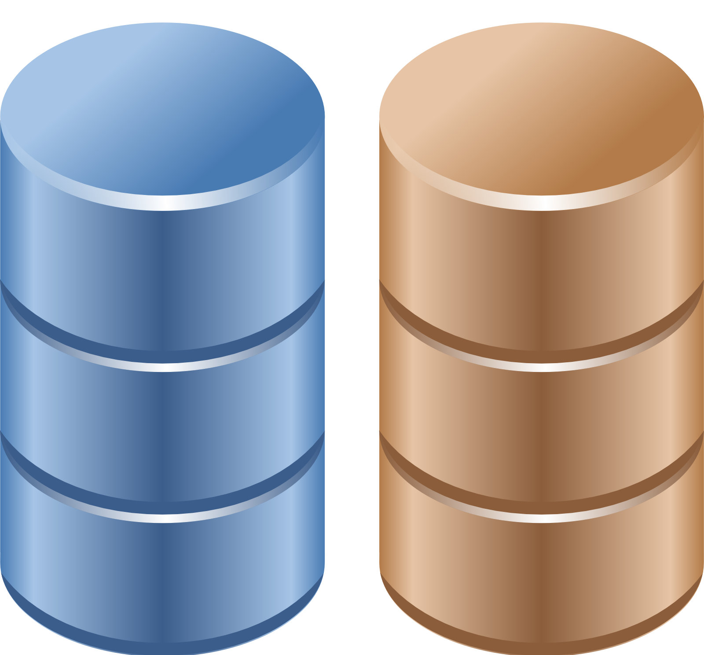
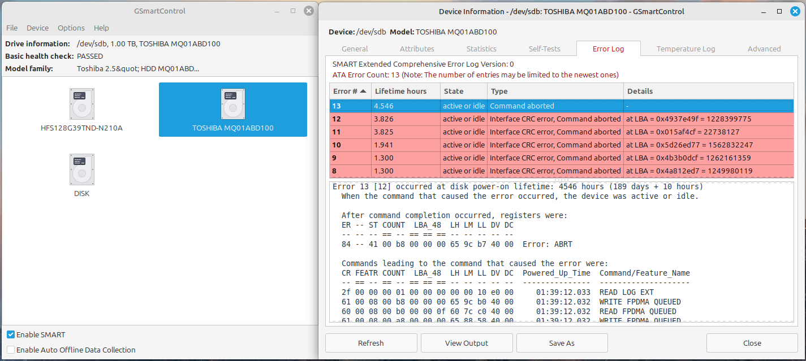

## terminology

In general, there are four major types of mass storage devices in use today.

- A **solid state drive** (SSD) uses integrated circuits to store data.
- A **hard disk drive** (HDD) stores data on spinning platters coated with magnetic material.
- An **optical drive** uses a laser to read and write data on a plastic disc (a CD or DVD).
- A **tape drive** uses a magnetic tape to store data.

In this book we will use the following pictograms for *spindle disks* (in brown) and *solid state disks* (in blue).



### platter, head, track, cylinder, sector

Hard disk drives store data on magnetic or optical *disk platters*. The platters are rotated (at high speeds). Data is read by *heads*, which are very close to the surface of the platter, without touching it! The heads are mounted on an arm (sometimes called a comb or a fork) that all move at the same time.

Data is written in concentric circles called *tracks*. Track zero is (usually) on the outside. The time it takes to position the head over a certain track is called the *seek time*. Often the platters are stacked on top of each other, hence the set of tracks accessible at a certain position of the comb forms a *cylinder*. Tracks are divided into 512 byte *sectors*, with more unused space (*gap*) between the sectors on the outside of the platter.

When you break down the advertised *access time* of a hard drive, you will notice that most of that time is taken by movement of the heads (about 65%) and *rotational latency* (about 30%).

### solid state drives

A **solid state drive** (SSD) is a type of mass storage device without moving parts. It uses integrated circuits (typically NAND flash) to store data persistently (i.e. the data is preserved when the device is powered off).

SSDs can reach much higher speeds than HDDs, both in access time and in transfer rate. On the other hand, SSDs are more expensive per unit of storage and they have a limited number of write cycles (which can result in data loss as the device ages). Despite these disadvantages, SSDs are being used more and more in a wide range of devices including personal computers, mobile and embedded devices, enterprise servers, etc.

SSDs are produced in various form factors (e.g. mSATA, M.2, etc) and support different interfaces that are also used by traditional HDDs (such as SATA, SAS, NVMe, ...).

### mass storage interfaces

There are several standards to connect mass storage devices to a computer. Common types include:

- **IDE** (Integrated Drive Electronics), also known as **PATA** (Parallel Advanced Technology Attachment): an older standard introduced in the late 1980s, with a maximum of two drives per controller. Supported transfer speeds up to 133MB/s (167MB/s for CompactFlash cards). This type of hard disk is no longer sold, but you can still find them in older computers.

- **SATA** (Serial Advanced Technology Attachment): the successor to IDE, introduced in 2003. By 2008, it had replaced most of the IDE drives in the desktop PC market. A single controller can drive up to fifteen storage devices. Transfer speeds can go up to 6Gbit/s. The latest revision of the standard (3.5) was released in 2020, so SATA is still in use today.

- **SCSI** (Small Computer System Interface, pronounced *scuzzy*) and **SAS** (Serial Attached SCSI): a standard introduced in the early 1980s, but also still in use today (with a standard being published as recently as SAS-4 2017). SCSI is commonly used in servers. Transfer speeds depend on the specific SCSI standard used, but can go up to 22.5Gb/s (SAS-4).

- **NVMe** (Non-Volatile Memory Express): a standard introduced in 2011, designed for Solid State drives. It uses the PCIe bus, which is faster than SATA. Transfer speeds can go up to 32Gb/s.

During boot, the operating system will detect storage devices that are present and make them available to the system. The devices are then accessed through device files in the `/dev` directory.

### block device

Random access hard disk devices have an abstraction layer called **block device** to enable reading and writing data in fixed-size (usually 512 bytes) blocks. Blocks can be accessed independent of access to other blocks.

```console
[student@linux ~]$ lsblk
NAME                        MAJ:MIN RM  SIZE RO TYPE MOUNTPOINT
sda                           8:0    0   40G  0 disk 
--sda1                        8:1    0  500M  0 part /boot
--sda2                        8:2    0 39.5G  0 part 
  --VolGroup-lv_root (dm-0) 253:0    0 38.6G  0 lvm  /
  --VolGroup-lv_swap (dm-1) 253:1    0  928M  0 lvm  [SWAP]
sdb                           8:16   0   72G  0 disk 
sdc                           8:32   0  144G  0 disk
```

In the output of `ls -l`, a block device has the letter b to denote the file type.

```console
[student@linux ~]$ ls -l /dev/sd*
brw-rw----. 1 root disk 8,  0 Apr 19 10:12 /dev/sda
brw-rw----. 1 root disk 8,  1 Apr 19 10:12 /dev/sda1
brw-rw----. 1 root disk 8,  2 Apr 19 10:12 /dev/sda2
brw-rw----. 1 root disk 8, 16 Apr 19 10:12 /dev/sdb
brw-rw----. 1 root disk 8, 32 Apr 19 10:12 /dev/sdc
```

Virtual devices like *RAID* (Redundant Array of Independent Disks) or *LVM* (Logical Volume Management) are also listed as *block devices* as seen in this RHEL7 virtual machine.

```console
[student@rhel7 ~]$ lsblk
NAME                    MAJ:MIN RM   SIZE RO TYPE  MOUNTPOINT
sda                       8:0    0     8G  0 disk
├─sda1                    8:1    0   400M  0 part
│ └─md0                   9:0    0 399.7M  0 raid1
├─sda2                    8:2    0   400M  0 part
│ └─md0                   9:0    0 399.7M  0 raid1
└─sda3                    8:3    0   400M  0 part
sdb                       8:16   0     8G  0 disk
sdc                       8:32   0     8G  0 disk
sdd                       8:48   0     2G  0 disk
sde                       8:64   0     2G  0 disk
sdf                       8:80   0  20.5G  0 disk
├─sdf1                    8:81   0   500M  0 part  /boot
└─sdf2                    8:82   0    20G  0 part
  ├─centos_centos7-swap 253:0    0     2G  0 lvm   [SWAP]
  └─centos_centos7-root 253:1    0    18G  0 lvm   /
sr0                      11:0    1  1024M  0 rom
```

Note that a *character device* is a constant stream of characters, being denoted by a c in `ls -l`. Note also that the *ISO 9660* standard for cdrom uses a *2048 byte* block size.

Old hard disks (and floppy disks) use *cylinder-head-sector* addressing to access a sector on the disk. Most current disks use *LBA* (Logical Block Addressing).

## device naming

When making mass storage devices available to the system, the kernel assigns a name to each device according to a specific naming scheme.

### pata (ide) device naming

All *PATA/IDE* drives on your system will start with `/dev/hd` followed by a unit letter. There can be two *ATA controllers* that each can have a so-called *master* and *slave* device. The master hdd on the first controller is `/dev/hda`, the slave is `/dev/hdb`. For the second controller, the names of the devices are `/dev/hdc` and `/dev/hdd`.

| Controller | Connection | Device Name |
| :--------- | :--------- | :---------- |
| ide0       | master     | `/dev/hda`  |
| ide0       | slave      | `/dev/hdb`  |
| ide1       | master     | `/dev/hdc`  |
| ide1       | slave      | `/dev/hdd`  |

It is possible to have only `/dev/hda` and `/dev/hdd`. The first one is a single ata hard disk, the second one is the cdrom (by default configured as slave).

### SATA/SCSI device naming

*SATA* and *SCSI* drives follow a similar scheme, but all start with `/dev/sd`. A modern Linux system will also use `/dev/sd*` for sd-cards, usb-sticks, (legacy) ATA/IDE devices and solid state drives.

You're not limited to four devices, so any letter can be used. When you run out of letters (after `/dev/sdz`), you can continue with `/dev/sdaa`, `/dev/sdab` and so on.

Below a sample of how SATA/SCSI devices on a Linux can be named. Adding a scsi disk or raid controller with a lower scsi address will change the naming scheme (shifting the higher scsi addresses one letter further in the alphabet).

| Device            | SCSI ID | Device Name |
| :---------------- | :------ | :---------- |
| disk 0            | 0       | `/dev/sda`  |
| disk 1            | 1       | `/dev/sdb`  |
| RAID controller 0 | 5       | `/dev/sdc`  |
| RAID controller 1 | 6       | `/dev/sdd`  |

### NVMe device naming

*NVMe* devices are named `/dev/nvme0n1`, `/dev/nvme1n1`, etc. The `n` stands for namespace, which is a logical partition of the device. The first number is the controller number, the second number is the namespace number.

This is an example of a laptop with two NVMe drives.

```console
[student@linux ~]$ lsblk --nvme
NAME    TYPE MODEL                    SERIAL              REV TRAN   RQ-SIZE  MQ
nvme1n1 disk WD PC SN740 SDDPTQD-1T00 23344G800113   73110000 nvme      1023  20
nvme0n1 disk PM9B1 NVMe Samsung 512GB S6MZNF0W522815 46305039 nvme       511  16
```

### other device names

Less common device names include:

- `/dev/fd*` for old floppy disk drives.
- `/dev/sr*` for optical (DVD/CD-ROM) drives.
- `/dev/loop*` for loopback devices (used to mount disk images).
- `/dev/md*` for software RAID devices.
- `/dev/mapper/*` for LVM devices.
- `/dev/mmcblk*` for MMC/(micro-)SD cards.

Here's an example of a Radxa Rock 4 SE single board computer with a micro-SD card (`/dev/mmcblk0`) and an NVMe drive (`/dev/nvme0n1`) as storage devices.

```console
student@rock4:~$ lsblk
NAME        MAJ:MIN RM   SIZE RO TYPE MOUNTPOINT
mmcblk0     179:0    0  14.7G  0 disk 
|-mmcblk0p1 179:1    0   3.9M  0 part 
|-mmcblk0p2 179:2    0     4M  0 part 
|-mmcblk0p3 179:3    0     4M  0 part 
|-mmcblk0p4 179:4    0   512M  0 part /boot
`-mmcblk0p5 179:5    0  14.1G  0 part /
nvme0n1     259:0    0 232.9G  0 disk 
`-nvme0n1p1 259:1    0 232.9G  0 part /var
```

## discovering disk devices

### fdisk

You can start by using `/sbin/fdisk` to find out what kind of disks are seen by the kernel. Below the result on old Debian desktop, with two *PATA/IDE disks* present.

```console
student@debian:~$ sudo fdisk -l | grep Disk
Disk /dev/hda: 60.0 GB, 60022480896 bytes
Disk /dev/hdb: 81.9 GB, 81964302336 bytes
```

And here an example of *SATA or SCSI disks* on a server with CentOS.

```console
[root@centos ~]# fdisk -l | grep 'Disk /dev/sd'
Disk /dev/sda: 42.9 GB, 42949672960 bytes
Disk /dev/sdb: 77.3 GB, 77309411328 bytes
Disk /dev/sdc: 154.6 GB, 154618822656 bytes
Disk /dev/sdd: 154.6 GB, 154618822656 bytes
```

Here is an overview of disks on a RHEL4u3 server with two real 72GB *SCSI* disks. This server is attached to a *NAS* (Network Attached Storage) with four *NAS* disks of half a terabyte. On the NAS disks, four LVM (`/dev/md[0-3]`) software RAID devices are configured.

```console
[root@tsvtl1 ~]# fdisk -l | grep Disk
Disk /dev/sda: 73.4 GB, 73407488000 bytes
Disk /dev/sdb: 73.4 GB, 73407488000 bytes
Disk /dev/sdc: 499.0 GB, 499036192768 bytes
Disk /dev/sdd: 499.0 GB, 499036192768 bytes
Disk /dev/sde: 499.0 GB, 499036192768 bytes
Disk /dev/sdf: 499.0 GB, 499036192768 bytes
Disk /dev/md0: 271 MB, 271319040 bytes
Disk /dev/md2: 21.4 GB, 21476081664 bytes
Disk /dev/md3: 21.4 GB, 21467889664 bytes
Disk /dev/md1: 21.4 GB, 21476081664 bytes
```

Here's an example of a laptop with two NVMe drives running Fedora:

```console
[student@fedora]$ sudo fdisk -l | grep 'Disk /dev/nv*'
Disk /dev/nvme1n1: 953,87 GiB, 1024209543168 bytes, 2000409264 sectors
Disk /dev/nvme0n1: 476,94 GiB, 512110190592 bytes, 1000215216 sectors
```

You can also use `fdisk` to obtain information about one specific hard disk device.

```console
[student@fedora]$ sudo fdisk -l /dev/nvme1n1
Disk /dev/nvme1n1: 953,87 GiB, 1024209543168 bytes, 2000409264 sectors
Disk model: WD PC SN740 SDDPTQD-1T00
Units: sectors of 1 * 512 = 512 bytes
Sector size (logical/physical): 512 bytes / 512 bytes
I/O size (minimum/optimal): 512 bytes / 512 bytes
Disklabel type: gpt
Disk identifier: 7C87D206-9D4E-11EF-8350-4CD71753C88C

Device             Start        End    Sectors   Size Type
/dev/nvme1n1p1      2048    1050623    1048576   512M EFI System
/dev/nvme1n1p2   1050624  431648767  430598144 205,3G Linux filesystem
/dev/nvme1n1p3 431648768  433745919    2097152     1G Linux extended boot
/dev/nvme1n1p4 433745920 2000408575 1566662656   747G Linux filesystem
```

Later we will use fdisk to do dangerous stuff like creating and deleting partitions.

### dmesg

Kernel boot messages can be seen with the `dmesg` command. Since hard disk devices are detected by the kernel during boot, you can also use `dmesg` to find information about disk devices.

```console
[student@linux ~]$ sudo dmesg | grep 'sd[a-z]' | head
sd 0:0:0:0: [sda] 83886080 512-byte logical blocks: (42.9 GB/40.0 GiB)
sd 0:0:0:0: [sda] Write Protect is off
sd 0:0:0:0: [sda] Mode Sense: 00 3a 00 00
sd 0:0:0:0: [sda] Write cache: enabled, read cache: enabled, doesn't support DPO or FUA
sda: sda1 sda2
sd 0:0:0:0: [sda] Attached SCSI disk
sd 3:0:0:0: [sdb] 150994944 512-byte logical blocks: (77.3 GB/72.0 GiB)
sd 3:0:0:0: [sdb] Write Protect is off
sd 3:0:0:0: [sdb] Mode Sense: 00 3a 00 00
sd 3:0:0:0: [sdb] Write cache: enabled, read cache: enabled, doesn't support DPO or FUA
```

Here is another example of `dmesg` on a computer with a 200GB ATA disk.

```console
student@linux:~$ dmesg | grep -i "ata disk"
[    2.624149] hda: ST360021A, ATA DISK drive
[    2.904150] hdb: Maxtor 6Y080L0, ATA DISK drive
[    3.472148] hdd: WDC WD2000BB-98DWA0, ATA DISK drive
```

An example of `dmesg` running on the laptop with two NVMe disks. We only look at device `nvme1`. On this machine, `nvme0` contains a Windows installation and it is not mounted by the Linux system.

```console
[student@fedora]$ sudo dmesg | grep -i nvme1
[    2.425933] nvme nvme1: pci function 0000:73:00.0
[    2.468054] nvme nvme1: allocated 32 MiB host memory buffer.
[    2.470749] nvme nvme1: 20/0/0 default/read/poll queues
[    2.476032]  nvme1n1: p1 p2 p3 p4
[    3.055765] BTRFS: device label fedora devid 1 transid 159274 /dev/nvme1n1p4 (259:4) scanned by mount (653)
[    3.059399] BTRFS info (device nvme1n1p4): first mount of filesystem f72d8a68-b63d-47a4-91c4-2c6cfdf4bbee
[    3.059413] BTRFS info (device nvme1n1p4): using crc32c (crc32c-intel) checksum algorithm
[    3.059423] BTRFS info (device nvme1n1p4): using free-space-tree
[    7.333111] BTRFS info (device nvme1n1p4 state M): use zstd compression, level 1
[    8.319807] EXT4-fs (nvme1n1p3): mounted filesystem 2242a7c6-400e-4ead-9b5e-1077f21f82bf r/w with ordered data mode. Quota mode: none.
[    9.841691] block nvme1n1: No UUID available providing old NGUID
[14125.958736] nvme nvme1: 20/0/0 default/read/poll queues
[26378.899332] nvme nvme1: 20/0/0 default/read/poll queues
[45545.144818] nvme nvme1: 20/0/0 default/read/poll queues
```

### /sbin/lshw

The `lshw` tool will *list hardware*. With the right options, `lshw` can show a lot of information about disks (and partitions).

Below a truncated screenshot on Debian 6:

```console
student@debian~$ sudo lshw -class volume | grep -A1 -B2 scsi
        description: Linux raid autodetect partition
        physical id: 1
        bus info: scsi@1:0.0.0,1
        logical name: /dev/sdb1
--
        description: Linux raid autodetect partition
        physical id: 1
        bus info: scsi@2:0.0.0,1
        logical name: /dev/sdc1
--
        description: Linux raid autodetect partition
        physical id: 1
        bus info: scsi@3:0.0.0,1
        logical name: /dev/sdd1
--
        description: Linux raid autodetect partition
        physical id: 1
        bus info: scsi@4:0.0.0,1
        logical name: /dev/sde1
--
        vendor: Linux
        physical id: 1
        bus info: scsi@0:0.0.0,1
        logical name: /dev/sda1
--
        vendor: Linux
        physical id: 2
        bus info: scsi@0:0.0.0,2
        logical name: /dev/sda2
--
        description: Extended partition
        physical id: 3
        bus info: scsi@0:0.0.0,3
        logical name: /dev/sda3
```

Here's an example on an AlmaLinux 9 VM where we added three virtual SATA disks:

```console
[student@el ~]$ sudo lshw -class disk
  *-disk:0                  
       description: ATA Disk
       product: VBOX HARDDISK
       vendor: VirtualBox
       physical id: 0
       bus info: scsi@2:0.0.0
       logical name: /dev/sda
       version: 1.0
       serial: VBc60a9b86-bac8d41b
       size: 64GiB (68GB)
       capabilities: partitioned partitioned:dos
       configuration: ansiversion=5 logicalsectorsize=512 sectorsize=512 signature=0732c2c4
  *-disk:1
       description: ATA Disk
       product: VBOX HARDDISK
       vendor: VirtualBox
       physical id: 1
       bus info: scsi@3:0.0.0
       logical name: /dev/sdb
       version: 1.0
       serial: VB2dd78925-55c51090
       size: 20GiB (21GB)
       configuration: ansiversion=5 logicalsectorsize=512 sectorsize=512
  *-disk:2
       description: ATA Disk
       product: VBOX HARDDISK
       vendor: VirtualBox
       physical id: 2
       bus info: scsi@4:0.0.0
       logical name: /dev/sdc
       version: 1.0
       serial: VB13a1d20a-c37e487a
       size: 20GiB (21GB)
       configuration: ansiversion=5 logicalsectorsize=512 sectorsize=512
  *-disk:3
       description: ATA Disk
       product: VBOX HARDDISK
       vendor: VirtualBox
       physical id: 3
       bus info: scsi@5:0.0.0
       logical name: /dev/sdd
       version: 1.0
       serial: VBc4020207-5d756530
       size: 20GiB (21GB)
       configuration: ansiversion=5 logicalsectorsize=512 sectorsize=512
```

Remark that older versions of Enterprise Linux may not have this tool (unless you add a repository).

### /sbin/lsscsi

The `lsscsi` command provides a nice readable output of all SCSI (and SCSI emulated devices including SATA drives). This first screenshot shows `lsscsi` on a SPARC system.

```console
student@sparc:~$ lsscsi 
[0:0:0:0]    disk    Adaptec  RAID5            V1.0  /dev/sda
[1:0:0:0]    disk    SEAGATE  ST336605FSUN36G  0438  /dev/sdb
```

Below a screenshot of `lsscsi` on a QNAP NAS (which has four 750GB disks and boots from a usb stick).

```console
student@qnap~$ lsscsi 
[0:0:0:0]    disk    SanDisk  Cruzer Edge      1.19  /dev/sda
[1:0:0:0]    disk    ATA      ST3750330AS      SD04  /dev/sdb
[2:0:0:0]    disk    ATA      ST3750330AS      SD04  /dev/sdc
[3:0:0:0]    disk    ATA      ST3750330AS      SD04  /dev/sdd
[4:0:0:0]    disk    ATA      ST3750330AS      SD04  /dev/sde
```

This screenshot shows the classic output of `lsscsi`. Compare this with the output of `cat /proc/scsi/scsi`, as shown in the next section.

```console
student@linux~$ lsscsi -c
Attached devices: 
Host: scsi0 Channel: 00 Target: 00 Lun: 00
  Vendor: SanDisk  Model: Cruzer Edge      Rev: 1.19
  Type:   Direct-Access                    ANSI SCSI revision: 02
Host: scsi1 Channel: 00 Target: 00 Lun: 00
  Vendor: ATA      Model: ST3750330AS      Rev: SD04
  Type:   Direct-Access                    ANSI SCSI revision: 05
Host: scsi2 Channel: 00 Target: 00 Lun: 00
  Vendor: ATA      Model: ST3750330AS      Rev: SD04
  Type:   Direct-Access                    ANSI SCSI revision: 05
Host: scsi3 Channel: 00 Target: 00 Lun: 00
  Vendor: ATA      Model: ST3750330AS      Rev: SD04
  Type:   Direct-Access                    ANSI SCSI revision: 05
Host: scsi4 Channel: 00 Target: 00 Lun: 00
  Vendor: ATA      Model: ST3750330AS      Rev: SD04
  Type:   Direct-Access                    ANSI SCSI revision: 05
```

This example comes from a bare-metal Dell server with two Seagate SATA disks in a (hardware) RAID 1 configuration (i.e. mirroring), running an Enterprise Linux-based distro. You will notice that the two Seagate disks aren't mapped to a file in `/dev`. This is because the RAID controller is only presenting the RAID 1 array (listed as *Dell Virtual Disk*) to the operating system (under `/dev/sda`).

```console
[student@dell ~]$ lsscsi
[2:0:0:0]    cd/dvd  TEAC     DVD-ROM DV-28SW  R.2A  /dev/sr0 
[4:0:0:0]    disk    SEAGATE  ST3300657SS      ES64  -        
[4:0:1:0]    disk    SEAGATE  ST3300657SS      ES64  -        
[4:1:0:0]    disk    Dell     VIRTUAL DISK     1028  /dev/sda 
[student@dell ~]$ lsscsi  -c
Attached devices: 
Host: scsi2 Channel: 00 Target: 00 Lun: 00
  Vendor: TEAC     Model: DVD-ROM DV-28SW  Rev: R.2A
  Type:   CD-ROM                           ANSI SCSI revision: 05
Host: scsi4 Channel: 00 Target: 00 Lun: 00
  Vendor: SEAGATE  Model: ST3300657SS      Rev: ES64
  Type:   Direct-Access                    ANSI SCSI revision: 05
Host: scsi4 Channel: 00 Target: 01 Lun: 00
  Vendor: SEAGATE  Model: ST3300657SS      Rev: ES64
  Type:   Direct-Access                    ANSI SCSI revision: 05
Host: scsi4 Channel: 01 Target: 00 Lun: 00
  Vendor: Dell     Model: VIRTUAL DISK     Rev: 1028
  Type:   Direct-Access                    ANSI SCSI revision: 05
```

### /proc/scsi/scsi

Another way to locate `scsi` (or sd) devices is via `/proc/scsi/scsi`.

This screenshot is from a `sparc` computer with Adaptec RAID5, a hardware RAID controller.

```console
student@sparc:~$ cat /proc/scsi/scsi 
Attached devices:
Host: scsi0 Channel: 00 Id: 00 Lun: 00
  Vendor: Adaptec  Model: RAID5            Rev: V1.0
  Type:   Direct-Access                    ANSI SCSI revision: 02
Host: scsi1 Channel: 00 Id: 00 Lun: 00
  Vendor: SEAGATE  Model: ST336605FSUN36G  Rev: 0438
  Type:   Direct-Access                    ANSI SCSI revision: 03
```

Here we run `cat /proc/scsi/scsi` on the QNAP from above (with Debian Linux).

```console
student@qnap~$ cat /proc/scsi/scsi 
Attached devices:
Host: scsi0 Channel: 00 Id: 00 Lun: 00
  Vendor: SanDisk  Model: Cruzer Edge      Rev: 1.19
  Type:   Direct-Access                    ANSI  SCSI revision: 02
Host: scsi1 Channel: 00 Id: 00 Lun: 00
  Vendor: ATA      Model: ST3750330AS      Rev: SD04
  Type:   Direct-Access                    ANSI  SCSI revision: 05
Host: scsi2 Channel: 00 Id: 00 Lun: 00
  Vendor: ATA      Model: ST3750330AS      Rev: SD04
  Type:   Direct-Access                    ANSI  SCSI revision: 05
Host: scsi3 Channel: 00 Id: 00 Lun: 00
  Vendor: ATA      Model: ST3750330AS      Rev: SD04
  Type:   Direct-Access                    ANSI  SCSI revision: 05
Host: scsi4 Channel: 00 Id: 00 Lun: 00
  Vendor: ATA      Model: ST3750330AS      Rev: SD04
  Type:   Direct-Access                    ANSI  SCSI revision: 05
```

Note that some recent versions of Debian have this disabled in the kernel. You can enable it (after a kernel compile) using this entry:

```bash
# CONFIG_SCSI_PROC_FS is not set
```

Enterprise Linux-based distributions have this by default (if there are scsi devices present).

```console
[student@el ~]$ cat /proc/scsi/scsi 
Attached devices:
Host: scsi0 Channel: 00 Id: 00 Lun: 00
  Vendor: ATA      Model: VBOX HARDDISK    Rev: 1.0 
  Type:   Direct-Access                    ANSI  SCSI revision: 05
Host: scsi3 Channel: 00 Id: 00 Lun: 00
  Vendor: ATA      Model: VBOX HARDDISK    Rev: 1.0 
  Type:   Direct-Access                    ANSI  SCSI revision: 05
Host: scsi4 Channel: 00 Id: 00 Lun: 00
  Vendor: ATA      Model: VBOX HARDDISK    Rev: 1.0 
  Type:   Direct-Access                    ANSI  SCSI revision: 05
```

## erasing a hard disk

Before selling your old hard disk on the internet, it may be a good idea to erase it. By simply repartitioning, or by using the Microsoft Windows format utility, or even after an `mkfs` command, some people will still be able to read most of the data on the disk.

```console
student@debian~$ aptitude search foremost autopsy sleuthkit | tr -s ' '
p autopsy - graphical interface to SleuthKit 
p foremost - Forensics application to recover data 
p sleuthkit - collection of tools for forensics analysis
```

Although technically the `/sbin/badblocks` tool is meant to look for bad blocks, you can use it to completely erase all data from a disk. Since this is really writing to every sector of the disk, it can take a long time!

```console
student@debian:~$ sudo badblocks -ws /dev/sdb
Testing with pattern 0xaa: done
Reading and comparing: done
Testing with pattern 0x55: done
Reading and comparing: done
Testing with pattern 0xff: done
Reading and comparing: done
Testing with pattern 0x00: done
Reading and comparing: done
```

The previous screenshot overwrites every sector of the disk *four times*. Erasing `once` with a tool like `dd` (see below) is enough to destroy all data. However, theoretically, advanced forensic tools could still recover data from the disk.

Warning, this screenshot shows how to permanently destroy all data on a block device.

```console
[root@linux ~]# dd if=/dev/zero of=/dev/sdb
```

## advanced hard disk settings

Tweaking of hard disk settings (dma, gap, ...) are not covered in this course. Several tools exists, `hdparm` and `sdparm` are two of them.

`hdparm` can be used to display or set information and parameters about an ATA (or SATA) hard disk device. The `-i` and `-I` options will give you even more information about the physical properties of the device.

```console
student@linux:~$ sudo hdparm /dev/sdb

/dev/sdb:
  IO_support   =  0 (default 16-bit)
  readonly     =  0 (off)
  readahead    = 256 (on)
  geometry     = 12161/255/63, sectors = 195371568, start = 0
```

Below `hdparm` info about a 200GB IDE disk.

```console
student@linux:~$ sudo hdparm /dev/hdd

/dev/hdd:
  multcount     =  0 (off)
  IO_support    =  0 (default) 
  unmaskirq     =  0 (off)
  using_dma     =  1 (on)
  keepsettings  =  0 (off)
  readonly      =  0 (off)
  readahead     = 256 (on)
  geometry      = 24321/255/63, sectors = 390721968, start = 0
```

Here a screenshot of `sdparm` on Debian.

```console
vagrant@debian:~$ sudo sdparm /dev/sda
    /dev/sda: ATA       VBOX HARDDISK     1.0 
Read write error recovery mode page:
  AWRE          1  [cha: n, def:  1]
  ARRE          0  [cha: n, def:  0]
  PER           0  [cha: n, def:  0]
Caching (SBC) mode page:
  IC            0  [cha: n, def:  0]
  WCE           1  [cha: y, def:  1]
  RCD           0  [cha: n, def:  0]
Control mode page:
  TST           0  [cha: n, def:  0]
  SWP           0  [cha: n, def:  0]
```

Use `hdparm` and `sdparm` with care, especially when changing settings. It is possible to make a disk unusable by setting the wrong parameters.

## SMART monitoring

Nowadays, hard disks (both spindle and solid state drives) have a built-in monitoring system called **S.M.A.R.T.** (Self-Monitoring, Analysis and Reporting Technology). This system tracks all kinds of indicators of the reliability of the disk. This data can be used to predict when a disk is about to fail.

On Linux, install the `smartmontools` package to get access to the `smartctl` command that can read and report on the S.M.A.R.T. data of a disk.

For starters, the command `smartctl --scan` will list disks. This example is taken from a Synology NAS with two replaceable disks (`/dev/sd[ab]`). The operating system is booted from a third disk (`/dev/hda`).

```console
student@synology:~$ smartctl --scan
/dev/hda -d ata # /dev/hda, ATA device
/dev/sda -d scsi # /dev/sda, SCSI device
/dev/sdb -d scsi # /dev/sdb, SCSI device
```

The following example shows the S.M.A.R.T. data of an older M.2 SSD in a laptop (see e.g. `Power_On_Hours` and `Power_Cycle_Count`).

```console
student@linux:~$ sudo smartctl -a /dev/sda
smartctl 7.4 2023-08-01 r5530 [x86_64-linux-6.8.0-48-generic] (local build)
Copyright (C) 2002-23, Bruce Allen, Christian Franke, www.smartmontools.org

=== START OF INFORMATION SECTION ===
Model Family:     SK hynix SATA SSDs
Device Model:     HFS128G39TND-N210A
Serial Number:    FI6CN05861170CO1W
Firmware Version: 30001P10
User Capacity:    128.035.676.160 bytes [128 GB]
Sector Sizes:     512 bytes logical, 4096 bytes physical
Rotation Rate:    Solid State Device
Form Factor:      M.2
TRIM Command:     Available, deterministic
Device is:        In smartctl database 7.3/5528
ATA Version is:   ACS-2 (minor revision not indicated)
SATA Version is:  SATA 3.1, 6.0 Gb/s (current: 6.0 Gb/s)
Local Time is:    Thu Nov  7 15:28:44 2024 CET
SMART support is: Available - device has SMART capability.
SMART support is: Enabled

=== START OF READ SMART DATA SECTION ===
SMART overall-health self-assessment test result: PASSED

General SMART Values:
Offline data collection status:  (0x00)	Offline data collection activity
          was never started.
          Auto Offline Data Collection: Disabled.
Self-test execution status:      (  32)	The self-test routine was interrupted
          by the host with a hard or soft reset.
Total time to complete Offline 
data collection: 		(    0) seconds.
Offline data collection
capabilities: 			 (0x19) SMART execute Offline immediate.
          No Auto Offline data collection support.
          Suspend Offline collection upon new
          command.
          Offline surface scan supported.
          Self-test supported.
          No Conveyance Self-test supported.
          No Selective Self-test supported.
SMART capabilities:            (0x0002)	Does not save SMART data before
          entering power-saving mode.
          Supports SMART auto save timer.
Error logging capability:        (0x01)	Error logging supported.
          General Purpose Logging supported.
Short self-test routine 
recommended polling time: 	 (   2) minutes.
Extended self-test routine
recommended polling time: 	 (  10) minutes.

SMART Attributes Data Structure revision number: 0
Vendor Specific SMART Attributes with Thresholds:
ID# ATTRIBUTE_NAME          FLAG     VALUE WORST THRESH TYPE      UPDATED  WHEN_FAILED RAW_VALUE
  1 Raw_Read_Error_Rate     0x000f   166   166   006    Pre-fail  Always       -       0
  5 Retired_Block_Count     0x0032   100   100   036    Old_age   Always       -       4
  9 Power_On_Hours          0x0032   095   095   000    Old_age   Always       -       5135
 12 Power_Cycle_Count       0x0032   100   100   020    Old_age   Always       -       8426
100 Total_Erase_Count       0x0032   100   100   000    Old_age   Always       -       9508764
168 Min_Erase_Count         0x0032   076   076   000    Old_age   Always       -       257
169 Max_Erase_Count         0x0032   070   070   000    Old_age   Always       -       326
171 Program_Fail_Count      0x0032   253   253   000    Old_age   Always       -       0
172 Erase_Fail_Count        0x0032   253   253   000    Old_age   Always       -       0
174 Unexpect_Power_Loss_Ct  0x0030   100   100   000    Old_age   Offline      -       132
175 Program_Fail_Count_Chip 0x0032   253   253   000    Old_age   Always       -       0
176 Unused_Rsvd_Blk_Cnt_Tot 0x0032   253   253   000    Old_age   Always       -       0
177 Wear_Leveling_Count     0x0032   073   073   000    Old_age   Always       -       290
178 Used_Rsvd_Blk_Cnt_Chip  0x0032   100   100   000    Old_age   Always       -       49
179 Used_Rsvd_Blk_Cnt_Tot   0x0032   100   100   000    Old_age   Always       -       184
180 Erase_Fail_Count        0x0032   100   100   000    Old_age   Always       -       2456
184 End-to-End_Error        0x0032   253   253   000    Old_age   Always       -       0
187 Reported_Uncorrect      0x0032   253   253   000    Old_age   Always       -       0
188 Command_Timeout         0x0032   253   253   000    Old_age   Always       -       0
194 Temperature_Celsius     0x0002   036   000   000    Old_age   Always       -       36 (Min/Max 17/64)
195 Hardware_ECC_Recovered  0x0032   253   253   000    Old_age   Always       -       0
196 Reallocated_Event_Count 0x0032   100   100   036    Old_age   Always       -       4
198 Offline_Uncorrectable   0x0032   253   253   000    Old_age   Always       -       0
199 UDMA_CRC_Error_Count    0x0032   253   253   000    Old_age   Always       -       0
204 Soft_ECC_Correction     0x000e   100   001   000    Old_age   Always       -       321
212 Phy_Error_Count         0x0032   253   253   000    Old_age   Always       -       0
234 Unknown_SK_hynix_Attrib 0x0032   100   100   000    Old_age   Always       -       40112
241 Total_Writes_GB         0x0032   100   100   000    Old_age   Always       -       11530
242 Total_Reads_GB          0x0032   100   100   000    Old_age   Always       -       17757
250 Read_Retry_Count        0x0032   099   099   000    Old_age   Always       -       67379349

SMART Error Log Version: 0
No Errors Logged

SMART Self-test log structure revision number 1
No self-tests have been logged.  [To run self-tests, use: smartctl -t]

Selective Self-tests/Logging not supported

The above only provides legacy SMART information - try 'smartctl -x' for more

```

As mentioned in the output, `smartctl -x` will give you even more information about the disk. We won't show the result here (as it would be too long), but you can try it on your own system.

If you only want to know the health status of the disk, you can use the `-H` option.

```console
student@linux:~$ sudo smartctl -H /dev/sda
smartctl 6.5 (build date Jan 20 2021) [armv7l-linux-3.2.40] (local build)
Copyright (C) 2002-16, Bruce Allen, Christian Franke, www.smartmontools.org

=== START OF READ SMART DATA SECTION ===
SMART overall-health self-assessment test result: PASSED
```

If a disk encounters a problem, the S.M.A.R.T. system will log this in the disk's error log. You can view this log with the `-l error` option. A short exerpt from the error log of a disk is shown below.

```text
Error 13 occurred at disk power-on lifetime: 4546 hours (189 days + 10 hours)
  When the command that caused the error occurred, the device was active or idle.

  After command completion occurred, registers were:
  ER ST SC SN CL CH DH
  -- -- -- -- -- -- --
  84 41 b8 b7 9c 65 40  Error: ABRT

  Commands leading to the command that caused the error were:
  CR FR SC SN CL CH DH DC   Powered_Up_Time  Command/Feature_Name
  -- -- -- -- -- -- -- --  ----------------  --------------------
  2f 00 01 10 00 00 e0 00      01:39:12.033  READ LOG EXT
  61 08 b8 b0 9c 65 40 00      01:39:12.032  WRITE FPDMA QUEUED
  60 08 b0 c0 7c 60 40 00      01:39:12.032  READ FPDMA QUEUED
  61 08 a8 58 88 65 40 00      01:39:12.032  WRITE FPDMA QUEUED
  60 08 a0 b8 7c 60 40 00      01:39:12.031  READ FPDMA QUEUED
```

You can use `smartctl` to run a self-test on the disk. This is done with the `-t` option. The following example shows how to run a short self-test on a disk. Other types of tests are available, like `long` and `conveyance` tests.

```console
student@linux:~$ sudo smartctl -t short /dev/sda
smartctl 7.4 2023-08-01 r5530 [x86_64-linux-6.8.0-48-generic] (local build)
Copyright (C) 2002-23, Bruce Allen, Christian Franke, www.smartmontools.org

=== START OF OFFLINE IMMEDIATE AND SELF-TEST SECTION ===
Sending command: "Execute SMART Short self-test routine immediately in off-line mode".
Drive command "Execute SMART Short self-test routine immediately in off-line mode" successful.
Testing has begun.
Please wait 2 minutes for test to complete.
Test will complete after Thu Nov  7 15:38:15 2024 CET
Use smartctl -X to abort test.
```

The self-test can take a while to complete, but this happens in the background and you can continue with other work. Afterwards, you can check the status of the test with the `-l selftest` option.

```console
student@linux:~$ sudo smartctl -l selftest /dev/sda
smartctl 7.4 2023-08-01 r5530 [x86_64-linux-6.8.0-48-generic] (local build)
Copyright (C) 2002-23, Bruce Allen, Christian Franke, www.smartmontools.org

=== START OF READ SMART DATA SECTION ===
SMART Self-test log structure revision number 1
Num  Test_Description    Status                  Remaining  LifeTime(hours)  LBA_of_first_error
# 1  Short offline       Completed without error       00%      5135         -
```

Remark that S.M.A.R.T. data is only available on *physical* disks. These days, all but a very few disks should be S.M.A.R.T. capable. If you encounter a disk that doesn't support S.M.A.R.T., it's probably a very old one (and maybe time to replace it).

On systems with a graphical desktop, you can use the `gsmartcontrol` tool to get a nice graphical overview of the S.M.A.R.T. data, like in the screenshot below.



