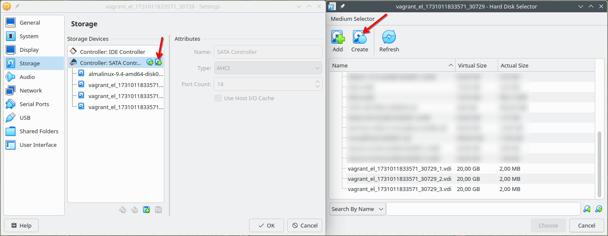

## practice: hard disk devices

**About this lab:** To practice working with hard disks, you will need some hard disks. When there are no physical hard disk available, you can use virtual disks in *VirtualBox* or *VMWare*.

For example, use the [Virtual Media Manager](https://www.virtualbox.org/manual/topics/storage.html#virtual-media-manager) of VirtualBox to create a couple of virtual hard disk files. In the VM's *Storage* settings, select the SATA controller and click the *Add Hard Disk* icon and in the *Hard Disk Selector* on the *Create* button (as shown in the image below).

You will then be presented with the *Create Virtual Hard Disk* wizard. In the following steps, select the *VDI* format, keep the default option to create a *dynamically allocated* hard disk, and select a size. The default is 20 GB, which is fine. It's relatively safe to choose a (much) larger size, as the disk image will only use the space that is actually written to it. For the exercise with `badblocks`, it's best to create a smaller disk, as it would take a very long time!

In the screenshot, we added 3 SATA disks of 20 GB each.

This setup can be used in the labs for the chapters on *partitions*, *file systems*, and *mounting*.

1. Use `lsblk` and `fdisk` to make a list of detected hard disk devices and their properties.

2. Use `dmesg` to look in the boot messages for information about the hard disks.

3. Verify that you can see the disk devices in `/dev`.

4. Turn off the virtual machine, add an **IDE disk** of size 128MB and boot.

    **Remark** that booting the VM now will probably fail because the system will try to boot from that new empty disk. When starting the VM in the VirtualBox GUI, press `F12`. This allows you to choose the device to boot from. Select the drive with the installed operating system.

5. Repeat exercises 1 - 3 and check that the new IDE disk is detected.

6. Install `lsscsi`, `lshw`, `hdparm`, and `sdparm`. Use them to find information about the disks.

    **Remark** that `smartctl` will not work on virtual disks. If you have access to a bare-metal Linux system, we recommend to try it there!

7. Use `badblocks` to completely erase the small IDE disk.

