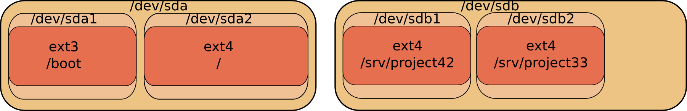
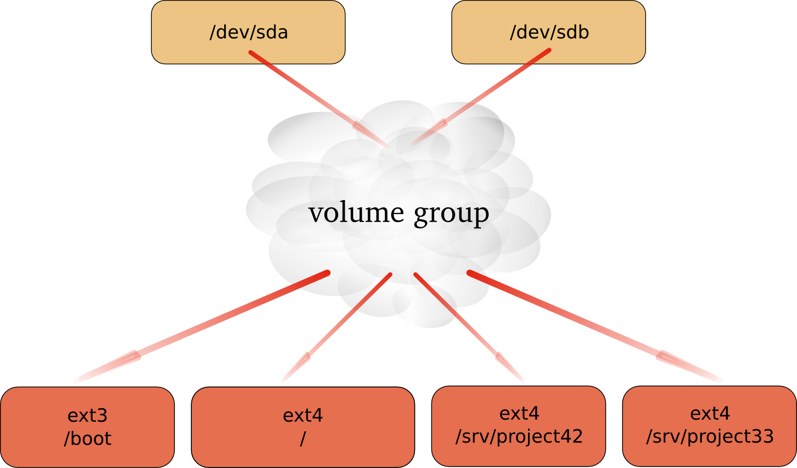

## introduction to lvm

### problems with standard partitions

There are some problems when working with hard disks and standard
partitions. Consider a system with a small and a large hard disk device,
partitioned like this. The first disk (/dev/sda) is partitioned in two,
the second disk (/dev/sdb) has two partitions and some empty space.

In the example above, consider the options when you want to enlarge the
space available for `/srv/project42`. What can you do ? The solution
will always force you to unmount the file system, take a backup of the
data, remove and recreate partitions, and then restore the data and
remount the file system.

### solution with lvm

Using `lvm` will create a virtual layer between the mounted file systems
and the hardware devices. This virtual layer will allow for an
administrator to enlarge a mounted file system in use. When `lvm` is
properly used, then there is no need to unmount the file system to
enlarge it.

## lvm terminology

### physical volume (pv)

A `physical volume` is any block device (a disk, a partition, a RAID
device or even an iSCSI device). All these devices can become a member
of a `volume group`.

The commands used to manage a `physical volume` start with pv.

    [root@centos65 ~]# pv
    pvchange   pvck       pvcreate   pvdisplay  pvmove     pvremove
    pvresize   pvs        pvscan

### volume group (vg)

A `volume group` is an abstraction layer between `block devices` and
`logical volumes`.

The commands used to manage a `volume group` start with vg.

    [root@centos65 ~]# vg
    vgcfgbackup    vgconvert      vgextend       vgmknodes      vgs
    vgcfgrestore   vgcreate       vgimport       vgreduce       vgscan
    vgchange       vgdisplay      vgimportclone  vgremove       vgsplit
    vgck           vgexport       vgmerge        vgrename

### logical volume (lv)

A `logical volume` is created in a `volume group`. Logical volumes that
contain a file system can be mounted. The use of `logical volumes` is
similar to the use of `partitions` and is accomplished with the same
standard commands (mkfs, mount, fsck, df, \...).

The commands used to manage a `logical volume` start with lv.

    [root@centos65 ~]# lv
    lvchange     lvextend     lvmdiskscan  lvmsar       lvresize     
    lvconvert    lvm          lvmdump      lvreduce     lvs          
    lvcreate     lvmchange    lvmetad      lvremove     lvscan       
    lvdisplay    lvmconf      lvmsadc      lvrename

## example: using lvm

This example shows how you can use a device (in this case /dev/sdc, but
it could have been /dev/sdb or any other disk or partition) with lvm,
how to create a volume group (vg) and how to create and use a logical
volume (vg/lvol0).

First thing to do, is create physical volumes that can join the volume
group with `pvcreate`. This command makes a disk or
partition available for use in Volume Groups. The screenshot shows how
to present the SCSI Disk device to LVM.

    root@RHEL4:~# pvcreate /dev/sdc
    Physical volume "/dev/sdc" successfully created

*Note: lvm `will` work fine when using the complete device, but another
operating system on the same computer (or on the same SAN) will not
recognize lvm and will mark the block device as being empty! You can
avoid this by creating a partition that spans the whole device, then run
`pvcreate` on the partition instead of the disk.*

Then `vgcreate` creates a volume group using one device.
Note that more devices could be added to the volume group.

    root@RHEL4:~# vgcreate vg /dev/sdc
    Volume group "vg" successfully created

The last step `lvcreate` creates a logical volume.

    root@RHEL4:~# lvcreate --size 500m vg
    Logical volume "lvol0" created

The logical volume /dev/vg/lvol0 can now be formatted with ext3, and
mounted for normal use.

    root@RHELv8u2:~# mke2fs -m0 -j /dev/vg/lvol0 
    mke2fs 1.35 (28-Feb-2004)
    Filesystem label=
    OS type: Linux
    Block size=1024 (log=0)
    Fragment size=1024 (log=0)
    128016 inodes, 512000 blocks
    0 blocks (0.00%) reserved for the super user
    First data block=1
    Maximum filesystem blocks=67633152
    63 block groups
    8192 blocks per group, 8192 fragments per group
    2032 inodes per group
    Superblock backups stored on blocks: 
    8193, 24577, 40961, 57345, 73729, 204801, 221185, 401409
                
    Writing inode tables: done                            
    Creating journal (8192 blocks): done
    Writing superblocks and filesystem accounting information: done
                
    This filesystem will be automatically checked every 37 mounts or
    180 days, whichever comes first.  Use tune2fs -c or -i to override.
    root@RHELv8u2:~# mkdir /home/project10
    root@RHELv8u2:~# mount /dev/vg/lvol0 /home/project10/
    root@RHELv8u2:~# df -h | grep proj
    /dev/mapper/vg-lvol0  485M   11M  474M   3% /home/project10

A logical volume is very similar to a partition, it can be formatted
with a file system, and can be mounted so users can access it.

## example: extend a logical volume

A logical volume can be extended without unmounting the file system.
Whether or not a volume can be extended depends on the file system it
uses. Volumes that are mounted as vfat or ext2 cannot be extended, so in
the example here we use the ext3 file system.

The fdisk command shows us newly added scsi-disks that will serve our
lvm volume. This volume will then be extended. First, take a look at
these disks.

    [root@RHEL5 ~]# fdisk -l | grep sd[bc]
    Disk /dev/sdb doesn't contain a valid partition table
    Disk /dev/sdc doesn't contain a valid partition table
    Disk /dev/sdb: 1181 MB, 1181115904 bytes
    Disk /dev/sdc: 429 MB, 429496320 bytes

You already know how to partition a disk, below the first disk is
partitioned (in one big primary partition), the second disk is left
untouched.

    [root@RHEL5 ~]# fdisk -l | grep sd[bc]
    Disk /dev/sdc doesn't contain a valid partition table
    Disk /dev/sdb: 1181 MB, 1181115904 bytes
    /dev/sdb1               1         143     1148616   83  Linux
    Disk /dev/sdc: 429 MB, 429496320 bytes

You also know how to prepare disks for lvm with
`pvcreate`, and how to create a volume group with
`vgcreate`. This example adds both the partitioned disk
and the untouched disk to the volume group named `vg2`.

    [root@RHEL5 ~]# pvcreate /dev/sdb1
      Physical volume "/dev/sdb1" successfully created
    [root@RHEL5 ~]# pvcreate /dev/sdc
      Physical volume "/dev/sdc" successfully created
    [root@RHEL5 ~]# vgcreate vg2 /dev/sdb1 /dev/sdc
      Volume group "vg2" successfully created

You can use `pvdisplay` to verify that both the disk and
the partition belong to the volume group.

    [root@RHEL5 ~]# pvdisplay | grep -B1 vg2
      PV Name               /dev/sdb1
      VG Name               vg2
    --
      PV Name               /dev/sdc
      VG Name               vg2

And you are familiar both with the `lvcreate` command to
create a small logical volume and the `mke2fs` command to
put ext3 on it.

    [root@RHEL5 ~]# lvcreate --size 200m vg2
      Logical volume "lvol0" created
    [root@RHEL5 ~]# mke2fs -m20 -j /dev/vg2/lvol0 
    ...

As you see, we end up with a mounted logical volume that according to
`df` is almost 200 megabyte in size.

    [root@RHEL5 ~]# mkdir /home/resizetest
    [root@RHEL5 ~]# mount /dev/vg2/lvol0 /home/resizetest/
    [root@RHEL5 ~]# df -h | grep resizetest
                          194M  5.6M  149M   4% /home/resizetest

Extending the volume is easy with `lvextend`.

    [root@RHEL5 ~]# lvextend -L +100 /dev/vg2/lvol0 
      Extending logical volume lvol0 to 300.00 MB
      Logical volume lvol0 successfully resized

But as you can see, there is a small problem: it appears that df is not
able to display the extended volume in its full size. This is because
the filesystem is only set for the size of the volume before the
extension was added.

    [root@RHEL5 ~]# df -h | grep resizetest
                          194M  5.6M  149M   4% /home/resizetest

With `lvdisplay` however we can see that the volume is
indeed extended.

    [root@RHEL5 ~]# lvdisplay /dev/vg2/lvol0 | grep Size
      LV Size                300.00 MB

To finish the extension, you need `resize2fs` to span the
filesystem over the full size of the logical volume.

    [root@RHEL5 ~]# resize2fs /dev/vg2/lvol0 
    resize2fs 1.39 (29-May-2006)
    Filesystem at /dev/vg2/lvol0 is mounted on /home/resizetest; on-line re\
    sizing required
    Performing an on-line resize of /dev/vg2/lvol0 to 307200 (1k) blocks.
    The filesystem on /dev/vg2/lvol0 is now 307200 blocks long. 

Congratulations, you just successfully expanded a logical volume.

    [root@RHEL5 ~]# df -h | grep resizetest
                          291M  6.1M  225M   3% /home/resizetest
    [root@RHEL5 ~]#

## example: resize a physical Volume

This is a humble demonstration of how to resize a physical Volume with
lvm (after you resize it with fdisk). The demonstration starts with a
100MB partition named /dev/sde1. We used fdisk to create it, and to
verify the size.

    [root@RHEL5 ~]# fdisk -l 2>/dev/null | grep sde1
    /dev/sde1               1         100      102384   83  Linux
    [root@RHEL5 ~]#

Now we can use pvcreate to create the Physical Volume, followed by pvs
to verify the creation.

    [root@RHEL5 ~]# pvcreate /dev/sde1
      Physical volume "/dev/sde1" successfully created
    [root@RHEL5 ~]# pvs | grep sde1
      /dev/sde1             lvm2 --    99.98M  99.98M
    [root@RHEL5 ~]#

The next step is to use fdisk to enlarge the partition (actually
deleting it and then recreating /dev/sde1 with more cylinders).

    [root@RHEL5 ~]# fdisk /dev/sde

    Command (m for help): p

    Disk /dev/sde: 858 MB, 858993152 bytes
    64 heads, 32 sectors/track, 819 cylinders
    Units = cylinders of 2048 * 512 = 1048576 bytes

       Device Boot      Start         End      Blocks   Id  System
    /dev/sde1               1         100      102384   83  Linux

    Command (m for help): d
    Selected partition 1

    Command (m for help): n
    Command action
       e   extended
       p   primary partition (1-4)
    p
    Partition number (1-4): 
    Value out of range.
    Partition number (1-4): 1
    First cylinder (1-819, default 1): 
    Using default value 1
    Last cylinder or +size or +sizeM or +sizeK (1-819, default 819): 200

    Command (m for help): w
    The partition table has been altered!

    Calling ioctl() to re-read partition table.
    Syncing disks.
    [root@RHEL5 ~]#

When we now use fdisk and pvs to verify the size of the partition and
the Physical Volume, then there is a size difference. LVM is still using
the old size.

    [root@RHEL5 ~]# fdisk -l 2>/dev/null | grep sde1
    /dev/sde1               1         200      204784   83  Linux
    [root@RHEL5 ~]# pvs | grep sde1
      /dev/sde1             lvm2 --    99.98M  99.98M
    [root@RHEL5 ~]#

Executing pvresize on the Physical Volume will make lvm aware of the
size change of the partition. The correct size can be displayed with
pvs.

    [root@RHEL5 ~]# pvresize /dev/sde1
      Physical volume "/dev/sde1" changed
      1 physical volume(s) resized / 0 physical volume(s) not resized
    [root@RHEL5 ~]# pvs | grep sde1
      /dev/sde1             lvm2 --   199.98M 199.98M
    [root@RHEL5 ~]#

## example: mirror a logical volume

We start by creating three physical volumes for lvm. Then we verify the
creation and the size with pvs. Three physical disks because lvm uses
two disks for the mirror and a third disk for the mirror log!

    [root@RHEL5 ~]# pvcreate /dev/sdb /dev/sdc /dev/sdd
      Physical volume "/dev/sdb" successfully created
      Physical volume "/dev/sdc" successfully created
      Physical volume "/dev/sdd" successfully created
    [root@RHEL5 ~]# pvs
      PV         VG         Fmt  Attr PSize   PFree  
      /dev/sdb              lvm2 --   409.60M 409.60M
      /dev/sdc              lvm2 --   409.60M 409.60M
      /dev/sdd              lvm2 --   409.60M 409.60M

Then we create the Volume Group and verify again with pvs. Notice how
the three physical volumes now belong to vg33, and how the size is
rounded down (in steps of the extent size, here 4MB).

    [root@RHEL5 ~]# vgcreate vg33 /dev/sdb /dev/sdc /dev/sdd
      Volume group "vg33" successfully created
    [root@RHEL5 ~]# pvs
      PV         VG         Fmt  Attr PSize   PFree  
      /dev/sda2  VolGroup00 lvm2 a-    15.88G      0 
      /dev/sdb   vg33       lvm2 a-   408.00M 408.00M
      /dev/sdc   vg33       lvm2 a-   408.00M 408.00M
      /dev/sdd   vg33       lvm2 a-   408.00M 408.00M
    [root@RHEL5 ~]#

The last step is to create the Logical Volume with `lvcreate`. Notice
the `-m 1` switch to create one mirror. Notice also the change in free
space in all three Physical Volumes!

    [root@RHEL5 ~]# lvcreate --size 300m -n lvmir -m 1 vg33 
      Logical volume "lvmir" created
    [root@RHEL5 ~]# pvs
      PV         VG         Fmt  Attr PSize   PFree  
      /dev/sda2  VolGroup00 lvm2 a-    15.88G      0 
      /dev/sdb   vg33       lvm2 a-   408.00M 108.00M
      /dev/sdc   vg33       lvm2 a-   408.00M 108.00M
      /dev/sdd   vg33       lvm2 a-   408.00M 404.00M

You can see the copy status of the mirror with lvs. It currently shows a
100 percent copy.

    [root@RHEL5 ~]# lvs vg33/lvmir
      LV    VG   Attr   LSize   Origin Snap%  Move Log        Copy% 
      lvmir vg33 mwi-ao 300.00M                    lvmir_mlog 100.00

## example: snapshot a logical volume

A snapshot is a virtual copy of all the data at a point in time on a
volume. A snapshot Logical Volume will retain a copy of all changed
files of the snapshotted Logical Volume.

The example below creates a snapshot of the bigLV Logical Volume.

    [root@RHEL5 ~]# lvcreate -L100M -s -n snapLV vg42/bigLV
      Logical volume "snapLV" created
    [root@RHEL5 ~]#

You can see with lvs that the snapshot snapLV is indeed a snapshot of
bigLV. Moments after taking the snapshot, there are few changes to bigLV
(0.02 percent).

    [root@RHEL5 ~]# lvs
      LV       VG         Attr   LSize   Origin Snap%  Move Log Copy%
      bigLV    vg42       owi-a- 200.00M                              
      snapLV   vg42       swi-a- 100.00M bigLV    0.02                
    [root@RHEL5 ~]#

But after using bigLV for a while, more changes are done. This means the
snapshot volume has to keep more original data (10.22 percent).

    [root@RHEL5 ~]# lvs | grep vg42
      bigLV    vg42       owi-ao 200.00M                              
      snapLV   vg42       swi-a- 100.00M bigLV   10.22                
    [root@RHEL5 ~]#

You can now use regular backup tools (dump, tar, cpio, \...) to take a
backup of the snapshot Logical Volume. This backup will contain all data
as it existed on bigLV at the time the snapshot was taken. When the
backup is done, you can remove the snapshot.

    [root@RHEL5 ~]# lvremove vg42/snapLV
    Do you really want to remove active logical volume "snapLV"? [y/n]: y
      Logical volume "snapLV" successfully removed
    [root@RHEL5 ~]#

## verifying existing physical volumes

### lvmdiskscan

To get a list of block devices that can be used with LVM, use
`lvmdiskscan`. The example below uses grep to limit the
result to SCSI devices.

    [root@RHEL5 ~]# lvmdiskscan | grep sd
      /dev/sda1                [      101.94 MB] 
      /dev/sda2                [       15.90 GB] LVM physical volume
      /dev/sdb                 [      409.60 MB] 
      /dev/sdc                 [      409.60 MB] 
      /dev/sdd                 [      409.60 MB] LVM physical volume
      /dev/sde1                [       95.98 MB] 
      /dev/sde5                [      191.98 MB] 
      /dev/sdf                 [      819.20 MB] LVM physical volume
      /dev/sdg1                [      818.98 MB] 
    [root@RHEL5 ~]#

### pvs

The easiest way to verify whether devices are known to lvm is with the
`pvs` command. The screenshot below shows that only
/dev/sda2 is currently known for use with LVM. It shows that /dev/sda2
is part of Volgroup00 and is almost 16GB in size. It also shows /dev/sdc
and /dev/sdd as part of vg33. The device /dev/sdb is knwon to lvm, but
not linked to any Volume Group.

    [root@RHEL5 ~]# pvs
      PV         VG         Fmt  Attr PSize   PFree  
      /dev/sda2  VolGroup00 lvm2 a-    15.88G      0 
      /dev/sdb              lvm2 --   409.60M 409.60M
      /dev/sdc   vg33       lvm2 a-   408.00M 408.00M
      /dev/sdd   vg33       lvm2 a-   408.00M 408.00M
    [root@RHEL5 ~]#

### pvscan

The `pvscan` command will scan all disks for existing
Physical Volumes. The information is similar to pvs, plus you get a line
with total sizes.

    [root@RHEL5 ~]# pvscan
      PV /dev/sdc    VG vg33         lvm2 [408.00 MB / 408.00 MB free]
      PV /dev/sdd    VG vg33         lvm2 [408.00 MB / 408.00 MB free]
      PV /dev/sda2   VG VolGroup00   lvm2 [15.88 GB / 0    free]
      PV /dev/sdb                    lvm2 [409.60 MB]
      Total: 4 [17.07 GB] / in use: 3 [16.67 GB] / in no VG: 1 [409.60 MB]
    [root@RHEL5 ~]#

### pvdisplay

Use `pvdisplay` to get more information about physical
volumes. You can also use `pvdisplay` without an argument to display
information about all physical (lvm) volumes.

    [root@RHEL5 ~]# pvdisplay /dev/sda2
      --- Physical volume ---
      PV Name               /dev/sda2
      VG Name               VolGroup00
      PV Size               15.90 GB / not usable 20.79 MB
      Allocatable           yes (but full)
      PE Size (KByte)       32768
      Total PE              508
      Free PE               0
      Allocated PE          508
      PV UUID               TobYfp-Ggg0-Rf8r-xtLd-5XgN-RSPc-8vkTHD
       
    [root@RHEL5 ~]#

## verifying existing volume groups

### vgs

Similar to `pvs` is the use of `vgs` to display a quick
overview of all volume groups. There is only one volume group in the
screenshot below, it is named VolGroup00 and is almost 16GB in size.

    [root@RHEL5 ~]# vgs
      VG         #PV #LV #SN Attr   VSize  VFree
      VolGroup00   1   2   0 wz--n- 15.88G    0 
    [root@RHEL5 ~]#

### vgscan

The `vgscan` command will scan all disks for existing
Volume Groups. It will also update the `/etc/lvm/.cache`
file. This file contains a list of all current lvm devices.

    [root@RHEL5 ~]# vgscan
      Reading all physical volumes.  This may take a while...
      Found volume group "VolGroup00" using metadata type lvm2
    [root@RHEL5 ~]#

LVM will run the vgscan automatically at boot-up, so if you add hot swap
devices, then you will need to run vgscan to update /etc/lvm/.cache with
the new devices.

### vgdisplay

The `vgdisplay` command will give you more detailed
information about a volume group (or about all volume groups if you omit
the argument).

    [root@RHEL5 ~]# vgdisplay VolGroup00
      --- Volume group ---
      VG Name               VolGroup00
      System ID             
      Format                lvm2
      Metadata Areas        1
      Metadata Sequence No  3
      VG Access             read/write
      VG Status             resizable
      MAX LV                0
      Cur LV                2
      Open LV               2
      Max PV                0
      Cur PV                1
      Act PV                1
      VG Size               15.88 GB
      PE Size               32.00 MB
      Total PE              508
      Alloc PE / Size       508 / 15.88 GB
      Free  PE / Size       0 / 0   
      VG UUID               qsXvJb-71qV-9l7U-ishX-FobM-qptE-VXmKIg
       
    [root@RHEL5 ~]#

## verifying existing logical volumes

### lvs

Use `lvs` for a quick look at all existing logical
volumes. Below you can see two logical volumes named LogVol00 and
LogVol01.

    [root@RHEL5 ~]# lvs
      LV       VG         Attr   LSize  Origin Snap%  Move Log Copy% 
      LogVol00 VolGroup00 -wi-ao 14.88G                              
      LogVol01 VolGroup00 -wi-ao  1.00G                              
    [root@RHEL5 ~]#

### lvscan

The `lvscan` command will scan all disks for existing
Logical Volumes.

    [root@RHEL5 ~]# lvscan
      ACTIVE            '/dev/VolGroup00/LogVol00' [14.88 GB] inherit
      ACTIVE            '/dev/VolGroup00/LogVol01' [1.00 GB] inherit
    [root@RHEL5 ~]#

### lvdisplay

More detailed information about logical volumes is available through the
`lvdisplay(1)` command.

    [root@RHEL5 ~]# lvdisplay VolGroup00/LogVol01
      --- Logical volume ---
      LV Name                /dev/VolGroup00/LogVol01
      VG Name                VolGroup00
      LV UUID                RnTGK6-xWsi-t530-ksJx-7cax-co5c-A1KlDp
      LV Write Access        read/write
      LV Status              available
      # open                 1
      LV Size                1.00 GB
      Current LE             32
      Segments               1
      Allocation             inherit
      Read ahead sectors     0
      Block device           253:1
       
    [root@RHEL5 ~]#

## manage physical volumes

### pvcreate

Use the `pvcreate` command to add devices to lvm. This
example shows how to add a disk (or hardware RAID device) to lvm.

    [root@RHEL5 ~]# pvcreate /dev/sdb
      Physical volume "/dev/sdb" successfully created
    [root@RHEL5 ~]#

This example shows how to add a partition to lvm.

    [root@RHEL5 ~]# pvcreate /dev/sdc1
      Physical volume "/dev/sdc1" successfully created
    [root@RHEL5 ~]#

You can also add multiple disks or partitions as target to pvcreate.
This example adds three disks to lvm.

    [root@RHEL5 ~]# pvcreate /dev/sde /dev/sdf /dev/sdg
      Physical volume "/dev/sde" successfully created
      Physical volume "/dev/sdf" successfully created
      Physical volume "/dev/sdg" successfully created
    [root@RHEL5 ~]#

### pvremove

Use the `pvremove` command to remove physical volumes from
lvm. The devices may not be in use.

    [root@RHEL5 ~]# pvremove /dev/sde /dev/sdf /dev/sdg
      Labels on physical volume "/dev/sde" successfully wiped
      Labels on physical volume "/dev/sdf" successfully wiped
      Labels on physical volume "/dev/sdg" successfully wiped
    [root@RHEL5 ~]#

### pvresize

When you used fdisk to resize a partition on a disk, then you must use
`pvresize` to make lvm recognize the new size of the
physical volume that represents this partition.

    [root@RHEL5 ~]# pvresize /dev/sde1
      Physical volume "/dev/sde1" changed
      1 physical volume(s) resized / 0 physical volume(s) not resized

### pvchange

With `pvchange` you can prevent the allocation of a
Physical Volume in a new Volume Group or Logical Volume. This can be
useful if you plan to remove a Physical Volume.

    [root@RHEL5 ~]# pvchange -xn /dev/sdd
      Physical volume "/dev/sdd" changed
      1 physical volume changed / 0 physical volumes not changed
    [root@RHEL5 ~]#

To revert your previous decision, this example shows you how te
re-enable the Physical Volume to allow allocation.

    [root@RHEL5 ~]# pvchange -xy /dev/sdd
      Physical volume "/dev/sdd" changed
      1 physical volume changed / 0 physical volumes not changed
    [root@RHEL5 ~]#

### pvmove

With `pvmove` you can move Logical Volumes from within a
Volume Group to another Physical Volume. This must be done before
removing a Physical Volume.

    [root@RHEL5 ~]# pvs | grep vg1
      /dev/sdf   vg1        lvm2 a-   816.00M      0 
      /dev/sdg   vg1        lvm2 a-   816.00M 816.00M
    [root@RHEL5 ~]# pvmove /dev/sdf
      /dev/sdf: Moved: 70.1%
      /dev/sdf: Moved: 100.0%
    [root@RHEL5 ~]# pvs | grep vg1
      /dev/sdf   vg1        lvm2 a-   816.00M 816.00M
      /dev/sdg   vg1        lvm2 a-   816.00M      0

## manage volume groups

### vgcreate

Use the `vgcreate` command to create a volume group. You
can immediately name all the physical volumes that span the volume
group.

    [root@RHEL5 ~]# vgcreate vg42 /dev/sde /dev/sdf
      Volume group "vg42" successfully created
    [root@RHEL5 ~]#

### vgextend

Use the `vgextend` command to extend an existing volume
group with a physical volume.

    [root@RHEL5 ~]# vgextend vg42 /dev/sdg
      Volume group "vg42" successfully extended
    [root@RHEL5 ~]#

### vgremove

Use the `vgremove` command to remove volume groups from
lvm. The volume groups may not be in use.

    [root@RHEL5 ~]# vgremove vg42
      Volume group "vg42" successfully removed
    [root@RHEL5 ~]#

### vgreduce

Use the `vgreduce` command to remove a Physical Volume
from the Volume Group.

The following example adds Physical Volume /dev/sdg to the vg1 Volume
Group using vgextend. And then removes it again using vgreduce.

    [root@RHEL5 ~]# pvs | grep sdg
      /dev/sdg              lvm2 --   819.20M 819.20M
    [root@RHEL5 ~]# vgextend vg1 /dev/sdg
      Volume group "vg1" successfully extended
    [root@RHEL5 ~]# pvs | grep sdg
      /dev/sdg   vg1        lvm2 a-   816.00M 816.00M
    [root@RHEL5 ~]# vgreduce vg1 /dev/sdg
      Removed "/dev/sdg" from volume group "vg1"
    [root@RHEL5 ~]# pvs | grep sdg
      /dev/sdg              lvm2 --   819.20M 819.20M

### vgchange

Use the `vgchange` command to change parameters of a
Volume Group.

This example shows how to prevent Physical Volumes from being added or
removed to the Volume Group vg1.

    [root@RHEL5 ~]# vgchange -xn vg1
      Volume group "vg1" successfully changed
    [root@RHEL5 ~]# vgextend vg1 /dev/sdg
      Volume group vg1 is not resizable.

You can also use vgchange to change most other properties of a Volume
Group. This example changes the maximum number of Logical Volumes and
maximum number of Physical Volumes that vg1 can serve.

    [root@RHEL5 ~]# vgdisplay vg1 | grep -i max
      MAX LV                0
      Max PV                0
    [root@RHEL5 ~]# vgchange -l16 vg1
      Volume group "vg1" successfully changed
    [root@RHEL5 ~]# vgchange -p8 vg1
      Volume group "vg1" successfully changed
    [root@RHEL5 ~]# vgdisplay vg1 | grep -i max
      MAX LV                16
      Max PV                8

### vgmerge

Merging two Volume Groups into one is done with `vgmerge`.
The following example merges vg2 into vg1, keeping all the properties of
vg1.

    [root@RHEL5 ~]# vgmerge vg1 vg2
      Volume group "vg2" successfully merged into "vg1"
    [root@RHEL5 ~]#

## manage logical volumes

### lvcreate

Use the `lvcreate` command to create Logical Volumes in a
Volume Group. This example creates an 8GB Logical Volume in Volume Group
vg42.

    [root@RHEL5 ~]# lvcreate -L5G vg42
      Logical volume "lvol0" created
    [root@RHEL5 ~]#

As you can see, lvm automatically names the Logical Volume
`lvol0`. The next example creates a 200MB Logical Volume
named MyLV in Volume Group vg42.

    [root@RHEL5 ~]# lvcreate -L200M -nMyLV vg42
      Logical volume "MyLV" created
    [root@RHEL5 ~]#

The next example does the same thing, but with different syntax.

    [root@RHEL5 ~]# lvcreate --size 200M -n MyLV vg42
      Logical volume "MyLV" created
    [root@RHEL5 ~]#

This example creates a Logical Volume that occupies 10 percent of the
Volume Group.

    [root@RHEL5 ~]# lvcreate -l 10%VG -n MyLV2 vg42
      Logical volume "MyLV2" created
    [root@RHEL5 ~]#

This example creates a Logical Volume that occupies 30 percent of the
remaining free space in the Volume Group.

    [root@RHEL5 ~]# lvcreate -l 30%FREE -n MyLV3 vg42
      Logical volume "MyLV3" created
    [root@RHEL5 ~]#

### lvremove

Use the `lvremove` command to remove Logical Volumes from
a Volume Group. Removing a Logical Volume requires the name of the
Volume Group.

    [root@RHEL5 ~]# lvremove vg42/MyLV
    Do you really want to remove active logical volume "MyLV"? [y/n]: y
      Logical volume "MyLV" successfully removed
    [root@RHEL5 ~]#

Removing multiple Logical Volumes will request confirmation for each
individual volume.

    [root@RHEL5 ~]# lvremove vg42/MyLV vg42/MyLV2 vg42/MyLV3
    Do you really want to remove active logical volume "MyLV"? [y/n]: y
      Logical volume "MyLV" successfully removed
    Do you really want to remove active logical volume "MyLV2"? [y/n]: y
      Logical volume "MyLV2" successfully removed
    Do you really want to remove active logical volume "MyLV3"? [y/n]: y
      Logical volume "MyLV3" successfully removed
    [root@RHEL5 ~]#

### lvextend

Extending the volume is easy with `lvextend`. This example
extends a 200MB Logical Volume with 100 MB.

    [root@RHEL5 ~]# lvdisplay /dev/vg2/lvol0 | grep Size
      LV Size                200.00 MB
    [root@RHEL5 ~]# lvextend -L +100 /dev/vg2/lvol0
      Extending logical volume lvol0 to 300.00 MB
      Logical volume lvol0 successfully resized
    [root@RHEL5 ~]# lvdisplay /dev/vg2/lvol0 | grep Size
      LV Size                300.00 MB

The next example creates a 100MB Logical Volume, and then extends it to
500MB.

    [root@RHEL5 ~]# lvcreate --size 100M -n extLV vg42
      Logical volume "extLV" created
    [root@RHEL5 ~]# lvextend -L 500M vg42/extLV
      Extending logical volume extLV to 500.00 MB
      Logical volume extLV successfully resized
    [root@RHEL5 ~]#

This example doubles the size of a Logical Volume.

    [root@RHEL5 ~]# lvextend -l+100%LV vg42/extLV
      Extending logical volume extLV to 1000.00 MB
      Logical volume extLV successfully resized
    [root@RHEL5 ~]#

### lvrename

Renaming a Logical Volume is done with `lvrename`. This
example renames extLV to bigLV in the vg42 Volume Group.

    [root@RHEL5 ~]# lvrename vg42/extLV vg42/bigLV
      Renamed "extLV" to "bigLV" in volume group "vg42"
    [root@RHEL5 ~]#

