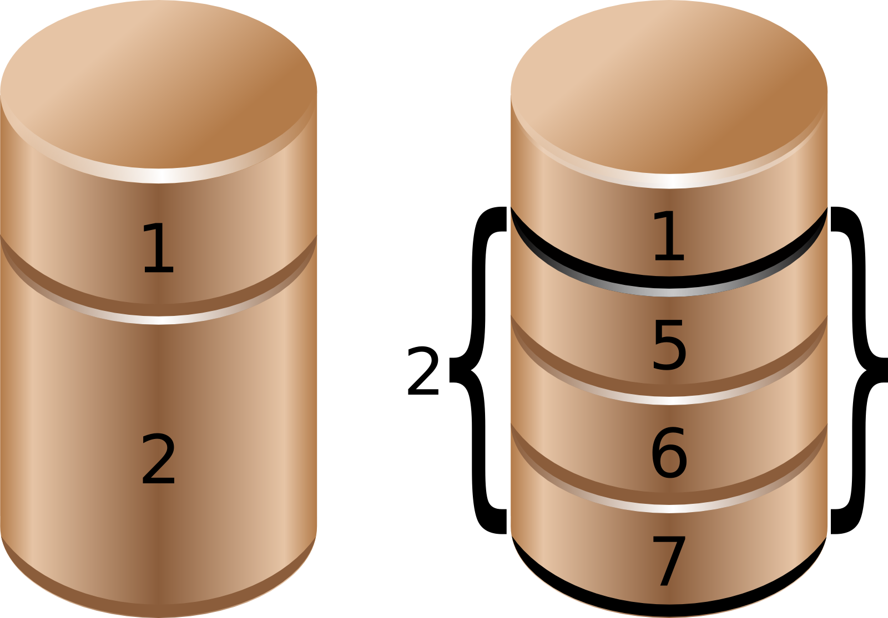

## about partitions

### primary, extended and logical

Linux requires you to create one or more **partitions**. The next paragraphs will explain how to create and use partitions.

A partition's *geometry* and size is usually defined by a starting and ending cylinder (sometimes by sector). Partitions can be of type **primary** (maximum four), **extended** (maximum one) or **logical** (contained within the extended partition). Each partition has a *type field* that contains a code. This determines the computer's operating system or the partitions file system.

| Partition Type   | naming |
| :--------------- | :----- |
| Primary (max 4)  | 1-4    |
| Extended (max 1) | 1-4    |
| Logical          | 5-     |

### partition naming

We saw before that hard disk devices are named `/dev/sdx` with `x` depending on the hardware configuration. Next is the partition number, starting the count at 1. Hence the four (possible) primary partitions are numbered 1 to 4. Logical partition counting always starts at 5. Thus `/dev/sda2` is the second partition on the first SATA hard disk device, and `/dev/sdb5` is the first logical partition on the second SATA hard disk device.

| partition   | device                                             |
| :---------- | :------------------------------------------------- |
| `/dev/sda1` | first primary partition on `/dev/sda`              |
| `/dev/sda2` | second primary or extended partition on `/dev/sda` |
| `/dev/sda5` | first logical drive on `/dev/sda`                  |
| `/dev/sdb6` | second logical on `/dev/sdb`                       |


The picture below shows two (spindle) disks with partitions. Note that an extended partition is a container holding logical drives.



## discovering partitions

### fdisk -l

In the `fdisk -l` example below you can see that two partitions exist on `/dev/sdb`. The first partition spans 31 cylinders and contains a Linux swap partition. The second partition is much bigger.

```console
student@linux:~$ sudo fdisk -l /dev/sdb

Disk /dev/sdb: 100.0 GB, 100030242816 bytes
255 heads, 63 sectors/track, 12161 cylinders
Units = cylinders of 16065 * 512 = 8225280 bytes

    Device Boot    Start      End     Blocks   Id  System
/dev/sdb1             1       31     248976   82  Linux swap / Solaris
/dev/sdb2            32    12161   97434225   83  Linux
```

### /proc/partitions

The `/proc/partitions` file contains a table with major and minor number of partitioned devices, their number of blocks and the device name in `/dev`. Verify with
`/proc/devices` to link the major number to the proper device.

```console
student@linux:~$ cat /proc/partitions 
major minor  #blocks  name

3     0     524288 hda
3    64     734003 hdb
8     0    8388608 sda
8     1     104391 sda1
8     2    8281507 sda2
8    16    1048576 sdb
8    32    1048576 sdc
8    48    1048576 sdd
253     0    7176192 dm-0
253     1    1048576 dm-1
```

The *major* number corresponds to the device type (or driver) and can be found in `/proc/devices`. In this case 3 corresponds to `ide` and 8 to `sd`. The `major` number determines the `device driver` to be used with this device.

The *minor* number is a unique identification of an instance of this device type. The `devices.txt`[^part_devices] file in the Linux kernel source tree contains a full list of major and minor numbers.

[^part_devices]: See e.g. <https://git.kernel.org/pub/scm/linux/kernel/git/torvalds/linux.git/tree/Documentation/admin-guide/devices.txt?h=v6.12>

### parted and others

You may be interested in alternatives to `fdisk` like `parted`, `cfdisk`, `sfdisk` and `gparted`. This course mainly uses `fdisk` to partition hard disks.

`parted` is recommended by some Linux distributions for handling storage with `gpt` instead of `mbr`.

Below a screenshot of `parted` on Enterprise Linux.

```console
[vagrant@el ~]$ rpm -q parted
parted-3.5-2.el9.x86_64
[vagrant@el ~]$ sudo parted /dev/sdb
GNU Parted 3.5
Using /dev/sdb
Welcome to GNU Parted! Type 'help' to view a list of commands.
(parted) print                                                            
Model: ATA VBOX HARDDISK (scsi)
Disk /dev/sdb: 21.5GB
Sector size (logical/physical): 512B/512B
Partition Table: msdos
Disk Flags: 

Number  Start   End     Size    Type     File system  Flags
 1      1049kB  5370MB  5369MB  primary  ext4
 2      5370MB  10.7GB  5369MB  primary  xfs
 3      10.7GB  16.1GB  5369MB  primary  ext3
 4      16.1GB  21.5GB  5368MB  primary  ntfs

(parted) quit
```

## partitioning new disks

In the example below, we bought a new disk for our system. After the new hardware is properly attached, you can use `fdisk` or `parted` to create the necessary partition(s). This example uses `fdisk`, but there is nothing wrong with using `parted`.

### recognising the disk

First, we check with `fdisk -l` whether Linux can see the new disk. Yes it does, the new disk is seen as /dev/sdb, but it does not have any
partitions yet.

```console
student@linux:~$ sudo fdisk -l

Disk /dev/sda: 12.8 GB, 12884901888 bytes
255 heads, 63 sectors/track, 1566 cylinders
Units = cylinders of 16065 * 512 = 8225280 bytes

Device Boot      Start      End      Blocks   Id  System
/dev/sda1   *       1        13      104391   83  Linux
/dev/sda2          14      1566    12474472+  8e  Linux LVM

Disk /dev/sdb: 1073 MB, 1073741824 bytes
255 heads, 63 sectors/track, 130 cylinders
Units = cylinders of 16065 * 512 = 8225280 bytes

Disk /dev/sdb doesn't contain a valid partition table
```

### opening the disk with fdisk

Then we create a partition with fdisk on `/dev/sdb`. First we start the fdisk tool with `/dev/sdb` as argument. Be very very careful not to
partition the wrong disk!!

```console
student@linux:~$ fdisk /dev/sdb
Device contains neither a valid DOS partition table, nor Sun, SGI...
Building a new DOS disklabel. Changes will remain in memory only,
until you decide to write them. After that, of course, the previous
content won't be recoverable.

Warning: invalid flag 0x0000 of partition table 4 will be corrected...
```

### empty partition table

Inside the fdisk tool, we can issue the `p` command to see the current disks partition table.

```console
Command (m for help): p
        
Disk /dev/sdb: 1073 MB, 1073741824 bytes
255 heads, 63 sectors/track, 130 cylinders
Units = cylinders of 16065 * 512 = 8225280 bytes
        
Device Boot      Start         End      Blocks   Id  System
```

### create a new partition

No partitions exist yet, so we issue `n` to create a new partition. We choose p for primary, 1 for the partition number, 1 for the start cylinder and 14 for the end cylinder.

```console
Command (m for help): n
Command action
e   extended
p   primary partition (1-4)
p
Partition number (1-4): 1
First cylinder (1-130, default 1): 
Using default value 1
Last cylinder or +size or +sizeM or +sizeK (1-130, default 130): 14
```

We can now issue p again to verify our changes, but they are not yet written to disk. This means we can still cancel this operation! But it looks good, so we use `w` to write the changes to disk, and then quit the fdisk tool.

```console
Command (m for help): p
    
Disk /dev/sdb: 1073 MB, 1073741824 bytes
255 heads, 63 sectors/track, 130 cylinders
Units = cylinders of 16065 * 512 = 8225280 bytes
        
Device Boot      Start         End      Blocks   Id  System
/dev/sdb1               1          14      112423+  83  Linux
        
Command (m for help): w
The partition table has been altered!
        
Calling ioctl() to re-read partition table.
Syncing disks.
```

### display the new partition

Let's verify again with `fdisk -l` to make sure reality fits our dreams. Indeed, the screenshot below now shows a partition on `/dev/sdb`.

```console
student@linux:~$ sudo fdisk -l

Disk /dev/sda: 12.8 GB, 12884901888 bytes
255 heads, 63 sectors/track, 1566 cylinders
Units = cylinders of 16065 * 512 = 8225280 bytes

Device Boot      Start        End      Blocks   Id  System
/dev/sda1   *        1         13      104391   83  Linux
/dev/sda2           14       1566    12474472+  8e  Linux LVM

Disk /dev/sdb: 1073 MB, 1073741824 bytes
255 heads, 63 sectors/track, 130 cylinders
Units = cylinders of 16065 * 512 = 8225280 bytes

Device Boot      Start         End      Blocks   Id  System
/dev/sdb1               1          14      112423+  83  Linux
```

## about the partition table

### master boot record

The **partition table** information (primary and extended partitions) is written in the **master boot record** or `mbr`. You can use `dd` to copy the mbr to a file.

This example copies the master boot record from the first SATA hard disk.

```bash
dd if=/dev/sda of=/SCSIdisk.mbr bs=512 count=1
```

The same tool can also be used to wipe out all information about partitions on a disk. This example writes zeroes over the master boot record.

```bash
dd if=/dev/zero of=/dev/sda bs=512 count=1
```

Or to wipe out the whole partition or disk.

```bash
dd if=/dev/zero of=/dev/sda
```

### partprobe

Don't forget that after restoring a *master boot record* with `dd`, that you need to force the kernel to reread the partition table with `partprobe`. After running `partprobe`, the partitions can be used again.

```console
[student@linux ~]$ sudo partprobe 
```

### logical drives

The *partition table* does not contain information about *logical drives*. So the `dd` backup of the `mbr` only works for primary and extended partitions. To backup the partition table including the logical drives, you can use `sfdisk`.

This example shows how to backup all partition and logical drive information to a file.

```bash
sfdisk -d /dev/sda > parttable.sda.sfdisk
```

The following example copies the `mbr` and all *logical drives* info from `/dev/sda` to `/dev/sdb`.

```bash
sfdisk -d /dev/sda | sfdisk /dev/sdb
```

## GUID partition table

`gpt` was developed because of the limitations of the 1980s `mbr` partitioning scheme (for example only four partitions can be defined, and they have a maximum size two terabytes).

Since 2010 `gpt` is a part of the `uefi` specification, but it is also used on `bios` systems.

Newer versions of `fdisk` work fine with `gpt`, but most production servers today (mid 2015) still have an older `fdisk.`. You can use `parted` instead.

## labeling with parted

`parted` is an interactive tool, just like `fdisk`. Type `help` in `parted` for a list of commands and options.

This screenshot shows how to start `parted` to manage partitions on `/dev/sdb`.

```console
[student@linux ~]$ sudo parted /dev/sdb
GNU Parted 3.1
Using /dev/sdb
Welcome to GNU Parted! Type 'help' to view a list of commands.
(parted)
```

Each command also has built-in help. For example `help mklabel` will list all supported labels. Note that we only discussed `mbr` (msdos) and `gpt` in this book.

```console
(parted) help mklabel
    mklabel,mktable LABEL-TYPE             create a new disklabel (partition table)

    LABEL-TYPE is one of: aix, amiga, bsd, dvh, gpt, mac, msdos, pc98, sun, loop
```

We create an `mbr` label.

```console
(parted) mklabel msdos>
Warning: The existing disk label on /dev/sdb will be destroyed and all data on
this disk will be lost. Do you want to continue?
Yes/No? yes
(parted) mklabel gpt
Warning: The existing disk label on /dev/sdb will be destroyed and all data on
this disk will be lost. Do you want to continue?
Yes/No? Y
```

### partitioning with parted

Once labeled it is easy to create partitions with `parted`. This screenshot starts with an unpartitioned (but `gpt` labeled) disk.

```console
(parted) print
Model: ATA VBOX HARDDISK (scsi)
Disk /dev/sdb: 8590MB
Sector size (logical/physical): 512B/512B
Partition Table: gpt
Disk Flags:

Number  Start  End  Size  File system  Name  Flags

(parted)
```

This example shows how to create two primary partitions of equal size.

```console
(parted) mkpart primary 0 50%
Warning: The resulting partition is not properly aligned for best performance.
Ignore/Cancel? I
(parted) mkpart primary 50% 100%
(parted)
```

Verify with `print` and exit with `quit`. Since `parted` works directly on the disk, there is no need to `w(rite)` like in `fdisk`.

```console
(parted) print
Model: ATA VBOX HARDDISK (scsi)
Disk /dev/sdb: 8590MB
Sector size (logical/physical): 512B/512B
Partition Table: gpt
Disk Flags:

Number  Start   End     Size    File system  Name     Flags
    1      17.4kB  4295MB  4295MB               primary
    2      4295MB  8589MB  4294MB               primary

(parted) quit
Information: You may need to update /etc/fstab.
```

