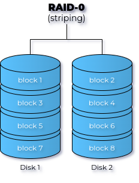
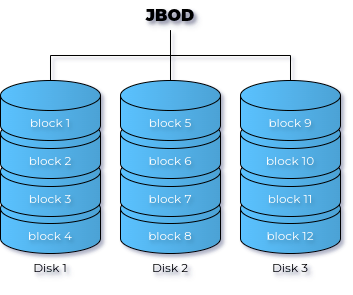
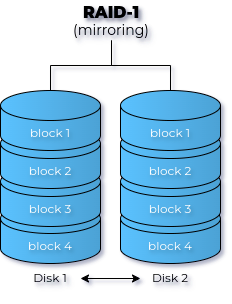
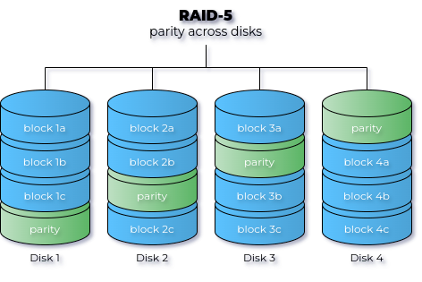
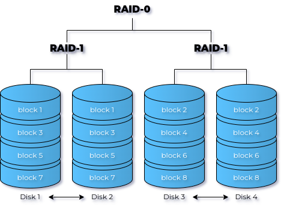

## raid levels

Before we dive in to the practical part of creating a *raid* array, let's first discuss the different *raid* levels. Be aware that only some of these levels are "standardized". Some hardware vendors have defined their own proprietary *raid* levels.

Deciding on which *raid level* to choose depends on the requirements of the specific use case and the available budget. Often, the result is a compromise between performance, redundancy and cost.

### raid 0

**raid 0** uses two or more disks, and is often called *striping* (or *stripe set*, or *striped volume*). Data is divided in *chunks*, evenly spread across every disk in the array. The main advantage of *raid 0* is that the performance is higher than a single disk. *raid 0* is the only *raid* level without redundancy. When one disk fails, all data is lost.



### jbod

**jbod** (Just a Bunch Of Disks) uses two or more disks, and is often called *concatenating* (or *spanning*, *spanned set*, or *spanned volume*). Data is written to the first disk, until it is full. Then data is written to the second disk, etc. The main advantage of *jbod* is that you can create *larger drives* than the space available on a single disk. However, JBOD offers no redundancy and no performance gain.



### raid 1

**raid 1** uses exactly two disks, and is often called *mirroring* (or *mirror set*, or *mirrored volume*). All data written to the array is written on each disk. The main advantage of *raid 1* is *redundancy*. The main disadvantage is that you lose at least half of your available disk space (in other words, you at least double the cost).



### raid 2, 3 and 4?

**raid 2** uses bit level striping, *raid 3* byte level, and *raid 4* is the same as *raid 5* (see below), but with a dedicated parity disk (we'll explain parity in the next section). This is actually slower than *raid 5*, because every write would have to write parity to this one (bottleneck) disk. It is unlikely that you will ever see these *raid* levels in production.

### raid 5

*raid 5* uses three or more disks, each divided into chunks. Every
time chunks are written to the array, one of the disks will receive a
*parity* chunk. Unlike *raid 4*, the parity chunk will
alternate between all disks. The main advantage of this is that *raid 5*
will allow for full data recovery in case of *one* hard disk failure.



*Parity* is a method to reconstruct data when one disk fails. When data is written to one of the disks of the array, e.g. a byte with binary representation `0100 1110`, it is combined with the data on the same position on one of the other disks, e.g. `1010 1011`, using the logical XOR operation:

|   A   |   B   | A XOR B |
| :---: | :---: | :-----: |
|   0   |   0   |    0    |
|   0   |   1   |    1    |
|   1   |   0   |    1    |
|   1   |   1   |    0    |

The result for the example above would be:

|        |    data     |
| :----: | :---------: |
| disk 1 | `0100 1110` |
| disk 2 | `1010 1011` |
| parity | `1110 0101` |

This parity byte is then written to the third disk of the array. When either disk fails, all data on that disk can be reconstructed by XOR-ing the data on the two remaining disks. For example, when disk 1 fails, the data on disk 2 can be reconstructed by XOR-ing the data on disk 2 and the parity byte:

|        |    data     |
| :----: | :---------: |
| disk 2 | `1010 1011` |
| parity | `1110 0101` |
| result | `0100 1110` |

This also works for arrays with more than 3 disks. For example in an array with four disks, first XOR new data with the corresponding data on a second disk, then XOR the result with the data on the third disk to get the parity data and store that on the fourth disk.

### raid 6

*raid 6* is very similar to *raid 5*, but uses two parity chunks. *raid 6* protects against two hard disk failures. Oracle Solaris *zfs* calls this *raidz2* (and also had *raidz3* with triple parity).

### raid 0+1

*raid 0+1* is a mirror(1) of stripes(0). This means you first create two *raid 0 stripe* sets, and then you set them up as a mirror set. For example, when you have six 100GB disks, then the stripe sets are each 300GB. Combined in a mirror, this makes 300GB total. *raid 0+1* will survive one disk failure. It will only survive the second disk failure if this disk is in the same stripe set as the previous failed disk.

### raid 1+0

*raid 1+0* (also called *raid 10*) is a stripe(0) of mirrors(1). For example, when you have six 100GB disks, then you first create three mirrors of 100GB each. You then stripe them together into a 300GB drive. In this example, as long as not all disks in the same mirror fail, it can survive up to three hard disk failures.



### raid 50

*raid 5+0* is a stripe(0) of *raid 5* arrays. Suppose you have nine
disks of 100GB, then you can create three *raid 5* arrays of 200GB each.
You can then combine them into one large stripe set.

### many others

There are many other nested *raid* combinations, like *raid* 30, 51, 60,
100, 150, ...

## building a software raid5 array

In this section, we'll show how to create a software *raid 5* array. If you want to try this yourself, you can create a VM with three (extra) disks. We prepared a Vagrant environment that you can use for this purpose in the Github repository <https://github.com/HoGentTIN/linux-training-labs>. Clone the repository, open a terminal in subdirectory `raid/` and run the command `vagrant up`. This will create a VM with name `raidsrv` that has three extra empty disks of 5GB each.

The `mdadm` command that is used to manage raid arrays is already installed. If it isn't on your lab instance, install it with the package manager of your distribution.

### do we have three disks?

Log in to the vm with `vagrant ssh` and check with `lsblk` that the empty disks are connected.

```console
[vagrant@raidsrv ~]$ lsblk
NAME   MAJ:MIN RM SIZE RO TYPE MOUNTPOINTS
sda      8:0    0  64G  0 disk 
├─sda1   8:1    0   2G  0 part [SWAP]
└─sda2   8:2    0  62G  0 part /
sdb      8:16   0   5G  0 disk 
sdc      8:32   0   5G  0 disk 
sdd      8:48   0   5G  0 disk 
```

Disk `/dev/sda` is where the OS is installed (AlmaLinux 9, which you can check by running `cat /etc/os-release`). Disks `/dev/sdb`, `/dev/sdc` and `/dev/sdd` are the three empty disks we will use to create the *raid 5* array.

### fd partition type

The next step is to create a partition of type `fd` on every disk. The `fd` type is to set the partition as *Linux RAID autodetect*. Use the `L` command (not shown in the screenshot) to list all partition types and find `fd`.

```console
[vagrant@raidsrv ~]$ sudo fdisk /dev/sdb

Welcome to fdisk (util-linux 2.37.4).
Changes will remain in memory only, until you decide to write them.
Be careful before using the write command.

Device does not contain a recognized partition table.
Created a new DOS disklabel with disk identifier 0x8c2b2c46.

Command (m for help): n
Partition type
   p   primary (0 primary, 0 extended, 4 free)
   e   extended (container for logical partitions)
Select (default p): p
Partition number (1-4, default 1): 
First sector (2048-10485759, default 2048): 
Last sector, +/-sectors or +/-size{K,M,G,T,P} (2048-10485759, default 10485759): 

Created a new partition 1 of type 'Linux' and of size 5 GiB.

Command (m for help): t
Selected partition 1
Hex code or alias (type L to list all): fd
Changed type of partition 'Linux' to 'Linux raid autodetect'.

Command (m for help): w
The partition table has been altered.
Calling ioctl() to re-read partition table.
Syncing disks.
```

Repeat this for `/dev/sdc` and `/dev/sdd`. Afterwards, verify the layout with `lsblk` and `fdisk`:

```console
[vagrant@raidsrv ~]$ lsblk
NAME   MAJ:MIN RM SIZE RO TYPE MOUNTPOINTS
sda      8:0    0  64G  0 disk 
├─sda1   8:1    0   2G  0 part [SWAP]
└─sda2   8:2    0  62G  0 part /
sdb      8:16   0   5G  0 disk 
└─sdb1   8:17   0   5G  0 part 
sdc      8:32   0   5G  0 disk 
└─sdc1   8:33   0   5G  0 part 
sdd      8:48   0   5G  0 disk 
└─sdd1   8:49   0   5G  0 part 
[vagrant@raidsrv ~]$ sudo fdisk -l | grep raid
/dev/sdb1        2048 10485759 10483712   5G fd Linux raid autodetect
/dev/sdc1        2048 10485759 10483712   5G fd Linux raid autodetect
/dev/sdd1        2048 10485759 10483712   5G fd Linux raid autodetect
```

### create the raid5

We create the *raid 5* array with the `mdadm` command:

```console
[vagrant@raidsrv ~]$ sudo mdadm --create /dev/md0 --chunk=64 --level=5 --raid-devices=3 /dev/sdb1 /dev/sdc1 /dev/sdd1
mdadm: Defaulting to version 1.2 metadata
mdadm: array /dev/md0 started.
```

Let's verify the result:

```console
[vagrant@raidsrv ~]$ lsblk
NAME    MAJ:MIN RM SIZE RO TYPE  MOUNTPOINTS
sda       8:0    0  64G  0 disk  
├─sda1    8:1    0   2G  0 part  [SWAP]
└─sda2    8:2    0  62G  0 part  /
sdb       8:16   0   5G  0 disk  
└─sdb1    8:17   0   5G  0 part  
  └─md0   9:0    0  10G  0 raid5 
sdc       8:32   0   5G  0 disk  
└─sdc1    8:33   0   5G  0 part  
  └─md0   9:0    0  10G  0 raid5 
sdd       8:48   0   5G  0 disk  
└─sdd1    8:49   0   5G  0 part  
  └─md0   9:0    0  10G  0 raid5 
[vagrant@raidsrv ~]$ sudo fdisk -l /dev/md0
Disk /dev/md0: 9.99 GiB, 10724835328 bytes, 20946944 sectors
Units: sectors of 1 * 512 = 512 bytes
Sector size (logical/physical): 512 bytes / 512 bytes
I/O size (minimum/optimal): 65536 bytes / 131072 bytes
```

It is interesting to note that the raid device has a size of about 10GB, which is the sum of the sizes of two of the three disks!

### /proc/mdstat

The status of the raid devices can be seen in `/proc/mdstat`. This example shows a *raid 5* in the process of rebuilding.

```console
[vagrant@raidsrv ~]$ cat /proc/mdstat 
Personalities : [raid6] [raid5] [raid4] 
md0 : active raid5 sdd1[3] sdc1[1] sdb1[0]
        16769664 blocks super 1.2 level 5, 64k chunk, algorithm 2 [3/2] [UU_]
        [============>........]  recovery = 62.8% (5266176/8384832) finish=0\
.3min speed=139200K/sec
```

This example shows an active software *raid 5*.

```console
[vagrant@raidsrv ~]$ cat /proc/mdstat 
Personalities : [raid6] [raid5] [raid4] 
md0 : active raid5 sdd1[3] sdc1[1] sdb1[0]
      10473472 blocks super 1.2 level 5, 64k chunk, algorithm 2 [3/3] [UUU]
      
unused devices: <none>
```

### mdadm --detail

Use `mdadm --detail` to get information on a raid device.

```console
[vagrant@raidsrv ~]$ sudo mdadm --detail /dev/md0
/dev/md0:
           Version : 1.2
     Creation Time : Fri Nov 22 18:50:56 2024
        Raid Level : raid5
        Array Size : 10473472 (9.99 GiB 10.72 GB)
     Used Dev Size : 5236736 (4.99 GiB 5.36 GB)
      Raid Devices : 3
     Total Devices : 3
       Persistence : Superblock is persistent

       Update Time : Fri Nov 22 18:51:23 2024
             State : clean 
    Active Devices : 3
   Working Devices : 3
    Failed Devices : 0
     Spare Devices : 0

            Layout : left-symmetric
        Chunk Size : 64K

Consistency Policy : resync

              Name : raidsrv:0  (local to host raidsrv)
              UUID : f3404c53:ddf0584a:c409709a:ed20cb42
            Events : 18

    Number   Major   Minor   RaidDevice State
       0       8       17        0      active sync   /dev/sdb1
       1       8       33        1      active sync   /dev/sdc1
       3       8       49        2      active sync   /dev/sdd1
```

### format and mount

In order to use the raid device, we need to format it with a filesystem and mount it. We'll use `ext4` as the filesystem.

```console
[vagrant@raidsrv ~]$ sudo mkfs -t ext4 /dev/md0
mke2fs 1.46.5 (30-Dec-2021)
Creating filesystem with 2618368 4k blocks and 655360 inodes
Filesystem UUID: 92439e25-eb9d-4c74-9997-a02fde4b3067
Superblock backups stored on blocks: 
        32768, 98304, 163840, 229376, 294912, 819200, 884736, 1605632

Allocating group tables: done                            
Writing inode tables: done                            
Creating journal (16384 blocks): done
Writing superblocks and filesystem accounting information: done 

[vagrant@raidsrv ~]$ sudo mount /dev/md0 /srv/
```

To make the mount permanent, find the UUID of the device and add it to `/etc/fstab`.

```console
[vagrant@raidsrv ~]$ sudo blkid /dev/md0
/dev/md0: UUID="92439e25-eb9d-4c74-9997-a02fde4b3067" TYPE="ext4"
```

The line added to `/etc/fstab` should look like this (replace the UUID with the one you found, and set options according to your needs):

```text
UUID=92439e25-eb9d-4c74-9997-a02fde4b3067 /srv ext4 defaults 0 2
```

Log out and restart the VM with `vagrant reload raidsrv` to verify that the raid device is mounted after a reboot.

```console
[vagrant@raidsrv ~]$ mount | grep '/dev/sd[a-d]'
/dev/sda2 on / type xfs (rw,relatime,seclabel,attr2,inode64,logbufs=8,logbsize=32k,noquota)
[vagrant@raidsrv ~]$ mount | grep md0
/dev/md0 on /srv type ext4 (rw,relatime,seclabel,stripe=32)
[vagrant@raidsrv ~]$ df -h
Filesystem      Size  Used Avail Use% Mounted on
devtmpfs        4.0M     0  4.0M   0% /dev
tmpfs           385M     0  385M   0% /dev/shm
tmpfs           154M  4.4M  150M   3% /run
/dev/sda2        62G  1.6G   61G   3% /
/dev/md0        9.8G   24K  9.3G   1% /srv
vagrant         748G  271G  477G  37% /vagrant
tmpfs            77M     0   77M   0% /run/user/1000
```

### removing a software raid

The software raid is visible in `/proc/mdstat` when active. To remove the raid completely so you can use the disks for other purposes, you stop (de-activate) it with `mdadm`.

```console
[vagrant@raidsrv ~]$ sudo mdadm --stop /dev/md0
mdadm: stopped /dev/md0
```

The disks can now be repartitioned.

### further reading

Take a look at the man page of `mdadm` for more information. Below an
example command to add a new partition while removing a faulty one.

```bash
sudo mdadm /dev/md0 --add /dev/sde1 --fail /dev/sdb1 --remove /dev/sdb1
```

