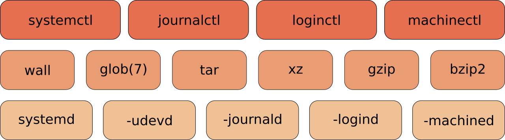

## systemd

{width="14cm"}

`systemd` is a software suite that provides an array of system
components for Linux operating systems. Its main aim is to unify service
configuration and behavior across Linux distributions; `systemd`\'s
primary component is a \"system and service manager\"---an init system
used to bootstrap user space and manage user processes. It also provides
replacements for various daemons and utilities, including device
management, login management, network connection management, and event
logging. The name systemd adheres to the Unix convention of naming
daemons by appending the letter d. It also plays on the term \"System
D\", which refers to a person\'s ability to adapt quickly and improvise
to solve problems.

`systemd` has replaced all the standard init/runlevel/rc functionality.
Both `Red Hat` and `Debian` and their deritives have decided in 2014
that `systemd` will be replacing `init` in current and future releases
(RHEL7+/CentOS7+ and Debian 8+).

The screenshot below shows `systemd` running as `pid 1` on RHEL8.

    [root@rhel8 ~]# ps fax | grep systemd | cut -c1-76
        1 ?        Ss     0:01 /usr/lib/systemd/systemd --switched-root --system
      505 ?        Ss     0:00 /usr/lib/systemd/systemd-journald
      545 ?        Ss     0:00 /usr/lib/systemd/systemd-udevd
      670 ?        Ss     0:00 /usr/lib/systemd/systemd-logind
      677 ?        Ssl    0:00 /bin/dbus-daemon --system --address=systemd: --no
     2662 pts/1    S+     0:00          \_ grep --color=auto systemd
    [root@rhel8 ~]#

Debian 10 uses parts of `systemd`, but still has `init` as `pid 1`.

    root@debian10:~# ps fax | grep systemd | cut -c1-76
      350 ?        Ss     0:00 /lib/systemd/systemd-udevd --daemon
     2206 ?        S      0:11 /sbin/cgmanager --daemon -m name=systemd
     2932 ?        S      0:04 /lib/systemd/systemd-logind
    16353 pts/4    S+     0:00              \_ grep systemd
    root@debian10:~#

### systemd targets

The first command to learn is `systemctl list-units --type=target` (or
the shorter version `systemctl -t target`). It will show you the
different targets on the system.

    [root@rhel81 ~]# systemctl -t target
    UNIT                LOAD   ACTIVE SUB    DESCRIPTION
    basic.target        loaded active active Basic System
    cryptsetup.target   loaded active active Encrypted Volumes
    getty.target        loaded active active Login Prompts
    local-fs-pre.target loaded active active Local File Systems (Pre)
    local-fs.target     loaded active active Local File Systems
    multi-user.target   loaded active active Multi-User System
    network.target      loaded active active Network
    paths.target        loaded active active Paths
    remote-fs.target    loaded active active Remote File Systems
    slices.target       loaded active active Slices
    sockets.target      loaded active active Sockets
    swap.target         loaded active active Swap
    sysinit.target      loaded active active System Initialization
    timers.target       loaded active active Timers

    LOAD   = Reflects whether the unit definition was properly loaded.
    ACTIVE = The high-level unit activation state, i.e. generalization of SUB.
    SUB    = The low-level unit activation state, values depend on unit type.

    14 loaded units listed. Pass --all to see loaded but inactive units, too.
    To show all installed unit files use 'systemctl list-unit-files'.
    [root@rhel81 ~]#

Targets are the replacement of runlevels and define specific points to
reach when booting the system. For example the `graphical.target` is
reached when you get a graphical interface, and the `nfs.target`
requires a running nfs server.

To switch to a target (for example `multi-user.target`), we now use
`systemctl isolate` (instead of the equivalent `init 3` to change the
runlevel).

This screenshot shows a `Red Hat Enterprise Linux 8` server switching
from a graphical interface to command line (decreasing the number of
running processes).

    [root@rhel8 ~]# ps fax | wc -l
    169
    [root@rhel8 ~]# systemctl isolate multi-user.target
    [root@rhel8 ~]# ps fax | wc -l
    129
    [root@rhel8 ~]#

To change the default target, we again use this `systemctl` command
(instead of editing the `/etc/inittab` file).

    [root@rhel8 ~]# systemctl set-de
    rm '/etc/systemd/system/default.target'
    ln -s '/usr/lib/systemd/system/multi-user.target' '/etc/systemd/system/default\
    .target'
    [root@rhel8 ~]#

This command removed the file `/etc/systemd/system/default.target` and
replaced it with a symbolic link to the `multi-user-.target` target.

### systemd dependencies

Dependencies are no longer defined by alfabetical order of running
scripts, but by configuration in `/etc/systemd/system/`. For example
here are the required services for the `multi-user.target` on Red Hat
Enterprise 7.1.

    [root@rhel81 ~]# cat /etc/redhat-release
    Red Hat Enterprise Linux Server release 7.1 (Maipo)
    [root@rhel81 ~]# ls /etc/systemd/system/multi-user.target.wants/
    abrt-ccpp.service    auditd.service          postfix.service    sysstat.service
    abrtd.service        chronyd.service         remote-fs.target   tuned.service
    abrt-oops.service    crond.service           rhsmcertd.service
    abrt-vmcore.service  irqbalance.service      rsyslog.service
    abrt-xorg.service    NetworkManager.service  sshd.service
    [root@rhel81 ~]#

Below a screenshot from Debian (bullseye/sid is Debian 11). There is
already a lot of `systemd` in Debian 8 and 9 (less than in RHEL7).

    root@debian11:~# cat /etc/debian_version
    stretch/sid
    root@debian11:~# ls /etc/systemd/system/multi-user.target.wants/
    anacron.service       binfmt-support.service  lm-sensors.service  rsyslog.service
    atd.service           cron.service            pppd-dns.service    ssh.service
    avahi-daemon.service  fancontrol.service      remote-fs.target
    root@debian11:~#

Typical `rc scripts` are replaced with services. Issue the
`systemctl list-units -t service --all` (or `systemctl -at service`) to
get a list of all services on your system.

    [root@rhel8 ~]# systemctl -at service | head -5 | column -t | cut -c1-78
    UNIT                 LOAD    ACTIVE    SUB      DESCRIPTION
    abrt-ccpp.service    loaded  active    exited   Install      ABRT     coredump
    abrt-oops.service    loaded  active    running  ABRT         kernel   log
    abrt-vmcore.service  loaded  inactive  dead     Harvest      vmcores  for
    abrt-xorg.service    loaded  active    running  ABRT         Xorg     log
    [root@rhel8 ~]#

### service status

Below is a (truncated) screenshot showing how to see the status of the
`sshd` service. (This RHEL server was attacked using brute force ssh on
2 August 2015.)

    [root@rhel81 ~]# systemctl status sshd.service

    sshd.service - OpenSSH server daemon
     Loaded: loaded (/usr/lib/systemd/system/sshd.service; enabled)
     Active: active (running) since Wed 2015-07-29 12:00:10 CEST; 1 weeks 0 days ago
    Main PID: 1123 (sshd)
      CGroup: /system.slice/sshd.service
              └─1123 /usr/sbin/sshd -D

    Aug 02 16:45:24 rhel81 sshd[12704]: Failed password for root from 43.229.53.79 
    Aug 02 18:15:28 rhel81 sshd[12872]: pam_unix(sshd:auth): authentication failur
    Aug 02 18:15:28 rhel81 sshd[12872]: pam_succeed_if(sshd:auth): requirement "ui
    Aug 02 18:15:30 rhel81 sshd[12872]: Failed password for root from 43.229.53.79
    Aug 02 18:15:30 rhel81 sshd[12872]: pam_succeed_if(sshd:auth): requirement "ui
    Aug 02 18:15:32 rhel81 sshd[12872]: Failed password for root from 43.229.53.79
    Aug 02 18:15:32 rhel81 sshd[12872]: pam_succeed_if(sshd:auth): requirement "ui
    Aug 02 18:15:34 rhel81 sshd[12872]: Failed password for root from 43.229.53.79
    Aug 02 18:15:34 rhel81 sshd[12872]: Received disconnect from 43.229.53.79: 11:
    Aug 03 10:21:11 rhel81 sshd[14616]: pam_unix(sshd:auth): authentication failur
    Aug 03 10:21:11 rhel81 sshd[14616]: pam_succeed_if(sshd:auth): requirement "ui
    Aug 03 10:21:13 rhel81 sshd[14616]: Failed password for root from 119.188.7.14
    Aug 03 10:21:13 rhel81 sshd[14616]: Received disconnect from 119.188.7.143: 11
    Aug 03 14:20:03 rhel81 sshd[15083]: Accepted password for root from 192.168.1.
    Hint: Some lines were ellipsized, use -l to show in full.
    [root@rhel81 ~]#

This `systemd` feature does not work by default on `Debian 8/9` because
`init` has pid 1. It only works when the system is booted with `systemd`
as pid 1.

    root@debian8:~# systemctl status sshd
    Failed to get D-Bus connection: Operation not permitted
    root@debian8:~# systemctl status ssh
    Failed to get D-Bus connection: Operation not permitted
    root@debian8:~# service ssh status
    sshd is running.
    root@debian8:~#

### systemd services configuration

The `chkconfig` and `service` commands are considered \'legacy\'. They
are replaced with `systemctl`.

This screenshot shows the new way to start and stop a service.

    [root@rhel8 ~]# systemctl start crond.service
    [root@rhel8 ~]# systemctl show crond.service | grep State
    LoadState=loaded
    ActiveState=active
    SubState=running
    UnitFileState=enabled
    [root@rhel8 ~]# systemctl stop crond.service
    [root@rhel8 ~]# systemctl show crond.service | grep State
    LoadState=loaded
    ActiveState=inactive
    SubState=dead
    UnitFileState=enabled
    [root@rhel8 ~]#

And here is the new way to stop and disable a service.

    [root@rhel8 ~]# systemctl stop crond.service
    [root@rhel8 ~]# systemctl disable crond.service
    rm '/etc/systemd/system/multi-user.target.wants/crond.service'
    [root@rhel8 ~]# systemctl show crond.service | grep State
    LoadState=loaded
    ActiveState=inactive
    SubState=dead
    UnitFileState=disabled
    [root@rhel8 ~]#

This screenshot shows how to enable and start the service again.

    [root@rhel8 ~]# systemctl enable crond.service
    ln -s '/usr/lib/systemd/system/crond.service' '/etc/systemd/system/multi-user.\
    target.wants/crond.service'
    [root@rhel8 ~]# systemctl start crond.service
    [root@rhel8 ~]# systemctl show crond.service | grep State
    LoadState=loaded
    ActiveState=active
    SubState=running
    UnitFileState=enabled
    [root@rhel8 ~]#

### systemd signalling

You can also use `systemd` to `kill` problematic services.

    [root@rhel8 ~]# systemctl show crond.service | grep State
    LoadState=loaded
    ActiveState=active
    SubState=running
    UnitFileState=enabled
    [root@rhel8 ~]# systemctl kill -s SIGKILL crond.service
    [root@rhel8 ~]# systemctl show crond.service | grep State
    LoadState=loaded
    ActiveState=failed
    SubState=failed
    UnitFileState=enabled
    [root@rhel8 ~]#

### systemd shutdown

The `poweroff`, `halt` and `reboot` commands are considered legacy now
and are handeld by `systemctl`. The table below shows the legacy
commands on the left and their new `systemd` equivalent on the right.

  ---------------------------------------------------------
  legacy command         systemd command
  ---------------------- ----------------------------------
  poweroff               systemctl poweroff

  reboot                 systemctl reboot

  halt                   systemctl halt

  pm-suspend             systemctl suspend

  pm-hibernate           systemctl hibernate
  ---------------------------------------------------------

  : systemd power management

### remote systemd

The `systemctl` utility has a buil-in remote control providing there is
an `ssh daemon` running on the remote system.

This screenshot shows how to use `systemctl` to verify a service on an
other RHEL server.

    [root@rhel8 ~]# systemctl -H root@192.168.1.65 status sshd
    root@192.168.1.65's password:
    sshd.service - OpenSSH server daemon
       Loaded: loaded (/usr/lib/systemd/system/sshd.service; enabled)
       Active: active (running) since Thu 2014-09-11 13:04:10 CEST; 16min ago
      Process: 1328 ExecStartPre=/usr/sbin/sshd-keygen (code=exited, status=0/SUCCE\
    SS)
     Main PID: 1363 (sshd)
       CGroup: /system.slice/sshd.service
    [root@rhel8 ~]#

### there is more systemd

There are other tools\...

    systemd-analyze                 systemd-loginctl
    systemd-ask-password            systemd-machine-id-setup
    systemd-cat                     systemd-notify
    systemd-cgls                    systemd-nspawn
    systemd-cgtop                   systemd-run
    systemd-coredumpctl             systemd-stdio-bridge
    systemd-delta                   systemd-sysv-convert
    systemd-detect-virt             systemd-tmpfiles
    systemd-inhibit                 systemd-tty-ask-password-agent

For example `systemd-analyze blame` will give you an overview of the
time it took for each service to boot.

    [root@rhel8 ~]# systemd-analyze blame | head
              1.977s firewalld.service
              1.096s tuned.service
               993ms postfix.service
               939ms iprinit.service
               925ms vboxadd-x11.service
               880ms firstboot-graphical.service
               839ms accounts-daemon.service
               829ms network.service
               822ms iprupdate.service
               795ms boot.mount
    [root@rhel8 ~]#

