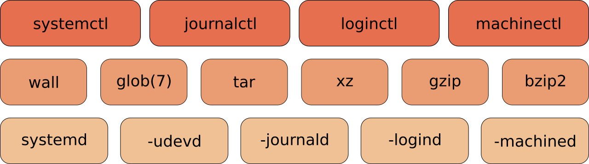

## systemd

{width="14cm"}

`systemd` is a software suite that provides an array of system components for Linux operating systems. Its main aim is to unify service configuration and behavior across Linux distributions; `systemd`'s primary component is a *system and service manager*, i.e. an init system used to bootstrap user space and manage user processes. It also provides replacements for various daemons and utilities, including device management, login management, network connection management, and event logging. The name systemd adheres to the Unix convention of naming daemons by appending the letter d. It also plays on the term "SystemD", which refers to a person's ability to adapt quickly and improvise to solve problems.

`systemd` has replaced all the standard init/runlevel/rc functionality. Both Red Hat and `Debian` and their derivatives have decided in 2014 that `systemd` was to replace `init` in current and future releases (RHEL7+ and Debian 8+).

If you still encounter a book, webpage, blog or forum post that mentions commands like `service`, `/etc/init.d/`, `chkconfig`, etc., you should know that these are considered 'legacy' and have been replaced with `systemctl`!

The screenshot below shows `systemd` running as PID (Process ID) 1 on Enterprise Linux.

```console
student@el:~$ ps -fq 1
UID          PID    PPID  C STIME TTY          TIME CMD
root           1       0  0 08:09 ?        00:00:00 /usr/lib/systemd/systemd --switched-root --system -
```

When you show PID 1 on Debian, it seems that it's not `systemd` but `init`. However, this is actually a symbolic link to `systemd`, as you can see in the screenshot below.

```console
student@debian:~$ ps -fq 1
UID          PID    PPID  C STIME TTY          TIME CMD
root           1       0  0 08:04 ?        00:00:00 /sbin/init
student@debian:~$ ls -l /sbin/init 
lrwxrwxrwx 1 root root 22 Sep  9  2025 /sbin/init -> ../lib/systemd/systemd
```

`systemd` consists of several components that are responsible for different aspects of system management, like log management, user session management, locale settings, network configuration, device management, etc. Linux distributions can choose which components to include in their distribution, or not.

For example on this Enterprise Linux system, these are the running `systemd` components:

```console
student@el:~$ ps -ef | grep systemd
root           1       0  0 08:09 ?        00:00:00 /usr/lib/systemd/systemd --switched-root --system --deserialize=43
root         787       1  0 08:09 ?        00:00:00 /usr/lib/systemd/systemd-journald
root         827       1  0 08:09 ?        00:00:00 /usr/lib/systemd/systemd-userdbd
root         835       1  0 08:09 ?        00:00:00 /usr/lib/systemd/systemd-udevd
root         957       1  0 08:09 ?        00:00:00 /usr/lib/systemd/systemd-logind
vagrant     4885       1  0 08:09 ?        00:00:00 /usr/lib/systemd/systemd --user
[... some output omitted ...]
```

While on this Debian system, these are the running `systemd` components:

```console
student@debian:~$ ps -ef | grep systemd
root         329       1  0 08:05 ?        00:00:00 /usr/lib/systemd/systemd-journald
root         382       1  0 08:05 ?        00:00:00 /usr/lib/systemd/systemd-udevd
message+     698       1  0 08:05 ?        00:00:00 /usr/bin/dbus-daemon --system --address=systemd: --nofork --nopidfile --systemd-activation --syslog-only
root         708       1  0 08:05 ?        00:00:00 /usr/lib/systemd/systemd-logind
vagrant     1768       1  0 08:15 ?        00:00:00 /usr/lib/systemd/systemd --user
```

### systemd targets

The first command to learn is `systemctl list-units --type=target` (or the shorter version `systemctl -t target`). It will show you the different *targets* on the system, i.e. specific points to reach when booting the system. For example the `graphical.target` is
reached when you get a graphical interface, the multi-user.target is reached when you get a command line interface with networking, etc.

```console
student@el:~$ systemctl list-units --type=target
  UNIT                     LOAD   ACTIVE SUB    DESCRIPTION
  basic.target             loaded active active Basic System
  cryptsetup.target        loaded active active Local Encrypted Volumes
[... output omitted ...]
  sockets.target           loaded active active Socket Units
  ssh-access.target        loaded active active SSH Access Available
  sshd-keygen.target       loaded active active sshd-keygen.target
  swap.target              loaded active active Swaps
  sysinit.target           loaded active active System Initialization
  timers.target            loaded active active Timer Units
  veritysetup.target       loaded active active Local Verity Protected Volumes

Legend: LOAD   → Reflects whether the unit definition was properly loaded.
        ACTIVE → The high-level unit activation state, i.e. generalization of SUB.
        SUB    → The low-level unit activation state, values depend on unit type.

25 loaded units listed. Pass --all to see loaded but inactive units, too.
To show all installed unit files use 'systemctl list-unit-files'.
```

To switch to a specific target (for example `multi-user.target`), we use the command `systemctl isolate`. The following example shows how to open an emergency shell with minimal services running. **Warning:** do not run this command on a production system, over an SSH connection, or on systems to which you do not have physical access. In the `rescue.target`, network daemons are disabled, so you may lock yourself out.

```console
root@el:~# systemctl isolate rescue.target
```

You can compare the number of running processes before and after switching to another target. In the following example, we start in the rescue.target:

```console
root@el:~# ps -ef | wc -l
109
root@el:~# systemctl isolate multi-user.target
[... output omitted ...]
root@el:~# ps -ef | wc -l
141
```

To see the default target, use `systemctl get-default` and to change it, use `systemctl set-default`:

```console
student@debian:~$ systemctl get-default 
graphical.target
student@debian:~$ sudo systemctl set-default multi-user.target 
Created symlink '/etc/systemd/system/default.target' → '/usr/lib/systemd/system/multi-user.target'.
```

This command removed the file `/etc/systemd/system/default.target` and replaced it with a symbolic link to `multi-user.target`.

### systemd dependencies

A systemd target holds a list of services that are required to reach that target. You can see the dependencies of a target with the command `systemctl list-dependencies <target>`. For example:

```console
student@el:~$ systemctl list-dependencies poweroff.target 
poweroff.target
○ └─systemd-poweroff.service
student@el:~$ systemctl list-dependencies reboot.target 
reboot.target
○ ├─grub2-systemd-integration.service
○ └─systemd-reboot.service
student@el:~$ systemctl list-dependencies multi-user.target 
multi-user.target
● ├─atd.service
○ ├─audit-rules.service
● ├─auditd.service
● ├─chronyd.service
● ├─crond.service
● ├─firewalld.service
[... output omitted ...]
● ├─basic.target
● │ ├─-.mount
○ │ ├─rpmdb-migrate.service
○ │ ├─rpmdb-rebuild.service
● │ ├─paths.target
● │ ├─slices.target
● │ │ ├─-.slice
● │ │ └─system.slice
● │ ├─sockets.target
● │ │ ├─cockpit.socket
● │ │ ├─dbus.socket
● │ │ ├─dm-event.socket
● │ │ ├─iscsid.socket
[... output omitted ...]
```

Remark that the output shows a tree structure, and that targets may have other targets as dependencies.

### systemd services

In the context of `systemd`, a background process or daemon is called a *service*. A service is defined by a unit file, which is a configuration file that describes how the service should be started, stopped, and managed. Unit files are typically located in `/etc/systemd/system/` or `/usr/lib/systemd/system/`.

Issue the `systemctl list-units -t service --all` (or `systemctl -at service`) to get a list of all services on your system.

```console
student@debian:~$ systemctl -at service
  UNIT                                 LOAD      ACTIVE   SUB     DESCRIPTION                          
  acpid.service                        loaded    active   running ACPI event daemon
  apache2.service                      loaded    active   running The Apache HTTP Server
  apparmor.service                     loaded    active   exited  Load AppArmor profiles
● auditd.service                       not-found inactive dead    auditd.service
  auth-rpcgss-module.service           loaded    inactive dead    Kernel Module supporting RPCSEC_GSS
  blk-availability.service             loaded    active   exited  Availability of block devices
● console-screen.service               not-found inactive dead    console-screen.service
  console-setup.service                loaded    active   exited  Set console font and keymap
  cron.service                         loaded    active   running Regular background program processin…
  dbus.service                         loaded    active   running D-Bus System Message Bus
● display-manager.service              not-found inactive dead    display-manager.service
● dkms.service                         not-found inactive dead    dkms.service
[... output omitted ...]
```

You can limit the output to running services by specifying the `--state=running` option:

```console
student@debian:~$ systemctl -at service --state=running
  UNIT                     LOAD   ACTIVE SUB     DESCRIPTION                                   
  acpid.service            loaded active running ACPI event daemon
  apache2.service          loaded active running The Apache HTTP Server
  cron.service             loaded active running Regular background program processing daemon
  dbus.service             loaded active running D-Bus System Message Bus
  getty@tty1.service       loaded active running Getty on tty1
  nfs-blkmap.service       loaded active running pNFS block layout mapping daemon
  rpcbind.service          loaded active running RPC bind portmap service
  ssh.service              loaded active running OpenBSD Secure Shell server
  systemd-journald.service loaded active running Journal Service
  systemd-logind.service   loaded active running User Login Management
  systemd-udevd.service    loaded active running Rule-based Manager for Device Events and Files
  user@1000.service        loaded active running User Manager for UID 1000
  vboxadd-service.service  loaded active running vboxadd-service.service

Legend: LOAD   → Reflects whether the unit definition was properly loaded.
        ACTIVE → The high-level unit activation state, i.e. generalization of SUB.
        SUB    → The low-level unit activation state, values depend on unit type.

13 loaded units listed.
To show all installed unit files use 'systemctl list-unit-files'.
```

Showing failed services can also be useful:

```console
student@debian:~$ systemctl -at service --failed
  UNIT            LOAD   ACTIVE SUB    DESCRIPTION           
● apache2.service loaded failed failed The Apache HTTP Server

Legend: LOAD   → Reflects whether the unit definition was properly loaded.
        ACTIVE → The high-level unit activation state, i.e. generalization of SUB.
        SUB    → The low-level unit activation state, values depend on unit type.

1 loaded units listed.
To show all installed unit files use 'systemctl list-unit-files'.
```

### service status

Below is a (truncated) screenshot showing how to see the status of the `sshd` service. (This RHEL server was attacked using brute force ssh on 2 August 2015.)

```console
[root@linux1 ~]# systemctl status sshd.service

sshd.service - OpenSSH server daemon
    Loaded: loaded (/usr/lib/systemd/system/sshd.service; enabled)
    Active: active (running) since Wed 2015-07-29 12:00:10 CEST; 1 weeks 0 days ago
Main PID: 1123 (sshd)
    CGroup: /system.slice/sshd.service
            └─1123 /usr/sbin/sshd -D

Aug 02 16:45:24 rhel81 sshd[12704]: Failed password for root from 43.229.53.79 
Aug 02 18:15:28 rhel81 sshd[12872]: pam_unix(sshd:auth): authentication failur
Aug 02 18:15:28 rhel81 sshd[12872]: pam_succeed_if(sshd:auth): requirement "ui
Aug 02 18:15:30 rhel81 sshd[12872]: Failed password for root from 43.229.53.79
Aug 02 18:15:30 rhel81 sshd[12872]: pam_succeed_if(sshd:auth): requirement "ui
Aug 02 18:15:32 rhel81 sshd[12872]: Failed password for root from 43.229.53.79
Aug 02 18:15:32 rhel81 sshd[12872]: pam_succeed_if(sshd:auth): requirement "ui
Aug 02 18:15:34 rhel81 sshd[12872]: Failed password for root from 43.229.53.79
Aug 02 18:15:34 rhel81 sshd[12872]: Received disconnect from 43.229.53.79: 11:
Aug 03 10:21:11 rhel81 sshd[14616]: pam_unix(sshd:auth): authentication failur
Aug 03 10:21:11 rhel81 sshd[14616]: pam_succeed_if(sshd:auth): requirement "ui
Aug 03 10:21:13 rhel81 sshd[14616]: Failed password for root from 119.188.7.14
Aug 03 10:21:13 rhel81 sshd[14616]: Received disconnect from 119.188.7.143: 11
Aug 03 14:20:03 rhel81 sshd[15083]: Accepted password for root from 192.168.1.
Hint: Some lines were ellipsized, use -l to show in full.
```

### starting and stopping systemd services

This screenshot shows the new way to start and stop a service (and to check if it is active without the verbose output of `systemctl status`).

```console
student@debian:~$ systemctl is-active apache2.service 
inactive
student@debian:~$ sudo systemctl start apache2.service 
student@debian:~$ systemctl is-active apache2.service 
active
student@debian:~$ sudo systemctl stop apache2.service 
student@debian:~$ systemctl is-active apache2.service 
inactive
```

Starting and stopping a service is a change to the system state, so needs to be done with superuser privileges. Hence the `sudo` command in the example above.

When you want to start a service automatically at boot time, you can use the `enable` command. The `disable` command will remove the service from the list of services that are started at boot time. Both commands have an option `--now` to also start or stop the service immediately. The following screenshot shows how to enable and start the `apache2` service.

```console
student@debian:~$ systemctl is-enabled apache2.service 
enabled
student@debian:~$ sudo systemctl disable apache2.service 
Synchronizing state of apache2.service with SysV service script with /usr/lib/systemd/systemd-sysv-install.
Executing: /usr/lib/systemd/systemd-sysv-install disable apache2
Removed '/etc/systemd/system/multi-user.target.wants/apache2.service'.
student@debian:~$ systemctl is-enabled apache2.service 
disabled
student@debian:~$ sudo systemctl enable --now apache2.service 
Synchronizing state of apache2.service with SysV service script with /usr/lib/systemd/systemd-sysv-install.
Executing: /usr/lib/systemd/systemd-sysv-install enable apache2
Created symlink '/etc/systemd/system/multi-user.target.wants/apache2.service' → '/usr/lib/systemd/system/apache2.service'.
student@debian:~$ systemctl is-enabled apache2.service 
enabled
```

Of course, the `status` command has more information than the `is-active` and `is-enabled` commands:

```console
student@debian:~$ systemctl status apache2.service 
● apache2.service - The Apache HTTP Server
     Loaded: loaded (/usr/lib/systemd/system/apache2.service; enabled; preset: enabled)
     Active: active (running) since Wed 2026-08-26 09:24:25 UTC; 4min 59s ago
 Invocation: 7f907da19a7843f4bf4dd14c8011a471
       Docs: https://httpd.apache.org/docs/2.4/
   Main PID: 2416 (apache2)
      Tasks: 55 (limit: 3506)
     Memory: 6.8M (peak: 7.2M)
        CPU: 27ms
     CGroup: /system.slice/apache2.service
             ├─2416 /usr/sbin/apache2 -k start
             ├─2417 /usr/sbin/apache2 -k start
             └─2418 /usr/sbin/apache2 -k start
```

In the context of starting ans stopping services, the most important lines in this output are the ones starting with `Loaded:`, and `Active:`. What is also useful to note is that `preset: enabled` means that the service is immediately enabled when the package is installed, while `preset: disabled` means that the service is not enabled when the package is installed. Debian usually has `preset: enabled`, so after installing Apache, for example, it will be immediately started and enabled. On Enterprise Linux, however, services are usually installed with `preset: disabled`, so after installing Apache, you will need to start and enable it manually.

Presets for `sshd` and Apache on Debian:

```console
student@debian:~$ systemctl status apache2.service | grep preset:
     Loaded: loaded (/usr/lib/systemd/system/apache2.service; enabled; preset: enabled)
student@debian:~$ systemctl status sshd.service | grep preset:
     Loaded: loaded (/usr/lib/systemd/system/ssh.service; enabled; preset: enabled)
```

And on Enterprise Linux:

```console
student@el:~$ systemctl status sshd.service | grep preset:
     Loaded: loaded (/usr/lib/systemd/system/sshd.service; enabled; preset: enabled)
student@el:~$ systemctl status httpd.service | grep preset:
     Loaded: loaded (/usr/lib/systemd/system/httpd.service; enabled; preset: disabled)
```

### systemd signalling

You can also use `systemd` to `kill` problematic services.

```console
student@debian:~$ sudo systemctl kill -s SIGKILL apache2.service 
```

Depending on the configuration of the service, the process may end up in a "failed" state, or it may be relaunched automatically. Since the systemctl command usually doesn't show mouch output, the system logs can show you what happened.

```console
vagrant@debian:~$ sudo journalctl -flu apache2.service
Aug 26 09:21:35 debian systemd[1]: Starting apache2.service - The Apache HTTP Server...
Aug 26 09:21:35 debian systemd[1]: Started apache2.service - The Apache HTTP Server.
Aug 26 09:42:12 debian systemd[1]: apache2.service: Sent signal SIGKILL to main process 2836 (apache2) on client request.
Aug 26 09:42:12 debian systemd[1]: apache2.service: Killed unit cgroup with SIGKILL on client request.
Aug 26 09:42:12 debian systemd[1]: apache2.service: Main process exited, code=killed, status=9/KILL
Aug 26 09:42:12 debian systemd[1]: apache2.service: Killing process 2893 (apache2) with signal SIGKILL.
Aug 26 09:42:12 debian systemd[1]: apache2.service: Failed with result 'signal'.
Aug 26 09:42:12 debian systemd[1]: apache2.service: Scheduled restart job, restart counter is at 2.
Aug 26 09:42:12 debian systemd[1]: Starting apache2.service - The Apache HTTP Server...
Aug 26 09:42:13 debian systemd[1]: Started apache2.service - The Apache HTTP Server.
```

### systemd shutdown

`systemd` also handles the shutdown of the system. The `systemctl poweroff`, `systemctl halt` and `systemctl reboot` commands are used to power off, halt or reboot the system, respectively. These commands will stop all running services and unmount all file systems before shutting down the system.

Shortcut commands `poweroff`, `halt` and `reboot` are also available, but they are actually symbolic links to the `systemctl` executable.

```console
student@el:~$ ls -l /usr/sbin/poweroff 
lrwxrwxrwx. 1 root root 16 Aug 17  2025 /usr/sbin/poweroff -> ../bin/systemctl
student@el:~$ ls -l /usr/sbin/halt 
lrwxrwxrwx. 1 root root 16 Aug 17  2025 /usr/sbin/halt -> ../bin/systemctl
student@el:~$ ls -l /usr/sbin/reboot 
lrwxrwxrwx. 1 root root 16 Aug 17  2025 /usr/sbin/reboot -> ../bin/systemctl
```

### remote systemd

The `systemctl` utility has a buil-in remote control providing there is an `ssh daemon` running on the remote system.

This screenshot shows how to use `systemctl` to verify a service on an EL server over SSH. We issue the command on a Debian system, where the `httpd` service can never be available (it's called `apache2` instead).

```console
student@debian:~$ systemctl -H student@192.168.56.10 status httpd
The authenticity of host '192.168.56.10 (192.168.56.10)' can't be established.
ED25519 key fingerprint is SHA256:VNK/tBRO7CA11AJMzeTEBITQ2DtzNjFJsCub5+Q2hmw.
This key is not known by any other names.
Are you sure you want to continue connecting (yes/no/[fingerprint])? 
Warning: Permanently added '192.168.56.10' (ED25519) to the list of known hosts.
student@192.168.56.10's password: 
● httpd.service - The Apache HTTP Server
     Loaded: loaded (/usr/lib/systemd/system/httpd.service; enabled; preset: disabled)
     Active: active (running) since Wed 2026-08-26 08:55:45 UTC; 54min ago
 Invocation: 810edfbf8daf425286673be834ea0dc4
       Docs: man:httpd.service(8)
   Main PID: 9012
     Status: "Total requests: 0; Idle/Busy workers 100/0;Requests/sec: 0; Bytes served/sec:   0 B/sec"
      Tasks: 177 (limit: 18320)
     Memory: 14.8M (peak: 15.1M)
        CPU: 1.062s
     CGroup: /system.slice/httpd.service
             ├─9012 /usr/sbin/httpd -DFOREGROUND
             ├─9095 /usr/sbin/httpd -DFOREGROUND
             ├─9096 /usr/sbin/httpd -DFOREGROUND
             ├─9097 /usr/sbin/httpd -DFOREGROUND
             └─9102 /usr/sbin/httpd -DFOREGROUND
```

### there is more systemd

There are other components in the systemd ecosystem. Here's a non-exhaustive list of some of them:

- `systemd-analyze`: analyze the boot process and performance of the system
- `systemd-boot`: boot manager for EFI systems
- `systemd-coredump`: capture and manage core dumps
- `systemd-firstboot`: initialize a new system
- `systemd-homed`: manage user home directories
- `systemd-hostnamed`: manage host and domain names
- `systemd-journald`: collect and manage log data
- `systemd-localed`: manage system locale and keyboard layout
- `systemd-logind`: manage user logins and sessions
- `systemd-networkd`: manage network configuration
- `systemd-nspawn`: lightweight container manager
- `systemd-oomd`: out-of-memory daemon
- `systemd-resolved`: provide network name resolution
- `systemd-sysusers`: manage system users and groups
- `systemd-timesyncd`: synchronize the system clock with remote NTP servers
- `systemd-udevd`: manage device events and device nodes

As mentioned before, distributions can choose which components to include in their distribution, or not.

As a final example, `systemd-analyze blame` will give you an overview of the time it took for each service to boot.

```console
student@debian:~$ systemd-analyze blame | head
422ms ifupdown-pre.service
252ms dev-mapper-debian\x2d\x2d13\x2d\x2dvg\x2droot.device
107ms keyboard-setup.service
105ms networking.service
 99ms vboxadd.service
 97ms lvm2-monitor.service
 89ms modprobe@drm.service
 89ms apparmor.service
 87ms user@1000.service
 84ms e2scrub_reap.service
```

