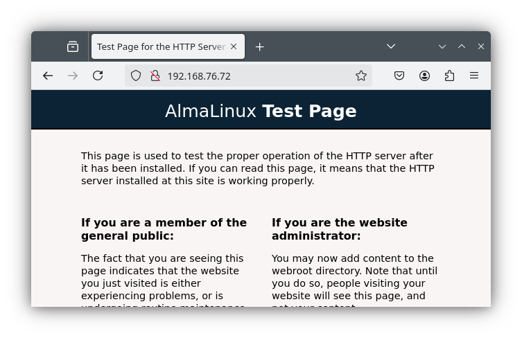

## a bottom-up approach to troubleshooting

As you know by the time you reach this chapter, the Internet is designed as a layered system. The [OSI model](https://nl.wikipedia.org/wiki/OSI-model) is often used to explain how networking works, but for our purposes, the four layer TCP/IP model is more practical and sufficient.

For reference, here is a summary of the TCP/IP model:

| Layer       | Protocols                 | Keywords              |
| :---------- | :------------------------ | :-------------------- |
| Application | HTTP, DNS, DHCP, FTP, ... |                       |
| Transport   | TCP, UDP                  | sockets, port numbers |
| Internet    | IP, ICMP                  | routing, IP address   |
| Link        | Ethernet, ARP             | switch, MAC address   |
| (Physical)  |                           | cables, RF signals    |

The physical layer at the bottom is not really part of the TCP/IP family of protocols and is out of scope for this chapter.

In order to troubleshoot effectively, it is essential to understand that interventions on the higher layers will not solve issues if problems on the lower layers aren't fixed first. This is why you should **always use a bottom-up approach to troubleshooting**. That is, start at the bottom layer of the stack, check *everything* on that layer before moving up to the next layer.

In the following sections, we'll show what to check on each layer and which commands to use. We'll also provide some general guidelines for troubleshooting network services.

It is always a good idea to open a separate terminal window and follow the logs in real-time with `sudo journalctl -fl` or, specific to a service, `sudo journalctl -flu <service>`.

## lab environment setup

In order to follow the examples provided in this chapter, you can set up a lab environment from the Github repository [HoGentTIN/linux-training-labs](https://github.com/HoGentTIN/linux-training-labs). Fork and clone the repository or download it as a ZIP file. Follow the instructions in the main README file to get started and then the README file in the `troubleshooting/` directory.

After launching the Vagrant environment in the `troubleshooting/` directory, you will have two AlmaLinux 9 VMs running:

| Host   | IP            | Service                 |
| :----- | :------------ | :---------------------- |
| `webt` | 192.168.76.72 | Apache web server       |
| `dbt`  | 192.168.76.73 | MariaDB database server |

The database server is configured correctly, but the web server is not.

In the examples below, we will use these host names to refer to the systems. Remark that these systems have two adapters: `eth0` is connected to a NAT interface that provides Internet access, and `eth1` is attached to a Host-only Adapter that connects the two systems.

## the link layer

On this layer, check:

- Are cables connected properly?
    - On a physical device, look for blinking lights on the network interface of the system under test and the network device it is attached to. Testing the cables with a cable tester is also a good idea.
    - On a Virtual Machine, check if the network adapter is connected to the right network.
- Are the network interfaces up?

Use the `ip link` command to check the status of the network interfaces. E.g. (with the `-br` option for a more concise output):

```console
[vagrant@webt ~]$ ip -br l
lo      UNKNOWN    00:00:00:00:00:00 <LOOPBACK,UP,LOWER_UP> 
eth0    UP         08:00:27:b3:a1:5c <BROADCAST,MULTICAST,UP,LOWER_UP> 
eth1    DOWN       08:00:27:b3:29:e3 <NO-CARRIER,BROADCAST,MULTICAST,UP> 
```

This system has three network interfaces:

- `lo`: the loopback interface, always up.
- `eth0`: an Ethernet adapter, up and running (indicated by `UP` and `BROADCAST`).
- `eth1`: another Ethernet adapter, not connected (indicated by `DOWN` and `NO-CARRIER`).

In fact, there is no signal on adapter `eth1`, which either indicates that the cable is unplugged, or the cable is defective. On a physical system, check the cable and ports on the system and the switch.

In VirtualBox, there's also a few things to check. Open the VM settings and go to the Network tab.

- First of all, all VMs that need to communicate with each other should be attached to the same network. In the lab setup, check the Adapter 2 tab and ensure that `webt` is connected to the same network as `dbt`. If not, make the necessary changes to `webt`. Remark that restarting the VM is not necessary. This is equivalent to plugging in a cable on another network device.
- Next, click on the "Advanced" and ensure the checkbox with label "Cable connected" is checked.


After making the necessary changes, check the status of the network interfaces again:

```console
[vagrant@webt ~]$ ip -br l
lo      UNKNOWN    00:00:00:00:00:00 <LOOPBACK,UP,LOWER_UP> 
eth0    UP         08:00:27:b3:a1:5c <BROADCAST,MULTICAST,UP,LOWER_UP> 
eth1    UP         08:00:27:b3:29:e3 <BROADCAST,MULTICAST,UP,LOWER_UP> 
```

## the internet layer

On this layer, check:

- Local network configuration of the system under test:
    - IP address and subnet mask
    - Default gateway
    - DNS servers
- Routing within the LAN:
    - Can you ping the default gateway and DNS servers?
    - Can you ping another system on the same network?
    - Does the DNS server respond to queries?

It is important to know the expected values for these settings. For example, you may see that a system does have an IP address, say, 169.254.152.12, but no internet access. If you don't know that this particular address range is used for providing a host with an IP address when no DHCP server is available, you might spend a lot of time troubleshooting the wrong issue.

### checking the local network configuration

- IP address and subnet mask: `ip address`

    - Do you have an IP address?
        - If not, the DHCP server may be down, is unreachable from this system, or doesn't give an IP address to this system.
        - The problem may also be on the DHCP server side.
    - Is it in the correct subnet?
        - If not, check if the system has an "link-local" address, e.g. in the range 169.254.0.0/16. This is a sign that the system couldn't get an IP address from a DHCP server.
        - If the address is plain wrong, check the configuration of the network interface. Maybe you configured a static IP address when the system should get one from DHCP, or maybe you forgot to restart the network service after a config change.
    - Is the subnet mask correct? E.g. the IP is correct, but pinging another system in the LAN gives a "network unreachable" error.
        - If not, routing within the LAN may not be possible.
        - Check the configuration of the network interface.

- Default gateway: `ip route`

    - Is the default gateway present?
    - Is it the correct IP address in the expected subnet?

- DNS servers: `cat /etc/resolv.conf` or `resolvectl dns`

    - Is the `nameserver` entry present
    - Is the DNS server IP correct?

The IP addresses on the database server in our lab setup:

```console
[vagrant@dbt ~]$ ip -br a
lo      UNKNOWN    127.0.0.1/8 ::1/128 
eth0    UP         10.0.2.15/24 fe80::4de4:bee5:560:8219/64 
eth1    UP         192.168.76.73/24 fe80::a00:27ff:fe8a:f6f2/64 
```

The loopback interface always has the address 127.0.0.1. The `eth0` interface has the address 10.0.2.15/24, which is the default for the NAT interface in VirtualBox. The `eth1` interface has the address 192.168.76.73, which is the one we expect. The subnet mask is /24, the default for a private class C network.

However, if we look at the web server:

```console
[vagrant@webt ~]$ ip -br a
lo      UNKNOWN    127.0.0.1/8 ::1/128 
eth0    UP         10.0.2.15/24 fe80::399a:5f3c:2fc7:9979/64 
eth1    UP         192.168.56.172/25 fe80::a00:27ff:feb3:29e3/64 
```

The `eth0` interface also has the address 10.0.2.15/24, but that's not actually a problem. This is the case for *all* VirtualBox VMs attached to a NAT interface. The VM is isolated in this network, but can reach the Internet through the host system. Since it's a separate network, it does not interfere with the address on the other VM.

However, `eth1` is clearly wrong. The address is in the wrong subnet. Let's assign the correct address:

```console
[vagrant@webt ~]$ nmcli device status
DEVICE  TYPE      STATE                   CONNECTION  
eth0    ethernet  connected               eth0        
eth1    ethernet  connected               System eth1 
lo      loopback  connected (externally)  lo   
[vagrant@webt ~]$ nmcli -f IP4 connection show 'System eth1'
IP4.ADDRESS[1]:    192.168.56.172/25
IP4.GATEWAY:       --
IP4.ROUTE[1]:      dst = 192.168.56.128/25, nh = 0.0.0.0, mt = 101
[vagrant@webt ~]$ sudo nmcli connection modify 'System eth1' ipv4.addresses 192.168.76.72/24
[vagrant@webt ~]$ sudo nmcli connection down 'System eth1'
Connection 'System eth1' successfully deactivated (D-Bus active path: /org/freedesktop/NetworkManager/ActiveConnection/3)
[vagrant@webt ~]$ sudo nmcli connection up 'System eth1'
Connection successfully activated (D-Bus active path: /org/freedesktop/NetworkManager/ActiveConnection/5)
[vagrant@webt ~]$ ip -br a
lo      UNKNOWN    127.0.0.1/8 ::1/128 
eth0    UP         10.0.2.15/24 fe80::399a:5f3c:2fc7:9979/64 
eth1    UP         192.168.76.72/24 fe80::a00:27ff:feb3:29e3/64
```

Remark that this IP address had another important issue, i.e. the network mask was incorrect. In order for two hosts on the same LAN/subnet to be able to communicate, the network part of their IP address must be the same. If the subnet masks do not match, it's possible that another host on the network is not considered to be on the same network, causing the packet to be sent to the default gateway instead of being delivered directly.

Next, let's check the routing table:

```console
[vagrant@webt ~]$ ip route
default via 10.0.2.2 dev eth0 proto dhcp src 10.0.2.15 metric 100 
10.0.2.0/24 dev eth0 proto kernel scope link src 10.0.2.15 metric 100 
192.168.76.0/24 dev eth1 proto kernel scope link src 192.168.76.72 metric 101 
```

This routing table is correct for this VM. The VM is attached to two network interfaces, `eth0` and `eth1`. IP packets destined for address 10.0.2.0/24 (the subnet of the NAT interface) are sent out through `eth0`, and packets destined for 192.168.76.0/24 (the subnet of the Host-only Adapter) are sent out through `eth1`. All other packets are sent to the default gateway, 10.0.2.2. This is the default IP address of the gateway simulated by the VirtualBox NAT interface.

Finally, let's check the DNS configuration:

```console
[vagrant@webt ~]$ cat /etc/resolv.conf 
# Generated by NetworkManager
nameserver 10.0.2.3
```

Again, this is correct. The DNS server is the one provided by the VirtualBox NAT interface, and has always the IP address 10.0.2.3.

### routing within the LAN

- Ping between hosts within the LAN

- Ping the default gateway

    - Remark: some system administrators deliberately disable ICMP echo requests (ping) on network devices for security purposes. If you can't ping the default gateway, it may be that the device is configured this way.

- Ping the DNS server

- Query the DNS server (with `dig` or `nslookup`)

Let's try this on the `webt` VM:

```console
[vagrant@webt ~]$ ping -c1 192.168.76.73
PING 192.168.76.73 (192.168.76.73) 56(84) bytes of data.
64 bytes from 192.168.76.73: icmp_seq=1 ttl=64 time=0.974 ms

--- 192.168.76.73 ping statistics ---
1 packets transmitted, 1 received, 0% packet loss, time 0ms
rtt min/avg/max/mdev = 0.974/0.974/0.974/0.000 ms
[vagrant@webt ~]$ ping -c1 10.0.2.2
PING 10.0.2.2 (10.0.2.2) 56(84) bytes of data.
64 bytes from 10.0.2.2: icmp_seq=1 ttl=64 time=0.490 ms

--- 10.0.2.2 ping statistics ---
1 packets transmitted, 1 received, 0% packet loss, time 0ms
rtt min/avg/max/mdev = 0.490/0.490/0.490/0.000 ms
[vagrant@webt ~]$ ping -c1 10.0.2.3
PING 10.0.2.3 (10.0.2.3) 56(84) bytes of data.
64 bytes from 10.0.2.3: icmp_seq=1 ttl=64 time=0.706 ms

--- 10.0.2.3 ping statistics ---
1 packets transmitted, 1 received, 0% packet loss, time 0ms
rtt min/avg/max/mdev = 0.706/0.706/0.706/0.000 ms
[vagrant@webt ~]$ dig @10.0.2.3 www.linux-training.be +short
188.40.26.208
```

We receive a ping response from the database server, the default gateway and the DNS server. The DNS server also responds to queries.

### internet connectivity

After this step, you might want to test Internet connectivity by e.g. pinging the WAN interface of the default gateway, or the IP address of the next hop (if you know it).

If the previous steps were successful, but you can't reach the Internet, the problem may be with the default gateway or the routing table on the default gateway.

This is outside the scope of this troubleshooting guide, since we're focusing on troubleshooting services we are setting up ourselves.

## the transport layer

On this layer, check:

- Is the service running?
- Is the service listening on the correct port? `sudo ss -tulpn`
- Does the firewall allow traffic to the service port? `sudo firewall-cmd --list-all`

### is the service running?

Use the command  `systemctl status <service>`. Check for `active (running)` in the output, or `inactive (dead)`. If the service is not running, you can try to start it with `sudo systemctl start <service>`. If this fails, check the logs for error messages.

Also check whether the service is `enabled`, i.e. will start automatically when the system boots. If not, enable it with `sudo systemctl enable <service>`.

Let's check whether MariaDB is running on the database server:

```console
[vagrant@dbt ~]$ systemctl status mariadb
● mariadb.service - MariaDB 10.5 database server
     Loaded: loaded (/usr/lib/systemd/system/mariadb.service; enabled; preset: disabled)
     Active: active (running) since Mon 2024-06-17 13:11:15 UTC; 33min ago
       Docs: man:mariadbd(8)
             https://mariadb.com/kb/en/library/systemd/
    Process: 730 ExecStartPre=/usr/libexec/mariadb-check-socket (code=exited, status=0/SUCCESS)
    Process: 773 ExecStartPre=/usr/libexec/mariadb-prepare-db-dir mariadb.service (code=exited, status>
    Process: 853 ExecStartPost=/usr/libexec/mariadb-check-upgrade (code=exited, status=0/SUCCESS)
   Main PID: 814 (mariadbd)
     Status: "Taking your SQL requests now..."
      Tasks: 8 (limit: 11128)
     Memory: 103.4M
        CPU: 632ms
     CGroup: /system.slice/mariadb.service
             └─814 /usr/libexec/mariadbd --basedir=/usr
```

MariaDB is running correctly!

For the web server, we get:

```console
[vagrant@webt ~]$ systemctl status httpd
○ httpd.service - The Apache HTTP Server
     Loaded: loaded (/usr/lib/systemd/system/httpd.service; disabled; preset: disabled)
    Drop-In: /usr/lib/systemd/system/httpd.service.d
             └─php-fpm.conf
     Active: inactive (dead)
       Docs: man:httpd.service(8)
```

So Apache is not running. We can also see that it is disabled, so it won't start automatically when the system boots. Let's start and enable it:

```console
[vagrant@webt ~]$ sudo systemctl enable --now httpd
Created symlink /etc/systemd/system/multi-user.target.wants/httpd.service → /usr/lib/systemd/system/httpd.service.
[vagrant@webt ~]$ systemctl is-active httpd
active
```

Starting Apache succeeded, and it is now running and enabled. This time, we used the `is-active` command to avoid the long output of `systemctl status`. However, you can use `status` to get more information about the service.

### is the service listening on the correct port?

Use the command `sudo ss -tulpn` (show sockets). The options have the following meaning:

- `-t`: show TCP sockets.
- `-u`: show UDP sockets (not relevant for pure TCP-based services like HTTP(S), can be omitted in that case).
- `-l`: show only listening (server) sockets.
- `-p`: show the process that owns the socket. This requires root privileges, hence the `sudo` before the command.
- `-n`: show IP addresses instead of trying to resolve them to host names and show port numbers instead of the service name (as enumerated in the file `/etc/services`).

The order of the options is not important, but for Dutch speaking people, the mnemonic "TULPeN" may help to remember the options.

You need to know which interfaces and ports the service is supposed to listen on! If the service is running, but not listening on the expected port (e.g. 8443 instead of 443 for a web server). Some services are configured to only listen on the loopback interface, which also can be determined with `ss`.

We know that MariaDB listens on port 3306, and a web server on port 80 and/or 443. Let's check the database server first. Remark that we don't use `-u` here, since both MariaDB and HTTP(S) are TCP-based services.

```console
[vagrant@dbt ~]$ sudo ss -tlnp | grep mariadb
LISTEN 0    80    *:3306    *:*    users:(("mariadbd",pid=814,fd=20)) 
```

The important part is the `*:3306`, which means that MariaDB is listening on all interfaces (`*`) on port 3306. The process that owns the socket is `mariadbd`.

On the web server, we get (some superfluous output omitted and replaced with `...`):

```console
[vagrant@webt ~]$ sudo ss -tlnp | grep httpd
LISTEN 0    511    *:443     *:*    users:(("httpd",pid=7672,fd=6),...)
LISTEN 0    511    *:8080    *:*    users:(("httpd",pid=7672,fd=4),...)
```

The `httpd` proces listens on port 443 and 8080. This is not what we expect. The default ports for HTTP and HTTPS are 80 and 443, respectively. 8080 is a common alternative for test setups, but it's not the default, so won't work if we want to acces the web server with a browser (unless we specify the port in the URL, but that's not what we want here).

 Let's check the configuration file of Apache:

```console
[vagrant@webt ~]$ grep 8080 /etc/httpd/conf/httpd.conf
Listen 8080
```

Indeed, Apache is configured to listen on port 8080. Edit the configuration file and change the port to 80. After that, restart the service:

```console
[vagrant@webt ~]$ sudo vi /etc/httpd/conf/httpd.conf
... (make the necessary changes and save) ...
[vagrant@webt ~]$ apachectl configtest
AH00558: httpd: Could not reliably determine the server's fully qualified domain name, using 127.0.1.1. Set the 'ServerName' directive globally to suppress this message
Syntax OK
[vagrant@webt ~]$ sudo systemctl restart httpd
sudo systemctl restart httpd
[vagrant@webt ~]$ sudo ss -tlnp | grep httpd
LISTEN 0    511    *:80     *:*    users:(("httpd",pid=7977,fd=4),...)
LISTEN 0    511    *:443    *:*    users:(("httpd",pid=7977,fd=6),...)
```

Note that we executed `apachectl configtest` before restarting the service. This command checks the syntax of the configuration file. If there are errors, the service won't start. If the syntax is OK, the command will return `Syntax OK`. The warning about the server name is normal for a test environment, so can be safely ignored. Now, Apache listens on the correct ports.

### check the firewall configuration

Use the command `sudo firewall-cmd --list-all` to check the firewall configuration. This command shows all zones and the services that are allowed in each zone. If the service is not listed, it is not allowed through the firewall.

On the database server, we get:

```console
[vagrant@dbt ~]$ sudo firewall-cmd --list-all
public (active)
  target: default
  icmp-block-inversion: no
  interfaces: eth0 eth1
  sources: 
  services: cockpit dhcpv6-client mysql ssh
  ports: 
...
```

We see `mysql` in the list of services, which is correct for MariaDB. On the web server, we get:

```console
[vagrant@webt ~]$ sudo firewall-cmd --list-all
public (active)
  target: default
  icmp-block-inversion: no
  interfaces: eth0 eth1
  sources: 
  services: cockpit dhcpv6-client ssh
  ports: 
  protocols: 
...
```

There is no `http` or `https` service in the list. We need to add these services to the firewall configuration and reload the firewall rules:

```console
[vagrant@webt ~]$ sudo firewall-cmd --add-service=http --permanent
success
[vagrant@webt ~]$ sudo firewall-cmd --add-service=https --permanent
success
[vagrant@webt ~]$ sudo firewall-cmd --reload 
success
[vagrant@webt ~]$ sudo firewall-cmd --list-all
public (active)
  target: default
  icmp-block-inversion: no
  interfaces: eth0 eth1
  sources: 
  services: cockpit dhcpv6-client http https ssh
  ports: 
  protocols: 
...
```

Now HTTP and HTTPS traffic is allowed through the firewall.

At this time, the web server should be available for users on the local network. You can test this by opening a browser on the host system and navigating to <http://192.168.76.72>. If you see the Apache test page, everything up to this point is working correctly.



## the application layer

The application layer is the most diverse, as it comprises all services that run on top of the transport layer. This includes web servers, mail servers, DNS servers, etc. Troubleshooting specific behaviour of these services is beyond the scope of this chapter, but there are a few things that you should always check, regardless of the service:

- Check the logs
- Validate the syntax of the configuration files
- Read the manual
- Use command-line client tools to test the service

All other checks are specific to the application.

### check the logs

Linux systems based on `systemd` use `journalctl` to manage system logs. You can use `journalctl` (with root privileges) to view the logs of a specific service, e.g. `sudo journalctl -u <service>`. The `-f` option will show new log entries as they are written and the `-l` option will show the full log entries (instead of truncating lines that do not fit within the width of the terminal).

Some services also write logs to a file in `/var/log`. For example, when troubleshooting a web server, you might want to check `/var/log/httpd/error_log` for messages that do not appear with `journalctl`. Check the documentation of the service to find out where the logs are stored.

Following log files in real-time can be done with the command `tail -f /var/log/<logfile>`.

### validate config file syntax

Most services have a command that checks the syntax of a configuration file before/without starting the service. It is useful to always run this command first to check for existing errors. Also, after making any change to the configuration file, run the command again to ensure you don't introduce new errors.

A few examples:

- Apache web server: `sudo apachectl configtest`
- Nginx web server: `sudo nginx -t`
- Bind DNS server: `sudo named-checkconf` and `sudo named-checkzone <zone> <zonefile>`
- Vsftpd FTP server: `sudo vsftpd -t`

Check the manual of the service for the exact command to use.

### read the manual

When you are responsible for managing a service in production, you must know the system inside out in order to be effective in your job. At a certain point, googling for solutions will no longer be sufficient. You need to know the service's configuration file, log files, and the commands to manage the service.

That's information that you won't find on Stack Overflow or Reddit, but in the manuals. Finding help is a topic that is covered in another chapter, so we won't go into detail here. A few suggestions and examples without striving to be comprehensive:

- Check the man page of the command, configuration file or service
- Check the documentation of your Linux distribution (e.g. [the RedHat Manuals](https://access.redhat.com/documentation/en-us/red_hat_enterprise_linux/) or [Debian Documentation](https://www.debian.org/doc/))
- Check the reference manual of the service (e.g. [the Apache HTTP Server Documentation](https://httpd.apache.org/docs/), [the Nginx Documentation](https://nginx.org/en/docs/), [the Bind 9 Administrator Reference Manual](https://bind9.readthedocs.io/en/latest/))
- Read a (good) book about the service, e.g. [DNS for Rocket Scientists](http://zytrax.com/books/dns/)

### use command-line tools

For troubleshooting purposes, it is often more useful to use command-line client tools than the graphical user interface that you would run for daily use. GUIs often hide important details, or give only generic error messages.

The specific tools you can use depend on the service you are troubleshooting and there are a lot. Here are a few examples, again without trying to be complete:

- `curl` for web servers
- `dig` for DNS servers
- `smbclient` for Samba file servers
- `netcat` for general network troubleshooting, setting up raw TCP connections
- `nmap` for network scanning (which also includes scripts to test specific services)

## SELinux troubleshooting

Although the default web page of Apache should be visible now, when we try to open the PHP test script at <http://192.168.76.72/test.php>, we get an "Access denied" error. Let's investigate the cause and fix it.

TODO

## general guidelines

To conclude, here are some general guidelines that you should use when troubleshooting issues with network services:

- Before making any change, **back up** configuration files.

- Always **be systematic**, follow the bottom-up approach.

- Be **thorough**, don't skip any step. You can't solve problems higher up in the stack if issues lower down are not resolved.

- **Do not assume: test!** The fact that "it doesn't work" means that one of your assumptions is wrong.

- **Know your environment.** What is the topology? What are the IP addresses (summarize them in a table)? What services should be running? Read the documentation of the services you are responsible for.

- **Read The Fine Log Files!** You need to be able to interpret the log files of the services you are troubleshooting. Keep a real time log viewer open in a separate terminal window, study the effect that interventions on a system have in the logs.

- **Read The Fine Error Message!** Error messages are essential to understand what is going wrong, and on which layer in the TCP/IP stack the issue is located.

- Work in **small steps**. Make one change at a time, and immediately test the effect of that change.

- If possible, **validate config file syntax** after each change and before restarting a service.

- Don't forget to **restart the service** after making changes to their configuration files.

- **Verify each change** so you don't introduce new issues.

- Keep a **cheat sheet** or **troubleshooting checklist** with all the steps to follow and commands you need. For an example, see <https://github.com/bertvv/cheat-sheets>

- **Automate** to avoid human error. Use a configuration management system to describe the desired state of the infrastructure under your control. Automate tests as well, or implement a monitoring and log aggregation solution.

- Finally, **don't ping Google** as your first troubleshooting step. If it doesn't work (and it probably wont, or you wouldn't need to troubleshoot), too many things could have gone wrong. Go back to the beginning of this list and start there... ;-)

