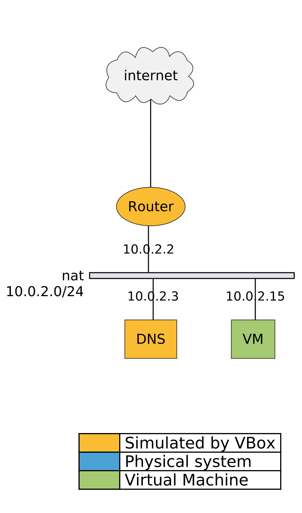
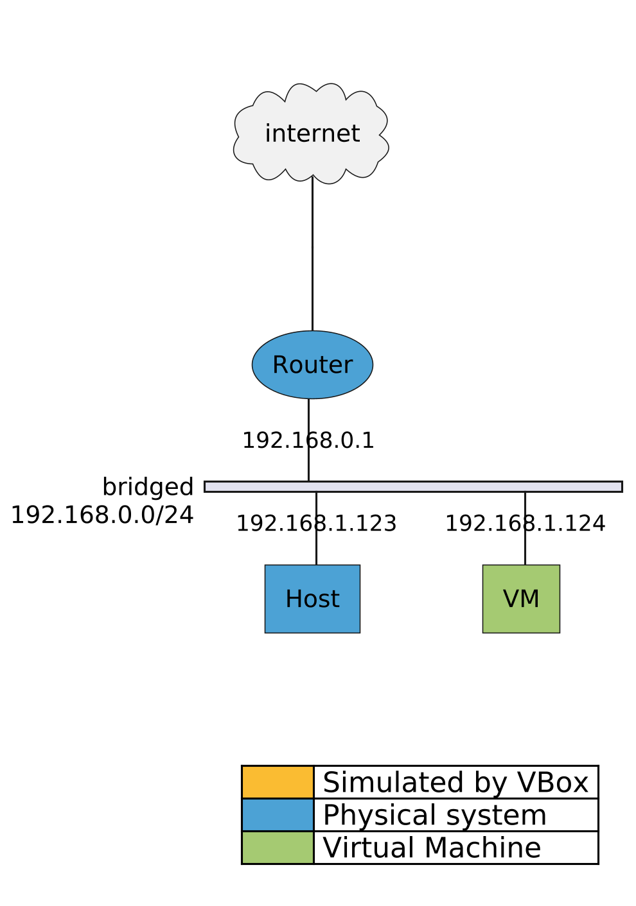
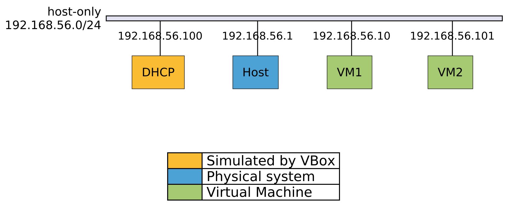
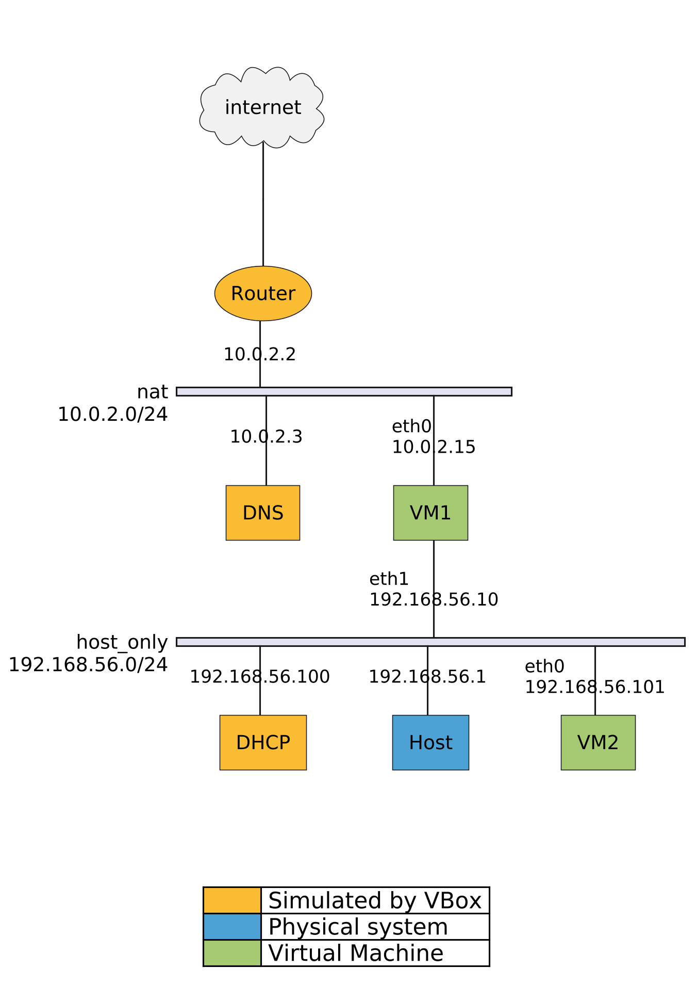
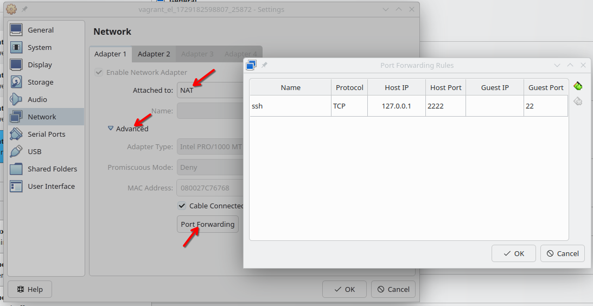

## nat adapter

The default adapter type for a VirtualBox VM is the so-called **NAT (Network Address Translation) adapter**. It simulates a situation where the VM is isolated in a local network that is attached to a router with internet connectivity. For a "client" type VM that does not run network services and that does not need to communicate with other VMs, the NAT adapter is a good choice. The VM can access the internet, but it is not directly reachable from the host or other VMs.

The IP settings of a VM attached to a NAT adapter are predictable:

- The network address used is 10.0.2.0/24 (i.e. a subnetted private class A network).
- The VM's IP address is always 10.0.2.15
- VirtualBox simulates a router with internal IP 10.0.2.2 that forwards traffic to the internet.
- VirtualBox also provides a DNS proxy to resolve DNS queries from the VM, with IP 10.0.2.3.

The structure of the network is shown in the image below.

{ width=50% }

## bridged networking

The bridged interface provides your VM with direct access to the physical (Ethernet) network to which your host is connected. This means that the VM is treated as a separate device in the network, with its own IP address and MAC address. The VM can communicate with the host, other VMs, and other devices in the network. The IP settings of a VM attached to a bridged interface are determined by the DHCP server of the physical network.

If you look at the table above, you could conclude that this interface has the best connectivity options and therefore is the most useful one in the list. However, its use comes with some major disadvantages:

- The VM is exposed to the physical network, which can be a security risk for experimental or development VMs.
- The IP settings of the VM are not predictable and depend on the DHCP server. This can be a problem if you want to run a network service on the VM that needs to be reachable from other devices.
- In some environments, the DHCP server may not provide an IP address to the VM, which makes the VM unusable.
- Functionality is limited or impossible when using wireless interfaces for bridged networking.

{ width=50% }

## internal networking

The internal network interface is a private network that is isolated from the host and the physical network (and, consequently, the Internet). VMs attached to the same internal network can communicate with each other, but not with the host or VMs attached to other types of network adapters.

This network type is useful for creating a private network between VMs that only need to communicate with each other but not with the host or other devices in the physical network.

DHCP services are not provided for internal networks, so you need to configure IP addresses manually, or set up a VM with a DHCP server.

## host-only networking

The host-only interface is a private network that is isolated from the physical network but allows communication between the host and VMs. VMs attached to the same host-only network can communicate with each other and with the host, but not with other devices in the physical network. This network type is useful for creating a private network between the host and VMs that need to communicate with each other but not with other devices in the physical network. DHCP services can be provided for host-only networks, so you can configure IP addresses manually or use the DHCP server.

On a fresh install of VirtualBox, no host-only networks are configured. When you create the first one, VirtualBox will give it predictable IP settings:

- The network address used is 192.168.56.0/24 (i.e. a private class C network that is not commonly used by e.g. routers).
- The host system gets the first IP address within this range, i.e. 192.168.56.1
- VirtualBox simulates a DHCP server at IP 192.168.56.100 that will serve IP addresses to VMs from 192.168.56.101 up to 192.168.56.254.

This implies that you can assign static IP addresses to VMs in the range 192.168.56.2 up to 192.168.56.99. This is useful for VMs where you want to have predictable IP addresses, e.g. for running network services.

The image below illustrates the "default" host-only network in VirtualBox. The host system has the .1 address, VM1 has static IP .10 and VM2 has .101 assigned by the DHCP server.
{ width=80% }

You can create multiple host-only networks in VirtualBox, each with their own IP range (class A, B, or C). This allows you to create separate private networks for different purposes. For each network, you can choose whether to enable DHCP services or not.

## combining network types

You can combine different network types in a single VM to achieve the desired connectivity. For example, you can enable two adapters, attach the first to an NAT network (so the VM gets Internet access) and the second to a host-only network (to allow communication with the host).

When you are setting up a network service in a VM that you want to test from the physical system, this is the ideal setup. Your VM can access the Internet (to install packages, etc.), and you can access the service from the host system on a predictable IP address.

{ width=50% }

You can simulate an entire LAN by giving one VM (that will be configured as a router) an NAT and an internal adapter, and attach other VMs to the internal network.

## port forwarding on nat

Before, we stated that a VM on an NAT network cannot directly be reached from the host system. There is an exception to this rule in the form of **port forwarding**. With port forwarding, you can map a port on the host system to a port on the VM. This way, you can access services running on the VM from the host system.

In the VM settings dialog, open the *Advanced* section of the network adapter that is attached to the NAT network and click the *Port Forwarding* button. A new dialog opens where you can add port forwarding rules. In the example below, we forward port 2222 on the host system to port 22 on the VM. This way, we can SSH into the VM by connecting to `localhost`, port 2222 on the host system. This is actually how Vagrant connects to VMs.

The disadvantage is that only specified services on the VM are reachable from the host system. Also, if you want access to multiple VMs, you need to configure port forwarding rules for each VM on a separate port on the host system. Therefore, if you need more flexibility, you should consider using a bridged or host-only network.

## summary

The table below summarizes the most important network types in VirtualBox and the connectivity they provide. Depending on your needs, you can choose either the appropriate network type or a combination of them. "VM to VM" connectivity implies that both VMs are attached to the same network type.

| Network type         | VM to Internet | Host to VM | VM to VM |
| :------------------- | :------------: | :--------: | :------: |
| NAT adapter          |      yes       |   no(*)    |    no    |
| Bridged networking   |      yes       |    yes     |   yes    |
| Internal networking  |       no       |     no     |   yes    |
| Host-only networking |       no       |    yes     |   yes    |

(*) There is no direct IP connectivity between host and VM, but you can use port forwarding to access specific services running on the VM from the host.

